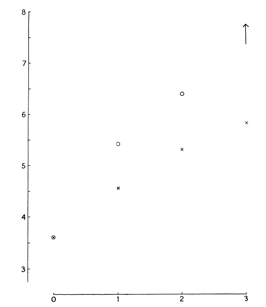
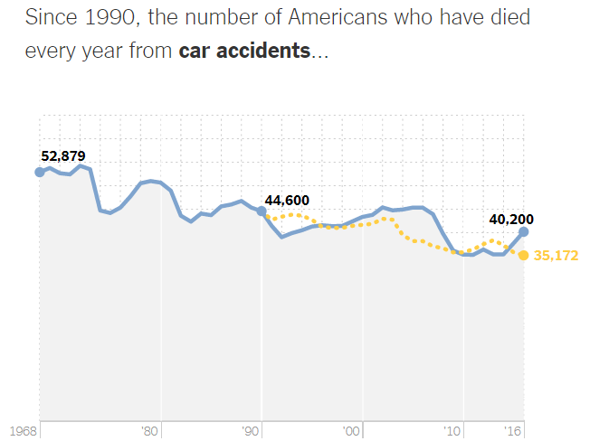
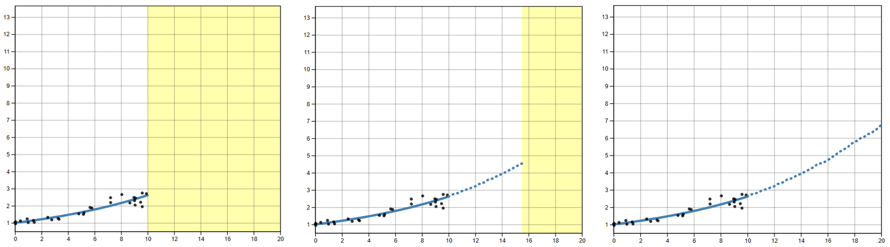

# Prediction with 'You Draw It' {#youdrawit}

```{r youdrawit-setup, message=FALSE, warning=FALSE, echo = F}
library(tidyverse)
library(patchwork)
library(here)
library(readr)
library(knitr)
```

```{r eyefitting-data, message=FALSE, warning=FALSE, echo = F}
eyefitting_model_data <- read_csv("data/02b-eyefitting/eyefitting-model-data.csv") %>%
  dplyr::rename(`Parameter Choice` = parm_id)

eyefitting_simulated_data <- read_csv("data/02b-eyefitting/eyefitting-simulated-data.csv") %>%
  dplyr::rename(`Parameter Choice` = parm_id)

eyefitting_parameters <- read_csv("data/02b-eyefitting/eyefitting-parameters.csv") %>%
  dplyr::rename(`Parameter Choice` = parm_id)

eyefitting_lmer_preds <- read_csv("data/02b-eyefitting/eyefitting-lmer-preds.csv") %>%
  dplyr::rename(`Parameter Choice` = parm_id)

eyefitting_gamm_preds <- read_csv("data/02b-eyefitting/eyefitting-gamm-preds.csv") %>%
  dplyr::rename(`Parameter Choice` = parm_id)
```

```{r exponential-data, message=FALSE, warning=FALSE, echo = F}
youdrawit_model_data      <- read_csv("data/02a-youdrawit/youdrawit-model-data.csv")  %>%
  mutate(`Points Truncated` = ifelse(points_truncated == 10, "50%", "75%"),
         `Growth Rate` = ifelse(beta == "beta0.1", "Low", "High")) %>%
  mutate(`Growth Rate` = factor(`Growth Rate`, levels = c("Low", "High")))

youdrawit_simulated_band <- youdrawit_model_data %>%
  group_by(`Growth Rate`, `Points Truncated`, x) %>%
  summarize(min_ynls = min(ynls),
            max_ynls = max(ynls))

youdrawit_simulated_data  <- read_csv("data/02a-youdrawit/youdrawit-simulated-data.csv")  %>%
  mutate(`Points Truncated` = ifelse(points_truncated == 10, "50%", "75%"),
         `Growth Rate` = ifelse(beta == "beta0.1", "Low", "High")) %>%
  mutate(`Growth Rate` = factor(`Growth Rate`, levels = c("Low", "High")))

youdrawit_preds_gamm_0.1  <- read_csv("data/02a-youdrawit/youdrawit-exponential-prediction-gamm-preds-0.1.csv") %>%
  mutate(`Points Truncated` = ifelse(points_truncated == 10, "50%", "75%"),
         `Growth Rate` = ifelse(beta == "beta0.1", "Low", "High")) %>%
  mutate(`Growth Rate` = factor(`Growth Rate`, levels = c("Low", "High")))

youdrawit_preds_gamm_0.23 <- read_csv("data/02a-youdrawit/youdrawit-exponential-prediction-gamm-preds-0.23.csv") %>%
  mutate(`Points Truncated` = ifelse(points_truncated == 10, "50%", "75%"),
         `Growth Rate` = ifelse(beta == "beta0.1", "Low", "High")) %>%
  mutate(`Growth Rate` = factor(`Growth Rate`, levels = c("Low", "High")))

```

## Introduction

In [Chapter 2](#lineups), a base foundation for future exploration of the use of log scales was established by evaluating participants ability to identify differences in charts through the use of lineups. 
This did not require that participants were able to understand exponential growth, identify log scales, or have any mathematical training; instead, it simply tested whether individuals are able to perceptually distinguish different curvature and slopes in a standard scatterplot. 
This is necessary, but not sufficient, to determine whether individuals are capable of higher-level interaction with statistical data on log and linear scales.
In order to determine whether there are cognitive disadvantages to log scales, we utilized interactive graphics to test an individual's ability to make predictions for exponentially increasing data. 
In this study, participants were asked to draw a line using their computer mouse through an exponentially increasing trend shown on both the log and linear scales. 

### A Review of Regression and Prediction

Our visual system is naturally built to look for structure and identify patterns. 
For instance, points going down from left to right indicates a negative correlation between the x and y variables. 
In the past, manual methods have been used to compare our intuitive visual sense of patterns to those determined by statistical methods.
Initial studies in the 20th century explored the use of fitting lines by eye through a set of points [@finney_subjective_1951; @mosteller_eye_1981]. 
Common methods of fitting trends by eye involve maneuvering a string, black thread, or ruler until the fit is suitable, then drawing the line through the set of points. 

<!-- \svp{You can change this to active voice relatively easily by saying "researchers were interested in assessing..."} -->
Researchers in @finney_subjective_1951 were interested in assessing the effect of stopping iterative maximum likelihood calculations after one iteration. 
Many techniques in statistical analysis are performed with the aid of iterative calculations such as Newton's method or Fisher's scoring. 
Guesses are made at the best estimates of certain parameters and these guesses are then used as the basis of a computation which yields a new set of approximation to the parameter estimates; this same procedure is then performed on the new parameter estimates and the computing cycle is repeated until convergence, as determined by the statistician, is reached. 
The author was interested in whether one iteration of calculations was sufficient in the estimation of parameters connected with dose-response relationships. 
One measure of interest in dose-response relationships is the relative potency between a test preparation of doses and standard preparation of does; relative potency is calculated as the ratio of two equally effective doses between the two preparation methods. 
\cref{fig:subjective-judgement} shows a pair of parallel probit responses in a biological assay.
The $x$-axis is the $\log_{1.5}$ dose level for four dose levels (for example, doses 4, 6, 9, and 13 correspond correspond to equally spaced values on a logarithmic scale, labeled  0, 1, 2, and 3) and the $y$-axis is the corresponding probit response as calculated in @finney1948table; circles correspond to the test preparation method while the crosses correspond to the standard preparation method.
For these sort of assays, the does-response relationship follows a linear regression of the probit response on the logarithm of the dose levels; the two preparation methods can be constrained to be parallel [@jerne1949validity], limiting the relative potency to one consistent value. 
In this study, twenty-one scientists were recruited via postal mail and asked to "rule two lines" in order to judge by eye the positions for a pair of parallel probit regression lines in a biological assay \pcref{fig:subjective-judgement}.
<!-- https://www.quantics.co.uk/blog/what-is-relative-potency/ -->
The author then computed one iterative calculation of the relative potency based on starting values as indicated by the pair of lines provided by each participant and compared these relative potency estimates to that which was estimated by the full probit technique (reaching convergence through multiple iterations).
Results indicated that one cycle of iterations for calculating the relative potency was sufficient based on the starting values provided by eye from the participants.

```{r subjective-judgement, fig.scap = "Subjective Judgement in Statistical Analysis (1951) parallel probits", fig.cap = "Parallel probit responses in a biological assay shown to study participants in Subjective Judgement in Statistical Analysis (1951). The $x$-axis is the $\\log_{1.5}$ dose level and the $y$-axis is the corresponding probit response; circles correspond to the test preparation method while the crosses correspond to the standard preparation method.", out.width="50%"}

```

Thirty years later, Mosteller et al. (1981), sought to understand the properties of least squares and other computed lines by establishing one systematic method of fitting lines by eye. 
The authors recruited 153 graduate students and post doctoral researchers in Introductory Biostatistics. 
Participants were asked to fit lines by eye to four sets of points \pcref{fig:mosteller-eyefitting-plot} using an 8.5 x 11 inch transparency with a straight line etched completely across the middle. 
A latin square design [@anderson_design_1974] with packets of the set of points stapled together in four different sequences was used to determine if there is an effect of order of presentation; results indicated that order of presentation had no effect. 
Without a formal analysis of the study, the researchers discussed the idea that participants tended to fit the slope of the first principal component (error minimized orthogonally, both horizontal and vertical, to the regression line) over the slope of the least squares regression line (error minimized vertically to the regression line) \pcref{fig:ols-vs-pca-example}. 
<!-- \svp{Mention that there wasn't an actual analysis here, just a discussion of the idea.} -->

```{r mosteller-eyefitting-plot, fig.scap = "Eye Fitting Straight Lines (1981) data sets", fig.cap = "Scatter plots of the data shown to study participants in Eye Fitting Straight Lines (1981).", out.width="70%"}
knitr::include_graphics("images/02-you-draw-it/eyefitting-straight-lines-plots.png")
```

Recently, @ciccione2021can conducted a comprehensive set of studies investigating human ability to detect trends in graphical representations from a psychophysical approach.
Participants were asked to judge trends, estimate slopes, and conduct extrapolation. 
To estimate slopes, participants were asked to report the slope of the best-fitting regression line using a track-pad to adjust the tilt of a line on the screen. 
Results indicated the slopes participants reported were always in excess of the ideal slopes, both in the positive and in the negative direction, and those biases increase with noise and with number of points.
This supports the results found in Mosteller et al. (1981) and suggest that participants might use Deming regression [@deming1943statistical], which is equivalent to a regression equation based ont the first principal component or principal axes and minimizes the Euclidean distance of points from the line, when fitting a line to a noisy scatter-plot.

While not explicitly intended for perceptual testing, in 2015, the New York Times introduced an interactive feature, called 'You Draw It' [@aisch_cox_quealy_2015; @buchanan_park_pearce_2017; @katz_2017], where readers input their own assumptions about various metrics and compare how these assumptions relate to reality.
The New York Times team utilizes Data Driven Documents (D3) that allow readers to predict these metrics through the use of drawing a line on their computer screen with their computer mouse. 
\cref{fig:nyt-caraccidents} [@katz_2017] is one such example in which readers were asked to draw the line for the missing years providing what they estimated to be the number of Americans who have died every year from car accidents, since 1990.
After the reader completed drawing the line, the actual observed values were revealed and the reader was able to check their estimated knowledge against the actual reported data.

```{r nyt-caraccidents, fig.scap = "New York Times 'You Draw It' feature", fig.cap = "New York Times 'You Draw It' feature; readers were asked to use their mouse to draw the line for the missing years in order to provide what they estimated to be the number of Americans who have died every year from car accidents, since 1990.", out.width="75%"}

```

### Data Driven Documents

Major news and research organizations such as the New York Times, FiveThirtyEight, Washington Post, and the Pew Research Center create and customize graphics with Data Driven Documents (D3).
In June 2020, the New York Times released a front page displaying figures that represent each of the 100,000 lives lost from the COVID-19 pandemic until that point in time [@NYTrememberinglives]; this visualization was meant to bring about a visceral reaction and resonate with readers. 
During 2021 March Madness, FiveThirtyEight created a roster-shuffling machine which allowed readers to build their own NBA contender through interactivity [@ryanabest_2021].
Data Driven Documents (D3) is an open-source JavaScript based graphing framework created by Mike Bostock during his time working on graphics at the New York Times.
<!-- Although the theoretical consider D3 the plotting framework for JavaScript equivalent to the `ggplot2` package in R [@ggplot2]. -->
<!-- \svp{eek, that makes me squirm. D3 is not a grammar-of-graphics approach. It is a nice plotting framework though.} -->
<!-- Similar to geometric objects and style choices in `ggplot2`, the  -->
The grammar of D3 includes elements such as circles, paths, and rectangles with choices of attributes and styles such as color and size.
Data Driven Documents depend on Extensible Markup Language (XML) to generate graphics and images by binding objects and layers to the plotting area as Scalable Vector Graphics (SVG) in order to preserve the shapes rather than the pixels \pcref{fig:raster-vs-vector} [@raster_vs_svg].
Advantages of using D3 include animation and allowing for movement and user interaction such as hovering, clicking, and brushing. 

```{r raster-vs-vector, fig.cap = "SVG vs raster", out.width="70%"}
knitr::include_graphics("images/02-you-draw-it/raster-vs-vector.png")
# https://commons.wikimedia.org/wiki/File:Bitmap_VS_SVG.svg
# https://creativecommons.org/licenses/by-sa/2.5/legalcode
```

A challenge of working with D3 is the environment necessary to display the graphics and images. 
The `r2d3` package in R provides an efficient integration of D3 visuals and R by displaying them in familiar HTML output formats such as RMarkdown or Shiny applications [@r2d3].
The creator of the graphic applies `D3.js` source code to visualize data which has previously been processed within an R setting. 

The example R code illustrates the structure of the `r2d3` function which includes specification of a data frame in R (converted to a JSON file), the D3.js source code file, and the D3 version that accompanies the source code.
A default SVG container for layering elements is then generated by the `r2d3` function which renders the plot using the source code. 
[Appendix A](#youdrawit-with-shiny) outlines the development of the 'You Draw It' interactive plots used in this study through the use of `r2d3` and R shiny applications. 
\cref{fig:youdrawit-example} provides an example of a 'You Draw It' interactive plot as was shown to participants during the study. 
The first frame shows what the participant saw along with the prompt, "Use your mouse to fill in the trend in the yellow box region". 
Next, the yellow box region moved along as the participant drew their trend-line until the yellow region disappeared, indicating the participant had filled in the entire domain.

```{r r2d3-example, echo = T, eval = F}
r2d3(data = data,
     script = "d3-source-code.js",
     d3_version= "5")
```

```{r youdrawit-example, fig.scap = "'You Draw It' task plot example", fig.cap = "Example of a 'You Draw It' interactive plot as shown to participants during the study. The first frame shows what the participant saw along with the prompt, \\textit{'Use your mouse to fill in the trend in the yellow box region'}. Next, the yellow box region moved along as the participant drew their trend-line until the yellow region disappeared, indicating the participant had filled in the entire domain.", out.width="100%"}

```

## Study Design

This chapter contains two sub-studies; the first aims to establish 'You Draw It' as a tool for measuring predictions of trends fitted by eye and a method for testing graphics, the second then applies 'You Draw It' to test an individual's ability to make predictions for exponentially increasing data on the log and linear scale.
The first sub-study, referred to as Eye Fitting Straight Lines in the Modern Era, was intended  to implement the ‘You Draw It’ feature as a way to measure the patterns we see in data. We validate the 'You Draw It' method for testing graphics by replicating the less technological study conducted by @mosteller_eye_1981.
Based on previous research, we hypothesize that visual regression tends to mimic principle component or Deming regression rather than an ordinary least squares regression. 
In order to assess this hypothesis, we introduce a method for statistically modeling the participant drawn lines using generalized additive mixed models (GAMM).
The second sub-study, referred to as Prediction of Exponential Trends, uses the established 'You Draw It' method to test an individual's ability to make predictions for exponentially increasing data on both the log and linear scales.
We then use the GAMMS to analyze participant drawn lines; a benefit of using a GAMM is the estimation of smoothing splines, allowing for flexibility in the residual trend and analysis of nonlinear trends.

A total of six data sets - four Eye Fitting Straight Lines in the Modern Era and two Prediction of Exponential Trends - are generated for each individual at the start of the experiment. 
The two simulated data sets corresponding to the simulated data models used in the Prediction of Exponential Trends sub-study are then plotted a total of four times each with different aesthetic and scale choices for a total of eight task plots. 
Participants in the study are first shown two 'You Draw It' practice plots followed by twelve 'You Draw It' task plots. 
The order of all twelve task plots was randomly assigned for each individual in a completely randomized design where users saw the four task plots from the Eye Fitting Straight Lines in the Modern Era sub-study interspersed with the eight task plots from the Prediction of Exponential Trends sub-study. 

The 'You Draw It' study in this chapter was completed second in the series of the three graphical studies and took about fifteen minutes for participants to complete drawn trend lines for the twelve 'You Draw It' task plots.
Participants completed the series of graphical tests using a R Shiny application found [here](https://shiny.srvanderplas.com/perception-of-statistical-graphics/). 
Participant recruitment and study deployment was conducted via Prolific, a crowd sourcing website, on Wednesday, March 23, 2022 during which a total of 302 individuals completed 1254 unique 'You Draw It' task plots for the first sub-study and 309 individuals completed 2520 unique 'You Draw It' task plots associated with the second sub-study.

## Eye Fitting Straight Lines in the Modern Era

@finney_subjective_1951 and @mosteller_eye_1981 use methods such as using a ruler, string, or transparency sheet to fit straight lines through a set of points.
This section replicates the study found in @mosteller_eye_1981 and extends this study with formal statistical analysis methods in order to establish 'You Draw It' as a tool and method for testing graphics.

### Data Generation

All data processing was conducted in R before being passed to the `D3.js` source code. 
A total of $N = 30$ points $(x_i, y_i), i = 1,...N$ were generated for $x_i \in [x_{min}, x_{max}]$ where $x$ and $y$ have a linear relationship.
Data were simulated based on linear model with additive errors: 
\begin{align}
y_i & = \beta_0 + \beta_1 x_i + e_i \\
\text{with } e_i & \sim N(0, \sigma^2). \nonumber
\end{align} 
The parameters $\beta_0$ and $\beta_1$ were selected to replicate @mosteller_eye_1981 with $e_i$ generated by rejection sampling in order to guarantee the points shown align with that of the fitted line. 
An ordinary least squares regression was then fit to the simulated points in order to obtain the best fit line and fitted values in 0.25 increments across the domain, $(x_k, \hat y_{k,OLS}), k = 1, ..., 4 x_{max} +1$.
The data simulation function then outputted a list of point data and line data both indicating the parameter identification, $x$ value, and corresponding simulated or fitted $y$ value.
The data simulation procedure is described in \cref{alg:eyefitting-algorithm}.

\begin{algorithm}
  \caption{Eye Fitting Straight Lines in the Modern Era Data Simulation}\label{alg:eyefitting-algorithm}
  \begin{algorithmic}[1]
    \Statex \textbullet~\textbf{Input Parameters:} $y_{\bar{x}}$ for calculating the y-intercept, $\beta_0$; slope $\beta_1$; standard deviation from line $\sigma$; sample size of points $N = 30$; domain $x_{min}$ and $x_{max}$; fitted value increment $x_{by} = 0.25$.
    \Statex \textbullet~\textbf{Output Parameters:} List of point data and line data each indicating the parameter identification, $x$ value, and corresponding simulated or fitted $y$ value.
    \State Randomly select and jitter $N = 30$ $x$ values along the domain, $x_{i=1:N}\in [x_{min}, x_{max}]$.
    \State Determine the $y$-intercept, $\beta_0$, at $x = 0$ from the provided slope ($\beta_1$) and $y$ value at the mean of $x$ ($y_{\bar{x}}$) using point-slope equation of a line.
    \State Generate "good" errors, $e_{i = 1:N}$ based on $N(0,\sigma)$ by setting a constraint requiring the mean of the first $\frac{1}{3}\text{N}$ errors $< |2\sigma|.$
    \State Simulate point data based on $y_i = \beta_0 + \beta_1 x_i + e_i$
    \State Obtain ordinary least squares regression coefficients, $\hat\beta_0$ and $\hat\beta_1$, for the simulated point data using the `lm` function in the `stats` package in base R.
    \State Obtain fitted values every 0.25 increment across the domain from the ordinary least squares regression $\hat y_{k,OLS} = \hat\beta_{0,OLS} + \hat\beta_{1,OLS} x_k$.
    \State Output data list of point data and line data each indicating the parameter identification, $x$ value, and corresponding simulated or fitted $y$ value.
  \end{algorithmic}
\end{algorithm}

```{r eyefitting-parameters, messages = F, warning = F}
data.frame(Parm = c("F", "N", "S", "V"),
           y_xbar = c(3.9, 4.11, 3.88, 3.89),
           slope = c(0.66, -0.70, 0.66, 1.98),
           sigma = c(1.98, 2.5, 1.3, 1.5)
           ) %>%
  mutate(Parm = factor(Parm, levels = c("S", "F", "V", "N"))) %>%
  arrange(Parm) %>%
  knitr::kable("latex", 
               digits = 2, 
               escape = F, 
               booktabs = T, 
               linesep = "", 
               align = "c", 
               label = "eyefitting-parameters",
               col.names = c("Parameter Choice", "$y_{\\bar{x}}$", "$\\beta_1$", "$\\sigma$"),
        caption = "Eye Fitting Straight Lines in the Modern Era simulation model parameters")
```

Simulated model equation parameters were selected to reflect the four data sets (F, N, S, and V) used in @mosteller_eye_1981 \pcref{tab:eyefitting-parameters}. 
Parameter choices F, N, and S simulated data across a domain of 0 to 20. 
Parameter choice F produced a trend with a positive slope and a large variance while N had a negative slope and a large variance. 
In comparison, S resulted a trend with a positive slope with a small variance and V yielded a steep positive slope with a small variance over the domain of 4 to 16. 
\cref{fig:eyefitting-simplot} illustrates an example of simulated data for all four parameter choices intended to reflect the trends seen in \cref{fig:mosteller-eyefitting-plot}.
Aesthetic design choices were made consistent across each of the interactive 'You Draw It' plots; the $y$-axis range extended 10\% beyond (above and below) the range of the simulated data points to allow for users to draw outside the simulated data set range and minimize participants anchoring their lines to the edges of the graph.

```{r eyefitting-simplot, echo=F, fig.scap="Eye Fitting Straight Lines in the Modern Era simulated data example", fig.cap = "Scatter plots of example simulated data in Eye Fitting Straight Lines in the Modern Era sub-study. The four parameter choices were intended to reflect the trends seen in \\cref{fig:mosteller-eyefitting-plot}.", fig.height=8, fig.width=8, message=FALSE, warning=FALSE, out.width="100%"}

eyefitting_example_sim <- read_csv("data/02b-eyefitting/eyefitting-simdata-example.csv", show_col_types = F)
eyefitting_example_simplot <- eyefitting_example_sim %>%
  filter(data == "point_data") %>%
  filter(dataset %in% c("F", "N", "S") | (x < 16 & x > 4)) %>%
  mutate(dataset = factor(dataset, levels = c("S", "F", "V", "N"))) %>%
  dplyr::rename(`Parameter Choice` = dataset) %>%
  ggplot(aes(x = x, y = y)) +
  geom_point(size = 1) +
  facet_wrap(~`Parameter Choice`, labeller = labeller(`Parameter Choice` = label_both), ncol = 2) +
  theme_bw(base_size = 14) +
  theme(aspect.ratio = 1,
        legend.position = "none",
        plot.title   = element_text(size = 12, hjust = 0),
        axis.text    = element_text(size = 12),
        axis.title   = element_text(size = 12),
        legend.title = element_text(size = 12),
        legend.text  = element_text(size = 12),
        # strip.text = element_text(size = 5, margin = margin(0.05,0,0.05,0, "cm")),
        # strip.background = element_rect(size = 0.5),
        legend.key.size = unit(1, "line")
        ) 

eyefitting_example_simplot
```

### Results

In addition to the participant drawn points, $(x_k, y_{k,drawn})$, and the ordinary least squares (OLS) regression fitted values, $(x_k, \hat y_{k,OLS})$, a regression equation with a slope based on the first principal component (PCA) was used to calculate fitted values, $(x_k, \hat y_{k,PCA})$.
For each set of simulated data and parameter choice, the PCA regression slope, $\hat\beta_{1,PCA}$, and y-intercept, $\hat\beta_{0,PCA}$, were determined by using the `mcreg` function in the `mcr` package in R [@mcr_pkg] which implements Deming regression (equivalent to a regression based on the slope of the first principal component).
Fitted values, $\hat y_{k,PCA}$ were then obtained every 0.25 increment across the domain from the PCA regression equation, $\hat y_{k,PCA} = \hat\beta_{0,PCA} + \hat\beta_{1,PCA} x_k$.
\cref{fig:ols-vs-pca-example} illustrates the difference between an OLS regression equation which minimizes the vertical distance of points from the line and a regression equation with a slope calculated by the first principal component which minimizes the smallest distance of points from the line.

```{r ols-vs-pca-example, fig.height = 6, fig.width = 8, warning = F, message = F, fig.scap="OLS vs PCA regression lines", fig.cap = "Comparison between an OLS regression equation which minimizes the vertical distance of points from the line and a regression equation with a slope calculated by the first principal component which minimizes the smallest distance of points from the line.", message=FALSE, warning=FALSE, out.width="100%"}
library(ggplot2)
library(magrittr)
library(plyr)

set.seed(2)
corrCoef = 0.5 # sample from a multivariate normal, 10 datapoints
dat = MASS::mvrnorm(10,c(0,0),Sigma = matrix(c(1,corrCoef,2,corrCoef),2,2))
dat[,1] = dat[,1] - mean(dat[,1]) # it makes life easier for the princomp
dat[,2] = dat[,2] - mean(dat[,2])

dat = data.frame(x1 = dat[,1],x2 = dat[,2])

# Calculate the first principle component
# see http://stats.stackexchange.com/questions/13152/how-to-perform-orthogonal-regression-total-least-squares-via-pca
v = dat%>%prcomp%$%rotation
x1x2cor = bCor = v[2,1]/v[1,1]

x1tox2 = coef(lm(x1~x2,dat))
x2tox1 = coef(lm(x2~x1,dat))
slopeData = data.frame(slope = c(x1x2cor,x2tox1[2]),
                       type=c("Principal Component", "Ordinary Least Squares"))

# We want this to draw the neat orthogonal lines.
pointOnLine = function(inp){
  # y = a*x + c (c=0)
  # yOrth = -(1/a)*x + d
  # yOrth = b*x + d
  x0 = inp[1] 
  y0 = inp[2] 
  a = x1x2cor
  b = -(1/a)
  c = 0
  d = y0 - b*x0
  x = (d-c)/(a-b)
  y = -(1/a)*x+d
  return(c(x,y))
}

points = apply(dat,1,FUN=pointOnLine)

segmeData = rbind(data.frame(x=dat[,1],y=dat[,2],xend=points[1,],yend=points[2,],type = "Principal Component"),
                  data.frame(x=dat[,1],y=dat[,2],yend=dat[,1]*x2tox1[2],xend=dat[,1],type="Ordinary Least Squares"))

ols_pca_plot <- dat %>%
ggplot(aes(x1,x2))+
  geom_point()+
  geom_abline(data=slopeData,aes(slope = slope,intercept=0,color=type, linetype=type), size = 1.2)+
  geom_segment(data=segmeData,aes(x=x,y=y,xend=xend,yend=yend,color=type, linetype=type))+
  facet_grid(.~type)+
  coord_equal()+
  scale_x_continuous("x") +
  scale_y_continuous("y") +
  theme_bw(base_size = 14) +
  theme(aspect.ratio = 1,
        legend.position = "none",
        axis.text    = element_text(size = 12),
        axis.title   = element_text(size = 12),
        legend.title = element_blank(),
        # legend.text  = element_text(size = 10),
        # strip.text = element_text(size = 8, margin = margin(0.1,0,0.1,0, "cm")),
        # strip.background = element_rect(size = 0.8),
        legend.key.size = unit(1, "line")
        ) +
  scale_color_manual(values = c("steelblue", "orange"), labels = c("OLS", "PCA")) +
  scale_linetype_manual(values = c("solid", "dashed"), labels = c("OLS", "PCA"))
ols_pca_plot
```

<!-- To calculate the first principal component fit: https://benediktehinger.de/blog/science/scatterplots-regression-lines-and-the-first-principal-component/ -->

For each participant, the final data set used for analysis contains $x_{ijk}, y_{ijk,drawn}, \hat y_{ijk,OLS}$, and $\hat y_{ijk,PCA}$ for parameter choice $i = 1,2,3,4$, $j = 1,...N_{participant}$, and $x_{ijk}$ value $k = 1, ...,4 x_{max} + 1$. 
Using both a linear mixed model (LMM) and a generalized additive mixed model (GAMM), comparisons of vertical residuals in relation to the OLS fitted values ($e_{ijk,OLS} = y_{ijk,drawn} - \hat y_{ijk,OLS}$) and PCA fitted values ($e_{ijk,PCA} = y_{ijk,drawn} - \hat y_{ijk,PCA}$) were made across the domain.
\cref{fig:eyefitting-example-plot} displays an example of all three fitted trend lines for parameter choice F.

```{r eyefitting-example-plot, fig.height = 6, fig.width = 6, warning = F, message = F, fig.scap = "Eye Fitting Straight Lines in the Modern Era feedback data example", fig.cap = "Example of three trend lines showing the the OLS fitted, PCA fitted, and participant drawn values overlaid on the simulated data points.", out.width="70%"}

eyefitting_example <- eyefitting_model_data %>%
  # filter(participant_id == "65c10d498eae365e108efcd3dcb75287", parm_id == "N") %>%
  filter(participant_id == "60b16b9bd5a122c1457d31055df51a45", `Parameter Choice` == "F") %>%
  ggplot(aes(x = x)) +
  geom_line(aes(y = yols, color = "OLS", linetype = "OLS")) +
  geom_line(aes(y = ypca, color = "PCA", linetype = "PCA")) +
  geom_line(aes(y = ydrawn, color = "Drawn", linetype = "Drawn")) +
  geom_point(data = eyefitting_simulated_data %>%
               filter(dataset == "point_data", participant_id == "60b16b9bd5a122c1457d31055df51a45", `Parameter Choice` == "F"),
             aes(x = x, y = y)) +
  facet_wrap(~`Parameter Choice`, labeller = labeller(`Parameter Choice` = label_both)) +
  theme_bw(base_size = 14) +
  theme(aspect.ratio = 1,
        legend.position = "bottom",
        axis.text    = element_text(size = 12),
        axis.title   = element_text(size = 12),
        legend.title = element_text(size = 12),
        legend.text  = element_text(size = 12),
        # strip.text = element_text(size = 8, margin = margin(0.1,0,0.1,0, "cm")),
        # strip.background = element_rect(size = 0.8),
        legend.key.size = unit(1, "line")
        ) +
  scale_x_continuous(limits = c(0,20)) +
  scale_color_manual("", values = c("black", "steelblue", "orange")) +
  scale_linetype_manual("", values = c("dashed", "solid", "solid")) +
  scale_y_continuous("y")

eyefitting_example
```

Using the `lmer` function in the `lme4` package [@lme4], a LMM is fit separately to the OLS and PCA residuals, constraining the fit to a linear trend. 
Parameter choice, $x$, and the interaction between $x$ and parameter choice were treated as fixed effects with a random participant effect accounting for variation due to participant.
The LMM equation for each fit (OLS and PCA) residuals is given by:
\begin{equation}
y_{ijk,drawn} - \hat y_{ijk,fit} = e_{ijk,fit} = \left[\gamma_0 + \alpha_i\right] + \left[\gamma_{1} x_{ijk} + \gamma_{2i} x_{ijk}\right] + p_{j} + \epsilon_{ijk}
\end{equation}
\noindent where

+ $y_{ijk,drawn}$ is the drawn y-value for the $i^{th}$ parameter choice, $j^{th}$ participant, and $k^{th}$ increment of x-value
+ $\hat y_{ijk,fit}$ is the fitted y-value for the $i^{th}$ parameter choice, $j^{th}$ participant, and $k^{th}$ increment of x-value corresponding to either the OLS or PCA fit
+ $e_{ijk,fit}$ is the residual between the drawn and fitted y-values for the $i^{th}$ parameter choice, $j^{th}$ participant, and $k^{th}$ increment of x-value corresponding to either the OLS or PCA fit
+ $\gamma_0$ is the overall intercept
+ $\alpha_i$ is the effect of the $i^{th}$ parameter choice (F, S, V, N) on the intercept
+ $\gamma_1$ is the overall slope for $x$
+ $\gamma_{2i}$ is the effect of the parameter choice on the slope
+ $x_{ijk}$ is the x-value for the $i^{th}$ parameter choice, $j^{th}$ participant, and $k^{th}$ increment
+ $p_{j} \sim N(0, \sigma^2_{participant})$ is the random error due to the $j^{th}$ participant's characteristics
+ $\epsilon_{ijk} \sim N(0, \sigma^2)$ is the residual error.

Eliminating the linear trend constraint, the `bam` function in the `mgcv` package [@mgcv1; @mgcv2; @mgcv3; @mgcv4; @mgcv5] is used to fit a GAMM separately to the OLS and PCA residuals to allow for estimation of smoothing splines.
Parameter choice was treated as a fixed effect with no estimated intercept and a separate smoothing spline for $x$ was estimated for each parameter choice. 
A random participant effect accounting for variation due to participant and a random spline for each participant accounted for variation in spline for each participant.
The GAMM equation for each fit (OLS and PCA) residuals is given by:
\begin{equation}
y_{ijk, drawn} - \hat y_{ijk, fit} = e_{ijk,fit} = \alpha_i + s_{i}(x_{ijk}) + p_{j} + s_{j}(x_{ijk})
\end{equation}
\noindent where

+ $y_{ijk,drawn}$ is the drawn y-value for the $i^{th}$ parameter choice, $j^{th}$ participant, and $k^{th}$ increment of x-value
+ $\hat y_{ijk,fit}$ is the fitted y-value for the $i^{th}$ parameter choice, $j^{th}$ participant, and $k^{th}$ increment of x-value corresponding to either the OLS or PCA fit
+ $e_{ijk,fit}$ is the residual between the drawn and fitted y-values for the $i^{th}$ parameter choice, $j^{th}$ participant, and $k^{th}$ increment of x-value corresponding to either the OLS or PCA fit
+ $\alpha_i$ is the intercept for the parameter choice $i$
+ $s_{i}$ is the smoothing spline for the $i^{th}$ parameter choice
+ $x_{ijk}$ is the x-value for the $i^{th}$ parameter choice, $j^{th}$ participant, and $k^{th}$ increment
+ $p_{j} \sim N(0, \sigma^2_{participant})$ is the error due to participant variation
+ $s_{j}$ is the random smoothing spline for each participant.

\cref{fig:eyefitting-lmer-residualplots} and \cref{fig:eyefitting-gamm-residualplots} show the estimated trends of residuals (vertical deviation of participant drawn points from both the OLS and PCA fitted points) as modeled by a LMM and GAMM respectively. 
A random sample of 75 participants was selected to display individual participant residuals behind the overall residual trend.
Examining the plots, the estimated trends of PCA residuals (orange) appear to align more parallel and closer to the $y=0$ horizontal (dashed) line than the OLS residuals (blue). 
In particular, this trend is more prominent in parameter choices with large variances (F and N).
These results are consistent to those found in @mosteller_eye_1981 indicating participants fit a trend line closer to the estimated regression line with the slope of the first principal component than the estimated OLS regression line.
This study established 'You Draw It' as a method for graphical testing and reinforced the differences between intuitive visual model fitting and statistical model fitting, providing information about human perception as it relates to the use of statistical graphics.

```{r eyefitting-lmer-residualplots, warning = F, message = F, fig.height = 9, fig.width = 9, out.width = "100%", fig.scap = "Eye Fitting Straight Lines in the Modern Era LMM results", fig.cap = "Estimated trends of residuals (vertical deviation of participant drawn points from both the OLS (blue) and PCA (orange) fitted points) as fit by the linear mixed model. A random sample of 75 participants was selected to display the individual participant residuals behind the overall trend."}

set.seed(68505)
participant_sample <- sample(unique(eyefitting_model_data$prolific_id), 75)

# Plot Predictions
eyefitting_lmer_plot <- eyefitting_lmer_preds %>%
  filter((`Parameter Choice` %in% c("F", "N", "S") | (x <= 16 & x >= 4))) %>%
  mutate(`Parameter Choice` = factor(`Parameter Choice`, levels = c("S", "F", "V", "N"))) %>%
  ggplot(aes(x = x)) +
  geom_line(data = eyefitting_model_data %>% 
              filter(prolific_id %in% participant_sample), 
            aes(x = x, y = residual_ols_loess, group = plot_id, color = "OLS"), alpha = 0.1) +
  geom_line(data = eyefitting_model_data %>% 
              filter(prolific_id %in% participant_sample), 
            aes(x = x, y = residual_pca_loess, group = plot_id, color = "PCA"), alpha = 0.1) +
  geom_ribbon(aes(ymin = asymp.LCL.ols, ymax = asymp.UCL.ols, fill = "OLS"), color = NA, alpha = 0.4) +
  geom_line(aes(y = emmean.ols, color = "OLS")) +
  geom_ribbon(aes(ymin = asymp.LCL.pca, ymax = asymp.UCL.pca, fill = "PCA"), color = NA, alpha = 0.4) +
  geom_line(aes(y = emmean.pca, color = "PCA")) +
  geom_hline(yintercept = 0, linetype = "dashed", alpha = 0.5) +
  facet_wrap(~`Parameter Choice`, labeller = labeller(`Parameter Choice` = label_both), scales = "free") +
  theme_bw(base_size = 14) +
  theme(aspect.ratio = 1,
        legend.position = "right",
        plot.title   = element_text(size = 12, hjust = 0),
        axis.text    = element_text(size = 12),
        axis.title   = element_text(size = 12),
        legend.title = element_text(size = 12),
        legend.text  = element_text(size = 12),
        # strip.text = element_text(size = 5, margin = margin(0.05,0,0.05,0, "cm")),
        # strip.background = element_rect(size = 0.5),
        legend.key.size = unit(1, "line")
        ) +
  scale_y_continuous("Residual", limits = c(-5,5), breaks = seq(-5,5,2.5)) +
  scale_color_manual("Individual participant \nresiduals", values = c("steelblue", "orange"), labels = c("OLS", "PCA")) +
  scale_fill_manual("LMER fitted trend", values = c("steelblue", "orange"), labels = c("OLS", "PCA"))  +
  guides(color = guide_legend(override.aes = list(alpha = 1)),
         fill = guide_legend(override.aes = list(alpha = 1)))

eyefitting_lmer_plot
```

```{r eyefitting-gamm-residualplots, warning = F, message = F, fig.height = 9, fig.width = 9, out.width = "100%", fig.scap = "Eye Fitting Straight Lines in the Modern Era GAMM results", fig.cap = "Estimated trends of residuals (vertical deviation of participant drawn points from both the OLS (blue) and PCA (orange) fitted points) as fit by the generalized additive mixed model. A random sample of 75 participants was selected to display the individual participant residuals behind the overall trend."}

eyefitting_gamm_plot <- eyefitting_gamm_preds %>%
  filter((`Parameter Choice` %in% c("F", "N", "S") | (x <= 16 & x >= 4))) %>%
  mutate(`Parameter Choice` = factor(`Parameter Choice`, levels = c("S", "F", "V", "N"))) %>%
  ggplot(aes(x = x)) +
  geom_line(data = eyefitting_model_data %>% 
              filter(prolific_id %in% participant_sample), 
            aes(x = x, y = residual_ols_loess, group = plot_id, color = "OLS"), alpha = 0.1) +
  geom_line(data = eyefitting_model_data %>% 
              filter(prolific_id %in% participant_sample), 
            aes(x = x, y = residual_pca_loess, group = plot_id, color = "PCA"), alpha = 0.1) +
  geom_ribbon(aes(ymin = ols.lower, ymax = ols.upper, fill = "OLS"), color = NA, alpha = 0.4) +
  geom_line(aes(y = ols.pred, color = "OLS")) +
  geom_ribbon(aes(ymin = pca.lower, ymax = pca.upper, fill = "PCA"), color = NA, alpha = 0.4) +
  geom_line(aes(y = pca.pred, color = "PCA")) +
  geom_hline(yintercept = 0, linetype = "dashed", alpha = 0.5) +
  facet_wrap(~`Parameter Choice`, labeller = labeller(`Parameter Choice` = label_both), scales = "free") +
  theme_bw(base_size = 14) +
  theme(aspect.ratio = 1,
        legend.position = "right",
        plot.title   = element_text(size = 12, hjust = 0),
        axis.text    = element_text(size = 12),
        axis.title   = element_text(size = 12),
        legend.title = element_text(size = 12),
        legend.text  = element_text(size = 12),
        # strip.text = element_text(size = 5, margin = margin(0.05,0,0.05,0, "cm")),
        # strip.background = element_rect(size = 0.5),
        legend.key.size = unit(1, "line")
        ) +
  scale_y_continuous("Residual", limits = c(-5,5), breaks = seq(-5,5,2.5)) +
  scale_color_manual("Individual participant \nresiduals", values = c("steelblue", "orange"), labels = c("OLS", "PCA")) +
  scale_fill_manual("GAMM fitted trend", values = c("steelblue", "orange"), labels = c("OLS", "PCA"))   +
  guides(color = guide_legend(override.aes = list(alpha = 1)),
         fill = guide_legend(override.aes = list(alpha = 1)))

eyefitting_gamm_plot
```

## Prediction of Exponential Trends

The results from the first sub-study validated 'You Draw It' as a tool for testing graphics. 
This sub-study was designed to test an individual's ability to make predictions for exponentially increasing data on both the log and linear scales, addressing cognitive understanding of log scales.
Participants were asked to draw a line using their computer mouse through the exponentially increasing trend shown on both the log and linear scale. 

### Data Generation

All data processing was conducted in R before being passed to the D3.js source code. 
A total of $N = 30$ points $(x_i, y_i), i = 1,...N$ were generated for $x_i\in [x_{min}, x_{max}]$ where $x$ and $y$ have an exponential relationship.
Data were simulated based on a one parameter exponential model with multiplicative errors: 
\begin{align}
y_i & = e^{\beta x_i + e_i} \\
\text{with } e_i & \sim N(0, \sigma^2). \nonumber
\end{align} 
The parameter, $\beta$, was selected to reflect the rate of exponential growth with $e_i$ generated by rejection sampling in order to guarantee the points shown align with that of the fitted line displayed in the initial plot frame. 
A nonlinear least squares regression is then fit to the simulated points in order to obtain the best fit line and fitted values in 0.25 increments across the domain, $(x_m, \hat y_{m,NLS}), k = 1, ..., 4 x_{max} +1$.
The data simulation function then outputs a list of point data and line data both indicating the parameter identification, $x$ value, and corresponding simulated or fitted $y$ value.
The data simulation procedure is described in \cref{alg:exponential-prediction-alg}.

\begin{algorithm}
  \caption{Prediction of Exponential Trends Data Simulation}\label{alg:exponential-prediction-alg}
  \begin{algorithmic}[1]
    \Statex \textbullet~\textbf{Input Parameters:} $\beta$ growth rate; standard deviation from exponential curve $\sigma$; sample size of points $N = 30$; domain $x_{min}$ and $x_{max}$; fitted value increment $x_{by} = 0.25$.
    \Statex \textbullet~\textbf{Output Parameters:} List of point data and line data each indicating the parameter identification, $x$ value, and corresponding simulated or fitted $y$ value.
    \State Randomly select and jitter $N = 30$ $x$-values along the domain, $x_{i=1:N}\in [0, 20]$.
    \State Generate "good" errors, $e_{i = 1:N}$ based on $N(0,\sigma)$ by setting a constraint requiring the mean of the first $\frac{1}{3} N$ errors $< |2\sigma|.$
    \State Simulate point data based on $y_i = e^{\beta x_i + e_i}$.
    \State Fit the equation $\log(y_i) = \beta x_i$ to obtain an estimated starting value $\beta_0$. 
    \State Obtain nonlinear least squares regression coefficient, $\hat\beta_{NLS}$, for the simulated point data fitting using the `nls` function in the base `stats` R package.
    \State Obtain fitted values every 0.25 increment across the domain from the nonlinear least squares regression $\hat y_{m,NLS} = e^{\hat\beta_{NLS} x_m}$.
    \State Output data list of point data and line data each indicating the parameter identification, $x$ value, and corresponding simulated or fitted $y$ value.
  \end{algorithmic}
\end{algorithm}

Model equation parameter, $\beta$, was selected to reflect two exponential growth rates (low: $\beta = 0.10, \sigma = 0.09$ and high: $\beta = 0.23, \sigma = 0.25$) as determined by visual inspection with growth rate parameter selection from the lineup study in [Chapter 2](#lineups-parameter-selection) used as a starting point.
<!-- Visit [You Draw It Development - parameter selection](https://emily-robinson.shinyapps.io/you-draw-it-parameter-selection/) for examples. -->
Each growth rate parameter was used to simulate data across a domain of 0 to 20.
The two simulated data sets (low and high exponential growth rates) were then shown four times each by truncating the points shown at both 50\% and 75\% of the domain as well as on both the log and linear scales for a total of eight interactive plots reflecting a factorial treatment design. 
[Appendix B](#exponential-prediction-plots) displays visual examples of all eight interactive plots.
Aesthetic design choices were made consistent across each of the interactive 'You Draw It' plots; the $y$-axis extended 50\% below the lower limit of the simulated data range and 200\% beyond the upper limit of the simulated data range to allow for users to draw outside the data set range, and participants were asked to start drawing at 50\% of the domain (for example, at $x = 10$).
Reflecting the treatment design for each plot, the y-axis was assigned to be displayed on either the linear scale or log scale.

### Results

A LOESS smoother (local regression) was fit to each user line to allow for visual inspection.
For each participant $l = 1,...N_{participant}$, the final data set used for analysis contained $x_{ijklm}, y_{ijklm,drawn}, \hat y_{ijklm,loess}$, and $\hat y_{ijklm,NLS}$ for growth rate $i = 1,2$, points truncated $j = 1,2$, scale $k = 1,2$ and $x_{ijklm}$ value for increment $m = 1, ...,81$. 
\cref{fig:exponential-yloess-spaghetti-plot} displays spaghetti plots for each of the eight treatment combinations.
The spaghetti plot with a high growth rate suggests participants underestimated the exponential trend when asked to draw a trend line on the linear scale compared to when asked to draw a trend line on the log scale.
In particular, this suggestion is most noticeable when points are truncated at 50\% with the underestimation beginning at a later $x$ value when points are truncated at 75\%. 

```{r exponential-yloess-spaghetti-plot, message=FALSE, warning=FALSE, fig.height = 8, fig.width = 8, out.width = "100%", fig.scap = "Exponential prediction spaghetti plot", fig.cap = "Spaghetti plot of results from the exponential prediction sub-study. Participants drawn lines on the linear scale are shown in blue and the log scale are shown in orange. Variability in the statistically fitted regression lines occured due to a unique data set being simulated for each individual; the gray band shows the range fitted values from the statistically fitted regression lines."}

spaghetti_plot <- youdrawit_model_data %>%
  ggplot(aes(x = x)) +
  geom_line(aes(y = yloess, group = plot_id, color = scale), alpha = 0.2) +
  geom_ribbon(data = youdrawit_simulated_band, aes(ymin = min_ynls, ymax = max_ynls, fill = "Fitted NLS", group = NA), color = NA, alpha = 0.35) +
  facet_grid(`Growth Rate` ~ `Points Truncated`, scales = "free", labeller = labeller(`Growth Rate` = label_both, `Points Truncated` = label_both)) +
  theme_bw() +
  theme(aspect.ratio = 1,
        legend.position = "bottom"
        ) +
  scale_color_manual("", values = c("steelblue", "orange"), labels = c("Visual fit, linear scale \n (drawn, loess)", "Visual fit, log scale \n (drawn, loess)")) +
  scale_fill_manual("", values = c("black"), labels = c("Range of fitted values \n from statistically fitted regression \n lines (NLS)")) +
  scale_x_continuous(limits = c(10, 20)) +
  scale_y_continuous("y") +
  guides(color = guide_legend(override.aes = list(alpha = 1)),
         fill = guide_legend(override.aes = list(alpha = 0.5)))
spaghetti_plot
```

Allowing for flexibility, the `bam` function in the `mgcv` package [@mgcv1; @mgcv2; @mgcv3; @mgcv4; @mgcv5] was used to fit a GAMM to estimate trends of vertical residuals from the participant drawn line in relation to the NLS fitted values ($e_{ijklm,NLS} = y_{ijklm,drawn} - \hat y_{ijklm,NLS}$) across the domain. 
The combination between growth rate, point truncation, and scale was treated as a fixed effect with no estimated intercept and a separate smoothing spline for $x$ was estimated for each treatment combination. 
A random participant effect accounting for variation due to participant and a random spline for each participant accounted for variation in spline for each participant.
The GAMM equation for residuals is given by:
\begin{equation}
y_{ijklm,drawn} - \hat y_{ijklm,NLS} = e_{ijklm,nls} = \tau_{ijk} + s_{ijk}(x_{ijklm}) + p_{l} + s_{l}(x_{ijklm})
\end{equation}
\noindent where

+ $y_{ijklm,drawn}$ is the drawn y-value for the $l^{th}$ participant, $m^{th}$ increment, and $ijk^{th}$ treatment combination 
+ $\hat y_{ijklm,NLS}$ is the NLS fitted y-value for the $l^{th}$ participant, $m^{th}$ increment, and $ijk^{th}$ treatment combination 
+ $e_{ijklm,NLS}$ is the residual between the drawn y-value and fitted y-value for the $l^{th}$ participant, $m^{th}$ increment, and $ijk^{th}$ treatment combination 
+ $\tau_{ijk}$ is the intercept for the $i^{th}$ growth rate, $j^{th}$ point truncation, and $k^{th}$ scale treatment combination
+ $s_{ijk}$ is the smoothing spline for the $ijk^{th}$ treatment combination
+ $x_{ijklm}$ is the x-value for the $l^{th}$ participant, $m^{th}$ increment, and $ijk^{th}$ treatment combination 
+ $p_{l} \sim N(0, \sigma^2_{participant})$ is the error due to the $l^{th}$ participant's characteristics 
+ $s_{l}$ is the random smoothing spline for the $l^{th}$ participant.

\cref{fig:exponential-prediction-gamm-preds} shows the estimated trends of the residuals (vertical deviation of participant drawn points from NLS fitted points) as modeled by the GAMM. 
Examining the plots, the estimated trends of residuals for predictions made on the linear scale (blue) appear to deviate from the  $y=0$ horizontal (dashed) line indicating underestimation of exponential growth.
In comparisons, the estimated trends of residuals for predictions made on the log scale (orange) follow closely to the $y=0$ horizontal (dashed) line, implying exponential trends predicted on the log scale are more accurate than those predicted on the linear scale.
In particular, this trend is more prominent in high exponential growth rates where underestimation becomes prominent after the aid of points is removed.

```{r exponential-prediction-gamm-preds, message=FALSE, warning=FALSE, fig.height = 9, fig.width = 9, out.width = "100%", fig.scap = "Exponential prediction GAMM results", fig.cap = "Estimated trends of residuals (vertical deviation of participant drawn points from NLS fitted points) as fit by the generalized additive mixed model. Deviation for visual trends predicted on the linear scale are shown in blue and deviation for visual trends predicted on the log scale are shown in orange. A random sample of 75 participants was selected to display the individual participant residuals behind the overall trend."}

set.seed(68505)
participant_sample2 <- sample(unique(youdrawit_model_data$prolific_id), 75)

gamm_plot_0.1 <- youdrawit_preds_gamm_0.1 %>%
  ggplot(aes(x = x, y = estimate, group = scale, color = scale, fill = scale)) +
  geom_line(data = youdrawit_model_data %>% 
              filter(beta == "beta0.1", prolific_id %in% participant_sample2), 
            aes(x = x, y = residual_nls_drawn, group = plot_id), alpha = 0.1) +
  geom_ribbon(aes(ymin = lower, ymax = upper), color = NA, alpha = 0.4) +
  geom_line() +
  geom_hline(yintercept = 0, linetype = "dashed") +
  facet_grid(`Growth Rate` ~ `Points Truncated`, scales = "free", labeller = labeller(`Growth Rate` = label_both, `Points Truncated` = label_both)) +
  theme_bw() +
  theme(aspect.ratio = 1) +
  scale_y_continuous("Residual \n (ydrawn - ynls)", limits = c(-8, 8), breaks = seq(-10,10,2)) +
  scale_color_manual("Individual participant \nresiduals", values = c("steelblue", "orange2"), labels = c("Linear scale", "Log scale")) +
  scale_fill_manual("GAMM fitted trend", values = c("steelblue", "orange2"), labels = c("Linear scale", "Log scale")) +
  guides(color = guide_legend(override.aes = list(alpha = 1)),
         fill = guide_legend(override.aes = list(alpha = 1)))

gamm_plot_0.23 <- youdrawit_preds_gamm_0.23 %>%
  ggplot(aes(x = x, y = estimate, group = scale, color = scale, fill = scale)) +
  geom_line(data = youdrawit_model_data %>% 
              filter(beta == "beta0.23", prolific_id %in% participant_sample2), 
            aes(x = x, y = residual_nls_drawn, group = plot_id), alpha = 0.1) +
  geom_ribbon(aes(ymin = lower, ymax = upper), color = NA, alpha = 0.4) +
  geom_line() +
  geom_hline(yintercept = 0, linetype = "dashed") +
  facet_grid(`Growth Rate` ~ `Points Truncated`, scales = "free", labeller = labeller(`Growth Rate` = label_both, `Points Truncated` = label_both)) +
  theme_bw() +
  theme(aspect.ratio = 1) +
  scale_y_continuous("Residual \n (ydrawn - ynls)", limits = c(-150, 225), breaks = seq(-200,200,50)) +
  scale_color_manual("Individual participant \nresiduals", values = c("steelblue", "orange2"), labels = c("Linear scale", "Log scale")) +
  scale_fill_manual("GAMM fitted trend", values = c("steelblue", "orange2"), labels = c("Linear scale", "Log scale")) +
  guides(color = guide_legend(override.aes = list(alpha = 1)),
         fill = guide_legend(override.aes = list(alpha = 1)))

gamm_plot_0.1/
gamm_plot_0.23
```

<!-- + advocate smoothing of scatterplots to assist in detecting the shape of the point cloud in situations where the error in the data is substantial, or where the density of points changes along the abscissa @cleveland_graphical_1984 -->

## Discussion and Conclusion

The intent of this chapter was to establish 'You Draw It' as a method and tool for testing graphics then use this tool to determine the cognitive implications of displaying data on the log scale.
Eye Fitting Straight Lines in the Modern Era replicated the results found in @mosteller_eye_1981. 
When shown points following a linear trend, participants tended to fit the slope of the first principal component over the slope of the least squares regression line.
This trend was most prominent when shown data simulated with larger variances. 
The reproducibility of these results serve as evidence of the reliability of the 'You Draw It' method.

In Prediction of Exponential Trends, the 'You Draw It' method was used to test an individual's ability to make predictions for exponentially increasing data.
Results indicate that underestimation of exponential growth occurs when participants were asked to draw trend lines on the linear scale and that there was an improvement in accuracy when trends were drawn on the log scale. 
This phenomena is strongly supported for high exponential growth rates.
Improvement in predictions are made when points along the exponential trend are shown as indicated by the discrepancy in results for treatments with points truncated at 50\% compared to 75\% of the domain. 

The results of this study suggest that there are cognitive advantages to log scales when making predictions of exponential trends.
Participants' predictions were more accurate at high growth rates when participants drew trend lines on the log scale compared to the linear scale.
Further investigation is necessary to determine the implications of using log scales when translating exponential graphs to numerical values; we address this problem in the next chapter. 
