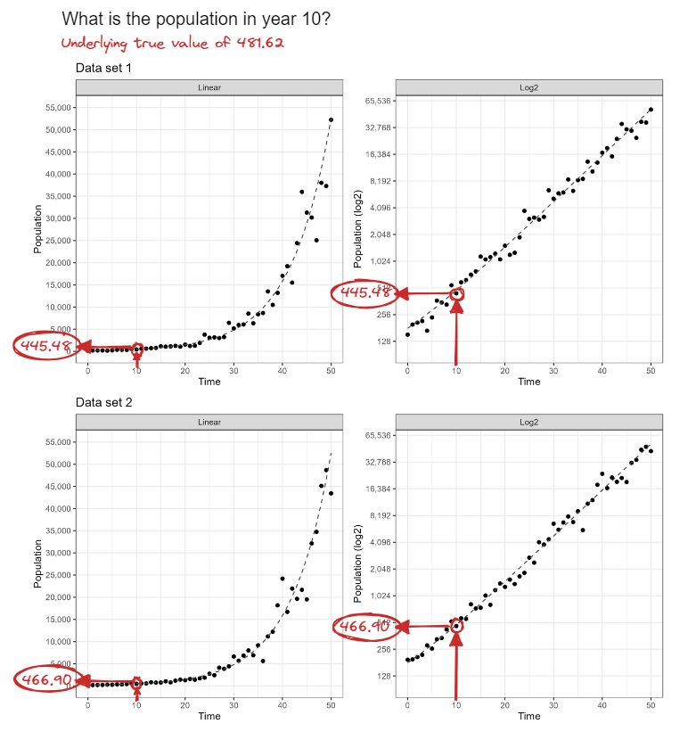
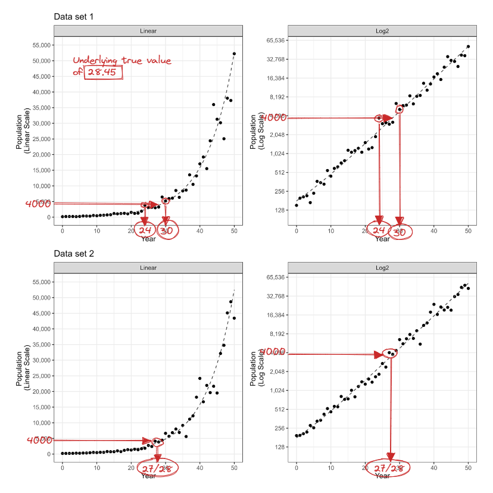
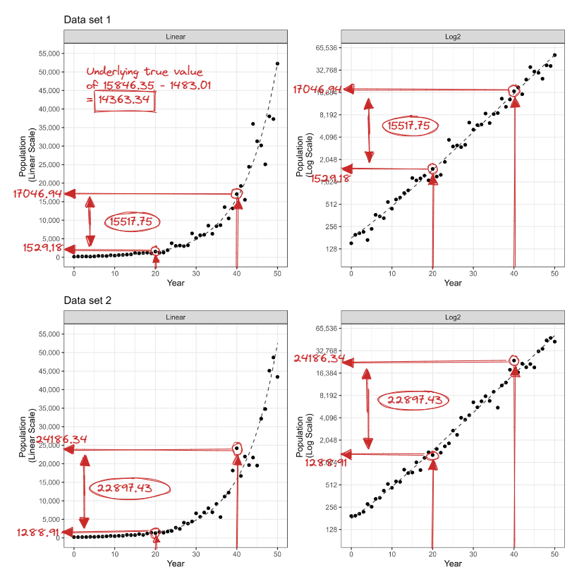
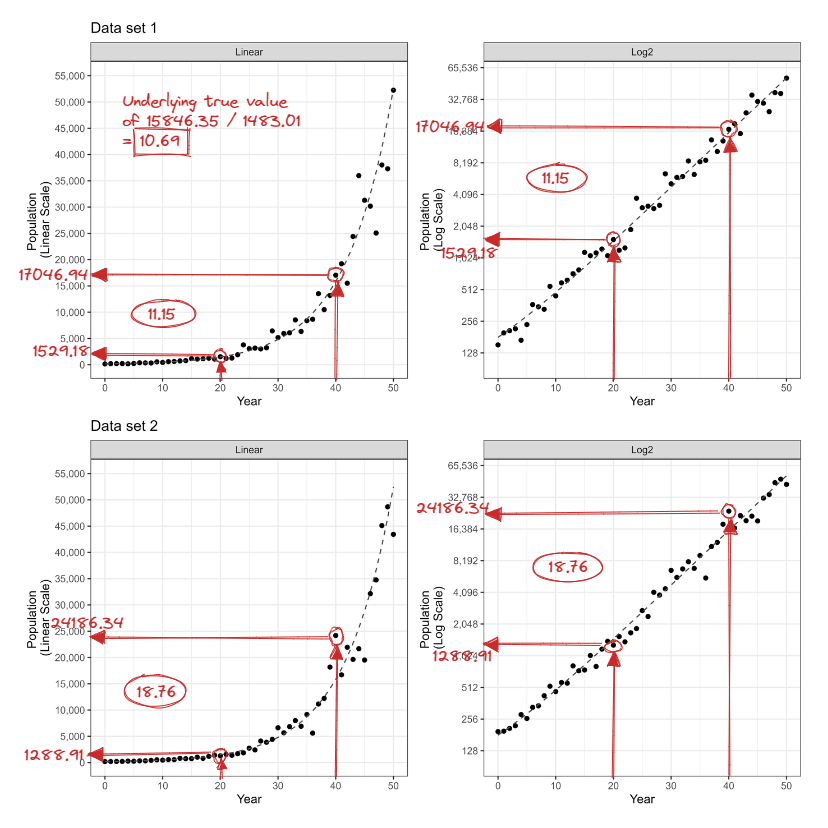
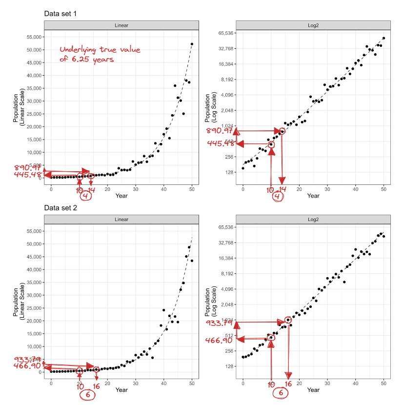

# Numerical Translation and Estimation {#estimation}

```{r estimation-setup, message=FALSE, warning=FALSE, echo = F}
library(tidyverse)
library(patchwork)
library(ggforce)
library(ggpubr)
library(here)
library(readr)
library(knitr)
library(kableExtra)
# library(pander)

library(ggwordcloud)
library(wordcloud)
library(RColorBrewer)
library(wordcloud2)
library(tm) 
library(tidytext)
library(corpus)
library(reshape2)
```

```{r estimation-data, message=FALSE, warning=FALSE, echo = F, cache = F}
estimation_model_data <- read_csv("data/03-estimation/estimation-model-data.csv")
q0_text_summary <- read_csv("data/03-estimation/q0-text-summary.csv")
estimation_simulated_data <- read_csv("data/03-estimation/estimation-simulated-data.csv") %>%
  mutate(x = x - 3000)
estimation_scenario_text <- read_csv("data/03-estimation/estimation-scenario-text.csv")
estimation_parameters <- read_csv("data/03-estimation/estimation-parameters.csv")
estimation_questions <- read_csv("data/03-estimation/estimation-questions.csv")
population_estimates_data <- read_csv("data/03-estimation/first-level-population-estimates.csv")

grid_lines_data <- tibble(scale = c(rep("linear", 12), rep("log2", 10)), 
                          grid_lines = c(seq(0,55000, 5000),
                                         2^seq(7,16))
) %>%
  expand_grid(dataset = c("dataset1", "dataset2"))
```

```{r density-plot}
densityPlot <- function(data, datasetID, estimate, xlabel = "Estimate", x_limits = c(0,70000), zoom = F, scalesx = T, zoom_limits = c(NA,NA), gridlines = T, rugjitter = 0.25){
  
  estPlot <- data %>%
    filter(dataset %in% datasetID) %>%
    ggplot(aes_string(x = estimate, fill = "scale", color = "scale")) +
    geom_density(alpha = 0.5, color = NA) +
    geom_rug(aes(y = -Inf), alpha = 0.8, show.legend = F, position = position_jitter(width = rugjitter, height = 0)) +
    geom_vline(aes(xintercept = true_value, linetype = "a")) +
    geom_vline(aes(xintercept = closest_pt_value, linetype = "b"))
  
  if(gridlines){
  estPlot <- estPlot + 
    geom_vline(data = grid_lines_data %>% filter(dataset == "dataset1", grid_lines >= x_limits[1], grid_lines <= x_limits[2]),
               aes(xintercept = grid_lines, color = scale, linetype = "c"))
  }
  
  estPlot <- estPlot +
    theme_bw() +
    theme(aspect.ratio = 0.5) +
    scale_color_manual("Scale", values = c("steelblue", "orange3")) +
    scale_fill_manual("Scale", values = c("steelblue", "orange3")) +
    scale_linetype_manual("", labels = c("True Value", "Closest Point Value", "Grid Line Breaks"), values = c("solid", "dashed", "dotted")) +
    scale_y_continuous("Density", labels = scales::comma)
  
  if(zoom){
  estPlot <- estPlot +
    facet_zoom(xlim = zoom_limits)
  }
  
  if(scalesx){
    estPlot <- estPlot +
    scale_x_continuous(xlabel, limits = x_limits)
  }
    
  return(estPlot)
  
}
```

## Introduction

The previous two chapters explored the use of log scales through differentiation and visual prediction of trends. 
These graphical tasks were conducted independent of context - no information about the data itself or even numerical scale values were provided to participants; instead, participants focused how our visual system perceives and identifies patterns in exponential growth.
In order to understand the cognitive implications of displaying exponentially increasing data on a log scale, it is essential to evaluate graph comprehension as it relates to the contextual scenario of the data shown.
This is a complex inferential process which requires participants to engage with the data by quantitatively transforming information in the chart [@cleveland_graphical_1984; @cleveland_graphical_1985].
In this study, we asked participants to translate a graph of exponentially increasing data into real value quantities and extend their estimations by comparing two data points.

<!-- Such complex inferential processes involve quantitatively transforming the information in the display (e.g., mentally transforming from a linear to log scale or calculating the difference between two or more data points; Cleveland, 1984, 1985). -->

### Graph Comprehension

Graph comprehension is heavily dependent on the questions being asked of the viewer; therefore, how these questions are phrased is an important aspect of comprehension and must be given deliberate consideration [@graesser2014new]. 
Evaluation of how viewers explore a new and complex graphic requires long-term interaction with the chart displaying the data [@becker2019trackr]. 
While it is difficult to obtain an accurate representation of a viewers understanding of the graphic with a fixed set of numerical estimates, three levels of graph comprehension have emerged from literature [@wood1968objectives; @curcio1987comprehension; @jolliffe1991assessment; @friel2001making; @glazer2011challenges].
The three behaviors related to graph comprehension involve (1) literal reading of the data (elementary level), (2) reading between the data (intermediate level), and (3) reading beyond the data (advanced level).
We present examples of questions associated with the three levels of questioning in [Section 1.4.1](#lit-questioning).
For instance, if shown a line graph of the value of a certain stock over time, an elementary level question might prompt the viewer to answer, "what was the value of stock X on June 15th?" and an intermediate level question would extend these estimates to ask the viewer, "over the first five days, how did the value of stock X change" [@friel2001making].
In addition to the graph's visual features and questioning, it is important for researchers to give careful consideration to the context of the graphic on the viewers comprehension.

### Estimation Biases

Certain well-known biases such as the tendency to round to multiples of five or ten or to anchor estimates to visual cues arise from open-ended estimation tasks [@tan1990processing].
Viewers may anchor their estimates to grid lines or round their approximations to rounded figures due to natural preference [@tan1994human; @godlonton2018anchoring; @myers1954accuracy].
Estimation accuracy is also affected by scale and axis labels [@dunham1991learning]; when alternate grid lines are labeled, viewers often read unlabeled grid lines as halves [@beeby1973well].
This misrepresentation is highlighted for asymmetric scales, such as a log scale, since spatial distance does not equate to numerical or quantitative difference.
Therefore, careful consideration must be given to the choice of scale for the graphic and how the viewer will interpret the data and information displayed.

## Study Design

Participants in this study were asked to answer six questions related to each of two contextual scenarios and an associated scatter plot shown for a total of twelve questions. 
The text for each scenario is presented below; the context of both scenarios was selected to be similar.
Each text describes a situation in which a fictional intergalactic species is exponentially increasing in population over a time chosen to reflect the popular culture media depiction of that species [@star_wars1; @star_wars2; @star_trek]. 
For simplicity, we will refer to these fictional time components as a year throughout the rest of the chapter.

\begin{quote}
\textbf{\textit{Tribble scenario.}} Hi, we're Tribbles! We were taken from our native planet, Iota Germinorum IV, and brought abroad Starfleet in stardate 4500. A Starfleet scientist, Edward Larkin, genetically engineered us to increase our reproductive rate in an attempt to solve a planetary food shortage. The Tribble population on Starfleet over the next 50 Stardates (equivalent to 1 week universe time) is illustrated in the graph. We need your help answering a few questions regarding the population of Tribbles.

\textbf{\textit{Ewok scenario.}} Hi, we're Ewoks! We are native to the forest moon of Endor. After the Galactic Civil War, some Ewoks traveled offworld to help Rebel veterans as 'therapy Ewoks' and began to repopulate. The Ewok population After the Battle of Yavin (ABY) is illustrated in the graph. We need your help answering a few questions regarding the population of Ewoks offworld.
\end{quote}

Fictional illustrations of the figures used in context were modified from artwork by @allison_horst and included on the main page for each scenario.
The scale of the graphic and data set displayed was randomly assigned to scenarios for each individual.
For instance, a participant may have seen a scatter plot of data set two displayed on the linear scale paired with the Ewok scenario text and a scatter plot of data set one displayed on the log scale paired with the Tribble scenario text.
The order of the two scenarios and their assigned data set and scale was randomly assigned to each individual.

We selected the six questions \pcref{tab:estimation-questions-table} for graph comprehension based on the three defined levels of questioning.
In each scenario, participants were first asked an open ended question, which required them to spend time exploring the data displayed in the graphic, followed by a random order of two elementary level questions and three intermediate level questions.
We did not focus on advanced level questioning since extrapolation and interpolation was addressed in [Chapter 2](#youdrawit).

```{r, estimation-questions-table, echo = F}
estimation_questions %>%
  filter(q_id != "scenario") %>%
  pivot_wider(id_cols = "q_id",
              names_from = "creature",
              values_from = "qtext") %>%
  mutate(q_id = c("Open Ended", "Elementary Q1", "Elementary Q2", "Intermediate Q1", "Intermediate Q2", "Intermediate Q3")) %>%
  kableExtra::kable("latex", booktabs = T, col.names = c("Question type", "Tribble scenario", "Ewok scenario"),
               caption = "Estimation Questions")  %>%
  kableExtra::column_spec(2:3, width = "10em")
```

The estimation study in this chapter was completed last in the series of the three graphical studies and took about fifteen minutes for participants to answer all twelve estimation questions.
Participants completed the series of graphical tests using a R Shiny application found [here](https://shiny.srvanderplas.com/perception-of-statistical-graphics/). 
For each of the quantitative translation questions, participants were provided a basic calculator and scratchpad to aid in their estimation of values.
We recorded the inputted and evaluated calculations and scratch work of each participant in order to better understand participant strategies for estimation.

## Data Generation

We generated two unique data sets with the same underlying parameter coefficients, but different errors randomly generated from the same error distribution. 
For each data set, a total of $N = 50$ points $(x_i, y_i), i = 1,...N$ were generated for single increments of $x_i\in [0, 50]$ where $x$ and $y$ have an exponential relationship.
Data were simulated based on a three parameter exponential model with multiplicative errors: 
\begin{align}
y_i & = \alpha e^{\beta x_i + e_i} + \theta \\
\text{with } e_i & \sim N(0, \sigma^2). \nonumber
\end{align} 
The underlying parameter coefficients were selected to follow a similar growth rate and shape as the previous two studies by visual inspection while ensuring in a maximum magnitude of around 50,000.
The resulting parameters selected for data generation were $\alpha = 130$, $\beta = 0.12$, $\theta = 50$, and $\sigma = 1.5$.

```{r estimation-simulated-data, fig.scap = "Estimation simulated data", fig.cap = "Scatter plots of the two unique data sets displayed on both the linear and log base two scales.", fig.height=9, fig.width=9, echo = F, message=FALSE, warning=FALSE, out.width="100%", echo = F, dev = "png"}

# dataset 1
simulated_plot_linear1 <- estimation_simulated_data %>%
  filter(dataset == "dataset1") %>%
  mutate(scale = "Linear") %>%
  ggplot(aes(x = x, y = y)) +
  geom_point() +
  geom_line(aes(y = y0), size = 0.5, color = "gray30", linetype = "dashed") +
  facet_wrap(~scale) +
  theme_bw() +
  theme(aspect.ratio = 1) +
  scale_x_continuous("Year") +
  scale_y_continuous("Population \n(Linear Scale)", 
                     limits = c(100, 55000),
                     breaks = seq(0, 55000, 5000),
                     labels = scales::comma,
                     minor_breaks = c()) +
  ggtitle("Data set 1")

simulated_plot_log1 <- estimation_simulated_data %>%
  filter(dataset == "dataset1") %>%
  mutate(scale = "Log2") %>%
  ggplot(aes(x = x, y = y)) +
  geom_point() +
  geom_line(aes(y = y0), size = 0.5, color = "gray30", linetype = "dashed") +
  facet_wrap(~scale) +
  theme_bw() +
  theme(aspect.ratio = 1) +
  scale_x_continuous("Year") +
  scale_y_continuous("Population \n(Log Scale)",
                     trans = "log2",
                     limits = c(100, 55000),
                     breaks = 2^seq(0,10000,1),
                     labels = scales::comma,
                     minor_breaks = c())

# dataset 2
simulated_plot_linear2 <- estimation_simulated_data %>%
  filter(dataset == "dataset2") %>%
  mutate(scale = "Linear") %>%
  ggplot(aes(x = x, y = y)) +
  geom_point() +
  geom_line(aes(y = y0), size = 0.5, color = "gray30", linetype = "dashed") +
  facet_wrap(~scale) +
  theme_bw() +
  theme(aspect.ratio = 1) +
  scale_x_continuous("Year") +
  scale_y_continuous("Population \n(Linear Scale)", 
                     limits = c(100, 55000),
                     breaks = seq(0, 55000, 5000),
                     labels = scales::comma,
                     minor_breaks = c()) +
  ggtitle("Data set 2")

simulated_plot_log2 <- estimation_simulated_data %>%
  filter(dataset == "dataset2") %>%
  mutate(scale = "Log2") %>%
  ggplot(aes(x = x, y = y)) +
  geom_point() +
  geom_line(aes(y = y0), size = 0.5, color = "gray30", linetype = "dashed") +
  facet_wrap(~scale) +
  theme_bw() +
  theme(aspect.ratio = 1) +
  scale_x_continuous("Year") +
  scale_y_continuous("Population \n(Log Scale)", 
                     trans = "log2",
                     limits = c(100, 55000),
                     breaks = 2^seq(0,10000,1),
                     labels = scales::comma,
                     minor_breaks = c())

(simulated_plot_linear1 + simulated_plot_log1) /
(simulated_plot_linear2 + simulated_plot_log2)
```

\cref{fig:estimation-simulated-data} display scatter plots of the two unique data sets on both the linear and log base two scales; a log of base two was selected in order to aid in participants estimation of time until the population doubled in 'Intermediate Q3' \pcref{tab:estimation-questions-table}.
Participants were shown the graphic of both data sets on either the linear or log scale with labels adjusted to reflect the associated scenario context and scale.
Grid lines for the $y$-axis were set to be consistent for the same scale across both data sets with the linear scale increasing by 5,000 and the log base two scale doubling, thus demonstrating the additive and multiplicative contextual appearance and interpretation of each scale respectively.
Minor $y$-axis grid lines were removed to avoid participants anchoring to the midway point between grid lines; this is particularly important on the log scale since a half-way grid line spatially does not correspond to a half-way point numerically.
Grid lines for the $x$-axis spanned a range of 50 years with major grid lines every ten years apart and minor grid lines indicating every five years.
The time unit labels on the $x$-axis reflected 0 to 50 ABY (After Battle of Yavin) for the Ewok scenario and were adjusted to 4500 to 4550 Stardates for the Tribble Scenario to align with the associated popular media depiction of each figure as well as disguise the use of the same underlying data simulation model and estimation questions across both scenarios.

## Results

Participant recruitment and study deployment was conducted via Prolific, a crowd sourcing website, on Wednesday, March 23, 2022 during which 302 individuals each completed all six estimation questions for each scenario (total of twelve questions per individual).
The data set used for analysis contained the unique participant identification and indicated the scenario, scale, data set, and estimation question along with the participant text response or quantitative estimate, calculation input and evaluation, and associated scratch work.
A total of 145 participants answered questions related to data set one on the linear scale and data set two on the log scale with 157 participants answering questions related to data set one on the log scale and data set two on the linear scale.
Sketches for each question are used to demonstrate the estimation tasks participants were asked to conduct.
An array of graphical displays allow for visual inspection of participant responses and provide suggestions about the cognitive implications of displaying exponentially increasing data on the log scale.

### Open Ended

Before participants were asked to estimate numeric quantities, they were asked to provide an open ended response and describe how the population changed over time. 
This required participants to spend time exploring the graphic and reflect upon how the data displayed related to the contextual application.
The `tidytext` and `corpus` packages in R [@tidytext_pkg; @corpus_pkg] were used to extract and stem words from participant text responses; stop words such as 'the' and 'is' as well as numbers were removed from the cleaned word responses. \svp{But you have numbers (x3) in your wordcloud... how bad is it if the numbers are left in?} \ear{I think x3 was read as a character because of the "x", the code only filtered out things like "3".}
The `wordcloud` package [@wordcloud_pkg] was used to create a cloud comparing frequencies of words across the two scales \pcref{fig:estimation-word-cloud}. 
The comparison word cloud is generated by defining $p_{i,j}$ as the rate in which word $i$ occurs when describing the data on scale $j$ where $p_j$ is the average rate across the scales $\sum_i{\frac{p_{i,j}}{\text{N scales}}}$. 
The maximum deviation for each word is calculated by $max_i(p_{i,j} - p_j)$ and mapped to the size of the word with the position of the word determined by the scale in which the maximum occurs.

```{r, estimation-word-cloud, fig.scap = "Estimation word cloud", fig.cap = "The open ended question results are displayed in a comparison word cloud which compares frequencies of words across the two scales. The maximum deviation in frequency is mapped to the size of the word and the position and color of the word is determined by the scale - linear (blue), log (orange).", fig.height=6, fig.width=6, out.width = "75%", message=FALSE, warning=FALSE, echo = F, dev = "png"}
set.seed(68505)
q0_text_summary %>%
  reshape2::acast(stem_word ~ scale, value.var = "count", fill = 0) %>%
  comparison.cloud(colors = c("steelblue", "orange2"),
                   max.words = 100,
                   rot.per = 0)
```

The comparison word cloud illustrates the general terminology participants used when describing the scatter plots shown on each scale.
Participants more frequently referred to terms such as 'exponential' and 'rapid' when shown the scatter plot on the linear scale while 'double' and 'quadruple' were often used to describe the graphic when shown on the log scale; indicating participants read the $y$-axis labels and noticed the doubling grid lines.
Participants often used "triple" to describe the data when displayed on the linear scale; one explanation might be that participants were roughly estimating the multiplicative change between grid lines.
For example, in year 40, the trend lands roughly around 15,000 and ends near 45,000 (three times as large) in year 50.
The use of the term 'linear' when participants are describing the appearance of the data displayed on the log scale suggests that a portion of participants described the visual appearance of the data independent of the axis labels; without further context, we do not have enough information to determine whether this implies participants were not recognizing the data was exponentially increasing rather than linearly increasing due to the change in contextual appearance caused by the choice of scale.
<!-- \svp{Or that they were describing the shape of the points independent of the axis -- we don't have enough context in the wordcloud to tell, even if it is suggestive.} -->

### Elementary Q1: Estimation of population

In order to examine the effect of scale on literal reading of the data, participants were asked, \textit{"What is the population in year 10?"} \pcref{fig:qe1-sketch}.
The true estimated population in year 10 based on the underlying parameter estimates was 481.61 with simulated points of 445.48 and 466.9 for data sets one and two respectively.
The median participant estimate across both scales and data sets was 500, with innerquartile ranges of 500 and 400 for data set one and data set two respectively when displayed on the linear scale and 48 and 12 for data set one and data set two respectively when displayed on the log scale.

```{r qe1-sketch, eval = T, fig.height = 8, fig.width = 8, out.width = "100%", fig.scap = "Elementary Q1 sketch", fig.cap = "Sketch of the estimation procedure asked in Elementary Q1.", dev = "png"}

```

Density plots were used to illustrate the distribution of the quantitative estimates provided by participants.
\pcref{fig:qe1-density-plot-10-all} reveals a larger variance in quantitative population estimates made on the linear scale compared to the log scale.
As expected, it is clear that participants were anchoring to grid lines and base ten values as highlighted by the high density of estimates at 512 and 500 on the log scale as well as local maximums near multiples of ten such as 500 and 1000.

```{r, eq1-data, message=FALSE, warning=FALSE, dev = "png"}
qe1_data <- estimation_model_data %>% 
  filter(q_id == "QE1") %>%
  mutate(response = as.numeric(response)) %>%
  mutate(showed_work_cutoff = ifelse(showed_work_n >= 2, "yes", "no"))
```

```{r qe1-info, eval = F}
estimation_simulated_data %>% 
  filter(x == 10) %>%
  knitr::kable(digits = 2)

qe1_data %>%
  group_by(dataset, scale) %>%
  get_summary_stats(response, type = "median_iqr") %>%
  knitr::kable(digits = 2)
```

```{r, qe1-density-plot-10-all, fig.scap = "Elementary Q1 density in year 10", fig.cap = "Density of the participant estimates for the population in year 10. Colors are associated to scale - linear (blue) and log (orange) - and vertical lines indicate the true value based on the underlying model equation (black solid), closest point value based on the simulated data set (black dashed), and grid lines shown on the graphs (blue/orange dotted). A jittered rug plot along the $x$-axis shows where participant estimates were made. The two unique data sets are shown separately.", fig.width = 9, fig.height = 9, out.width = "100%", message=FALSE, warning=FALSE, dev = "png"}
qe1_density10_1 <- densityPlot(data = qe1_data, datasetID = "dataset1", "response", xlabel = "Estimated Population at 10", x_limits = c(0,1200), zoom = F, rugjitter = 10) +
  geom_text(aes(label = "512", y = Inf, x = 512), color = "orange3", size = 3, hjust = -0.25, vjust = 2, show.legend = F) +
  ggtitle("Data set 1")

qe1_density10_2 <- densityPlot(data = qe1_data, datasetID = "dataset2", "response", xlabel = "Estimated Population at 10", x_limits = c(0,1200), zoom = F, rugjitter = 10) +
  geom_text(aes(label = "512", y = Inf, x = 512), color = "orange3", size = 3, hjust = -0.25, vjust = 2, show.legend = F) +
  ggtitle("Data set 2")

qe1_density10_1 / qe1_density10_2
```

During the study, participants were explicitly asked to estimate the population during year 10; this value corresponds to a low magnitude where the population is condensed in a small region on the linear scale as opposed to later in time when larger magnitudes in population can be seen.
While the results provided support for less variability in the estimated population in year 10 on the log scale, it is important to evaluate the accuracy of estimates along the full domain.
In two estimation questions related to intermediate level reading between the data, participants are asked to provide an increase and change in population between years 20 and 40, thus requiring participants to make first level estimates at these locations (\cref{fig:qi1-sketch} and \cref{fig:qi2-sketch}).
In order to understand the effect of the location along the domain and in turn the magnitude of the population being estimated, we extracted first level estimates for years 20 and 40 from participant calculations and scratch work. 

In order to examine whether participants who used the provided resources for estimation differed in their numerical estimations from those who did not, we first compared population estimates from the explicitly asked year 10 location; these comparisons are provided in [Appendix 3b](#estimation-comparison).
About half of the participants fell into the category which provided scratch work and half did not. 
It was determined there was no substantial difference or bias in estimates between the two groups, therefore, we proceeded to examine the estimated populations across scales from the first level estimates.

The true population from the underlying parameters in year 20 was 1483.01 with closest simulated point values of 1529.19 and 1288.9 for data sets one and two respectively; this location still results in a relatively low magnitude of population, but is closer to the crux of the exponential curve. 
In year 40, the true population from the underlying parameters in year 40 is 15846.35 with closest simulated point values of 17046.94 and 24186.34 for data sets one and two respectively. 
It is important to note that there is a difference in simulated point values in year 40 between the two data sets; as a result, the multiplicative error causes larger variance in simulated points for later years and larger population magnitudes.

```{r estimation-spaghetti-plots}
spaghettiPlotsTogether <- function(yearVals, scale, datasetID){
  
  plot <- population_estimates_data %>%
    filter(population_est < 55000, year %in% yearVals, dataset %in% datasetID) %>%
  ggplot() +
    
    # add spaghetti segments
    geom_segment(aes(x = yearest_true, y = population_est, xend = 0, yend = population_est, color = scale), alpha = 0.3) +
    geom_segment(aes(x = yearest_true, y = 100, xend = yearest_true, yend = population_est, color = scale), alpha = 0.3) +
    
    
    # add arrows for true value and closest point value
    geom_segment(aes(x = year, y = true_value, xend = -Inf  + 5, yend = true_value), size = 0.5, alpha = 0.9, linetype = "solid", color = "black", arrow = arrow(length=unit(0.1,"cm"), ends="last", type = "closed")) +
    geom_segment(aes(x = year, y = closest_pt_value, xend = -Inf + 5, yend = closest_pt_value), size = 0.5, alpha = 0.9, linetype = "solid", color = "black", arrow = arrow(length=unit(0.1,"cm"), ends="last", type = "closed")) +
    geom_segment(aes(x = year, y = 100, xend = year, yend = true_value), size = 0.5, alpha = 0.9, linetype = "solid", color = "black", arrow = arrow(length=unit(0.1,"cm"), ends="last", type = "closed")) +
    geom_segment(aes(x = year, y = 100, xend = year, yend = closest_pt_value), size = 0.5, alpha = 0.9, linetype = "solid", color = "black", arrow = arrow(length=unit(0.1,"cm"), ends="last", type = "closed")) +
    
    # add points
    geom_point(data = estimation_simulated_data %>% filter(dataset %in% datasetID), aes(x = x, y = y), alpha = 0.7, shape = 1, size = 1) +
    
    # extra
    facet_grid(~year, labeller = label_both) +
    theme_bw() +
    theme(aspect.ratio = 1) +
    scale_color_manual(values = c("steelblue", "orange3"), guide = guide_legend(override.aes = list(alpha = 1))) +
    scale_fill_manual(values = c("steelblue", "orange3")) +
    xlab("Year")
  
  if(scale == "linear"){
    plot <- plot +
      scale_y_continuous("Population", 
                         limits = c(100, 55000),
                       breaks = seq(0, 55000, 5000),
                       labels = scales::comma,
                       minor_breaks = c())
  } 
  
  if(scale == "log2"){
    plot <- plot +
    scale_y_continuous("Population \n (log2)", 
                       trans = "log2",
                       limits = c(100, 55000),
                       breaks = 2^seq(0,10000,1),
                       labels = scales::comma,
                       minor_breaks = c()
                       )
  }

plot
}
```

```{r spaghetti-dataset1, message=FALSE, warning=FALSE, fig.scap = "Estimated population spaghetti plot: data set 1", fig.cap = "Visual evaluation of participants estimates of the population at years 10, 20, and 40 on data set 1. When work was shown, first level estimates were extracted from participant calculations and scratch pad notes for years 20 and 40. Spaghetti plots are displayed on the linear scale (top) and log scale (bottom) with both scale estimates shown on each - linear (blue), log (orange). The year was calculated from the underlying model equation based on the population estimate provided by the participant. Gray arrows indicate the true value and closest point value as demonstrated in \\cref{fig:qe1-sketch}.", fig.width = 9, fig.height = 6, out.width = "100%", dev = "png"}
p1 <- spaghettiPlotsTogether(yearVals = c(10,20,40), scale = "linear", datasetID = "dataset1") + ggtitle("Data set 1")
p2 <- spaghettiPlotsTogether(yearVals = c(10,20,40), scale = "log2", datasetID = "dataset1")
p1/p2
```

```{r spaghetti-dataset2, message=FALSE, warning=FALSE, fig.scap = "Estimated population spaghetti plot: data set 2", fig.cap = "Visual evaluation of participants estimates of the population at years 10, 20, and 40 on data set 2. When work was shown, first level estimates were extracted from participant calculations and scratch pad notes for years 20 and 40. Spaghetti plots are displayed on the linear scale (top) and log scale (bottom) with both scale estimates shown on each - linear (blue), log (orange). The year was calculated from the underlying model equation based on the population estimate provided by the participant. Gray arrows indicate the true value and closest point value as demonstrated in \\cref{fig:qe1-sketch}.", fig.width = 9, fig.height = 6, out.width = "100%", dev = "png"}
p3 <- spaghettiPlotsTogether(yearVals = c(10,20,40), scale = "linear", datasetID = "dataset2") + ggtitle("Data set 2")
p4 <- spaghettiPlotsTogether(yearVals = c(10,20,40), scale = "log2", datasetID = "dataset2")
p3/p4
```

Population estimates for year 10 from participants who used the scratchpad and first level estimates for years 20 and 40 are shown with spaghetti plots in \cref{fig:spaghetti-dataset1} and \cref{fig:spaghetti-dataset2} displayed on both the linear and log scale to aid in visual evaluation.
The scale in which the estimate was made is indicated blue for linear and orange for log with the segments mapped from the participant estimated population to the true year based on the underlying data equation.
Previously noted, the simulated point corresponding to year 40 in data set two has a large deviation from the true underlying data equation; \cref{fig:spaghetti-dataset2} highlights that some participants were reading the data points as opposed to first detecting the underlying trend and making estimates based on the identified trend.
This provides argument that estimates are highly subjective to the particular data set.
As the year increases, we observe an increased accuracy in estimates made on the linear scale while estimates made on the log scale suffer in accuracy due to strong anchoring to grid lines and the larger quantitative difference between grid lines as population magnitudes increase.
For instance, on the log scale, there was a tendency to overestimate the population for year 20 from data set one, underestimate the population for year 20 from data set two, and overestimate the population for year 40 from data set two.
Inaccurate first level estimations can lead to consequences in estimations which require participants to make comparisons between two points (e.g. Intermediate Q1 and Q2).
<!-- \svp{This observation needs to show up in your discussion very clearly - it's a great example of the tradeoffs between the two scales! (I'm not there yet, just making notes as I go along)} -->

In extracting participant first level estimates from their calculation and scratch work, we observed participants were resistant to estimating between grid lines and had a greater tendency to anchor their estimates to the grid line estimates on the log scale. 
<!-- \svp{Do you think this would be true if we'd used log 10 and had 10 grid lines? Might be worth bringing up in your conclusion section...} -->
\cref{fig:common-population-estimates} illustrates the number of participants who provided that estimate on either the linear or log base two scale. 
<!-- \svp{You should probably explain what "true" means here - that is, there are several different ways to visually estimate the truth. A picture might even help to demonstrate.} -->
True values are based on the underlying model equation, closest simulated point values, and grid line breaks are indicated by the horizontal line types.
In particular, for year 40 in data set one, the closest point (17046.94) falls close to the log grid line (16384); participants greatly anchored to the grid line of 16384 with some participants adjusting to 16500 or 17000, anchoring again to a base ten value.
In a similar situation, for year 40 in data set two, the closest point (24186.34) falls close to the linear grid line (25000); more participants adjusted their estimates to 24500 or 24000 rather than anchoring to the grid line.
This suggests that participants were more likely to provide estimates which deviated from grid lines when making estimates on the linear scale, indicating they are more comfortable with interpreting values on a linear scale as opposed to the log scale.
When participants made estimates between grid lines on the log scale as indicated by their scratch work, they tended to estimate "halfway" between the two values indicated by the grid line breaks.
For example, 1536 was a common population estimate for year 20 in data set one because visually the location of estimation lands about halfway between grid lines 1024 and 2048 (\cref{fig:qi1-sketch} and \cref{fig:qi2-sketch}).
Another common halfway point on the log scale occurred at 24576 which visually lands between grid lines 16384 and 32768 for year 40 in data set two.
Participant calculations and scratch work provides support that participants equated these as halfway numerically as indicated by the selected work provided below:
\begin{align}
\textit{Sample work 1} \nonumber\\
2048-1024 &= 1024 \nonumber \\
1024/2 &= 512 \nonumber\\
512+1024 &= 1536 \nonumber
\nonumber \\ 
\nonumber \\
\textit{Sample work 2} \nonumber\\
2048 + 1024 & =3072 \nonumber\\
3072/2 & =1536 \nonumber
\nonumber \\ 
\nonumber \\
\textit{Sample work 3} \nonumber\\
32768-16384&=16384  \nonumber\\
32768-16384&=16384  \nonumber\\
16384*2&=32768  \nonumber\\
16384/2&=8192  \nonumber\\
8192+16384&=24576.  \nonumber
\end{align}
In particular, sample work 3 demonstrates the participant processing the log base two mapping as they repeatedly calculate the distance between two grid lines by subtraction and multiplication; they however then go on to estimate halfway between the two grid lines by equating spatial distance and quantitative difference.
This indicates a lack of understanding of log mapping where the spatial equivalence does not correspond to numeric equivalence; in other words, spatially halfway between two grid lines does not result in a numeric value halfway between the quantitative grid line labels.

```{r qe1-first-level-info, eval=FALSE, message=FALSE, warning=FALSE}
qe1_data %>%
  group_by(dataset, scale, showed_work_cutoff) %>%
  get_summary_stats(response, type = "median_iqr") %>%
  knitr::kable(digits = 2)

estimation_simulated_data %>% 
  filter(x == 20) %>%
  knitr::kable(digits = 2)

estimation_simulated_data %>% 
  filter(x == 40) %>%
  knitr::kable(digits = 2)
```

```{r message=FALSE, warning=FALSE, dev = "png"}
qe1_popest_common_responses <- population_estimates_data %>%
  group_by(scale, year, dataset, true_value, closest_pt_value, population_est) %>%
  dplyr::summarize(count = n()) %>%
  filter(count > 3) %>%
  arrange(year, scale, -count)

actual_values_data <- qe1_popest_common_responses %>%
  # filter(scale == "linear", "log") %>%
  select(year, scale, dataset, true_value, closest_pt_value) %>%
  unique() %>%
  pivot_wider(id_cols = c("year", "scale", "true_value"),
              names_from = "dataset",
              values_from = "closest_pt_value") %>%
  pivot_longer(cols = c("true_value", "dataset2", "dataset1"),
              names_to = "dataset",
              values_to = "population_est") %>%
  mutate(dataset = ifelse(dataset == "true_value" & scale == "linear", "dataset1",
                          ifelse(dataset == "true_value" & scale == "log2", "dataset2", dataset))) %>%
  mutate(scale = "linear", 
         true_value = NA,
         closest_pt_value = NA,
         count = NA) %>%
  unique() %>%
  select(year, scale, dataset, true_value, closest_pt_value, population_est, count)

qe1_popest_common_responses  <- qe1_popest_common_responses  %>%
  rbind(actual_values_data)
response_order <- c(unique(round(qe1_popest_common_responses$population_est,2))) %>% sort()

popEstCommonPlot <- function(yearVal, datasetID){
  
  common_plot <- qe1_popest_common_responses %>%
    filter(year %in% yearVal, dataset == datasetID) %>%
    mutate(population_est = round(population_est, 2)) %>%
    mutate(population_est = factor(population_est, response_order)) %>%
    mutate(population_est = factor(population_est, levels = response_order)) %>%
    ggplot(aes(x = count, xmin = 0, xmax = count, y = population_est, color = scale, shape = scale)) +
    geom_linerange(position = position_dodge(.5), show.legend = F) +
    geom_point(position = position_dodge(0.5) ) +
    geom_hline(aes(yintercept = as.factor(round(true_value,2)), linetype = "a")) +
    geom_hline(aes(yintercept = as.factor(round(closest_pt_value,2)), linetype = "b")) +
    geom_hline(data = grid_lines_data, aes(yintercept = as.factor(round(grid_lines, 2)), color = scale, linetype = "c")) +
    facet_wrap(~ year, ncol = 3, scales = "free_y", labeller = label_both) +
    theme_test() +
    theme(aspect.ratio = 0.67) +
    scale_shape_manual("Scale", values = c(16,15)) +
    scale_color_manual("Scale", values = c("steelblue", "orange3")) +
    scale_linetype_manual("", labels = c("True value", "Closest point", "Grid line"), values = c("solid", "dashed", "dotted")) +
    scale_y_discrete("Estimated Population") +
    scale_x_continuous("Number of participants")
  common_plot
}
```

```{r fig.height = 9, fig.width=9, message=FALSE, warning=FALSE, common-population-estimates, fig.scap="Estimated population: common responses for year 40", fig.cap = "Estimated populations in year 40 provided by more than three participants are shown in the dot chart. The $x$-axis indicates the number of participants who provided the estimate marked on the $y$-axis in assending numerical order. Colors are associated to scale - linear (blue) and log (orange) - and horizontal lines indicate the true value based on the underlying model equation (black solid), closest point value based on the simulated data set (black dashed), and grid lines shown on the graphs (blue/orange dotted). The two unique data sets are shown separately.", out.width="100%", dev = "png"}
p5 <- popEstCommonPlot(yearVal = c(40), datasetID = "dataset1") +
  ggtitle("Data set 1")

p6 <- popEstCommonPlot(yearVal = c(40), datasetID = "dataset2") +
  ggtitle("Data set 2")

p5 / p6
```

In conclusion, Elementary Q1 and the first level population estimates extracted from participant calculations and scratch work indicate that accuracy for low magnitudes are more accurate with lower variance in those estimates on the log scale than on the linear scale.
Accuracy of population estimates made on the linear scale improve as the magnitude of the population increases.
The results also provided support for the idea}that participants have a strong tendency to anchor their estimates to both grid lines and a base ten framework with resistance to estimating between grid lines on the log scale in particular, leading to a sacrifice in accuracy for larger magnitudes.
Participant calculations and scratch work revealed a lack of understanding of logarithmic mapping due to considering spatial distance as indicative of numerical distance.

### Elementary Q2: Estimation of time

In addition to estimating the population from a given year, participants were asked, \textit{"In what year does the population reach 4000?"} \pcref{fig:qe2-sketch}.
This required literal reading of the data by mapping a value given on the $y$-axis to its corresponding value on the $x$-axis.
The true estimated year based on the underlying equation in which the population reached exactly 4000 was 28.45. 
Unlike the previous question, there was no exact simulated point that aligned with the quantity to be estimated; the closest points for data set one occured at years 24 (population 3774.9) and 30 (population 5174.12) and for data set two at years 27 (population 3859.22) and 28 (population 4099.69).
The median year estimated by participants for data set one was 24 on both scales with innerquartile ranges of 1 and 3 for the linear and log scale respectively; the median for data set two occurred at 27 for both data sets with innerquartile ranges of 2 and 1 for the linear and log scale respectively.

```{r qe2-sketch, eval = T, fig.height = 9, fig.width = 9, out.width = "100%", fig.cap = "Elementary Q2 Sketch", dev = "png"}

```

```{r, eq2-data, message=FALSE, warning=FALSE}
qe2_data <- estimation_model_data %>% 
  filter(q_id == "QE2") %>%
  mutate(response = as.numeric(response))
```

```{r qe2-info, eval = F}
estimation_simulated_data %>% 
  filter(abs(y - 4000) < 1500) %>%
  arrange(dataset, y)

qe2_data %>%
  group_by(dataset, scale) %>%
  get_summary_stats(response, type = "median_iqr")
```

While a small portion of participants provided estimates of years 5, 10 and 15, the density plots in \cref{fig:qe2-density-plot} focus on reasonable participant estimates between years 20 and 35.
A population of 4000 occurs around a medium magnitude and is thus distinguishable on the linear scale, making the estimated location more visible.
Participants were consistently accurate across both the linear and log scales with a larger variance for data set one when estimates were made on the log scale.
One possible explanation for the difference in variation between data sets is that some participants were first visually fitting a trend on on the log scale (results in a visually linear trend) while some participants were basing their estimates off the closest point (year 24).
These competing strategies are clearly visible on the plot: some participants overestimated the closest point, while others made estimates more consistent with the true value based on the underlying (mean) equation. 
On the log scale, participants were able to strongly anchor their estimates to the grid line break of 4096 and provide accurate year estimates by counting between grid lines on the $x$-axis with few participants making estimates between years (for example, 27.5).
However, participants still had a tendency to anchor to a base ten framework as indicated by an increase in the density of estimates occurring at year 30.

```{r, qe2-density-plot, fig.cap = "Elementary Q2 Density. \\svp{Describe what is shown here - what are the main features? You have density plots with responses shown using a rug plot, but you can specifically describe anchoring to the closest point and then to specific even/round values.}", fig.width = 9, fig.height = 9, out.width = "100%", message=FALSE, warning=FALSE, dev = "png"}

# DATA SET 1
qe2_density_1 <- densityPlot(data = qe2_data, datasetID = "dataset1", "response", xlabel = "Estimated Year", x_limits = c(20,35), zoom = F, scalesx = T, gridlines = F, rugjitter = 0.25) +
  ggtitle("Data set 1")

# DATA SET 2
qe2_density_2 <- densityPlot(data = qe2_data, datasetID = "dataset2", "response", xlabel = "Estimated Year", x_limits = c(20,35), zoom = F, scalesx = T, zoom_limits = c(20,33), gridlines = F, rugjitter = 0.25) +
  geom_vline(aes(xintercept = 28, linetype = "b")) +
  ggtitle("Data set 2")

qe2_density_1  / qe2_density_2 
```

Results from Elementary Q2 provide support that participants accurately estimated the year in which the population reaches 4000 on both scales.
The accuracy on the linear scale can be explained by the visibility of a medium magnitude along with participant ability to make accurate estimates between grid lines on a linear scale.
The population given aligned closely with grid line 4096 on the log scale, allowing participants to strongly anchor to the grid line for their estimation.
In particular, for data set one, participants were slightly more likely to base their estimates off the underlying trend line on the log scale than on the linear scale.
Estimated years were often provided in whole numbers and few participants showed an understanding that the population of interest could occur between years.

### Intermediate Q1: Additive increase in population

Intermediate level questions required participants to read between the data and make comparisons between points.
Participants were asked, \textit{"From 20 to 40, the population increases by \_\_\_\_ [creatures]."} \pcref{fig:qi1-sketch}.
The questioning was selected carefully to prompt participants to make an additive comparison of populations between two years.
In order to make this comparison, participants must have first made an accurate first level estimate in both years and then subtract the two estimates. 
Sample participant work below shows correct logic on both the linear and log scales:
\begin{align}
\textit{Sample work 4: correct logic (linear)} \nonumber\\
15000 - 2500 & = 12500\nonumber\\
\text{Scratchpad: } &\text{In 20 ABY the population of Ewoks was 2500,}\nonumber\\
                   &\text{in 40 ABY the population was 15 000,}\nonumber\\
                   &\text{i would make a substraction}\nonumber \\
\nonumber \\
\textit{Sample work 5: correct logic (log)} \nonumber\\
2048 - 1024  & = 1024 \nonumber\\
1024 - 512   & = 512 \nonumber\\
1024 + 512   & = 1536 \nonumber\\
16384 - 1536 & = 14848 \nonumber\\
\text{Scratchpad: }  & \text{20 aby 1536} \nonumber\\
             & \text{40 16384.} \nonumber
\end{align}
The true estimated increase in population from year 20 to 40 based on the underlying equation is 14363.34 (15846.35 - 1483.01) with increases based on the closest points of 15517.75 (17046.94 - 1529.18) and 22897.45 (24186.34 - 1288.91) for data sets one and two respectively.
The median estimated increase for data set one was 15000 (IQR = 3000) for the linear scale and 14784 (IQR = 2000) for the log scale while data set two resulted in larger estimates and variability with a median increase of 17500 (IQR = 10625) and 16500 (IQR = 8952) for the linear and log scale respectively.
The discrepancy in the summary between the two data sets provides further support that participants were inspecting the simulated data points in order to make their estimates.

```{r, qi1-sketch, eval = T, fig.height = 8, fig.width = 8, out.width = "100%", fig.cap = "Intermediate Q1 Sketch", dev = "png"}

```

```{r qi1-data, message=FALSE, warning=FALSE}
# TRUNCATE AT 50000
qi1_data <- estimation_model_data %>% 
  filter(q_id == "QI1") %>%
  mutate(response = as.numeric(response)) %>%
  filter(response < 500000)
```

```{r qi1-summary, eval = F, message=FALSE, warning=FALSE, dev = "png"}
estimation_simulated_data %>% 
  filter(x %in% c(20, 40)) %>%
  arrange(dataset) %>%
  pivot_wider(id_cols = c("dataset"),
              names_from = "x",
              values_from = "y") %>%
  mutate(increase = `40` - `20`)

qi1_data %>%
  group_by(dataset, scale) %>%
  get_summary_stats(response, type = "median_iqr")
```

```{r qi1-density-1, fig.cap = "Intermediate Q1 Density (Data set 1) \\svp{Describe better. Also consider using alpha with rug plots because at the moment I can't see why the linear scale density is the way it is - all of the points seem to be above or below it with very few between true and closest point lines in blue...}", fig.width = 9, fig.height = 9, out.width = "100%", message=FALSE, warning=FALSE, dev = "png"}

# DATA SET 1
vline1 = c(14750)
vline2 = c(15000)
qi1_density_1a <- densityPlot(data = qi1_data, datasetID = "dataset1", "response", xlabel = "Estimated Increase in Population", x_limits = c(0,50000), zoom = T, scalesx = F, zoom_limits = c(10000,20000), gridlines = F, rugjitter = 10) +
  
  # geom_vline(aes(xintercept = vline1), color = "gray30") +
  # geom_text(aes(label = vline1, x = vline1, y = Inf), vjust = 2, hjust = -0.5, size = 3, color = "gray30") +  geom_vline(aes(xintercept = vline1), color = "gray30") +
  # 
  # geom_vline(aes(xintercept = vline2), color = "gray30") +
  # geom_text(aes(label = vline2, x = vline2, y = Inf), vjust = 2, hjust = -0.5, size = 3, color = "gray30") +
  
  ggtitle("Data set 1")

qi1_density_1b <- densityPlot(data = qi1_data, datasetID = "dataset1", "response", xlabel = "Estimated Increase in Population", x_limits = c(0,50000), zoom = T, scalesx = T, zoom_limits = c(10000,20000), gridlines = F, rugjitter = 10) +
  
  # geom_vline(aes(xintercept = vline1), color = "gray30") +
  # geom_text(aes(label = vline1, x = vline1, y = Inf), vjust = 2, hjust = -0.5, size = 3, color = "gray30") +  geom_vline(aes(xintercept = vline1), color = "gray30") +
  # 
  # geom_vline(aes(xintercept = vline2), color = "gray30") +
  # geom_text(aes(label = vline2, x = vline2, y = Inf), vjust = 2, hjust = -0.5, size = 3, color = "gray30") +
  
  ggtitle("Data set 1")

qi1_density_1a <- ggplot_build(qi1_density_1a)
qi1_density_1b <- ggplot_build(qi1_density_1b)

# re-set zoomed facet's limits to match zoomed range
k <- qi1_density_1b$layout$layout$SCALE_X[qi1_density_1b$layout$layout$name == "x"]
qi1_density_1b$layout$panel_scales_x[[k]]$limits <- qi1_density_1b$layout$panel_scales_x[[k]]$range$range 

# re-set zoomed facet's panel parameters based on original version p0
k <- qi1_density_1b$layout$layout$PANEL[qi1_density_1b$layout$layout$name == "x"]
qi1_density_1b$layout$panel_params[[k]] <- qi1_density_1a$layout$panel_params[[k]]

# convert built ggplot object to gtable of grobs as usual & print result
qi1_density_1b <- ggplot_gtable(qi1_density_1b)
grid::grid.draw(qi1_density_1b)
```

```{r qi1-density-2, fig.cap = "Intermediate Q1 Density (Data set 2)", fig.width = 9, fig.height = 9, out.width = "100%", message=FALSE, warning=FALSE, dev = "png"}

# DATA SET 2
qi1_density_2a <- densityPlot(data = qi1_data, datasetID = "dataset2", "response", xlabel = "Estimated Year", x_limits = c(0,50000), zoom = T, scalesx = F, zoom_limits = c(10000,30000), gridlines = F, rugjitter = 10) +
  ggtitle("Data set 2")

qi1_density_2b <- densityPlot(data = qi1_data, datasetID = "dataset2", "response", xlabel = "Estimated Year", x_limits = c(0,50000), zoom = T, scalesx = T, zoom_limits = c(10000,30000), gridlines = F, rugjitter = 10) +
  ggtitle("Data set 2")

qi1_density_2a <- ggplot_build(qi1_density_2a)
qi1_density_2b <- ggplot_build(qi1_density_2b)

# re-set zoomed facet's limits to match zoomed range
k <- qi1_density_2b$layout$layout$SCALE_X[qi1_density_2b$layout$layout$name == "x"]
qi1_density_2b$layout$panel_scales_x[[k]]$limits <- qi1_density_2b$layout$panel_scales_x[[k]]$range$range 

# re-set zoomed facet's panel parameters based on original version p0
k <- qi1_density_2b$layout$layout$PANEL[qi1_density_2b$layout$layout$name == "x"]
qi1_density_2b$layout$panel_params[[k]] <- qi1_density_2a$layout$panel_params[[k]]

# convert built ggplot object to gtable of grobs as usual & print result
qi1_density_2b <- ggplot_gtable(qi1_density_2b)
grid::grid.draw(qi1_density_2b)
```

\cref{fig:qi1-density-1} and \cref{fig:qi1-density-2} display the density for estimated increases in population as made by participants for data set one and two respectively.
There were a considerable amount of estimated increases near zero indicating that some participants were misinterpreting the value they were asked to estimate.
Sample participant work below shows common incorrect logic on both the linear and log scales:

\begin{align}
\textit{Sample work 6: incorrect logic (linear)} \nonumber\\
24000/2000&=12 \nonumber\\
\nonumber \\ 
\textit{Sample work 7: incorrect logic (log)} \nonumber\\
16380/1026&=15.96\nonumber\\
\nonumber \\ 
\textit{Sample work 8: changed logic (log)} \nonumber\\
2048-1024&=1024\nonumber\\
1024+512&=1536\nonumber\\
16384-1536&=14848\nonumber\\
14848/1536&=9.67.\nonumber
\end{align}

In particular, sample work 5 shows how the participant first estimated halfway between the log grid lines and correctly subtracted the populations for the two given years before incorrectly changing their logic to divide the two populations.
One potential source of misinterpretation of this questions might be the particular order in which participants were asked the questions.
For example, if participants were asked to provide an estimated increase in population after having been asked Intermediate Q2 which prompts participants to provide a multiplicative change in population, they may be more likely to misinterpret Intermediate Q1.
However, participants answering questions on the second scenario would have seen both questioning frameworks in the previous scenario context.

Estimates for the increase in population between year 20 and year 40 was distinctly more accurate for estimates made on the linear scale as indicated by the peak density occurring near the closest point and true value vertical lines.
The slight shifts in the density on the log scale suggest participants are making inaccurate first level estimates.
One explanation might be that participants were anchoring to the grid lines much stronger on the log scale as opposed to being more likely to adjust their estimates between grid lines on the linear scale.
Common responses \pcref{fig:qi1-common-responses} on the log scale come from anchoring to grid lines (16384 - 1024 = 15360), halfway numerically between grid lines (16384 - 1536  = 14848; 24576 - 1536 = 2340), and base ten (16384 - 2000 = 14784) while participants on the linear scale anchored to multiples of 500 and 1000.
This was dependent on the location of simulated points in relation to the grid lines and lead to an underestimation in difference for data set one and an overestimation in difference for data set two. 
Variance in estimates appeared to be consistent across both scales for data set two with a smaller variance on the log scale for data set one.

```{r, qi1-common-responses, fig.cap = "Intermediate Q1 Common Responses", fig.width = 9, fig.height = 9, out.width = "100%", message=FALSE, warning=FALSE, dev = "png"}
qi1_common_responses <- qi1_data %>%
  mutate(true_value = round(true_value, 2)) %>%
  group_by(scale, true_value, closest_pt_value, dataset, response) %>%
  dplyr::summarize(count = n()) %>%
  filter(count > 4) %>%
  arrange(response)

actual_values_data <- qi1_common_responses %>%
  # filter(scale == "linear", "log") %>%
  select(scale, dataset, true_value, closest_pt_value) %>%
  unique() %>%
  pivot_wider(id_cols = c("scale", "true_value"),
              names_from = "dataset",
              values_from = "closest_pt_value") %>%
  pivot_longer(cols = c("true_value", "dataset2", "dataset1"),
              names_to = "dataset",
              values_to = "response") %>%
  mutate(dataset = ifelse(dataset == "true_value" & scale == "linear", "dataset1",
                          ifelse(dataset == "true_value" & scale == "log2", "dataset2", dataset))) %>%
  mutate(scale = "linear", 
         true_value = NA,
         closest_pt_value = NA,
         count = NA) %>%
  unique() %>%
  # mutate(response = round(response, 2)) %>%
  select(scale, dataset, true_value, closest_pt_value, response, count)

qi1_common_responses <- qi1_common_responses %>%
  rbind(actual_values_data)
response_order <- c(unique(round(qi1_common_responses$response, 2))) %>% sort()

qi1_common_plot_1 <- qi1_common_responses %>%
  filter(dataset == "dataset1") %>%
  mutate(response = round(response, 2)) %>%
  mutate(response = factor(response, levels = response_order)) %>%
  ggplot(aes(x = count, xmin = 0, xmax = count, y = response, color = scale, shape = scale)) +
  geom_linerange(position = position_dodge(.5)) +
  geom_point(position = position_dodge(0.5)) +
  geom_hline(aes(yintercept = as.factor(round(true_value,2)), linetype = "True"), size = 0.8) +
  geom_hline(aes(yintercept = as.factor(round(closest_pt_value,2)), linetype = "Closest Point"), size = 0.8) +
  # facet_grid(~ dataset) +
  theme_test() +
  theme(aspect.ratio = 0.67) +
  scale_shape_manual("Scale", values = c(16,15)) +
  scale_color_manual("Scale", values = c("steelblue", "orange3")) +
  scale_linetype_manual("Actual Value", labels =  c("Closest Point", "True Value"), values = c("dashed", "solid")) +
  scale_y_discrete("Estimated Increase in Population") +
  scale_x_continuous(expand = c(0,0.5)) +
  ggtitle("Data set 1")

qi1_common_plot_2 <- qi1_common_responses %>%
  filter(dataset == "dataset2") %>%
  mutate(response = round(response, 2)) %>%
  mutate(response = factor(response, levels = response_order)) %>%
  ggplot(aes(x = count, xmin = 0, xmax = count, y = response, color = scale, shape = scale)) +
  geom_linerange(position = position_dodge(.5)) +
  geom_point(position = position_dodge(0.5)) +
  geom_hline(aes(yintercept = as.factor(round(true_value,2)), linetype = "True"), size = 0.8) +
  geom_hline(aes(yintercept = as.factor(round(closest_pt_value,2)), linetype = "Closest Point"), size = 0.8) +
  # facet_grid(~ dataset) +
  theme_test() +
  theme(aspect.ratio = 0.67) +
  scale_shape_manual("Scale", values = c(16,15)) +
  scale_color_manual("Scale", values = c("steelblue", "orange3")) +
  scale_linetype_manual("Actual Value", labels =  c("Closest Point", "True Value"), values = c("dashed", "solid")) +
  scale_y_discrete("Estimated Increase in Population") +
  scale_x_continuous(expand = c(0,0.5)) +
  ggtitle("Data set 2")

qi1_common_plot_1/
qi1_common_plot_2
```

Responses from Intermediate Q1 required participants to use their first level estimates in order to make an additive comparison of populations between two years.
Some participants misinterpreted the question, making a multiplicative comparison, thus providing estimates closer to zero.
This was supported by examining select participant calculation and scratchpad work. 
The estimated increase in population was more accurate on the linear scale with the lack of accuracy on the log scale affected by participant resistance to and misunderstanding of making estimates between log grid lines.

### Intermediate Q2: Multiplicative change in population

Previously, we explored how participants made an additive comparison of populations between two years.
In addition, participants were asked, \textit{"How many times more [creatures] are there in 40 than in 20?"} \pcref{fig:qi2-sketch}.
The questioning was selected carefully to prompt participants to make a multiplicative comparison between two years.
Similar to Intermediate Q1, in order to make this comparison, participants must have made accurate first level estimates in both years and then divide the two estimates.
Participants may also have made this comparison on the log scale by understanding the multiplicative nature of the grid lines. Sample participant work below shows correct logic on both the linear and log scales:

\begin{align}
\textit{Sample work 9: correct logic (linear)} \nonumber\\
17500/1400&=12.5 \nonumber\\	
\text{Scratchpad: } & \text{same as before, but a division} \nonumber\\
\nonumber \\
\textit{Sample work 11: correct logic (linear)} \nonumber\\
17000-1000&=16000 \nonumber\\
17000/1000&=17  \nonumber\\
\nonumber \\
\textit{Sample work 12: correct logic (log)} \nonumber\\
24/1.4&=17.14	 \nonumber\\ 
\text{Scratchpad: } & \text{around 24k tribbles were at 4540, and} \nonumber\\
                   & \text{1.4k at 4520, make a division and thats}\nonumber\\
                   & \text{how many times (without the k)}\nonumber
\nonumber \\
\textit{Sample work 13: correct logic (log)} \nonumber\\                   
2048*5&=10240 \nonumber\\   
2048*6&=12288 \nonumber\\   
2048*7&=14336 \nonumber\\   
2048*8&=16384  \nonumber\\   
2048*8&=16384. \nonumber
\end{align}

```{r, qi2-sketch, eval = T, fig.height = 8, fig.width = 8, out.width = "100%", fig.cap = "Intermediate Q2 Sketch", dev = "png"}

```

The scratch work from participants gave insight about the estimation strategy participants followed when determining the estimated change in population.
For instance, sample work 11 shows the participant first incorrectly calculated the additive increase in population before correcting their calculation through division while sample work 13 shows how the participant used a trial and error method.
The true change in population based on the underlying equation was 10.69 times as many (15846.35/1483.01) with changes based on the closest points of 11.1 (17046.94/1529.18) and 18.8 (24186.34/1288.91) for data sets one and two respectively.
The median estimated change for data set one was 11.7 (IQR = 8.5) for the linear scale and 10.7 (IQR = 6) for the log scale while data set two resulted in larger estimates and variability with a median change of 15.3 (IQR = 14) and 16 (IQR = 8.5) for the linear and log scale respectively.
The inconsistency between the two data sets aligns with previous evidence that participants were making estimates by reading the simulated data rather than based on the underlying trend.

```{r, qi2-data, warning = F, message = F}
# TRUNCATED AT 5000
qi2_data <- estimation_model_data %>% 
  filter(q_id == "QI2") %>%
  mutate(response = as.numeric(response)) %>%
  filter(response < 50000)
```

```{r, qi2-summary, eval = F, message = F, warning = F}
estimation_simulated_data %>% 
  filter(x %in% c(20, 40)) %>%
  arrange(dataset) %>%
  pivot_wider(id_cols = c("dataset"),
              names_from = "x",
              values_from = "y") %>%
  mutate(increase = `40`/`20`)

qi2_data %>%
  group_by(dataset, scale) %>%
  get_summary_stats(response, type = "median_iqr")
```

```{r, qi2-plots, fig.cap = "Intermediate Q2 Observed Plot", fig.width = 9, fig.height = 9, out.width = "100%", message=FALSE, warning=FALSE, dev = "png"}
qi2_plot_1 <- qi2_data %>%
    filter(dataset == "dataset1") %>%
  ggplot(aes(x = scale, y = response, group = participant_id, color = scale, shape = scale)) +
    geom_linerange(aes(ymin = 0, ymax = response), position = position_dodge2(0.95), size = 0.25) +
    geom_point(position = position_dodge2(0.95)) +
    # geom_hline(aes(yintercept = closest_pt_value), linetype = "dashed") +
    theme_bw() +
    theme(aspect.ratio = 0.5) +
    scale_shape_manual(values = c(16,15)) +
    scale_color_manual(values = c("steelblue", "orange"), guide = guide_legend(override.aes = list(alpha = 1) )) +
  scale_y_continuous("Estimated Change in Population \n(Times as Many)") +
  xlab("") +
  ggtitle("Data set 1")

qi2_plot_2 <- qi2_data %>%
    filter(dataset == "dataset2") %>%
  ggplot(aes(x = scale, y = response, group = participant_id, shape = scale, color = scale)) +
    geom_linerange(aes(ymin = 0, ymax = response), position = position_dodge2(0.95), size = 0.25) +
    geom_point(position = position_dodge2(0.95)) +
    # geom_hline(aes(yintercept = closest_pt_value), linetype = "dashed") +
    theme_bw() +
    theme(aspect.ratio = 0.5) +
    scale_shape_manual(values = c(16,15)) +
    scale_color_manual(values = c("steelblue", "orange"), guide = guide_legend(override.aes = list(alpha = 1) )) +
  ggtitle("Data set 2") +
  scale_y_continuous("Estimated Change in Population \n(Times as Many)") +
  xlab("")

qi2_plot_1 /
qi2_plot_2
```

As seen in the results for Intermediate Q1, some participants struggled to understand the value they were being asked to estimate.
Similarly, \cref{fig:qi2-plots} illustrates a substantial number of participants provided estimates that more closely reflected that of the additive increase in population rather than the multiplicative change. 
\cref{fig:qi2-common-responses} highlights that 15000 was still a common participant response.
Sample work below demonstrate common incorrect logic and calculations conducted by participants:

\begin{align}
\textit{Sample work 14: incorrect logic (linear)} \nonumber\\
23800-1100&=22700 \nonumber\\	
\nonumber \\
\textit{Sample work 15: incorrect logic (log)} \nonumber\\
16384-1536&=14848. \nonumber
\end{align}

Evaluating reasonable participant responses for the change in population between 0 times as many and 35 times as many, \cref{fig:qi2-density} indicates participants tended to be make more accurate and less variable estimates on the log scale than on the linear scale.
\cref{fig:qi2-plots} shows common responses provided by participants.

```{r qi2-density, fig.cap = "Intermediate Q2 Density", fig.width = 9, fig.height = 9, out.width = "100%", message=FALSE, warning=FALSE, dev = "png"}

# DATA SET 1
qi2_density_1 <- densityPlot(data = qi2_data, datasetID = "dataset1", "response", xlabel = "Estimated Change in Population \n(Times as Many)", x_limits = c(0,35), zoom = F, scalesx = T, gridlines = F, rugjitter = 1) +
  ggtitle("Data set 1")

# DATA SET 2
qi2_density_2 <- densityPlot(data = qi2_data, datasetID = "dataset2", "response", xlabel = "Estimated Change in Population \n(Times as Many)", x_limits = c(0,35), zoom = F, scalesx = T, gridlines = F, rugjitter = 1) +
  ggtitle("Data set 2")

qi2_density_1 /
qi2_density_2
```

```{r, qi2-common-responses, fig.cap = "Intermediate Q2 Common Responses", fig.width = 9, fig.height = 9, out.width = "100%", message=FALSE, warning=FALSE, dev = "png"}
qi2_common_responses <- qi2_data %>%
  mutate(true_value = round(true_value, 2)) %>%
  group_by(scale, true_value, closest_pt_value, dataset, response) %>%
  dplyr::summarize(count = n()) %>%
  filter(count > 3) %>%
  arrange(response)

actual_values_data <- qi2_common_responses %>%
  select(scale, dataset, true_value, closest_pt_value) %>%
  unique() %>%
  pivot_wider(id_cols = c("scale", "true_value"),
              names_from = "dataset",
              values_from = "closest_pt_value") %>%
  pivot_longer(cols = c("true_value", "dataset2", "dataset1"),
              names_to = "dataset",
              values_to = "response") %>%
  mutate(dataset = ifelse(dataset == "true_value" & scale == "linear", "dataset1",
                          ifelse(dataset == "true_value" & scale == "log2", "dataset2", dataset))) %>%
  mutate(scale = "linear", 
         true_value = NA,
         closest_pt_value = NA,
         count = NA) %>%
  unique() %>%
  # mutate(response = round(response, 2)) %>%
  select(scale, dataset, true_value, closest_pt_value, response, count)

qi2_common_responses <- qi2_common_responses %>%
  rbind(actual_values_data)
response_order <- c(unique(round(qi2_common_responses$response, 2))) %>% sort()

qi2_common_plot_1 <- qi2_common_responses %>%
  filter(dataset == "dataset1") %>%
  mutate(response = round(response, 2)) %>%
  mutate(response = factor(response, levels = response_order)) %>%
  ggplot(aes(x = count, xmin = 0, xmax = count, y = response, color = scale, shape = scale)) +
  geom_linerange(position = position_dodge(.5)) +
  geom_point(position = position_dodge(0.5)) +
  geom_hline(aes(yintercept = as.factor(round(true_value,2)), linetype = "True"), size = 0.8) +
  geom_hline(aes(yintercept = as.factor(round(closest_pt_value,2)), linetype = "Closest Point"), size = 0.8) +
  # facet_grid(~ dataset) +
  theme_test() +
  theme(aspect.ratio = 0.67) +
  scale_shape_manual("Scale", values = c(16,15)) +
  scale_color_manual("Scale", values = c("steelblue", "orange3")) +
  scale_linetype_manual("Actual Value", values = c("dotted", "dashed")) +
  scale_y_discrete("Estimated Change in Population \n(Times as Many)") +
  scale_x_continuous(expand = c(0,0.5)) +
  ggtitle("Data set 1")

qi2_common_plot_2 <- qi2_common_responses %>%
  filter(dataset == "dataset2") %>%
  mutate(response = round(response, 2)) %>%
  mutate(response = factor(response, levels = response_order)) %>%
  ggplot(aes(x = count, xmin = 0, xmax = count, y = response, color = scale, shape = scale)) +
  geom_linerange(position = position_dodge(.5)) +
  geom_point(position = position_dodge(0.5)) +
  geom_hline(aes(yintercept = as.factor(round(true_value,2)), linetype = "True"), size = 0.8) +
  geom_hline(aes(yintercept = as.factor(round(closest_pt_value,2)), linetype = "Closest Point"), size = 0.8) +
  # facet_grid(~ dataset) +
  theme_test() +
  theme(aspect.ratio = 0.67) +
  scale_shape_manual("Scale", values = c(16,15)) +
  scale_color_manual("Scale", values = c("steelblue", "orange3")) +
  scale_linetype_manual("Actual Value", values = c("dotted", "dashed")) +
  scale_y_discrete("Estimated Change in Population \n(Times as Many)") +
  scale_x_continuous(expand = c(0,0.5)) +
  ggtitle("Data set 2")

qi2_common_plot_1/
qi2_common_plot_2
```

Overall, responses for Intermediate Q2 provided further support that participants tended to misinterpret the quantity they were being asked to estimate.
The density plots of responses suggest that the log scale has a slight advantage over the linear scale for estimating the multiplicative change in population.
While anchoring to grid lines and base ten values for first level estimates still occurred, many participants further anchored their responses to whole values.

### Intermediate Q3: Time until population doubles

An alternative multiplicative comparison between two points was to determine the amount of time it took for a value to double.
Participants were asked, *"How long does it take for the population in year 10 to double?"* \pcref{fig:qi3-sketch}.
In order to accurately evaluate this comparison, participants must have made a first level estimate for the population in year 10, asked in Elementary Q1.
Participants then needed to double their first level estimate in order to extract the year in which this value occurred and finally subtract year 10.
Alternatively, on the log scale, participants could have made this comparison without actually extracting the numeric values and instead relied on their spatial distance equating one increase in grid lines to a double in population.
This estimation strategy would have required keen understanding of the log base two scale.
Making a judgement based on participant calculations and scratch work, most participants selected the former approach when they estimated the number of years it took for the population to double.
One participant stated, "4510 has 512 Tribble Population and to double it it needs to have 1,024 so it would take approximately 5 years. In 4515 they would have double the population." while another participant indicated "10Aby near to 460.8 so double is 921.6; aprox. 5 years."

```{r qi3-sketch, eval = T, fig.height = 8, fig.width = 8, out.width = "100%", fig.cap = "Intermediate Q3 Sketch", dev = "png"}

```

```{r, qi3-data, warning = F, message = F}
qi3_data <- estimation_model_data %>% 
  filter(q_id == "QI3") %>%
  mutate(response = as.numeric(response)) %>%
  filter(response < 50)
```

```{r, qi3-summary, eval = F, warning = F, message = F, dev = "png"}
doubled_data <- estimation_simulated_data %>% 
  filter(x == 10) %>%
  mutate(doubled = y*2)

estimation_simulated_data %>% 
  left_join(doubled_data %>% select(-c(x, y0, y)), by = c("dataset")) %>%
  mutate(pop_diff = abs(y - doubled),
         year_diff = x - 10) %>%
  filter(pop_diff < 200) %>%
  arrange(dataset, pop_diff)

qi3_data %>%
  group_by(dataset, scale) %>%
  get_summary_stats(response, type = "median_iqr") 
```

Based on the true underlying equation, the population in year 10 (481.62) doubled to 963.24 in year 16.25, thus it took 6.25 years for the population to double.
Closest simulated points resulted in the population doubling in 4 years (445 x 2 = 890.97 in 14) for data set one and 6 years (466.90 x 2 = 933.79 in 16) for data set two.
The median participant response for data set one was 5 (IQR = 5) and 5 (IQR = 2) for the linear and log scale respectively with a median for data set two of 8 (IQR = 6) and 6 (IQR = 2) for the linear and log scale respectively.
\cref{fig:qi3-density} illustrates the estimated number of years until the population in year 10 doubled.
While there appears to be similar accuracy across both scales, the variance in estimates was considerably smaller for the log scale.
The large variance in the linear scale may be explained by the location of reference year 10 which resulted in a population of low magnitude and is visually difficult to estimate.
As indicated by peaks in density, there was strong anchoring which occurs at multiples of five.

```{r qi3-density, fig.cap = "Intermediate Q3 Density", fig.width = 9, fig.height = 9, out.width = "100%", message=FALSE, warning=FALSE, dev = "png"}

# DATA SET 1
qi3_density_1 <- densityPlot(data = qi3_data, datasetID = "dataset1", "response", xlabel = "Estimated Years to Double \nin Population", x_limits = c(0,50), zoom = F, scalesx = T, gridlines = F, rugjitter = 1) +
  ggtitle("Data set 1")

# DATA SET 2
qi3_density_2 <- densityPlot(data = qi3_data, datasetID = "dataset2", "response", xlabel = "Estimated Years to Double \nin Population", x_limits = c(0,50), zoom = F, scalesx = T, gridlines = F, rugjitter = 1) +
  ggtitle("Data set 2")

qi3_density_1 /
qi3_density_2
```

In summary, as indicated by participant scratch work, they tended to make a first level estimates for the reference year 10 rather than visually judging the distance between grid lines on the log scale. 
The estimated number of years until the population doubled from a reference year of 10 resulted in lower variability on the log scale as opposed to a larger variability on the linear scale.
One explanation might be the low magnitude of population in year 10 and further exploration would be needed to justify for other reference years.
Common responses strongly suggest participants were anchoring to multiples of 5 years.

## Discussion and Conclusion

This study was intended to help inform and aid in understanding the cognitive implications of displaying exponentially increasing data on a log scale.
We evaluated graph comprehension as it relates to two contextual scenarios by asking participants a series of six questions (one open ended, two elementary level, and three intermediate) which required them to quantitatively transform information in the chart.
Results provided an understanding of the advantages and disadvantages of the log scale.

In general, results suggest that understanding log logic is difficult as indicated by the misunderstanding in Intermediate Q1 and Q2.
This is also supported in following participants estimation strategies for making first level estimates in Intermediate Q3 rather than relying on their spatial awareness between grid lines on the log scale.
The accuracy of estimates greatly depends on the location of the value being estimated in relation to the magnitude.
For example, accuracy and variability of population estimates made on the linear scale improved as the year of interest increased and thus the magnitude of population increased, making the point more visible.
Alternatively, there was a slight sacrifice in the accuracy of population estimates on the log scale as the year of interest increased.
This was due to participant resistance to estimate between grid lines on the log scale and inaccurate representation of equating spatial distance to quantitative difference.
As the magnitude of population increases, there was a more noticeable effect of the resistance and lack of understanding.
Inaccurate first level estimations can lead to consequences in estimations which require participants
to make comparisons between two points.
Density plots showed an advantage of the linear scale when estimating an additive increase in population and a slight advantage of the log scale when estimating a multiplicative change in population.

It was also found that estimates were subjective to the simulated data set as shown by the discrepancy between data set one and data set two.
This implies a large portion of participants were reading the actual simulated data points as opposed to basing estimates on the underlying visual trend of the data.
Common responses revealed participants bias to anchoring their estimates to the grid lines, particularly on the log scale, as well as to base ten values.
The strong tendency to anchor to grid lines on the log scale resulted in a sacrifice in accuracy as quantitative differences between grid lines increased.
This also implies that accuracy strongly depended on the location of the simulated point in relation to the grid lines.

Understanding graph comprehension is a complex process and requires long-term interaction with the chart and information being presented. 
With a fixed number of estimates and assessment of participant scratch work, we outlined a variety of situations in which displaying exponentially increasing data on the log scale resulted in both advantages and disadvantages, thus providing a better understanding of the cognitive implications of the use of log scales.

