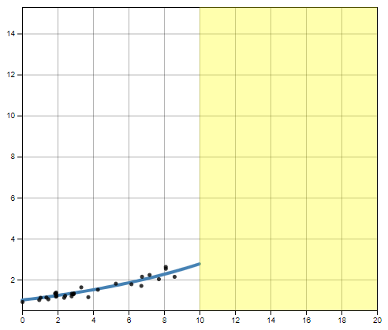
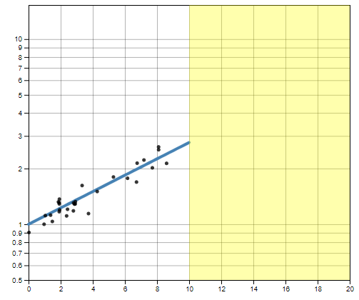
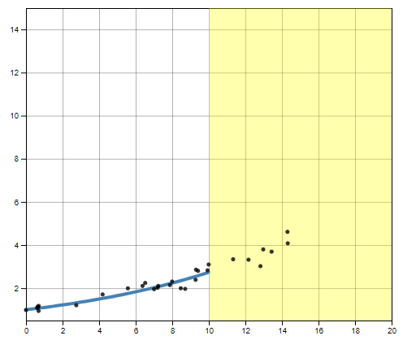
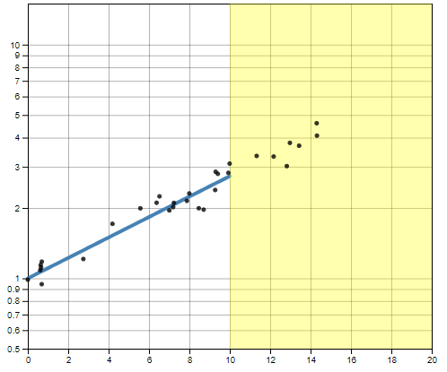
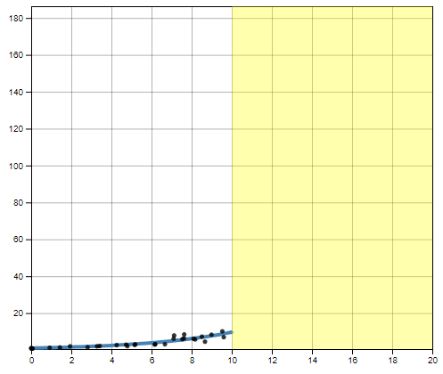
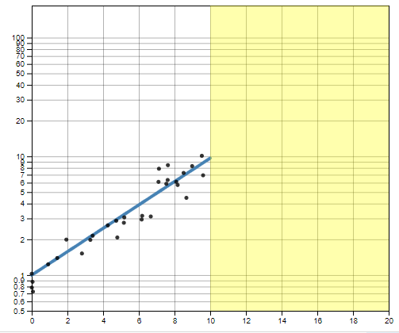
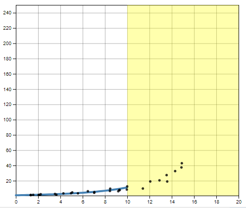
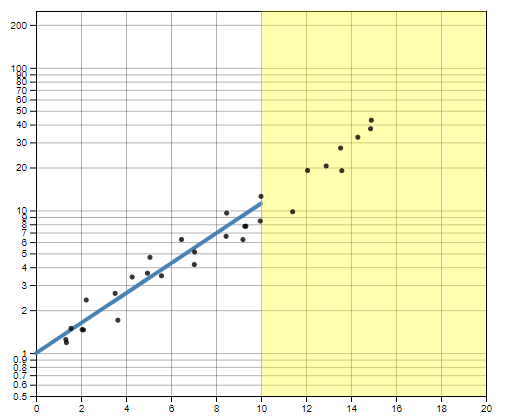

`r if(knitr:::is_latex_output()) '\\appendix'`

`r if(!knitr:::is_latex_output()) '# (APPENDIX) Appendix {-}'` 

```{r appendix-setup, message=FALSE, warning=FALSE, echo = F}
library(tidyverse)
```

# You Draw It Setup with Shiny {#youdrawit-with-shiny}

Interactive plots for the you draw it study were created using the `r2d3` package and integrating D3 source code with an R shiny application. 
I conducted all data simulation and processing in R and outputted two data sets - point data and line data - containing (x, y) coordinates corresponding to either a simulated point or fitted value predicted by a statistical model respectively. 
Then, the r2d3 package converted the data sets in R to JSON to be interpreted by the D3.js code. 
I define functions in D3.js to draw the initial plot and set up drawable points for the user drawn line. 
Drag events in D3.js were utilized to react to observe and react to user input. 
Shiny Messages were used to communicate the user interaction between the D3 code and the R environment. 
The plot was then rendered and updated on user interaction into the R shiny application with the RenderD3 and d3Output functions.
Parameters for aesthetic design choices were defined in a list of options and r2d3 passes these to the D3.js code.
For instance, I specified the buffer space allowed for the $x$ and $y$ axes to avoid users anchoring their lines to the axes limits. For D3.js source code, visit GitHub [here](https://github.com/srvanderplas/Perception-of-Log-Scales/blob/master/you-draw-it-development/you-draw-it-test-app/main.js).
\cref{fig:r2d3-shiny-flowchart} provides a visual aid of the process of creating the you draw it experimental study in [Chapter 3](#youdrawit).

```{r r2d3-shiny-flowchart, fig.cap = "Interactive plot development", out.width="100%"}
knitr::include_graphics("images/02-you-draw-it/r2d3+shiny.png")
```

```{r d3.js-source-code, include = F, eval = F, echo = T, tidy = T}
# Define variable margins
const margin = {left: 55, 
                right: 10, 
                top: options.title ? 40: 10, 
                bottom: options.title? 25: 55};

# Define variable default line attributes
const default_line_attrs = Object.assign({
  fill: "none",
  stroke: options.data_line_color || 'steelblue',
  strokeWidth: 4,
  strokeLinejoin: "round",
  strokeLinecap: "round",
}, options.line_style);

# defines a changing variable called state
let state = Object.assign({
  line_data: data.line_data,
  point_data: data.point_data,
  svg: svg.append('g').translate([margin.left, margin.top]).attr("class", "wrapper"),
  w: height*options.aspect_ratio - margin.left - margin.right,
  h: height - margin.top - margin.bottom,
}, options);

# To distinguish between code that runs at initialization-time only and
# code that runs when data changes, organize your code so that the code
# which responds to data changes is contained within the r2d3.onRender()
r2d3.onRender(function(data, svg, width, height, options) {
  
  state.line_data = data.line_data;
  state.point_data = data.point_data;
  
  state = Object.assign(state, options);
  state.options = options;
  state.w = height*options.aspect_ratio;

  start_drawer(state);

});

# An explicit resize handler
r2d3.onResize(function(width, height, options) {
  state.w = height*state.options.aspect_ratio - margin.left - margin.right;
  state.h = height - margin.top - margin.bottom;
  
  start_drawer(state, reset = false);

});

# Main function that draws current state of viz
function start_drawer(state, reset = true){
  const scales = setup_scales(state);
  
  if(!state.free_draw){
    draw_true_line(state, scales, state.draw_start);
  }
  
  # Cover hidden portion with a rectangle (disabled)
  # const line_hider = setup_line_hider(state.svg, state.draw_start, scales);
  
  # if we reset (these are points that can be drawn) remove what user has drawn.
  if(reset){
    state.drawable_points = setup_drawable_points(state);
  }
  
  # if we have points, we draw user's line.
  draw_user_line(state, scales);
  draw_rectangle(state, scales);
  draw_finished_line(state, scales, state.draw_start);
  
    # draw points for initial portion
  if(state.points != "none"){
    draw_points(state, scales);
  }
  
  # invert from pixle to data scale when they draw their points
  const on_drag = function(){
    const drag_x = scales.x.invert(d3.event.x);
    const drag_y = scales.y.invert(d3.event.y);
    fill_in_closest_point(state, drag_x, drag_y);
    draw_user_line(state, scales);
    draw_rectangle(state, scales);
  };
  
  # line_status is set by draw watcher - get user status line
  # if some points missing - in progress
  # complete line - done
  const on_end = function(){
    # Check if all points are drawn so we can reveal line
    const line_status = get_user_line_status(state);
    if(line_status === 'done'){
      # User has completed line drawing
      # if(state.show_finished) line_hider.reveal();
      # if(!state.free_draw)  line_hider.reveal();
      if(state.show_finished){
        draw_finished_line(state, scales, state.draw_start);
      }
      if(state.shiny_message_loc){
        # Make sure shiny is available before sending message
        if(typeof Shiny !== 'undefined'){
          # Send drawn points off to server
          Shiny.onInputChange(
            state.shiny_message_loc,
            state.drawable_points.map(d => d.y)
          );
        } else {
          console.log(`Sending message to ${state.shiny_message_loc}`);
        }
      }
    }
  };
  
  setup_draw_watcher(state.svg, scales, on_drag, on_end);
  
  # Do we have a title?
    if(state.title){
      state.svg.append('text')
      .at({
        y: -margin.top/2,
        dominantBaseline: 'middle',
        fontSize: '1.5rem',
      })
      .style('font-family', system_font)
      .text(state.title);
    }
}

function setup_drawable_points({line_data, free_draw, draw_start}){
  if(free_draw){
    return line_data.map(d => ({x: d.x, y: null}));
  } else {
    return line_data
    .filter(d => d.x >= draw_start)
    .map((d,i) => ({
      x: d.x,
      y: i === 0 ? d.y: null
    }));
  }
}

function get_user_line_status({drawable_points, free_draw}){
  const num_points = drawable_points.length;
  const num_filled = d3.sum(drawable_points.map(d => d.y === null ? 0: 1));
  const num_starting_filled = free_draw ? 0: 1;
  if(num_filled === num_starting_filled){
    return 'unstarted';
  } else if(num_points === num_filled){
    return 'done';
  } else {
    return 'in_progress';
  }
}

# Draw visable portion of line
function draw_true_line({svg, line_data, draw_start}, scales){
  var df = line_data.filter(function(d){ return d.x<=draw_start})
  state.svg.selectAppend("path.shown_line")
  .datum(df)
  .at(default_line_attrs)
  .attr("d", scales.line_drawer);
}

function draw_points({svg, point_data, points_end, points}, scales){
    if(points == "partial"){
      var df = point_data.filter(function(d){return (d.x<=points_end)});
    } else {
      var df = point_data;
    }
  const dots = state.svg.selectAll("circle").data(df)
  dots
    .enter().append("circle")
    .merge(dots)
    .attr("cx", d => scales.x(d.x))
    .attr("cy", d => scales.y(d.y))
    .attr("r", 2)
    .style("fill", "black")
    .style("opacity", 0.8)
    .style("stroke", "black")
}

function draw_rectangle({svg, drawable_points, line_data, draw_start, width, height, free_draw, x_by}, scales){
    if(get_user_line_status(state) === 'unstarted'){
      if(free_draw){
         var xmin = line_data[0].x
         var len  = line_data.length - 1
         var xmax = line_data[len].x
         var drawSpace_start = scales.x(xmin)
         var drawSpace_end   = scales.x(xmax)
       } else {
         var drawSpace_start = scales.x(draw_start)
         var drawSpace_end   = state.w
       }
    } else {
      if(get_user_line_status(state) === 'done'){
        var drawSpace_start = scales.x(100)
        var drawSpace_end = scales.x(110)
      } else {
        var df = drawable_points.filter(function(d){return (d.y === null)});
        var xmin = df[0].x - x_by;
        var len  = line_data.length - 1
        var xmax = line_data[len].x
        var drawSpace_start = scales.x(xmin)
        var drawSpace_end   = scales.x(xmax)
      }
    }
    const draw_region = state.svg.selectAppend("rect");
    draw_region
      .attr("x", drawSpace_start)
      .attr("width",drawSpace_end - drawSpace_start)
      .attr("y", 0)
      .attr("height", state.h)
      //.style("fill", "#e0f3f3")
      .style("fill-opacity", 0.4)
      .style("fill", "rgba(255,255,0,.8)")
}

function draw_user_line(state, scales){
  const {svg, drawable_points, drawn_line_color} = state;
  const user_line = state.svg.selectAppend("path.user_line");
  # Only draw line if there's something to draw.
  if(get_user_line_status(state) === 'unstarted'){
    user_line.remove();
    return;
  }
  # Draws the points the user is drawing with their mouse
  user_line
      .datum(drawable_points)
      .at(default_line_attrs)
      .attr('stroke', drawn_line_color)
      .attr("d", scales.line_drawer)
      .style("stroke-dasharray", ("1, 7"));
}

function draw_finished_line({svg, line_data, draw_start, free_draw}, scales){
  if(!free_draw){
    var df = line_data.filter(function(d){ return d.x >= draw_start})
  } else {
    var df = line_data
  }
  const finished_line = state.svg.selectAppend("path.finished_line")
    # Only draw line if there's something to draw.
  if(get_user_line_status(state) === 'unstarted'){
    finished_line.remove();
    return;
  }
  finished_line
  .datum(df)
  .at(default_line_attrs)
  .attr("d", scales.line_drawer)
  .attr("opacity", 0.5)
}

# from state we need drawable_points
function fill_in_closest_point({drawable_points, pin_start, free_draw}, drag_x, drag_y){
  # find closest point on data to draw
  let last_dist = Infinity;
  let current_dist;
  # If nothing triggers break statement than closest point is last point
  let closest_index = drawable_points.length - 1;
  const starting_index = free_draw ? 0 : (pin_start ? 1: 0);
  # for loop to check where closest point to where I am
  for(i = starting_index; i < drawable_points.length; i++){
    current_dist = Math.abs(drawable_points[i].x - drag_x);
    # If distances start going up we've passed the closest point
if(last_dist - current_dist < 0) {
  closest_index = i - 1;
  break;
}
last_dist = current_dist;
}

drawable_points[closest_index].y = drag_y;
}

function setup_draw_watcher(svg, scales, on_drag, on_end){
  svg.selectAppend('rect.drag_watcher')
  .at({
    height: scales.y.range()[0],
    width: scales.x.range()[1],
    fill: 'grey',
    fillOpacity: 0,
  })
  .call(
    d3.drag()
    .on("drag", on_drag)
    .on("end", on_end)
  );
}

function add_axis_label(label, y_axis = true){
  const bump_axis = y_axis ? 'x': 'y';
  const axis_label_style = {
    [bump_axis]: bump_axis == 'y' ? 3: -2,
    textAnchor: 'end',
    fontWeight: '500',
    fontSize: '0.9rem',
  };
  return g => {
    let last_tick = g.select(".tick:last-of-type");
    const no_ticks = last_tick.empty();
    if(no_ticks){
      last_tick = g.append('g')
      .attr('class', 'tick');
    }
    last_tick.select("line").remove();
    last_tick.selectAppend("text")
    .at(axis_label_style)
    .html(label);
  };
}

# Setup scales for visualization
function setup_scales(state){
  # multi-assign: x_range, etc. coming from options
  const {w, h, line_data, x_range, y_range, x_name, y_name, linear} = state;
  # convert x from data scale to pixle scale
  const x = d3.scaleLinear()
  .domain(x_range || d3.extent(line_data, d => d.x))
  .range([0, w]);
  //console.log(linear);
  if (linear == 'true') {
    //console.log('in linear block');
    # converts from data linear scale to pixle scale
    var y = d3.scaleLinear()
    .domain(y_range || d3.extent(line_data, d => d.y))
    .range([h, 0]);
  } else {
    //console.log('in log block');
    # converts from data log scale to pixle scale
    var y = d3.scaleLog()
    .domain(y_range || d3.extent(line_data, d => d.y))
    .range([h, 0]).base(10);
  }
  
  const xAxis = d3.axisBottom().scale(x).tickSizeOuter(0);
  const yAxis = d3.axisLeft().scale(y).tickFormat(d3.format(".4")).tickSizeOuter(0);
  const xAxisGrid = d3.axisBottom().scale(x).tickSize(-h).tickFormat('');
  const yAxisGrid = d3.axisLeft().scale(y).tickSize(-w).tickFormat('');
  
  state.svg.selectAll("g.x_grid").remove()
  state.svg.selectAll("g.y_grid").remove()
  # could call axis-grid "fred"
  state.svg.selectAll("g.axis-grid").remove()
  
  state.svg.selectAll("path.shown_line").remove()
  state.svg.selectAll("circle").remove()
  
  state.svg.selectAppend("g.x_grid")
  .attr('class', 'x axis-grid')
  .translate([0,h])
  .call(xAxisGrid);
  
  state.svg.selectAppend("g.y_grid")
  .attr('class', 'y axis-grid')
  .call(yAxisGrid);
  
  state.svg.selectAll(".axis-grid .tick")
  .style("stroke", "light-grey")
  .style("opacity", ".3");
  
  state.svg.selectAppend("g.x_axis")
  .translate([0,h])
  .call(xAxis);
  
  state.svg.selectAppend("g.y_axis")
  .call(yAxis);
  
  const line_drawer = d3.line()
  .defined(d => d.y !== null)
  .x(d => x(d.x))
  .y(d => y(d.y));
  
  return {
    x,
    y,
    line_drawer,
  };
}
```

# Exponential Prediction Interactive Plots {#exponential-prediction-plots}

The figures below illustrate the 8 interactive plots used to test exponential prediction.
Two data sets were simulated with low and high exponential growth rates and shown four times each by truncating the points shown at both 50\% and 75\% of the domain as well as on both the log and linear scales following a 2 x 2 x 2 factorial treatment design. 

```{r low-10-linear, fig.height = 4, fig.width = 4, out.width = "65%", fig.cap = "Exponential Prediction: low growth rate, points truncated at 50\\%, linear scale"}

```

```{r low-10-log, fig.cap = "Exponential Prediction: low growth rate, points truncated at 50\\%, log scale", fig.height = 4, fig.width = 4, out.width = "65%"}

```

```{r low-15-linear, fig.cap = "Exponential Prediction: low growth rate, points truncated at 75\\%, linear scale", fig.height = 4, fig.width = 4, out.width = "65%"}

```

```{r low-15-log, fig.cap = "Exponential Prediction: low growth rate, points truncated at 75\\%, log scale", fig.height = 4, fig.width = 4, out.width = "65%"}

```

```{r high-10-linear, fig.cap = "Exponential Prediction: high growth rate, points truncated at 50\\%, linear scale", fig.height = 4, fig.width = 4, out.width = "65%"}

```

```{r high-10-log, fig.cap = "Exponential Prediction: high growth rate, points truncated at 50\\%, log scale", fig.height = 4, fig.width = 4, out.width = "65%"}

```

```{r high-15-linear, fig.cap = "Exponential Prediction: high growth rate, points truncated at 75\\%, linear scale", fig.height = 4, fig.width = 4, out.width = "65%"}

```

```{r high-15-log, fig.cap = "Exponential Prediction: high growth rate, points truncated at 75\\%, log scale", fig.height = 4, fig.width = 4, out.width = "65%"}

```

# Scratchwork participant comparison {#estimation-comparison}

In order to examine whether participants who used the provided resources for estimation differed in their numerical estimations from those who did not, we first compared population estimates from the explicitly asked year 10 location.
About half of the participants fell into the category which provided scratch work and half did not \pcref{tab:showed-work-comparison-table}. 
The  was determined there was no substantial difference or bias in estimates between the two groups, therefore, we proceeded to examine the estimated populations across scales from the first level estimates \pcref{fig:showed-work-comparison}.
See [4.4.2](#eq1-results) for follow-up comparisons.

```{r, showed-work-comparison, echo = F, fig.cap = "Estimation showed work density plot comparison", fig.height = 9, fig.width = 9, out.width = "100%", warning = F, message = F}

# estimation_model_data <- read.csv(here("data/03-estimation/estimation-model-data.csv"))
# q0_text_summary <- read.csv(here("data/03-estimation/q0-text-summary.csv"))
# estimation_simulated_data <- read.csv(here("data/03-estimation/estimation-simulated-data.csv")) %>%
#   mutate(x = x - 3000)
# estimation_scenario_text <- read.csv(here("data/03-estimation/estimation-scenario-text.csv"))
# estimation_parameters <- read.csv(here("data/03-estimation/estimation-parameters.csv"))
# estimation_questions <- read.csv(here("data/03-estimation/estimation-questions.csv"))
# population_estimates_data <- read.csv(here("data/03-estimation/first-level-population-estimates.csv"))
# 
# grid_lines_data <- tibble(scale = c(rep("linear", 12), rep("log2", 10)),
#                           grid_lines = c(seq(0,55000, 5000),
#                                          2^seq(7,16))
# ) %>%
#   expand_grid(dataset = c("dataset1", "dataset2"))
# 
# qe1_data <- estimation_model_data %>%
#   filter(q_id == "QE1") %>%
#   mutate(response = as.numeric(response)) %>%
#   mutate(showed_work_cutoff = ifelse(showed_work_n >= 2, "yes", "no"))

qe1_data %>%
  group_by(dataset, scale, showed_work_cutoff) %>%
  get_summary_stats(response, type = "median_iqr") %>%
  select(dataset,	scale,	showed_work_cutoff,	n) %>%
  kableExtra::kable("latex", 
                    booktabs = T, 
                    col.names = c("Data set", "Scale", "Showed work", "N"),
               caption = "Estimation showed work summary",
               label = "showed-work-comparison-table")

qe1_compare_work <- qe1_data %>%
  ggplot(aes(x = response, fill = showed_work_cutoff)) +
  geom_density(alpha = 0.5, color = NA) +
  geom_vline(aes(xintercept = true_value, linetype = "True")) +
  geom_vline(aes(xintercept = closest_pt_value, linetype = "Closest Point")) +
  facet_grid(dataset ~ scale, scales = "free_y") +
  theme_bw() +
  theme(aspect.ratio = 1) + 
  scale_fill_manual(values = c("steelblue", "orange3")) +
  scale_linetype_manual("Actual Value", values = c("dashed", "dotted")) +
  # coord_cartesian(xlim = c(0,1000), ylim = c(0, 0.1)) +
  scale_x_continuous("Estimated Population", limits = c(0,1000)) +
  scale_y_continuous("Density")
qe1_compare_work
```

