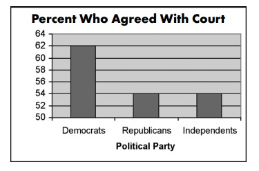

---
# UNL thesis fields
title: "HUMAN PERCEPTION OF EXPONENTIALLY INCREASING DATA DISPLAYED ON A LOG SCALE EVALUATED THROUGH EXPERIMENTAL GRAPHICS TASKS"
author: "Emily Anna Robinson"
month: "August"
year: "2022"
location: "Lincoln, Nebraska"
major: "Statistics"
adviser: "Susan VanderPlas and Reka Howard"
adviserAbstract: 
abstract: |
 Log scales are often used to display data over several orders of magnitude within one graph. Three graphical experimental tasks were conducted to evaluate the impact displaying data on the log scale has on human perception of exponentially increasing trends compared to displaying data on the linear scale. The first experiment evaluates whether our ability to perceptually notice differences in exponentially increasing trends is impacted by the choice of scale. Participants were shown a set of plots and asked to identify which plot appeared to differ most from the other plots. Results indicated that when there was a large difference in exponential curves, the choice of scale had no impact and participants accurately differentiated between the two curves on both the linear and log scale. However, displaying exponentially increasing data on a log scale improved the accuracy of differentiating between exponentially increasing curves with slight differences. An exception occurred when identifying an exponential curve from curves closely resembling a linear trend, indicating it is easy to identify a curve in a group of lines but much harder to identify a line in a group of curves. The other experimental tasks focus on determining whether there are cognitive disadvantages to log scales: do log scales make it harder to make use of graphical information? To test an individual's ability to make predictions for exponentially increasing data, participants were asked to draw a line using their computer mouse through an exponentially increasing trend shown on both the linear and log scale. Results showed that when exponential growth rate is large, underestimation of exponential growth occurs when making predictions on a linear scale and there is an improvement in accuracy of predictions made on the log scale. The last experimental task is designed to test an individuals' ability to translate a graph of exponentially increasing data into real value quantities and make comparisons of estimates. The results of the three experimental tasks provide guidelines for readers to actively choose which of many possible graphics to draw in order to ensure their charts are effective at communicating the intended result.
# *(348 words; 350 word limit)*
acknowledgments: |
  Thank you to all my people!
dedication: |
  Dedicated to...
# End of UNL thesis fields
knit: "bookdown::render_book"
site: bookdown::bookdown_site
output: 
  bookdown::pdf_book:
    pandoc_args: --top-level-division=chapter
    keep_tex: yes
    latex_engine: xelatex
    template: template.tex
  huskydown::thesis_gitbook: 
    style: style.css
#  huskydown::thesis_word: default
#  huskydown::thesis_epub: default
bibliography: bib/thesis.bib
# Download your specific bibliography database file and refer to it in the line above.
csl: bib/apa.csl
# Download your specific csl file and refer to it in the line above.
lot: true
lof: true
#header-includes:
#- \usepackage{tikz}
---

```{r setup, include = F}
options(width = 60)
knitr::opts_chunk$set(
  echo = F, eval = T, messages = F, warnings = F,
  fig.width = 6, fig.height = 4,  fig.align = 'center',
  out.width = "\\linewidth", dpi = 300, 
  tidy = T, tidy.opts=list(width.cutoff=45),
  fig.pos = "tbp",
  out.extra = "",
  cache = T
)
```

```{r include_packages, include = FALSE}
# This chunk ensures that the huskydown package is
# installed and loaded. This huskydown package includes
# the template files for the thesis.
if(!require(devtools))
  install.packages("devtools", 
                   repos = "http://cran.rstudio.com")
if(!require(huskydown))
  devtools::install_github(
    "benmarwick/huskydown"
  )
library(huskydown)
library(readr)
library(tidyverse)
library(scales)
library(knitr)
library(gridExtra)
library(patchwork)
library(cowplot)
library(ggforce)
library(scales)
library(formatR)
```

# Literature Review

<!-- + Editing text colors: \ear{Emily's editing color.} Emily may also use mostly black text as well. \svp{Susan's editing color.} \rh{Reka's editing color.} -->

+ \svp{General comment - it's a bit odd to write this in first person, but I'm not sure it's necessarily wrong. Just different.}
+ \ear{Need to check references. In text should only show last name.}

## Statistical Graphics

Advanced technology and computing power have promoted data visualization as a central tool in modern data science. @unwin_why_2020 defines data visualization as the art of drawing graphical charts in order to display data. 
Graphics are useful for data cleaning, exploring data structure, and have been an essential component in communicating information for the last 200 years [@lewandowsky_perception_1989]. 
This chapter aims to provide an overview of statistical graphics as they relate to effective communication in science and the media.
We examine how our interpretation is affected by our interaction with graphics through cognitive tasks of differing levels of complexity, and then introduce the 

### History of Graphics

During the $\text{18}^{\text{th}}$ and $\text{19}^{\text{th}}$ centuries, governments began using graphics in order to better understand their population and economic interests [@playfair1801statistical; @harms1991august; @walker2013statistical].
In \cref{fig:william-playfair-trade}, @playfair1801statistical visually represents the power and economic status of each European Nation in the early $\text{19}^{\text{th}}$ century. 
Circle size and numeric annotation within the circle indicate the number of square miles in each country with the number of people per square mile indicated above the circle. 
The vertical bar to the left side represents the number of inhabitants (millions), and the line to the right side represents the revenue (million pounds). 
Color in the original figure, not shown, identifies countries as maritime powers or powerful by land only. 
The Statistical atlas of the United States [@walker2013statistical] used charts and graphics to display data compiled from the 1870 US census. 
\cref{fig:statistical-atlas-state-population} displays the population of each state where square size represents the proportion of the states population separated into three regions representing the origin and race of the population.
The rectangle shown to the right represents the proportion of residents born in the state who have become residents of other states.
In the $\text{20}^{\text{th}}$ century, companies began utilizing graphics to understand their mechanics and support business decisions and news sources began displaying graphics of weather forecasts as a means to communicate critical information and aid in decision-making [@chandar2012graph; @yates1985graphs].
@chandar2012graph illustrates how AT\&T used graphics to demonstrate management's ability to optimize utilization of assets by making comparisons between their annual net telephone revenues and their returns on total assets \pcref{fig:ATandT-revenue}.
<!-- \svp{Might want to add a set of pictures showing the different types of graphics from this sentence - playfair's balance of trade, statistical atlas, and something from e.g. early IBM?}.  -->
Today, we encounter data visualizations everywhere; researchers include graphics to communicate their results in scientific publications and mass media present graphics in order to convey news stories to the public through newspapers, TV, and the Web [@gouretski2007much; @NYTimes_presidential_forecast; @natesilver538_2020].
<!-- @natesilver538_2020 tracked the 2020 US presidential election by communicating results of their forecast model to the public through a variety of interactive visualizations including a bar chart, snake chart, and electoral college maps. -->

```{r william-playfair-trade, fig.cap = "William Playfair's balance of trade", out.width="85%"}
knitr::include_graphics("images/william-playfair-balance-trade.png")

# https://repository.tku.ac.jp/dspace/bitstream/11150/6149/1/LAUD_085-03.pdf
```

```{r statistical-atlas-state-population, fig.cap = "Statistical Atlas 1870 state population", out.width="85%"}
knitr::include_graphics("images/statistical-atlas-state-population.jpg")

# https://www.loc.gov/item/05019329/
# PERMISSION: The Library of Congress is providing access to these materials for educational and research purposes and is not aware of any U.S. copyright protection (see Title 17 of the United States Code) or any other restrictions in the Map Collection materials.
```

```{r ATandT-revenue, fig.cap = "AT\\&T utilization of assets", out.width="85%"}
knitr::include_graphics("images/ATandT-revenue.png")
# https://us.sagepub.com/en-us/nam/journal-author-archiving-policies-and-re-use
# PERMISSION: You may use the Final Published PDF (or Original Submission or Accepted Manuscript, if preferred) in the following ways: in your dissertation or thesis, including where the dissertation or thesis will be posted in any electronic Institutional Repository or database
```

Although statistical graphics have become widely used and valued in science, business, and in many other aspects of life, as creators of graphics, we are too accepting of them as default without asking critical questions about the graphics we create or view [@unwin_why_2020]. 
@vanderplas_testing_2020 poses the general question we must ask ourselves, “how effective is this graph at communicating useful information?”
<!-- \rh{what do you/they mean by effective? you use "effective" later too so it is imortant to define or provide some examples/counter examples.} -->
An effective graphic accurately shows the data through the appropriate chart selection, axes and scales, and aesthetic design choices in order to successfully communicate the intended result. 
[Section 1.2](#misleading-graphics) illustrates how graphics can be misleading and ineffective at communicating the intended result by inaccurately displaying the data.

### Misleading Graphics {#misleading-graphics}

Despite past attempts to improve the use of graphics in science, graphics displayed in academic research are still falling short of the standards. @gordon_statistician_2015 evaluated 97 graphs for overall quality, based on five principles of graphical excellence including: (1) show the data clearly (2) use simplicity in design (3) use good alignment on a common scale for quantities to be compared (4) keep the visual encoding transparent (5) use graphical forms consistent with principles 1 and 4.
The authors randomly sampled 97 graphs published in A\* (top 5%) journals with work in statistics and applied science disciplines.
There were 50 graphs sampled from the most recently available issues of A\* journals in applied sciences such as environmental sciences, agricultural and veterinary sciences, medical and health sciences, education, economics, and psychology.
The additional 47 graphs were randomly sampled from A\* statistics journals.
Each graph was scored based on 60 features related to the five principles, such as proper axes labels.
Both authors assigned an overall quality rating (poor, adequate, good, or exemplary) to each of the graphs sampled; discussion between authors settled any discrepancies in ratings.
The authors rated 39% of the 97 graphs sampled as poor, indicating there is still an astonishing lack in the quality of graphics. 
More startling is the fact that the source of the graphic from an applied science or a graphic from statistics had no effect on the quality of the graphic. 

News media is a major culprit in displaying data in ways that could be misleading to the public. For example, in 2005, Terri Schiavo was removed from life-support after a seven year long court case .
News organizations [@misleading_graphs_2022] used graphs from polls to show the proportion of Americans from different political parties who agreed with the decision to remove the feeding tube \pcref{fig:percent-who-agree-with-count}.
Upon initial inspection of \cref{fig:percent-who-agree-with-count}, it appears that about three times as many democrats supported the decision as republicans or independents.
However, the scale on the vertical axis begins at 50\%, misleading the viewer to believe there was a much larger discrepancy in support between political parties than there actually was.
While this graph does display the truth, it is misleading due to the choice of baseline on the $y$-axis.
@baumer2021texts discuss a more recent example of a misleading graphic in the news shown in May 2020 when Georgia published a graphical display of COVID-19 cases \pcref{fig:covid-19-reporting}. 
This graphic was highly misleading in communicating the state of the pandemic due to the ordering along the $x$-axis.
Notice the case count for April 17th appears to the right of April 19th, and that the order of the counties has been selected so that the case counts are monotonically dcreasing for each day of reporting.
The appearance of this graphic leads viewers to believe COVID cases are decreasing.
Shortly after the graphic was released, the governor's office made a statement that in future graphics, chronological order would be used to display time due to public demand. While both examples were misleading due to axis labels and scales, other issues such as incomplete data and partitions that do not add to a whole can lead to misrepresentation of information.

```{r percent-who-agree-with-count, fig.cap = "Percent who agree with count", out.width="85%"}

# https://www.statisticshowto.com/probability-and-statistics/descriptive-statistics/misleading-graphs/#:~:text=Misleading%20graphs%20are%20sometimes%20deliberately,doesn't%20start%20at%20zero.
```

```{r covid-19-reporting, fig.cap = "COVID-19 reporting", out.width="85%"}
knitr::include_graphics("images/covid-ga-recreation.jpg")
# https://mdsr-book.github.io/mdsr2e/ch-ethics.html#truthful-falsehoods
```

### Graphical Guidelines

Higher quality of technology has influenced the creation, replication, and complexity of graphics as there are an infinitely many number of graphical displays and design choices that can be implemented at faster speeds with more flexibility. 
The creator of a graphic makes decisions about the variables displayed, the type of graphic, the size of the graphic and the aspect ratio, the colors and symbols used, the scales and limits, and the ordering of categorical variables. 
In response to the increasing number of design choices, consistent themes and higher standards are being placed on graphics. 
Selecting from an extensive list of styles and choices of graphics in order to effectively communicate insights into the data is a challenging task. 
A consistent concern is the lack of theory of graphics available to build on; better theory should result in better graphics. 
Creators of graphics need an established set of concepts and terminology to build their graphics from so they can actively choose which of many possible graphics to draw in order to ensure their charts are effective at communicating the intended result. 

Many efforts have been made to provide guidelines for graphical designs including Wilkinson's Grammar of Graphics [@wilkinson2012grammar].
The grammar of graphics serves as the fundamental framework for data visualization with the notion that graphics are built from the ground up by specifying exactly how to create a particular graph from a given data set.
Visual representations are constructed through the use of “tidy data” which is characterized as a data set in which each variable is in its own column, each observation is in its own row, and each value is in its own cell [@wickham2016r].
Graphics are viewed as a mapping from variables in a data set (or statistics computed from the data) to visual attributes such as the axes, colors, shapes, or facets on the canvas in which the chart is displayed.
\cref{fig:graphic-flowchart} illustrates the process of creating a graphic from a data set through the use of variable mapping, data transformations, coordinate systems, and aesthetic features [@vanderplas_testing_2020] 
Software, such as `ggplot2` [@ggplot2], aims to implement the framework of creating charts and graphics as the grammar of graphics recommends. 

```{r graphic-flowchart, fig.cap = "Graphic flowchart", out.width="50%"}
knitr::include_graphics("images/graphic-flowchart.png")
```

In efforts to achieve a higher standard of the graphics being presented, future work must be done to implement the academic research being conducted in graphics into practice.
For example, better definitions of variables, units of measurements, scales, and other graphical elements is necessary in order to improve the overall quality of graphics.
Changes in software defaults such as the originally set number of bins in a bar chart can help support the improvement of graphs in both statistics and the applied science.

## Perception

In order to develop guiding principles for generating graphics effective in communication, we must first understand the basic mechanics of the human perceptual system and the biases we are vulnerable to [@goldstein_sensation_2017]. This section aims to provide an overview of the perceptual process as it relates to inspection of graphical displays.

### Perceptual Process

The perceptual process is a sequence of steps used to describe a how a stimulus in the environment leads to our perception of the stimulus and action in response to the stimulus \pcref{fig:perceptual-process}. 
This process is separated into sensation [@carlson2010psychology] - involving simple processes that occur right at the beginning of a sensory system - and perception [@myers_dewall_2021] - involving higher-order mechanisms and identified with more complex processes. 

The perceptual process begins when there is a stimulus in the environment and light is reflected and focused back into the viewer's eyes. 
Within the eye, the light reflected is transformed and focused by the eye's optical system and an image is formed on the receptors of the viewer's retina. 
It is important to note that everything a person perceives is based not on direct contact with stimuli but on representations of stimuli that are formed on the receptors and the resulting activity in the person's nervous system.
Once light is reflected and focused, our visual receptors respond to the light and transform the light energy into electrical energy through a process called transduction. 
Signals from the receptors are then transmitted through the retina, to the brain, and then within the brain where perception (what do you see?) and recognition (what is it called?) occur.
After recognition, viewers take some sort of motor action; for example, the viewer might move closer to the object.
The perceptual process is not direct and instead takes on more of a cyclic nature where a person may go through many iterations of stimuli, perception, recognition, and action before the final image is identified and understood [@peterson1994object]. 

```{r perceptual-process, fig.cap = "Perceptual process", out.width="75%"}
knitr::include_graphics("images/perceptual-process-goldsein-pg5.png")
```

When perception occurs, we first experience the **preattentive stage** in which we observe color, shape, size, and other basic information about the stimuli being perceived. Preattentive perception effects are automatically processed within the first 500 milliseconds of viewing and do not depend on sustained cognitive attention [@vanderplas_testing_2020]. 
Following the preattentive stage, **direct attention** is required for additional processing to allow us to draw connections between components that assist in our interpretation of the stimuli. 
When viewing a chart or graph, most insights we gain are due to the cognitive processes that occur after attention is focused on specific aspects of the graph.

The relationship between physiology and perception can provide us information about how graphics may be understood and interpreted.
<!-- \rh{How?} -->
Through experimentation, the physiological response (automatic reaction) is related to the behavioral response (perception, recognition, and action). 
For example, @furmanski2000oblique tested behavioral responses with functional magnetic resonance imaging (fMRI) techniques to show that the the human visual system is more sensitive to horizontal and vertical stimuli than to stimuli at other orientations.
According to a cognitive analysis, graph interpretation involves (a) relatively simple pattern perception and association processes in which viewers can associate graphic patterns to quantitative referents and (b) more complex and error-prone inferential processes in which viewers must mentally transform data [@shah1999graphs].
@shah1995conceptual established the process in which viewers interact with charts by first perceptually observing the visual features and later translating to cognitive processing of the information depicted by those features.
A viewer must first encode the visual array by identifying meaningful visual features (for example, a straight light slanting downward). 
Next, the viewer must classify the quantitative measures and relationships which those visual features illustrate (for example, a decreasing linear relationship between $x$ and $y$). 
The last step involves translating the quantitative measures and relationships to the variables defined in the data set (for example, a population decreasing over years). 
Psychophysics, the branch of psychology that deals with the relationships between physical stimuli (for example, light) and mental phenomena, aims to provide explanations of the relationship between physiology and perception and point out human perceptual biases. 
By examining both behavior and physiology together, we are able to understand the mechanisms responsible for perception.

### Logarithmic Perception

<!-- \svp{Weber's law isn't quite the same thing as the numerical cognition stuff on log scales - it's a different perceptual phenomenon that is definitely related, but distinct in causal mechanism (as far as I know).} -->
<!-- \rh{Is there a reference for the actual "Weber's Law"? Please provide more connection between your text and the "Weber's Law".} -->
While our visual system is powerful, we are still vulnerable to biases related to our perception of different stimuli.
Ernst Weber, an early psychophysics researcher, discovered a phenomenon known as Weber's law by determining the relationship between the difference threshold (smallest detectable difference between two sensory stimuli; known as the "Just Noticeable Difference") and the magnitude of a stimulus [@fechner1860elemente]. 
This holds true for a variety of stimuli such as weight, light, and sound as well as for a range of magnitudes; larger numbers require a proportional larger difference in order to remain equally discriminate [@dehaene2008log]. 
Known as **Weber's law**, it was established that we do not notice absolute changes in stimuli, but instead that we notice the relative change [@sun_framework_2012]. 
Numerically, Weber's Law is defined as 
\begin{equation}
\frac{\Delta S}{S} = K
\end{equation}
where $\Delta S$ represents the difference threshold, $S$ represents the initial stimulus intensity, and $K$ is called Weber's contrast which remains constant as the magnitude of $S$ changes. 
Gustav Fechner, a founder of psychophysics, provided further extension to Weber's law by discovering the relationship between the perceived intensity is logarithmic to the stimulus intensity when observed above a minimal threshold of perception [@sun_framework_2012]. 
Formally known as the Weber-Fechner law, it is derived from Weber's law as
\begin{equation}
P = K\ln \frac{S}{S_0}
\end{equation}
where $P$ represents the perceived stimulus, $K$ represents Weber's contrast, $S$ represents the initial stimulus intensity, and $S_0$ represents the minimal threshold of perception.

## Cognitive Tasks and Testing Statistical Graphics

### Cognitive Fit
+ @vessey1991cognitive

+ @tan1990processing

+ Reasoning
+ Sensemaking
+ Decision-Making

@tory2004human

+ how people perceive and interact with a visualization tool can strongly influence their understanding of the data as well as the system’s usefulness

### Testing Statistical Graphics {#lit-graphical-experiments}

One way in which we determine the relationship between behavior and physiology is through the use of graphical tests [@cleveland_graphical_1984; @spence_visual_1990; @lewandowsky_perception_1989; @vanderplas2015spatial].
<!-- \rh{can you provide references? Especially for the examples?} -->
These tests may take many forms: identifying differences in graphs, accurately reading information off a chart, using data to make correct real-world decisions, or predicting the next few observations.
All of these types of tests require different levels of use and manipulation of the information presented in the chart.

The initial push to develop classification and recommendation systems for charts was grounded on heuristics rather than on experimentation [@kruskal1975visions; @macdonald1977numbers].
Request were made for the validation of the perception and utility of statistical charts through graphical experiments.
Initial experiments struggled with methodological issues [@eells1926relative; @croxton1927bar; @croxton1932graphic] with most early experimentation stemming from psychophysics research on the perception of size and shape [@teghtsoonian1965judgment]. 
<!-- \rh{"struggled with methodological issues" - examples?} -->
In attempts to understand the human perception and judgment of component parts, @eells1926relative instructed students to think of each circle diagram \pcref{fig:eells-compoment-parts} as representing 100\% and write their best estimate of the percentage of the whole in each sector.
Participants were told not to hurry, but to work steadily in order to determine efficiency of judgment. 
Students were then asked to analyze their mental processes used to make their estimates and indicate the method that best matches: by areas of sectors, by central angles, by arcs on the circumference, by subtending chords.
This process was repeated three days later by presenting students the same data represented in bar diagrams \pcref{fig:eells-compoment-parts}. 
Results of the study led the authors to argue for the use of circle diagrams to show component parts based on both participant accuracy and speed.
In response, @croxton1927bar evaluated the accuracy of judgment of two types of charts (bars and circles) in efforts to reach a consistent conclusion. 
During class, students were individually presented pairs of diagrams (without scales) on cards and asked to estimate the percentages displayed in the diagram.
It was found that the bar was preferable to the circle when shown percentages that deviate from quarters, but that the circle is strongly preferred when shown percentages separating the diagrams into 25\% or 50\%. 

```{r eells-compoment-parts, fig.cap = "Eells (1926) component parts diagrams", out.width="75%"}
knitr::include_graphics("images/eells-component-parts.png")
```

While a typical psychophysics experiment focuses on whether an effect is detectable and whether the magnitude of the effect can be accurately estimated, these early experiments instead depended on speed and accuracy for plot evaluation [@spence_visual_1990; @teghtsoonian1965judgment; @lewandowsky_perception_1989]. 
<!-- \rh{Examples?} -->
In attempts to understand the visual psychophysics of simple graphical elements, @spence_visual_1990 presented stimuli (tables, lines - horizontal and vertical, bars, boxes, cylinders, pie charts, and disk charts) to participants on a monitor screen in a computer lab. 
Participants were asked to use their cursor to position the marker to indicate the proportion to the apparent sizes of the elements \pcref{fig:spence-1990-proportion}.
Results found that the table elements (numbers), pie elements, and bar elements led to the most accurate proportion estimates; boxes and disk elements resulted in the least accurate estimates.
Measuring the speed at which participants made their judgments, it was found that two- and three- dimensional stimuli (for example, pie charts and box charts) assisted in faster judgment than zero- or one- dimensional stimuli (for example, tables and lines).

```{r spence-1990-proportion, fig.cap = "Spence (1990) task display", out.width="75%"}
knitr::include_graphics("images/spence-1990-proportion.png")
```

Cognitive psychologists and statisticians made progress by conducting experiments to identify perceptual errors associated with different styles of graphics and charts [@cleveland_graphical_1984; @cleveland_graphical_1985; @shah1999graphs]. 
<!-- \rh{Examples?} -->
@cleveland_graphical_1984 provides a basis for perceptual judgment, still utilized today, by examining six basic aesthetic design choices: position along a common scale, position along nonaligned scales, length, angle, slope, and area.
@shah1999graphs established the notion that redesigning graphs can result in the improvement of the viewer's interpretation of the data.
For example, the use of gestalt principles [@goldstein_sensation_2017] such as proximity, similarity, and good continuation can help minimize the inferential processes and maximize the pattern association processes required to interpret relevant information.

During the $\text{21}^{\text{st}}$ century, there have been advancements in the methodology used to investigate the effectiveness of statistical charts [@majumder_validation_2013]. 
@buja_statistical_2009 introduced the lineup protocol in which data plots are depicted and interpreted as statistics. 
Supported by the grammar of graphics, a data plot can be characterized as a statistic, defined as, "a functional mapping of a variable or set of variables" [@vanderplas_testing_2020].
This allows the data plot to be tested similar to other statistics, by comparing the actual data plot to a set of plots with the absence of any data structure we can test the likelihood of any perceived structure being significant.
The construction of data plots as statistics allows for easy experimentation, granting researchers the ability to compare the effectiveness of and understand the perception of different types of charts.
While the lineup protocol differs from methodology used in earlier studies, the focus is still on initial perception with a relatively small amount of work conducted to understand the effect of design choices on higher cognitive processes such as learning or analysis [@green2009personal]. 
Lineups serve as a powerful tool for testing *perceived* differences by eliminating ambiguous questions. 
However, the lineup protocol is constrained by the inability to test higher order cognitive skills such as accurately reading information off of a graph or drawing conclusions from the graph, limiting their ability to be used for testing real-world applications.

## Graph Comprehension

In order to understand how viewers are interpreting and using the data and information displayed on the chart, studies have asked participants to read information directly from a chart and provide a quantitative estimate or answer a predefined question [@peterson1954accurately; @broersma1985graphical; @dunn1988framed; @tan1994human; @amer2005bias].
@spence_visual_1990 presents four example questions for comparing the sizes of individual graphical elements: (1) How much greater was the rainfall in September than May? (2) Is the price of oil in constant dollars increasing or decreasing from year to year? (3) Do more people subscribe to Time than Newsweek? and (4) Did the ABC Corporation pay the largest dividends last year, or did XYZ?
@amer2005bias demonstrates that visual illusion may bias decision making and graph comprehension, even if the graphs are constructed according to best practice.
Participants were presented a cost volume profit graph \pcref{fig:amer-poggendorff-illusion} with two crossing lines (revenue and cost) and asked to estimate three values: (1) the amount of total revenues on the ordinate corresponding to the endpoint of the total-revenue line plotted on the graph (2) the amount of total costs on the ordinate corresponding to the endpoint of the total-cost line plotted on the graph and (3) the amount of costs/revenues on the ordinate at the break even point—the point where the two lines cross.
Results indicate that decision makers may consistently underestimate or overestimate the values displayed on line graphs due to what is called the "Poggendorff illusion."
In @dunn1988framed, participants were shown two maps, an unclassed choropleth map and a framed rectangle chart, indicating the murder rate of each US state \pcref{fig:framed-murder-rate-map}.
The goal of the study was to assess the relative accuracy with which quantitative information is extracted from both types of charts.
Participants were strictly informed that the experiment was designed to test the ability of individuals to "read" or "decode" statistical maps and asked to write down their estimate of the murder rate as accurately as possible beside the 24 named states. 
Results indicate that subjects found it easier to extract quantitative information from the framed rectangle chart than from the unclassed choropleth map and that the between individual variability in the choropleth map was related to the area of the state. 

```{r amer-poggendorff-illusion, fig.cap = "Amer (2005) cost volume profit graph", out.width="100%"}
knitr::include_graphics("images/amer-poggendorff-illusion.png")
```

```{r framed-murder-rate-map, fig.cap = "Dunn (1988) maps", out.width="100%"}
knitr::include_graphics("images/framed-murder-rate-map.png")
```

### Questioning

An important consideration in understanding graph comprehension is is the questions being asked of the viewer [@graesser2014new].
Low level questions address the content and interpretation or explicit material while deeper questions require inference, application, and evaluation of the information being presented.
Three levels of graph comprehension have emerged from mathematics education research [@wood1968objectives; @curcio1987comprehension; @jolliffe1991assessment; @friel2001making; @glazer2011challenges].
The three behaviors related to graph comprehension involve (1) literal reading of the data (elementary level), (2) reading between the data (intermediate level), and (3) reading beyond the data (advanced level).
@curcio1987comprehension aligns two questions multiple choice with each level of comprehension related to a graph showing the height of four children in centimeters \pcref{fig:children-height}.
Two literal items required the viewer to read the data, title, or axis label in order to answer, "What does this graph tell you" or "How tall was xxx?"
Comparison items required comparisons and the use of mathematical concepts to answer, "Who was the tallest" and "How much taller was x than y?"
Lastly, extension items required an extension, prediction, or inference such as, "If x grows 5 centimeters and y grows 10 centimeters by Sept. 1981, who will be taller and by how much?

```{r children-height, fig.cap = "Comprehension of heights (1987) ", out.width="80%"}
knitr::include_graphics("images/children-height.png")
```

<!-- Conceptual processes that translate the visual features into conceptual relations when one interprets titles, labels, and scales as well as any other keys or symbols that are part of the display. -->
<!-- Researchers must consider the effect of the graph’s visual characteristics and the graph’s context on one’s comprehension. -->

### Estimation Strategies

While not exclusive to extracting numerical values from charts, mathematics education research places an emphasis quantitative estimation skills [@hogan2003quantitative].
Three modes of estimation are taught as part of the mathematics curriculum in schools: numerosity, measurement, and computational estimation. 
Numerosity estimation requires the estimation of the number of items in a group or array; for example, guessing the number of M&M's in a jar.
Measurement estimation requires participants to provide an estimated value related to an object; for instance, an estimated length of a string or weight or a box.
Computational estimation is the third mode which refers to estimated answers to computations as a way to avoid exact calculations.
These estimates may be presented in either algorithmic form or a contextual scenario with words.
A longer history of quantitative estimation can be found in psychometic literature in which estimation tasks appeared in early psychometric studies of mental abilities.

In efforts to develop estimation skills, research has been conducted to evaluate strategies for estimating tasks.
Two common strategies in particular related to measurement estimation, involve reference point estimation and benchmark estimation.
Reference point estimation
Benchmark estimation 
@joram2005children was interested in the relationship among strategy use and accuracy of students’ representations of standard measurement units and measurement accuracy.
In this study, students were asked to estimate the lengths of two objects and explain their process.
In order to prompt students to communicate their estimation strategies, an interviewer asked questions such as, “How did you come up with your answer?” and “What were you thinking about when you came up with your answer?”.
Further prompting such as, “Do you know how tall your cousin is?” was often necessary to identify whether the student was using a reference point strategy for estimation.
Results from the study found that students who used a reference point had a more accurate representation of standard units and estimates of length than students who did not use a reference point.
@jones2012students examined the effect of scale (metric verses English) and task context on the accuracy of measurement estimation for linear distances.
The study showed that students were less accurate in estimating metric units as compared to English units and that estimation accuracy was highly dependent on task context. 
@forrester1990exploring argues that estimation, approximating, and measuring are key components in the intuitive understanding of dimension and scale necessary to manipulate information and interact effectively with our environment.

### Estimation Biases

Certain biases including anchoring and rounding to multiples of 5 or 10 arise in open-ended estimation tasks.
When it comes to understading graphics, anchoring is prominent in both graphical representations and data extraction tasks [@tan1990processing].
Anchoring bias refers to an individual using easily observed visual cues such as gridlines or "anchors" when extracting information such as the $x$ or $y$ value on a chart [@tan1994human ; @godlonton2018anchoring].
Rounding baises occur out of natural human preference to provide rounded figures even if a precise estimate is desired or requested [@myers1954accuracy]. 
 @schneeweiss2010symmetric outlines distortion in results as a consequence of rounding and suggests the use of corrections when conducting statistical regression analyses on data prone to rounding.

Scale and axis labels are other critical factors in estimation accuracy.
@dunham1991learning argue that if there is not proper attention given to the scale when using a line graph, there is a potential for issues when interpretting asymmetric scales and when choosing appropriate scales for the graphic.
@beeby1973well found that when asked to read data from line graphs, viewers consistentely misread the $y$-axis scale; when alternate grid lines were labeled, the unlabeled grid lines were read as halves.
This misrepresentation is highlighted for assymetric scales where spatial distance does not necessarily equate to numerical or quantiative difference.
The choice of scale can change the shape of a graph, thus creating a conceptual demand for the viewer when constructing a mental image of the graph [@leinhardt1990functions]. 

## Motivation and Background

```{r 91divoc-cases-july2021, fig.cap = "91-DOVIC New Daily Case Counts as of July 2021", out.width="100%"}
knitr::include_graphics("images/91dovic-cases-july2021.png")
```

```{r covid19-summer2020-risk-map, fig.cap = "COVID-19 Risk Level Map as of July 2020", out.width="100%"}
knitr::include_graphics("images/covid19-summer2020-risk-map.png")
```

We have recently experienced the impact graphics and charts have on a large scale through the SARSNCOV-2 pandemic (COVID-19). 
At the beginning of 2020, we saw an influx of dashboards being developed to display case counts, transmission rates, and outbreak regions [@rost_2020]; mass media routinely showed charts to share information with the public about the progression of the pandemic [@romano_scale_2020]. 
@fagen-ulmschneider_2020 began the 91-DIVOC project to explore the global growth of COVID-19 through interactive graphics updated daily. 
The interactive graphics allowed viewers to explore the current status of COVID-19 by selecting their desired regions, axes, axis scale, and measure of interest (for example, case count, death count, and vaccine count); \cref{fig:91divoc-cases-july2021} [@fagen-ulmschneider_2020] shows the new confirmed COVID-19 cases per day, normalized by population, as of July 2021. 
Other graphics displayed COVID-19 data as maps \pcref{fig:covid19-summer2020-risk-map} with color indicating the severity and risk in each US county [@global_epidemics_2021].
People began seeking out graphical displays of COVID-19 data as a direct result of these pieces of work [@rost_2020]; providing increased and ongoing exposure to these graphics over time. 
\cref{fig:covid19-datawrapper-views-july2020} illustrates the increased views Datawrapper, a user-friendly web tool used to create basic interactive charts, had during the COVID-19 pandemic [@rost_2020].
Many of these graphics helped guide decision makers to implement policies such as shut-downs or mandated mask wearing, as well as facilitated communication with the public to increase compliance [@bavel_using_2020]. 
As graphics began to play an important role in the communication of the pandemic, creators of graphics were faced with design choices in order to ensure their charts were effective at accurately communicating the current status of the pandemic. 

```{r covid19-datawrapper-views-july2020, fig.cap = "Datawrapper daily chart views during COVID-19", out.width="100%"}
knitr::include_graphics("images/covid19-datawrapper-views-july2020.png")
```

### Logarithmic Scales and Mapping

```{r log-scale-comic, include = F, fig.cap = "Usefulness of the log scale in science", out.width="100%"}
knitr::include_graphics("images/log-scale-comic.png")
```

When faced with data which spans several orders of magnitude, we must decide whether to show the data on its original scale (compressing the smaller magnitudes into relatively little area) or to transform the scale and alter the contextual appearance of the data.
One common solution is to use a log scale transformation to display data over several orders of magnitude within one graph.
<!-- The usefulness of the log scale in science is illustrated in \cref{fig:log-scale-comic} [@munroe_2005] showing the challenge of displaying the fuel energy density of Uranium along side other sources of fuel due to differences in magnitude of density. -->
Exponential curves are a common source of data in which smaller magnitudes are compressed into a smaller area; 
\cref{fig:log-scales} presents an exponential curve displayed on both the linear and log scale illustrating the use of the log scale when displaying data which spans several magnitudes. 
Logarithms convert multiplicative relationships (for example, 1 \& 10 displayed 10 units apart and 10 \& 100 displayed 90 units apart) to additive relationships (for example, 1 \& 10 and 10 \& 100 both equally spaced along the axis), showing proportional relationships and linearizing power functions [@menge_logarithmic_2018].
They also have practical purposes, easing the computation of small numbers such as likelihoods and transforming data to fit statistical assumptions.
When presenting log scaled data, it is possible to use either un-transformed scale labels (for example, values of 1, 10 and 100 are equally spaced along the axis) or log transformed scale labels (for example, 0, 1, and 2, showing the corresponding powers of 10).
\svp{In the grammar of graphics/ggplot2 formulation, this is the difference between a scale and a transformation... it might be worth seeing if that is a hadley-ism or if that is a wider convention.}

```{r log-scales, fig.cap = "Linear scale verses log scale", out.width="100%"}
data <- tibble(x = seq(0,10, by = 0.1), y = exp(x))

linear_scale <- data %>%
  ggplot(aes(x = x, y = y)) +
  geom_line() +
  theme_bw() +
  theme(aspect.ratio = 1) +
  ggtitle("Linear Scale")

log_scale <- data %>%
  ggplot(aes(x = x, y = y)) +
  geom_line() +
  theme_bw() +
  theme(aspect.ratio = 1) +
  scale_y_log10(breaks = trans_breaks("log10", function(x) 10^x)) +
  ggtitle("Log Scale")

grid.arrange(linear_scale,log_scale, ncol = 2)


# linear_scale <- data %>%
#   ggplot(aes(x = y, y = x)) +
#   # geom_line() +
#    theme_classic() +
#   theme(aspect.ratio = 0.01,
#         axis.line.y = element_blank(),
#         axis.ticks.y = element_blank(),
#         axis.text.y = element_blank()
#         ) +
#   labs(x = NULL,
#        y = NULL
#        )
# 
# log_scale <- data %>%
#   ggplot(aes(x = y, y = x)) +
#   # geom_line() +
#    theme_classic() +
#   theme(aspect.ratio = 0.01,
#         axis.line.y = element_blank(),
#         axis.ticks.y = element_blank(),
#         axis.text.y = element_blank()
#         ) +
#   labs(x = NULL,
#        y = NULL
#        ) +
#   scale_x_log10(breaks = trans_breaks("log10", function(x) 10^x))
# 
# grid.arrange(linear_scale,log_scale, ncol = 1)
```

We have recently experienced the benefits and pitfalls of using log scales as COVID-19 dashboards displayed
case count data on both the log and linear scale [@fagen-ulmschneider_2020; @burnmurdoch_2020]. 
In spring 2020, during the early stages of the COVID-19 pandemic, there were large magnitude discrepancies in case counts at a given time point between different geographic regions (for example states and provinces as well as countries and continents).
During this time, we saw the usefulness of log scale transformations showing case count curves for areas with few cases and areas with many cases within one chart. 
The usefulness of log scales in comparing deaths attributed to COVID-19 between countries as of March 2020 is illustrated in \cref{fig:covid19-FT-deaths-march2020-log}; the diagonal reference lines provide a visual aid useful for interpretation [@burnmurdoch_2020]. 
As the pandemic evolved, and the case counts were no longer spreading exponentially, graphs with linear scales seemed more effective at spotting early increases in case counts that signaled more localized outbreaks. In \cref{fig:covid19-FT-june2020-case-counts-linear} and \cref{fig:covid19-FT-june2020-case-counts-log}, the daily case counts as of June 30, 2020 are displayed on both the linear and log scales respectively [@burnmurdoch_2020]. 
The effect of the linear scale \pcref{fig:covid19-FT-june2020-case-counts-linear} appears to evoke a stronger reaction from the public than the log scale \pcref{fig:covid19-FT-june2020-case-counts-log} as daily case counts are clearly rising rapidly during the summer wave. 
This is only one recent example of a situation in which both log and linear scales are useful for showing different aspects of the same data. 
There are long histories of using log scales to display results in ecology, psychophysics, engineering, and physics [@menge_logarithmic_2018; @heckler_student_2013]
In @waddell2005comparisons, comparisons were made between the linear and logarithmic scales for the relationship between dosage and carcinogenicity in rodents.
Results favored the use of logarithmic scales for doses in order to put the relative doses into perspective whereas using a linear scale to administer doses to animals with the same chemicals to which humans are exposed does not provide useful, comparative information.
Given the widespread use of logarithmic scales, it is important to understand the implications of their use in order to provide guidelines for best use.
\svp{elaborate on this a bit - when are they used, and where are they effective? Can you draw more comprehensive conclusions about the use of log scales?}.

```{r covid19-FT-deaths-march2020-log, fig.cap = "Covid 19 Deaths (log scale) as of March 23, 2020", out.width="90%"}
knitr::include_graphics("images/covid19-FT-03.23.2020-log.png")
# https://eagereyes.org/blog/2020/in-praise-of-the-diagonal-reference-line
```

```{r covid19-FT-june2020-case-counts-linear, fig.cap = "Covid 19 Case Counts (linear scale) as of June 30, 2020", out.width="90%"}
knitr::include_graphics("images/covid19-FT-case-count-06.30.2020-linear.png")
```

```{r covid19-FT-june2020-case-counts-log, fig.cap = "Covid 19 Case Counts (log scale) as of June 30, 2020", out.width="90%"}
knitr::include_graphics("images/covid19-FT-case-count-06.30.2020-log.png")
```

When we first learn to count, we begin counting by ones (for example, 1, 2, 3, etc.), then by tens (for example, 10, 20, 30, etc.), and advancing to hundreds (for example, 100, 200, 300, etc.), following the base10 order of magnitude system (for example, 1, 10, 100, etc.).
Research suggests our perception and mapping of numbers to a number line is logarithmic at first, but transitions to a linear scale later in development, with formal mathematics education [@siegler_numerical_2017; @siegler_numerical_2017; @varshney_why_2013; @dehaene2008log].
For example, a kindergartner asked to place numbers one through ten along a number line would place three close to the middle, following the logarithmic perspective [@varshney_why_2013]; \cref{fig:log-number-line} demonstrates how a kindergartner might map numbers along a number line. 
@dehaene2008log found that with basic training, members of remote cultures with a basic vocabulary and minimal education understood the concept that numbers can be mapped into a spacial space; for example, numbers can be mapped to a number line or numbers can be mapped onto a clock. 
There was a gradual transition from logarithmic to linear scale as the mapping of whole number magnitude representations transitioned from a compressed (approximately logarithmic) distribution to an approximately linear one. 
These results indicate the universal and cultural-dependent characteristics of the sense of number. 

```{r log-number-line, fig.cap= "Kindergarten example of mapping numbers 1-10 along a number line", fig.height=1, fig.width=4.5, message=FALSE, warning=FALSE, out.width = "65%"}
tibble(x = seq(1,10, 0.25),
       y = 1,
       text = c("1", NA, NA, NA, 
                NA, NA, NA, NA,
                NA, NA, NA, "2",
                NA, NA, NA, NA,
                NA, "3", NA, NA, 
                NA, "4", NA, NA,
                NA, "5", NA, NA,
                "6", NA, NA, NA,
                "7", NA, "8", "9",
                "10")
       ) %>%
  ggplot(aes(x = x, y = y, label = text)) +
  # geom_line() +
  geom_text() + 
  theme_classic() +
  theme(aspect.ratio = 0.1,
        axis.line.y = element_blank(),
        axis.ticks.y = element_blank(),
        axis.text.y = element_blank()
        ) +
  labs(x = NULL,
       y = NULL
       ) +
  scale_x_continuous(breaks = c(1,10))
```
    
Assuming there is a direct relationship between perceptual and cognitive processes, it is reasonable to assume numerical representations should also be displayed on a nonlinear, compressed number scale. Therefore, if we perceive logarithmically by default, it is a natural (and presumably low effort) way to display information and should be easy to read and understand/use.
The idea is compression enlarges the coding space, thus increasing the dynamic range of perception and firing neurons within our visual system [@nieder2003coding].
Similar to the training and education required to transition from logarithmic mapping to linear mapping, there is also necessary training required in the assessment of graphical displays associated with logarithmic scales. @haemer_presentation_1949 identify semi-logarithmic charts for temporal series as requiring a certain degree of technical training.
    
### Underestimation of Exponential Growth {#underestimation}

```{r exponential-stages, include = F, fig.cap = "Stages of exponential growth", out.width = "75%"}
data <- tibble(x = seq(0,6,0.001),
               y = exp(x)) %>%
  mutate(group = ifelse(x <= 2, "G1", 
                        ifelse(x <= 4, "G2", "G3")))

data %>%
  ggplot(aes(x = x, y = y, color = group)) +
  geom_line(show.legend = T) +
  theme_bw() +
  theme(aspect.ratio = 1) +
  # facet_zoom(xlim = c(0,2), shrink = F, zoom.size = 3) +
  # facet_zoom(xy = group == 'G1', zoom.size = 1/3) +
  geom_mark_rect(show.legend = T) +
  scale_color_brewer("Stage", palette = "Dark2", labels = c("Early", "Mid", "Late"))
```

```{r exponential-stages-comic, fig.cap = "Log scale comic", out.width="100%"}
knitr::include_graphics("images/exponential-stages-comic.jpg")
```

People with diverse backgrounds can interpret the same display of data in vastly different ways; \cref{fig:exponential-stages-comic} [@vonbergmann_2021] illustrates how individuals in public health interpret exponential growth distinctly different from scientists during early, middle, and late stages of growth.
Exponential growth is often misjudged in early stages, appearing to have a small growth rate.
As exponential growth continues, the middle stage appears to be growing, but not at an astounding rate, appearing more quadratic.
It is not until late stages of exponential growth when it is quite apparent that there is exponential growth occurring.
This misinterpretation can lead to decisions made under inaccurate understanding causing future consequences.

Early studies explored the estimation and prediction of exponential growth and found that growth is underestimated when presented both numerically and graphically [@wagenaar_misperception_1975].
Results indicated that numerical estimation is more accurate than graphical estimation for exponential curves. 
Experimental studies were conducted in order to determine strategies to improve the accuracy of estimation of exponential growth [@wagenaar_misperception_1975; @jones_polynomial_1977; @mackinnon_feedback_1991].
There was no improvement in estimation found when participants had contextual knowledge or experience with exponential growth, but instruction on exponential growth reduced the underestimation; participants adjusted their initial starting value but not their perception of the growth rate [@wagenaar_misperception_1975; @jones_polynomial_1977].
@mackinnon_feedback_1991 found that estimation was improved by providing immediate feedback to participants about the accuracy of their current predictions.  

Our inability to accurately predict exponential growth might also be addressed by log transforming the data, however, this transformation introduces new complexities; most readers are not mathematically sophisticated enough to intuitively understand logarithmic math and translate that back into real-world effects.
In @menge_logarithmic_2018, ecologists were surveyed to determine how often ecologists encounter log scaled data and how well ecologists understand log scaled data when they see it in the literature. 
Participants were presented three relationships displayed on linear-linear scales, log-log scales with untransformed values, or log–log scales with log transformed values \pcref{fig:menge-plots}. 
The authors propose three types of misconceptions participants encountered when presented data on log-log scales: 'hand-hold fallacy', 'Zeno's zero fallacy', and 'watch out for curves fallacies'. 
These misconceptions are a result of linear extrapolation assuming that a line in log-log space represents a line instead of the power law (which is an exponential relationship) in linear-linear space.

```{r menge-plots, fig.cap = "Graphs viewed in Menge (2018) survey", out.width="100%"}
knitr::include_graphics("images/menge-plots.png")
```

The 'hand-hold fallacy' stems from the misconception that steeper slopes in log-log relationships are steeper slopes in linear-linear space, illustrated in \cref{fig:menge-plots} d-f. 
In fact, it is not only the slope that matters, but also the intercept and the location on the horizontal axis since a line in log-log space represents a power law in linear-linear space (linear extrapolation). 
Emerging from 'Zeno's zero fallacy' is the misconception that positively sloped lines in log-log space can imply a non-zero value of y when x is zero, illustrated in \cref{fig:menge-plots} a-c and d-f.
This is never true as positively sloped lines in log-log space actually imply that y = 0 when x = 0. This misconception again is a result of linear extrapolation assuming that a line in log-log space represents a line instead of the power law in linear-linear space. 
The last misconception, 'watch out for curves fallacies' encompasses three faults: (1) lines in log-log space are lines in linear-linear space, illustrated in \cref{fig:menge-plots} d-f, (2) lines in log-log space curve upward in linear-linear space, illustrated in \cref{fig:menge-plots} d-f, and (3) curves in log-log space have the same curvature in linear-linear space, illustrated in \cref{fig:menge-plots} g-i. 
Linear extrapolation is again responsible for the first and third faults while the second fault is a result of error in thinking that log-log lines represent power laws, and all exponential relationships curve upward; this is only true when the log-log slope is greater than one. 
@menge_logarithmic_2018 found that in each of these scenarios, participants were confident in their incorrect responses, indicating incorrect knowledge rather than a lack of knowledge.

## Research Objectives
In this research, we conducted a series of three graphical studies to evaluate the impact displaying data on the log scale has on human perception of exponentially increasing trends compared to displaying data on the linear scale.
Each study was related to a different graphical task, each requring a different level of interaction and cognitive use of the data being presented.
The first experiment evaluated whether our ability to perceptually notice differences in exponentially increasing trends is impacted by the choice of scale. 
We conducted a visual inference experiment in which participants were shown a series of lineups and asked to identify the plot that differed most from the surrounding plots. 
The other experimental tasks focus on determining whether there are cognitive disadvantages to log scales: do log scales make it harder to make use of graphical information? 
To test an individual's ability to make predictions for exponentially increasing data, participants were asked to draw a line using their computer mouse through an exponentially increasing trend shown on both the linear and log scale.
In addition to differentiation and prediction of exponentially increasing data, an estimation task was conducted to test an individuals' ability to translate a graph of exponentially increasing data into real value quantities and extend their estimations by making comparisons.
Combined, the three studies provide a comprehensive evaluation of the impact of displaying exponentially increasing data on a log scale as it relates to perception, prediction, and estimation.
The results of these studies help us to make reccommendations and provide guidelines for the use of log scales.

<!-- \svp{Things that seem to be missing: 1) Cleveland and McGill - hierarchy of accuracy in plot objects. You can think of e.g. exponentials as a series of tangential angles, which might help with explaining underestimation? 2) some literature explaining the different levels of complexity between perception, reading information off of a graph, predicting information, etc. - you should find this if only because it grounds the whole experiment in psychological theory (but you don't have to find it for your prelim)} -->