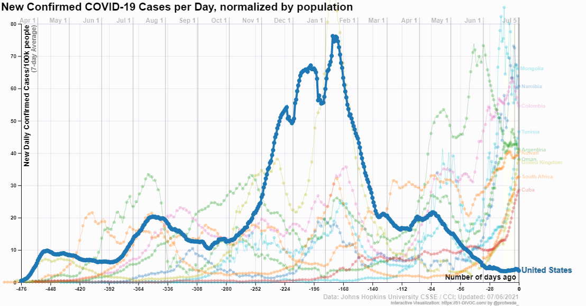
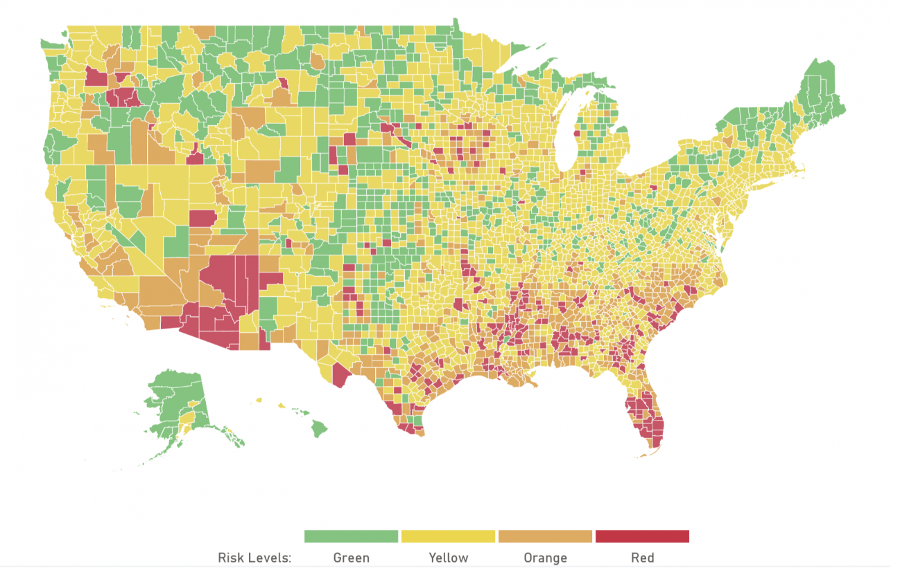

---
# UNL thesis fields
title: "HUMAN PERCEPTION OF EXPONENTIALLY INCREASING DATA DISPLAYED ON A LOG SCALE EVALUATED THROUGH EXPERIMENTAL GRAPHICS TASKS"
author: "Emily Anna Robinson"
month: "August"
year: "2022"
location: "Lincoln, Nebraska"
major: "Statistics"
adviser: "Susan VanderPlas and Reka Howard"
adviserAbstract: 
abstract: |
 Log scales are often used to display data over several orders of magnitude within one graph. We conducted a series of three graphical studies to evaluate the impact displaying data on the log scale has on human perception of exponentially increasing trends compared to displaying data on the linear scale. Each study was related to a different graphical task, each requiring a different level of interaction and cognitive use of the data being presented. The first experiment evaluated whether our ability to perceptually notice differences in exponentially increasing trends is impacted by the choice of scale. Participants were shown a set of plots and asked to identify which plot appeared to differ most from the other plots. Results indicated the choice of scale changes the contextual appearance of the data leading to slight perceptual advantages for both scales depending on the curvatures of the trend lines being compared. The second study validated a new method, 'You Draw It', for testing statistical graphics and introduced an appropriate statistical analysis method for comparing visually fitted trend lines to statistical regression results. This new method was then used to test participant's ability to make forecast predictions for exponentially increasing trends on both scales. The results from the analysis showed a clear underestimation of forecasting trends with high exponential growth rates when participants were asked to make predictions on the linear scale; improvement in forecasts were made when participants were asked to make predictions on the log scale. The third study evaluated graph comprehension as it relates to the contextual scenario of the data shown. Overall, our results suggested that log logic is difficult and that anchoring and rounding biases result in a sacrifice in accuracy in estimates made on the log scale for large magnitudes. The studies conducted in this research relied on graphical tasks of varying complexity to help us understand the perceptual and cognitive advantages and disadvantages of displaying exponentially increasing data on the log scale. The results are instrumental in establishing guidelines for making design choices about scale which result in data visualizations effective at communicating the intended results.
acknowledgments: |
  All of this would not have been possible without my incredible network and support system of friends, family, and mentors throughout the years. I want to thank everyone who encouraged me in any way along my graduate school journey.

  I was fortunate to have been introduced to statistics by some amazing professors at Winona State University during my undergraduate degree. All of you invested in my future and gave me opportunities that built my foundation of statistical knowledge with activities outside the classroom and internship experiences. Dr. Tisha Hooks, thank you for being someone I know I can always count on for advice and Dr. Chris Malone, thank you for planting the small mustard seed of being a professor in my mind by telling me, "go to grad school and teach." Thank you to my friends and peers at WSU who navigated classes and life with me; you taught me the importance of surrounding myself with a creative group of collegues to collaborate and share ideas with.

  During graduate school, I have had many wonderful mentors. To my advisors, Dr. Susan VanderPlas and Dr. Reka Howard, thank you for showing me that you can be both an unbelievable mother and a kick-ass academic. Reka, thank you for giving me the freedom to explore and discover an area of statistics I am passionate about; you have been encouraging me from day one. Susan, thank you for sharing your world of graphics with me and continuing to push me to be a better researcher; I am looking forward to collaborating more in the future. To my committee members, Dr. Erin Blankenship and Dr. Heather Akin, thank you for your enthusiasm about my work and being a part of my Ph.D. program. To other prominent mentors at UNL, Dr. Kathryn Hanford and Dr. Walter Stroup, thank you for training me to be a statistical consultant and value collaborative work. Dr. Stroup, thank you for hiking a mountain with me at JSM and advising me not to trust anyone under 14,000 feet.

  Furthering my education would not have been possible without such a supportive family. To my parents and biggest fans, Wayne and Ann Robinson, thank you for always believeing in me and knowing when I need extra support or encouragement. To my sister, Kelby Hildebrandt, and brother in-law Christen Hildebrandt, thank you for always being curious about my work; to my sweet nephew, Slade Hildebrandt, you never fail to make me smile. To my brother, Mark Robinson, thank you for speaking my language of statistics, and to my sister Ainslie Robinson, I am forever grateful for our countless FaceTime chats and virtual pandemic lunches.

  Nobody makes it through life without a great group of friends, and I am forever grateful for my statistics gals who were there to support me throughout this entire journey. Jessica Hauschild and Kelsey Karnik, you have been solid rocks and the most reliable friends I have ever had. To Dr. Ella Burnham, you were the best office mate I could have asked for; thank you for making going into work fun and for taking random study break walks with me. Dr. Donna Chen, thank you for being my adventure buddy and encouraging me to grow in my faith. To my graduate school roommate, Alison Kleffner, there are not enough words to thank you for being one of my best friends and biggest cheerleaders in Lincoln, NE; graduate school would not have been the same without someone to work from home with during the pandemic. Thank you for always laughing at my jokes and going along with my crazy ideas; I am excited to see where life takes you in your future. I was incredibly blessed with the best cohort of peers to navigate classes, consulting, and research with. Dr. Vamsi Manthena and Dr. Miguel Fudolig, thank you for not only being my peers, but friends I can count on and collegues to bounce ideas off of. You both challenged me to push my goals further than I could ever imagine. To my friends who supported me from a distance, thank you for always picking up the phone and meeting me where I was at in life. Dr. Katilin Wohnoutka, PT, DPT, OCS, thank you for walking alongside me through our twenties and showing me how to embrace the unknown.

  I want to give a big thanks to Southwood Lutheran Church for giving me a church home throughout graduate school. You gave me the space to grow stronger in my faith and challenged me to develop my own beliefs about the world around me. It is a testament to you that I strategically planned my summers around the annual mission trips; thank you for taking me in as an outsider and making me a part of these incredible weeks. To Pastor Greg Olson, thank you for giving me the courage to take a leap of faith on my future.

  Lastly, I want to thank Dr. Taylor Alison Swift for making beautiful music that got me through some long days and nights of writing.

  It takes a village to accomplish something great, and I am so thankful for the community that has surrounded me during my time in Lincoln, NE. To the Cal Poly Statistics Department, I look forward to joining this incredible group of faculty; you have already shown me the support I know I will have in my next stage of life.
  
dedication: |
  Dedicated to...
# End of UNL thesis fields
knit: "bookdown::render_book"
site: bookdown::bookdown_site
output: 
  bookdown::pdf_book:
    pandoc_args: --top-level-division=chapter
    keep_tex: yes
    latex_engine: xelatex
    template: template.tex
  huskydown::thesis_gitbook: 
    style: style.css
#  huskydown::thesis_word: default
#  huskydown::thesis_epub: default
bibliography: bib/thesis.bib
# Download your specific bibliography database file and refer to it in the line above.
csl: bib/apa.csl
# Download your specific csl file and refer to it in the line above.
lot: true
lof: true
#header-includes:
#- \usepackage{tikz}
---

```{r setup, include = F}
options(width = 60)
knitr::opts_chunk$set(
  echo = F, 
  eval = T, 
  messages = F, 
  warnings = F,
  fig.width = 6, 
  fig.height = 4,  
  fig.align = 'center',
  out.width = "\\linewidth", 
  dpi = 300, 
  tidy = T, tidy.opts=list(width.cutoff=45),
  fig.pos = "tbp",
  out.extra = "",
  cache = FALSE
)
```

```{r include_packages, include = FALSE}
# This chunk ensures that the huskydown package is
# installed and loaded. This huskydown package includes
# the template files for the thesis.
if(!require(devtools))
  install.packages("devtools", 
                   repos = "http://cran.rstudio.com")
if(!require(huskydown))
  devtools::install_github(
    "benmarwick/huskydown"
  )
library(huskydown)
library(readr)
library(tidyverse)
library(scales)
library(knitr)
library(gridExtra)
library(patchwork)
library(cowplot)
library(ggforce)
library(scales)
library(formatR)
```

# Literature Review

## Motivation and Background

We have recently experienced the impact graphics and charts have on a large scale through the SARSNCOV-2 pandemic (COVID-19). 
At the beginning of 2020, we saw an influx of dashboards developed to display case counts, transmission rates, and outbreak regions [@rost_2020]; mass media routinely showed charts to share information with the public about the progression of the pandemic [@romano_scale_2020]. 
@fagen-ulmschneider_2020 began the 91-DIVOC project to explore the global growth of COVID-19 through interactive graphics updated daily. 
The interactive graphics allowed viewers to explore the current status of COVID-19 by selecting their desired regions, axes, axis scale, and measure of interest (for example, case count, death count, and vaccine count); \cref{fig:91divoc-cases-july2021} [@fagen-ulmschneider_2020] shows the new confirmed COVID-19 cases per day, normalized by population, as of July 2021. 
Other graphics displayed COVID-19 data as maps \pcref{fig:covid19-summer2020-risk-map} with color indicating the severity and risk in each US county [@global_epidemics_2021].
People began seeking out graphical displays of COVID-19 data as a direct result of these pieces of work [@rost_2020], providing increased and ongoing exposure to these graphics over time. 
\cref{fig:covid19-datawrapper-views-july2020} illustrates the increased views Datawrapper, a user-friendly web tool used to create basic interactive charts, had during the COVID-19 pandemic [@rost_2020].
Many of these graphics helped guide decision makers to implement policies such as shut-downs or mandated mask wearing, as well as facilitated communication with the public to increase compliance [@bavel_using_2020]. 
As graphics began to play an important role in sharing information with the public, creators of graphics were faced with design choices in order to ensure their charts were effective at accurately communicating the current status of the pandemic.
In order to make educated decisions when designing a chart, we need to establish guidelines through experimentation in order to ensure the graphic is effective at communicating the intended results.

```{r 91divoc-cases-july2021, fig.scap = "91-DIVOC new daily case counts as of July 2021", fig.cap = "New daily COVID-19 case counts as of July 2021 shown in the 91-DIVOC dashboard (Fagen-Ulmschneider, 2020).", out.width="75%"}

```

```{r covid19-summer2020-risk-map,  fig.scap = "COVID-19 risk level map as of July 2020", fig.cap = "COVID-19 risk level map as of July 2020 (Jha et al., 2021).", out.width="75%"}

```

```{r covid19-datawrapper-views-july2020, fig.scap = "Datawrapper daily chart views during COVID-19", fig.cap = "Datawrapper daily chart views during COVID-19 (Rost, 2020).", out.width="75%"}
knitr::include_graphics("images/covid19-datawrapper-views-july2020.png")
```

## Misleading Graphics {#misleading-graphics}

There are many ways in which plots may inaccurately display the data and be ineffective or misleading in sharing information and results [@szafir2018good].
Misleading charts might have (1) bad form such as 3D pie charts or a plot type that is unsuitable for the type of data \pcref{fig:misleading-graphics-form}, (2) include too much "chartjunk", resulting in clutter or displaying useless data \pcref{fig:misleading-graphics-chartjunk}, or (3) have bad axes such as a mismatch between scale and context or just plain bad math \pcref{fig:misleading-graphics-bad-axes}.
\cref{fig:misleading-graphics-just-bad} demonstrates how a chart can be misleading in more than one way; the map of pet ownership violates guidelines by mapping too many variables to visual encodings which results in clutter and bad form [@reddit_CrappyDesign].

```{r misleading-graphics-form, fig.show = 'hold', fig.align='center', out.width = '49%', fig.scap = "Misleading graphical form examples", fig.cap = "These figures display information in bad form which results in an ineffective chart. The figure on the left uses 3D pie charts, which we will see later is poor practice. The right figure does not utilize the data in an effective way for the user to extract information (BusyAd6668, 2022; Steward-Lowndes et al., 2017)."}
knitr::include_graphics(c("images/misleading-graphics-3d-pie-batteries.jpg", "images/misleading-graphics-bad-form-better-science.png"))

#@reddit_dataisugly; @lowndes2017our

# https://www.reddit.com/r/dataisugly/comments/tgn4vq/argh/
# @reddit_dataisugly

# https://www.nature.com/articles/s41559-017-0160
# @lowndes2017our
```

```{r misleading-graphics-chartjunk, fig.show = 'hold', fig.align = 'center', out.width = '49%', fig.scap = "Misleading 'chartjunk' examples", fig.cap = "These figures provide examples of how too much clutter can be misleading (Dongarra, Meaur, Strohmaier, et al., 1997; Wordtips, 2022)."}
knitr::include_graphics(c("images/misleading-graphics-bad-form-supercomputers.png", "images/misleading-graphics-wordle-map.jpg"))

# [@graphcrimes_2022; @dongarra1997top500]

# https://twitter.com/GraphCrimes/status/1500314716081692676
# @graphcrimes_2022

# https://en.wikipedia.org/wiki/X86-64#/media/File:Processor_families_in_TOP500_supercomputers.svg
# @dongarra1997top500
```

```{r misleading-graphics-bad-axes, fig.show = 'hold', fig.align = 'center', out.width = '49%', fig.scap = "Misleading bad axes", fig.cap = "These figures are misleading in their axis selections and bad math. (Left) Selecting a baseline $y$-axis value of 0 minimizes the large decline in the rate of the rouble in 2022. (Right) The probabilities sum to greater than 100\\% (Smith, 2017; Villa, 2022)."}
knitr::include_graphics(c("images/misleading-graphics-pizza.png", "images/misleading-graphics-bad-axes-rouble-to-dollar.jpg"))

# [@villa_2022; @lauren_2018]

# https://twitter.com/emmevilla/status/1498365717720223751
# @villa_2022

# https://getdolphins.com/blog/the-worst-graphs-of-2017/
# @lauren_2018
```

```{r misleading-graphics-just-bad, fig.align = 'center', out.width="50%", fig.scap = "Misleading graphic multiple violations example", fig.cap = "This figure demonstrates how a chart can be misleading in more than one way; the map of pet ownership violates guidelines by mapping too many variables to visual encodings which results in clutter and bad form (Benjamin-Cat, 2018)."}


# https://i.redd.it/sdx40wo1s1y11.jpg
# @reddit_CrappyDesign
```

@baumer2021texts shares an example of a misleading graphic in the news shown in May 2020 when Georgia published a graphical display of COVID-19 cases \pcref{fig:covid-19-reporting}. 
This graphic was highly misleading in communicating the state of the pandemic due to the ordering along the $x$-axis.
Notice the case count for April $17^{th}$ appears to the right of April $19^{th}$, and that the order of the counties has been selected so that the case counts are monotonically decreasing for each day of reporting.
The appearance of this graphic leads viewers to believe COVID cases are decreasing.
Shortly after the graphic was released, the governor's office made a statement that in future charts, chronological order would be used to display time due to public demand.

```{r covid-19-reporting, fig.scap = "COVID-19 reporting", fig.cap = "Misleading graphic example displaying COVID-19 cases in Georgia as of May 2020. Notice the case count for April $17^{th}$ appears to the right of April $19^{th}$, and that the order of the counties has been selected so that the case counts are monotonically decreasing for each day of reporting (Baumer, Kaplan, \\& Horton, 2021).", out.width="100%"}
knitr::include_graphics("images/covid-ga-recreation.jpg")
# https://mdsr-book.github.io/mdsr2e/ch-ethics.html#truthful-falsehoods
```

Misleading charts are not only found in mass media, but graphics displayed in academic research and science are still falling short of the standards. @gordon_statistician_2015 evaluated 97 graphs for overall quality, based on five principles of graphical excellence including: (1) show the data clearly (2) use simplicity in design (3) use good alignment on a common scale for quantities to be compared (4) keep the visual encoding transparent (5) use graphical forms consistent with principles (1) and (4).
The authors rated 39% of the 97 graphs sampled as poor, indicating there is still an astonishing lack of quality in graphics.
More startling is the fact that the source of the graphic from an applied science or a graphic from statistics had no effect on the quality of the graphic. 

Although statistical graphics have become widely used and valued in science, business, and in many other aspects of life, we may be too accepting of easy-to-create, default data displays, using them without critically questioning the data and/or how effective the display is at displaying the data. Attempts to improve the creation and use of charts have been ongoing since the early $20^{th}$ century [@eells1926relative; @croxton1927bar; @von1927further; @croxton1932graphic]. 
We address the ways in which researchers use experimentation to test statistical graphics in order to establish guidelines and improve graphics in [Section 1.4](#testing-statistical-graphics).
In efforts to achieve a higher standard of the graphics being presented, work is needed to implement more academic research into graphics.
For example, better definitions of variables, units of measurements, scales, and other graphical elements are necessary in order to improve the overall quality of graphics.
Changes in software defaults such as the originally set number of bins in a bar chart can help support the improvement of graphs in both statistics and applied science.

## Graphical Frameworks

A consistent concern is the lack of theory of graphics available to build on; better theory should result in better data visualizations.
In order to improve the construction and distribution of charts, we need an established set of concepts and terminology so we can actively choose which of many possible graphics to draw in order to ensure our charts are effective at communicating the intended result. 
Of the many many efforts to provide frameworks and classification systems for graphical designs, the most useful for our purposes is Wilkinson's Grammar of Graphics [@wilkinson2013grammar].
The grammar of graphics serves as the fundamental framework for data visualization with the notion that graphics are built from the ground up by specifying exactly how to create a particular graph from a given data set.
Visual representations are constructed through the use of “tidy data” which is characterized as a data set in which each variable is in its own column, each observation is in its own row, and each value is in its own cell [@wickham2016r].
Graphics are viewed as a mapping from variables in a data set (or statistics computed from the data) to visual attributes such as the axes, colors, shapes, or facets on the canvas in which the chart is displayed.
\cref{fig:graphic-flowchart} illustrates the process of creating a graphic from a data set through the use of variable mapping, data transformations, coordinate systems, and aesthetic features [@vanderplas_testing_2020].
Software, such as `ggplot2` [@ggplot2], aims to implement the framework of creating charts and graphics using the layered framework of the grammar of graphics. 

```{r graphic-flowchart, fig.scap = "Graphic flowchart", fig.cap = "The flowchart illustrates the process of creating a graphic from a data set through the use of variable mapping, data transformations, coordinate systems, and aesthetic features.", out.width="50%"}
knitr::include_graphics("images/graphic-flowchart.png")
```

## Heuristics and "Good" Graphics {#good-graphics}

Charts have been an essential component in communicating information for the last 200 years [@lewandowsky_perception_1989].
Some of these charts succeeded in effectively showing the data in order for viewers to extract meaningful information. 
For example, during 1870, 1880, and 1890, the "Statistical Atlas of the United States" [@walker1874statistical] produced high quality and engaging graphics \pcref{fig:statistical-atlas-state-population}.
These data visualizations were created without the use of modern technology, demonstrating that exceptional graphics were achievable before the use of computers.

```{r statistical-atlas-state-population, fig.scap = "Statistical Atlas of the United States (1870)", fig.cap = "The Statistical Atlas of the United States (1870) produced high quality graphics. This figure displays the population of each state where square size represents the proportion of the states population separated into three regions representing the origin and race of the population (designtated by the shaded color). The rectangle shown to the right represents the proportion of residents born in the state who have become residents of other states.", out.width="85%"}
knitr::include_graphics("images/statistical-atlas-state-population.jpg")

# https://www.loc.gov/item/05019329/
# PERMISSION: The Library of Congress is providing access to these materials for educational and research purposes and is not aware of any U.S. copyright protection (see Title 17 of the United States Code) or any other restrictions in the Map Collection materials.
```

In the following decades, recommendations and guidelines emerged to help improve the overall quality of graphics. 
@wickham2013graphical gives a review and critique of the first formal advice for creating good graphics presented by The International Institute of Statistics in 1901.
@andrews_2022 recalls seventeen general suggestions for the visualization of statistical and quantitative data published by The American Society of Mechanical Engineers (ASME) in 1915.
Here we take a look at selected guidelines from these articles and connect them to work conducted almost 100 years after the recommendations were made.

When creating graphics, early guidelines state to keep symbols to a minimum; @tufte1985visual coins the term "chartjunk" which refers to any of the visual elements in the chart that are unnecessary for the viewer to comprehend the information represented in the plot. 
The ASME guidelines supported the minimization of "chartjunk" earlier that century by recommending that charts do not show any more coordinate lines than necessary to guide the eye in reading the diagram.
Guidelines for the use of lengths over areas or volumes were established in both sets of early recommendations, but not formally tested until the late $20^{th}$ century by @cleveland1987graphical.
The International Institute of Statistics included a recommendation for selecting the ratio of the scales such that the slope of the phenomenon corresponds to the tangent of the curve displayed on the plot at a 45$^{\circ}$ angle.
Almost 100 years later, @cleveland1988shape again made the recommendation to "bank to 45$^{\circ}$" and @heer2006multi explored extensions to propose alternate optimization criteria as well as introduced a technique meant to implement the original guideline.
Additional suggestions included the proper use of scales such as arrangements, labels, and baselines; the ASME advocated for careful consideration of the limiting lines for curves drawn on logarithmic coordinates \pcref{fig:standards-of-graphics-log-scale}.

```{r standards-of-graphics-log-scale, fig.scap = "Logarithmic scales ASME guidelines", fig.cap = "The ASME (1915) reccommended when curves are drawn on logarithmic coördinates, the limiting lines of the diagram should each be at some power of ten on the logarithmic scales. Note the use of the minor gridline breaks unequally spaced visually, but equally spaced numerically.", out.width="100%"}
knitr::include_graphics("images/standards-of-graphics-log-scale.jpg")
```

Helpful suggestions for creating "good" graphics are extremely common (and sometimes conflicting). In the absence of an underlying understanding of how graphics are perceived and used, these suggestions are largely ineffective and sometimes harmful. It is essential to have guidelines established through careful experimentation combined with an understanding of the perceptual and cognitive processes involved in the use of statistical graphics.

## Testing Statistical Graphics {#testing-statistical-graphics}

One way in which we establish guidelines is through the use of graphical tests [@cleveland_graphical_1984; @spence_visual_1990; @lewandowsky_perception_1989; @vanderplas2015spatial].
These tests may take many forms: identifying differences in graphs, accurately reading information off a chart, using data to make correct real-world decisions, or predicting the next few observations.
All of these types of tests require different levels of use and manipulation of the information presented in the chart.

The initial push to develop classification and recommendation systems for charts was grounded in heuristics rather than experimentation [@kruskal1975visions; @macdonald1977numbers].
Requests were made for the validation of the perception and utility of statistical charts through graphical experiments.
Most early experimentation [@eells1926relative; @croxton1927bar; @croxton1932graphic] stemmed from psychophysics research on the perception of size and shape. 
In attempts to understand the human perception and judgment of component parts, @eells1926relative instructed students to think of each circle diagram \pcref{fig:eells-compoment-parts} as representing 100\% and write their best estimate of the percentage of the whole in each sector.
Participants were told not to hurry, but to work steadily in order to determine efficiency of judgment. 
Students were then asked to analyze their mental processes used to make their estimates and indicate the method that best matches: by areas of sectors, by central angles, by arcs on the circumference, by subtending chords.
This process was repeated three days later by presenting students the same data represented in bar diagrams \pcref{fig:eells-compoment-parts}. 
Results of the study led the authors to argue for the use of circle diagrams to show component parts based on both participant accuracy and speed.
In response, @croxton1927bar evaluated the accuracy of judgment of two types of charts (bars and circles) in efforts to reach a consistent conclusion. 
During class, students were individually presented pairs of diagrams (without scales) on cards and asked to estimate the percentages displayed in the diagram.
The authors found the bar was preferable to the circle when shown percentages that deviate from quarters, but that the circle is strongly preferred when shown percentages separating the diagrams into 25\% or 50\%; this introduces the concept of anchoring discussed further in [Section 1.6.3](#estimation-biases).

```{r eells-compoment-parts, fig.scap = "Eells (1926) component parts diagrams", fig.cap = "Component part diagrams shown to study participants in Eells (1926). Researchers were interested in comparing the partition percentage estimate between circle and bar diagrams.", out.width="75%"}
knitr::include_graphics("images/eells-component-parts.png")
```

While a typical psychophysics experiment focuses on whether an effect is detectable and whether the magnitude of the effect can be accurately estimated, these early experiments instead depended on speed and accuracy for plot evaluation [@spence_visual_1990; @teghtsoonian1965judgment; @lewandowsky_perception_1989]. 
In attempts to understand the visual psychophysics of simple graphical elements, @spence_visual_1990 presented stimuli (tables, lines - horizontal and vertical, bars, boxes, cylinders, pie charts, and disk charts) to participants on a monitor screen in a computer lab. 
Participants were asked to use their cursor to position the marker to indicate the proportion to the apparent sizes of the elements \pcref{fig:spence-1990-proportion}.
Results found that the table elements (numbers), pie elements, and bar elements led to the most accurate proportion estimates; boxes and disk elements resulted in the least accurate estimates.
Measuring the speed at which participants made their judgments, two- and three- dimensional stimuli (for example, pie charts and box charts) assisted in faster judgment than zero- or one- dimensional stimuli (for example, tables and lines).

```{r spence-1990-proportion, fig.scap = "Spence (1990) task display", fig.cap = "Example of a stimuli shown to study participants in Spence (1990). Participants were asked to use their cursor to position the marker to indicate the proportion to the apparent sizes of the elements.", out.width="75%"}
knitr::include_graphics("images/spence-1990-proportion.png")
```

Cognitive psychologists and statisticians made progress by conducting experiments to identify perceptual errors associated with different styles of graphics and charts [@cleveland_graphical_1984; @cleveland_graphical_1985; @shah1999graphs]. 
@cleveland_graphical_1984 provided a basis for perceptual judgment, still utilized today, by examining six basic plot objects: position along a common scale, position along nonaligned scales, length, angle, slope, and area.
In @cleveland_graphical_1985, these plot objects were ordered by accuracy performed through graphical-perception tasks; for example, comparisons of angles resulted in more difficult judgments than between lengths of lines. 
@shah1999graphs established the notion that redesigning graphs can result in the improvement of the viewer's interpretation of the data.
For example, the use of gestalt principles [@goldstein2021sensation] such as proximity, similarity, and good continuation can help minimize the inferential processes and maximize the pattern association processes required to interpret relevant information.
In [Section 1.8](#underestimation) we see how the hierarchy of accuracy in plot objects presented in @cleveland_graphical_1985 can explain biases in our interpretation and use of graphics.

During the $\text{21}^{\text{st}}$ century, advancements were made in the methodology used to investigate the effectiveness of statistical charts [@majumder_validation_2013]. 
A notable advancement was made in @buja_statistical_2009 which introduced the lineup protocol.
Supported by the grammar of graphics, the lineup protocol characterizes a data plot as a statistic, defined as, "a functional mapping of a variable or set of variables" [@vanderplas_testing_2020].
This allows the data plot to be tested similar to other statistics; by comparing the actual data plot to a set of plots with the absence of any data structure, we can test the likelihood of any perceived structure being visually significant [@vanderplas2021statistical].
The construction of data plots as statistics allows for easy experimentation, granting researchers the ability to compare the effectiveness of and understand the perception of different types of charts.
While the lineup protocol differs from methodology used in earlier studies, the focus is still on initial perception with a relatively small amount of work conducted to understand the effect of design choices on higher cognitive processes such as learning or analysis [@green2009personal]. 
Lineups serve as a powerful tool for testing *perceived* differences by eliminating ambiguous questions. 
However, the lineup protocol is constrained by the inability to test higher order cognitive skills such as accurately reading information off of a graph or drawing conclusions from the graph, limiting their ability to test real-world applications.

## Task Complexity

In order to understand how our visual system perceives statistical charts, we must first consider the complexity of the graphic and how viewers are interacting with the data and information being displayed [@tory2004human].
The efficiency in which a viewer extracts data and information from a graphical display is greatly affected by the complexity of the task being performed such as identifying differences in plots or reading values off of the chart.
Cognitive fit refers to a match between the representation of the data and the complexity of the task; the representation and tools should support the task strategies, thus reducing the complexity of the task [@vessey1991cognitive].
@carpenter1998model identifies pattern recognition, interpretative processes, and integrative processes as strategies and processes required to complete tasks of varying degrees of complexity.
Pattern recognition requires the viewer to encode graphic patterns while interpretive processes operate on those patterns to construct meaning.
Integrative processes then relate the meanings to the contextual scenario as inferred from labels and titles.
These processes are critical when determining cognitive fit since they provide the link between the graphical representation and task [@vessey1991cognitive].
For example, perceptual differences may be identified through pattern recognition while estimation tasks would require integrative processes.
@tory2004human argues for multiple visual representations of the data since the users' information needs are dependent on both data context and task.
Therefore, we must consider and determine how the viewer is perceiving and interacting with the graphic as this can influence their understanding of the data and information.

## Graph Comprehension

Higher order cognitive processes require viewers to translate the visual features into conceptual relations by interpreting titles, labels, and scales.
In order to understand how viewers are interpreting and using the data and information displayed on the chart, studies have asked participants to read information directly from a chart and provide a quantitative estimate or answer a predefined question [@peterson1954accurately; @broersma1985graphical; @dunn1988framed; @tan1994human; @amer2005bias; @spence_visual_1990].
For instance, @amer2005bias demonstrated that visual illusion may bias decision making and graph comprehension, even if the graphs are constructed according to best practice.
Participants were presented a cost volume profit graph \pcref{fig:amer-poggendorff-illusion} with two crossing lines (revenue and cost) and asked to estimate three values: (1) the amount of total revenues on the ordinate corresponding to the endpoint of the total-revenue line plotted on the graph (2) the amount of total costs on the ordinate corresponding to the endpoint of the total-cost line plotted on the graph and (3) the amount of costs/revenues on the ordinate at the break even point—the point where the two lines cross.
Results indicated that decision makers may consistently underestimate or overestimate the values displayed on line graphs due to what is called the "Poggendorff illusion" [@zollner1860ueber].

```{r amer-poggendorff-illusion, fig.scap = "Amer (2005) cost volume profit graph", fig.cap = "Participants in Amer (2005) were shown this plot in order to test their graph comprehension and identify visual biases. This figure illustrates the 'Poggendorff illusion' which results in visual biases of underestimation and overestimation.", out.width="100%"}
knitr::include_graphics("images/amer-poggendorff-illusion.png")
```

### Questioning {#lit-questioning}

An important consideration in understanding graph comprehension is the questions being asked of the viewer [@graesser2014new].
Low level questions address the content and interpretation or explicit material while deeper questions require inference, application, and evaluation of the information being presented.
Three levels of graph comprehension have emerged from mathematics education research [@wood1968objectives; @curcio1987comprehension; @jolliffe1991assessment; @friel2001making; @glazer2011challenges].
The three behaviors related to graph comprehension involve (1) literal reading of the data (elementary level), (2) reading between the data (intermediate level), and (3) reading beyond the data (advanced level).
@curcio1987comprehension aligns two multiple choice questions with each level of comprehension related to a graph showing the height of four children in centimeters \pcref{fig:children-height}.
Two literal items required the viewer to read the data, title, or axis label in order to answer, "What does this graph tell you?" or "How tall was xxx?"
Comparison items required comparisons and the use of mathematical concepts to answer, "Who was the tallest?" and "How much taller was x than y?"
Lastly, extension items required an extension, prediction, or inference such as, "If x grows 5 centimeters and y grows 10 centimeters by Sept. 1981, who will be taller and by how much?
In @friel2001making, several studies were reviewed and their questions were placed in the taxonomy of skills required for answering questions at each level.
In addition to the graph's visual features and questioning, it is important for researchers to give careful consideration to the context of the graphic on the viewers comprehension.

```{r children-height, fig.scap = "Comprehension of heights, Curcio (1987)", fig.cap = "This plot was used in Curcio (1987) along with questions related to the heights of the four children in order to better understand graph comprehension skills.", out.width="80%"}

```

### Estimation Strategies

While not exclusive to extracting numerical values from charts, mathematics education research places an emphasis on quantitative estimation skills [@hogan2003quantitative].
Three modes of estimation are taught as part of the mathematics curriculum in schools: numerosity, measurement, and computational estimation. 
Numerosity estimation requires the estimation of the number of items in a group or array; for example, guessing the number of M&M's in a jar.
Measurement estimation requires participants to provide an estimated value related to an object; for instance, an estimated length of a string or weight or a box.
Computational estimation is the third mode which refers to estimated answers to computations as a way to avoid exact calculations.
These estimates may be presented in either algorithmic form or a contextual scenario with words.
A longer history of quantitative estimation can be found in psychometric literature in which estimation tasks appeared in early psychometric studies of mental abilities [@cattel1890mental; @thurstone1943primary; @carroll1993human; @carroll1996mathematical].

In efforts to develop estimation skills, research has been conducted to evaluate strategies for estimating tasks.
Common strategies related to measurement estimation involve reference point estimation, benchmark estimation, unit iteration, and guess and check.
@joram2005children was interested in the relationship among strategy use and accuracy of students’ representations of standard measurement units and measurement accuracy.
In this study, students were asked to estimate the lengths of two objects and explain their process.
The researchers used talk aloud protocols to prompt students to communicate their estimation strategies to an interviewer; results found that students who used a reference point had a more accurate representation of standard units and estimates of length than students who did not use a reference point.
@jones2012students examined the effect of scale (metric versus English) and task context on the accuracy of measurement estimation for linear distances.
The study showed that students were less accurate in estimating metric units as compared to English units and that estimation accuracy was highly dependent on the task context. 
@forrester1990exploring argued that estimation, approximating, and measuring are key components in the intuitive understanding of dimension and scale necessary to manipulate information and interact effectively with our environment.
Without open ended conversations, our research demonstrates how the use of graphical tasks of varying complexities conducted through an online system can provide insight about the tactics and procedures used to extract meaning from a chart.

### Estimation Biases {#estimation-biases}

Certain biases including anchoring and rounding to multiples of five or ten arise in open-ended estimation tasks.
When it comes to understanding graphics, anchoring is prominent in both graphical representations and data extraction tasks [@tan1990processing].
Anchoring bias refers to an individual using easily observed visual cues such as grid lines or "anchors" when extracting information such as the $x$ or $y$ value on a chart [@tan1994human ; @godlonton2018anchoring].
In addition to $x$-value and $y$-value anchoring, entity anchoring refers to anchoring on group information withing a data set. 
Rounding errors occur out of natural human preference to provide rounded figures even if a precise estimate is desired or requested [@myers1954accuracy]. 
 @schneeweiss2010symmetric outlines distortion in results as a consequence of rounding and suggests the use of corrections when conducting statistical regression analyses on data prone to rounding.

Scale and axis labels are other critical factors in estimation accuracy.
@dunham1991learning argue that if there is not proper attention given to the scale when using a line graph, there is a potential for issues when interpreting asymmetric scales and when choosing appropriate scales for the graphic.
@beeby1973well found that when asked to read data from line graphs, viewers consistently misread the $y$-axis scale; when alternate grid lines were labeled, the unlabeled grid lines were read as halves.
This misrepresentation is highlighted for asymmetric scales where spatial distance does not necessarily equate to numerical or quantitative difference.
The choice of scale can change the shape of a graph, thus creating a conceptual demand for the viewer when constructing a mental image of the graph [@leinhardt1990functions]. 

## Logarithmic Scales and Mapping

A major issue we encountered in the creation of COVID-19 plots was how to display data from a wide range of values.
When faced with data which spans several orders of magnitude, we must decide whether to show the data on its original scale (compressing the smaller magnitudes into relatively little area) or to transform the scale and alter the contextual appearance of the data.
One common solution is to use a log scale transformation to display data over several orders of magnitude within one graph.
Exponential curves are a common source of data in which smaller magnitudes are compressed into a smaller area; 
\cref{fig:log-scales} presents an exponential curve displayed on both the linear and log scale illustrating the use of the log scale when displaying data which spans several magnitudes. 
Logarithms convert multiplicative relationships (for example, 1 \& 10 displayed 10 units apart and 10 \& 100 displayed 90 units apart) to additive relationships (for example, 1 \& 10 and 10 \& 100 both equally spaced along the axis), showing proportional relationships and linearizing power functions [@menge_logarithmic_2018].
They also have practical purposes, easing the computation of small numbers such as likelihoods and transforming data to fit statistical assumptions.
When presenting log scaled data, it is possible to use either un-transformed scale labels (for example, values of 1, 10 and 100 are equally spaced along the axis) or log transformed scale labels (for example, 0, 1, and 2, showing the corresponding powers of 10).

```{r log-scales, fig.scap = "Linear scale versus log scale", fig.cap = "These plots present an exponential curve displayed on both the linear and log scale and illustrate the use of the log scale when displaying data which spans several magnitudes.", out.width="100%"}
data <- tibble(x = seq(0,10, by = 0.1), y = exp(x))

linear_scale <- data %>%
  ggplot(aes(x = x, y = y)) +
  geom_line() +
  theme_bw() +
  theme(aspect.ratio = 1) +
  ggtitle("Linear Scale")

log_scale <- data %>%
  ggplot(aes(x = x, y = y)) +
  geom_line() +
  theme_bw() +
  theme(aspect.ratio = 1) +
  scale_y_log10(breaks = trans_breaks("log10", function(x) 10^x)) +
  ggtitle("Log Scale")

grid.arrange(linear_scale,log_scale, ncol = 2)
```

<!-- We have recently experienced the benefits and pitfalls of using log scales as COVID-19 dashboards displayed case count data on both the log and linear scale .  -->
In spring 2020, during the early stages of the COVID-19 pandemic, there were large magnitude discrepancies in case counts at a given time point between different geographic regions (for example states and provinces as well as countries and continents).
During this time, we saw the usefulness of log scale transformations showing case count curves for areas with few cases and areas with many cases within one chart. 
The usefulness of log scales in comparing deaths attributed to COVID-19 between countries as of March 2020 is illustrated in \cref{fig:covid19-FT-deaths-march2020-log}; the diagonal reference lines provide a visual aid useful for interpretation [@burnmurdoch_2020]. 
As the pandemic evolved, and the case counts were no longer spreading exponentially, graphs with linear scales seemed more effective at spotting early increases in case counts that signaled more localized outbreaks. In \cref{fig:covid19-FT-june2020-case-counts-linear} and \cref{fig:covid19-FT-june2020-case-counts-log}, the daily case counts as of June 30, 2020 were displayed on both the linear and log scales respectively [@burnmurdoch_2020]. 
The effect of the linear scale \pcref{fig:covid19-FT-june2020-case-counts-linear} appeared to evoke a stronger reaction from the public than the log scale \pcref{fig:covid19-FT-june2020-case-counts-log} as daily case counts were clearly rising rapidly during the summer wave. 
This is only one recent example of a situation in which both log and linear scales are useful for showing different aspects of the same data[@fagen-ulmschneider_2020]. 


There is a long history of using log scales to display results in ecology, psychophysics, engineering, and physics [@menge_logarithmic_2018; @heckler_student_2013].
In @waddell2005comparisons, comparisons were made between the linear and logarithmic scales for the relationship between dosage and carcinogenicity in rodents.
Results favored the use of logarithmic scales for doses in order to put the relative doses into perspective whereas using a linear scale to administer doses to animals with the same chemicals to which humans are exposed does not provide useful, comparative information.
Given the widespread use of logarithmic scales, it is important to understand the implications of their use in order to provide guidelines for best use.

```{r covid19-FT-deaths-march2020-log, fig.scap = "Covid-19 deaths (log scale) as of March 23, 2020", fig.cap = "Covid-19 deaths (log scale) as of March 23, 2020.", out.width="90%"}
knitr::include_graphics("images/covid19-FT-03.23.2020-log.png")
# https://eagereyes.org/blog/2020/in-praise-of-the-diagonal-reference-line
```

```{r covid19-FT-june2020-case-counts-linear, fig.scap = "Covid-19 case counts (linear scale) as of June 30, 2020", fig.cap = "Covid-19 case counts (linear scale) as of June 30, 2020.", out.width="90%"}
knitr::include_graphics("images/covid19-FT-case-count-06.30.2020-linear.png")
```

```{r covid19-FT-june2020-case-counts-log, fig.scap = "Covid-19 case counts (log scale) as of June 30, 2020", fig.cap = "Covid-19 case counts (log scale) as of June 30, 2020.", out.width="90%"}

```

When we first learn to count, we begin counting by ones (for example, 1, 2, 3, etc.), then by tens (for example, 10, 20, 30, etc.), and advancing to hundreds (for example, 100, 200, 300, etc.), following the base10 order of magnitude system (for example, 1, 10, 100, etc.).
Research suggests our perception and mapping of numbers to a number line is logarithmic at first, but transitions to a linear scale later in development, with formal mathematics education [@siegler_numerical_2017; @siegler_numerical_2017; @varshney_why_2013; @dehaene2008log].
For example, a kindergartner asked to place numbers one through ten along a number line would place three close to the middle, following the logarithmic perspective [@varshney_why_2013]; \cref{fig:log-number-line} demonstrates how a kindergartner might map numbers along a number line. 
@dehaene2008log found that with basic training, members of remote cultures with a basic vocabulary and minimal education understood the concept that numbers can be mapped into a spacial space; for example, numbers can be mapped to a number line or numbers can be mapped onto a clock. 
There was a gradual transition from logarithmic to linear scale as the mapping of whole number magnitude representations transitioned from a compressed (approximately logarithmic) distribution to an approximately linear one. 
These results indicate the universal and cultural-dependent characteristics of the sense of numbers.
Regardless of training, our visual system is still vulnerable to biases related to our perception of different stimuli such as weight, light, or sound. 
*Weber's law* established that we do not notice absolute changes in stimuli, but instead we notice the relative change [@fechner1860elemente].
The *Weber-Fechner law* extended the discovery and stated the relationship between the perceived intensity (as sensed by the person; for example, perceived sound) is logarithmic to the stimulus intensity (as outputted by the object source; for example, decibels) when observed above a minimal threshold of perception.

```{r log-number-line, fig.scap= "Kindergarten example of mapping numbers 1-10 along a number line", fig.cap = "Kindergarten example of mapping numbers 1-10 along a number line.", fig.height=1, fig.width=4.5, message=FALSE, warning=FALSE, out.width = "65%"}
tibble(x = seq(1,10, 0.25),
       y = 1,
       text = c("1", NA, NA, NA, 
                NA, NA, NA, NA,
                NA, NA, NA, "2",
                NA, NA, NA, NA,
                NA, "3", NA, NA, 
                NA, "4", NA, NA,
                NA, "5", NA, NA,
                "6", NA, NA, NA,
                "7", NA, "8", "9",
                "10")
       ) %>%
  ggplot(aes(x = x, y = y, label = text)) +
  # geom_line() +
  geom_text() + 
  theme_classic() +
  theme(aspect.ratio = 0.1,
        axis.line.y = element_blank(),
        axis.ticks.y = element_blank(),
        axis.text.y = element_blank()
        ) +
  labs(x = NULL,
       y = NULL
       ) +
  scale_x_continuous(breaks = c(1,10))
```

Assuming there is a direct relationship between perceptual and cognitive processes, it is reasonable to assume numerical representations should also be displayed on a nonlinear, compressed number scale. Therefore, if we perceive logarithmically by default, it is a natural (and presumably low effort) way to display information and should be easy to read and understand/use.
The idea is that compression enlarges the coding space, thus increasing the dynamic range of perception and firing neurons within our visual system [@nieder2003coding].
Similar to the training and education required to transition from logarithmic mapping to linear mapping, there is also necessary training required in the assessment of graphical displays associated with logarithmic scales. @haemer_presentation_1949 identified semi-logarithmic charts for temporal series as requiring a certain degree of technical training for the viewer to extract meaningful information from the plot.
    
## Underestimation of Exponential Growth {#underestimation}

In addition to biases which result from the use of log scales, there is a general misinterpretation of exponential growth; \cref{fig:exponential-stages-comic} [@vonbergmann_2021] illustrates how individuals in public health interpret exponential growth distinctly different from scientists during early, middle, and late stages of growth.
Exponential growth is often misjudged in early stages, appearing to have a small growth rate.
As exponential growth continues, the middle stage appears to be growing, but not at an astounding rate, appearing more quadratic.
It is not until late stages of exponential growth when it is quite apparent that there is exponential growth occurring.
This misinterpretation can lead to decisions made under inaccurate understanding causing future consequences.

```{r exponential-stages-comic, fig.scap = "Log scale comic", fig.cap = "Comic illustrating the general misinterpretation of exponential growth.", out.width="100%"}
knitr::include_graphics("images/exponential-stages-comic.jpg")
```

Early studies explored the estimation and prediction of exponential growth and found that growth is underestimated when presented both numerically and graphically [@wagenaar_misperception_1975].
The hierarchy of plot objects such as lengths and angles, found in @cleveland_graphical_1985, can provide a possible explanation for the underestimation that occurs in exponentially increasing trends; the exponential trend can be thought of as a series of tangential angles leading to less accurate judgement of the next points.
Results from @wagenaar_misperception_1975 indicated that numerical estimation is more accurate than graphical estimation for exponential curves. 
Experimental studies were conducted in order to determine strategies to improve the accuracy of estimation of exponential growth [@wagenaar_misperception_1975; @jones_polynomial_1977; @mackinnon_feedback_1991].
There was no improvement in estimation found when participants had contextual knowledge or experience with exponential growth, but instruction on exponential growth reduced the underestimation; participants adjusted their initial starting value but not their perception of the growth rate [@wagenaar_misperception_1975; @jones_polynomial_1977].
@mackinnon_feedback_1991 found that estimation was improved by providing immediate feedback to participants about the accuracy of their current predictions.  

Our inability to accurately predict exponential growth might also be addressed by log transforming the data, however, this transformation introduces new complexities.
Most readers are not mathematically sophisticated enough to intuitively understand logarithmic math and translate that back into real-world effects.
In @menge_logarithmic_2018, ecologists were surveyed to determine how often ecologists encounter log scaled data and how well ecologists understand log scaled data when they see it in the literature. 
Participants were presented three relationships displayed on linear-linear scales, log-log scales with untransformed values, or log–log scales with log transformed values \pcref{fig:menge-plots}. 
The authors proposed three types of misconceptions participants encountered when presented data on log-log scales: 'hand-hold fallacy', 'Zeno's zero fallacy', and 'watch out for curves fallacies'. 
These misconceptions are a result of linear extrapolation assuming that a line in log-log space represents a line instead of the power law (which is an exponential relationship) in linear-linear space.

```{r menge-plots, fig.scap = "Graphs viewed in Menge (2018) survey", fig.cap = "Graphs presented to participants in Menge (2018). Three relationships were displayed on the linear-linear scales, log-log scales with transformed values, or log-log scales with log transformed values. These figures demonstrate misconceptions participants encountered when presented data on the log-log scales.", out.width="100%"}
knitr::include_graphics("images/menge-plots.png")
```

The 'hand-hold fallacy' stems from the misconception that steeper slopes in log-log relationships are steeper slopes in linear-linear space, illustrated in \cref{fig:menge-plots} d-f. 
In fact, it is not only the slope that matters, but also the intercept and the location on the horizontal axis since a line in log-log space represents a power law in linear-linear space (linear extrapolation). 
Emerging from 'Zeno's zero fallacy' is the misconception that positively sloped lines in log-log space can imply a non-zero value of y when x is zero, illustrated in \cref{fig:menge-plots} a-c and d-f.
This is never true as positively sloped lines in log-log space actually imply that $y = 0$ when $x = 0$. This misconception again is a result of linear extrapolation assuming that a line in log-log space represents a line instead of the power law in linear-linear space. 
The last misconception, 'watch out for curves fallacies' encompasses three faults: (1) lines in log-log space are lines in linear-linear space, illustrated in \cref{fig:menge-plots} d-f, (2) lines in log-log space curve upward in linear-linear space, illustrated in \cref{fig:menge-plots} d-f, and (3) curves in log-log space have the same curvature in linear-linear space, illustrated in \cref{fig:menge-plots} g-i. 
Linear extrapolation is again responsible for the first and third faults while the second fault is a result of error in thinking that log-log lines represent power laws, and all exponential relationships curve upward; this is only true when the log-log slope is greater than one. 
@menge_logarithmic_2018 found that in each of these scenarios, participants were confident in their incorrect responses, indicating incorrect knowledge rather than a lack of knowledge.

## Research Objectives
In this research, we conducted a series of three graphical studies to evaluate the impact displaying data on the log scale has on human perception of exponentially increasing trends compared to displaying data on the linear scale.
The series of graphical tests can be completed [here](https://shiny.srvanderplas.com/perception-of-statistical-graphics/).
Each study was related to a different graphical task, each requiring a different level of interaction and cognitive use of the data being presented.
The first experiment evaluated whether our ability to perceptually notice differences in exponentially increasing trends is impacted by the choice of scale. 
We conducted a visual inference experiment in which participants were shown a series of lineups and asked to identify the plot that differed most from the surrounding plots. 
The other experimental tasks focused on determining whether there are cognitive disadvantages to log scales: do log scales make it harder to make use of graphical information? 
To test an individual's ability to make predictions for exponentially increasing data, participants were asked to draw a line using their computer mouse through an exponentially increasing trend shown on both the linear and log scale.
In addition to differentiation and prediction of exponentially increasing data, an estimation task was conducted to test an individual's ability to translate a graph of exponentially increasing data into real value quantities and extend their estimations by making comparisons.
Combined, the three studies provide a comprehensive evaluation of the impact of displaying exponentially increasing data on a log scale as it relates to perception, prediction, and estimation.
The results of these studies help us make recommendations and provide guidelines for the use of log scales.