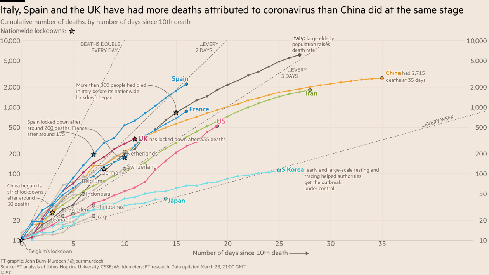
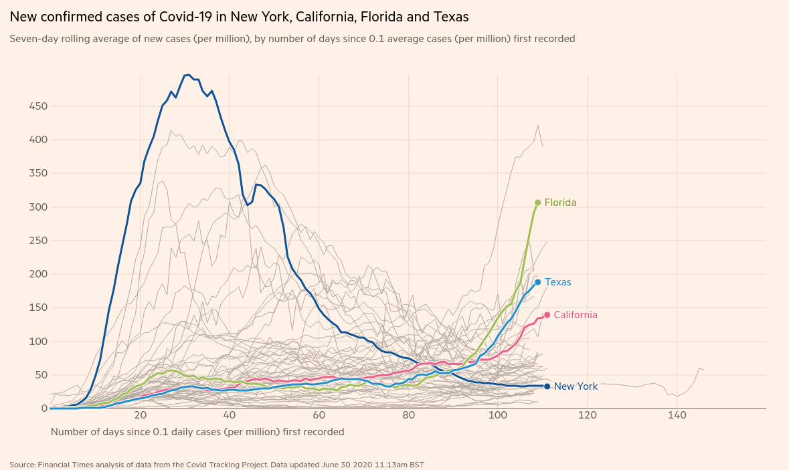

---
# UNL thesis fields
title: "HUMAN PERCEPTION OF EXPONENTIALLY INCREASING DATA DISPLAYED ON A LOG SCALE"
author: "Emily Anna Robinson"
month: "August"
year: "2022"
location: "Lincoln, Nebraska"
major: "Statistics"
adviser: "Susan VanderPlas and Reka Howard"
adviserAbstract: 
abstract: |
  Log scales are often used to display data over several orders of magnitude within one graph. During the COVID-19 pandemic, we have seen both the benefits and the pitfalls of using log scales to display case counts. Three graphical experimental tasks were conducted to evaluate the impact our choice of scale has on human perception of exponentially increasing trends. The first experiment evaluates whether our ability to perceptually notice differences in exponentially increasing trends is impacted by the choice of scale. We conducted a visual inference experiment in which participants were shown a series of lineup plots (consisting of 19 null panels and 1 target panel) and asked to identify the panel that was most different from the others. Our results indicated that when there was a large difference in curvature between the target plot and null plots, the choice of scale had no impact and participants accurately differentiated between the two curves on both the linear and log scale. However, displaying exponentially increasing data on a log scale improved the accuracy of differentiating between models with slight curvature differences. An exception occurred when identifying a plot with curvature embedded in surrounding plots closely relating to a linear trend, indicating that it is easy to identify a curve in a group of lines but much harder to identify a line in a group of curves. The use of visual inference to identify these guidelines suggests that there are *perceptual* advantages to log scales when differences are subtle. Our other experimental tasks focus on determining whether there are cognitive disadvantages to log scales: do log scales make it harder to make use of graphical information? We conducted a graphical task similar to the New York Times "You Draw It" page to test an individual's ability to use and make predictions for exponentially increasing data. We asked participants to draw a line using their computer mouse through the increasing exponential trend shown on both scales. In addition to differentiation and prediction of exponentially increasing data, we conduct an experimental task to test an individuals' ability to translate a graph of exponentially increasing data into real value quantities and extend their estimations by making comparisons. The results of our experimental tasks allow us to provide guidelines for readers to actively choose which of many possible graphics to draw, according to some set of design choices, to ensure that our charts are effective. *(399 words; 350 word limit)*
acknowledgments: |
  Thank you to all my people!
dedication: |
  Dedicated to...
# End of UNL thesis fields
knit: "bookdown::render_book"
site: bookdown::bookdown_site
output: 
  bookdown::pdf_book:
    pandoc_args: --top-level-division=chapter
    keep_tex: yes
    latex_engine: xelatex
    template: template.tex
  huskydown::thesis_gitbook: 
    style: style.css
#  huskydown::thesis_word: default
#  huskydown::thesis_epub: default
bibliography: bib/thesis.bib
# Download your specific bibliography database file and refer to it in the line above.
csl: bib/apa.csl
# Download your specific csl file and refer to it in the line above.
lot: true
lof: true
#header-includes:
#- \usepackage{tikz}
---

```{r setup, include = F}
options(width = 60)
knitr::opts_chunk$set(
  echo = F, eval = T, messages = F, warnings = F,
  fig.width = 6, fig.height = 4,  fig.align = 'center',
  out.width = "\\linewidth", dpi = 300, 
  tidy = T, tidy.opts=list(width.cutoff=45),
  fig.pos = "tbp",
  out.extra = ""
)
```

```{r include_packages, include = FALSE}
# This chunk ensures that the huskydown package is
# installed and loaded. This huskydown package includes
# the template files for the thesis.
if(!require(devtools))
  install.packages("devtools", 
                   repos = "http://cran.rstudio.com")
if(!require(huskydown))
  devtools::install_github(
    "benmarwick/huskydown"
  )
library(huskydown)
library(readr)
library(tidyverse)
library(scales)
library(knitr)
library(gridExtra)
library(patchwork)
library(cowplot)
library(ggforce)
```

# Literature Review

<!-- Editing text colors: \ear{Emily's editing color.} Emily may also use mostly black text as well. \svp{Susan's editing color.} \rh{Reka's editing color.} -->

<!-- \rh{references should include other than Susan, Di, \& Heike :) Also, more references should be listed for the usefulness of graphics.} -->

<!-- \rh{Also, maybe a small section could be included about bad graphics, and how people can mislead with bad graphics.} -->

## Introduction to Graphics

Advanced technology and computing power have promoted data visualization as a central tool in modern data science. @unwin_why_2020 defines data visualization as the art of drawing graphical charts in order to display data. 
Graphics are useful for data cleaning, exploring data structure, and have been an essential component in communicating information for the last 200 years [@lewandowsky_perception_1989]
During the $\text{18}^{\text{th}}$ and $\text{19}^{\text{th}}$ centuries, governments began using graphics in order to better understand their population and economic interests [@playfair1801statistical; @harms1991august; @walker2013statistical].
In \cref{fig:william-playfair-trade}, @playfair1801statistical visually represents the power and economic status of each European Nation in the early $\text{19}^{\text{th}}$ century. 
Circle size and numeric annotation within the circle indicate the number of square miles in each country with the number of people per square mile indicated above the circle. 
The vertical bar to the left side represents the number of inhabitants (millions), and the line to the right side represents the revenue (million pounds). 
Color in the original figure, not shown, identifies countries as maritime powers or powerful by land only. 
The Statistical atlas of the United States [@walker2013statistical] used charts and graphics to display data compiled from the 1870 US census. 
\cref{fig:statistical-atlas-state-population} displays the population of each state where square size represents the proportion of the states population separated into three regions representing the origin and race of the population.
The rectangle shown to the right represents the proportion of residents born in the state who have become residents of other states.
In the $\text{20}^{\text{th}}$ century, companies began utilizing graphics to understand their mechanics and support business decisions and news sources began displaying graphics of weather forecasts as a means to communicate critical information and aid in decision-making [@chandar2012graph; @yates1985graphs].
@chandar2012graph illustrates how AT\&T used graphics to demonstrate management's ability to optimize utilization of assets by making comparisons between their annual net telephone revenues and their returns on total assets \pcref{fig:ATandT-revenue}.
<!-- \svp{Might want to add a set of pictures showing the different types of graphics from this sentence - playfair's balance of trade, statistical atlas, and something from e.g. early IBM?}.  -->
Today, we encounter data visualizations everywhere; researchers include graphics to communicate their results in scientific publications and mass media present graphics in order to convey news stories to the public through newspapers, TV, and the Web [@gouretski2007much; @NYTimes_presidential_forecast; @natesilver538_2020].
<!-- @natesilver538_2020 tracked the 2020 US presidential election by communicating results of their forecast model to the public through a variety of interactive visualizations including a bar chart, snake chart, and electoral college maps. -->

```{r william-playfair-trade, fig.cap = "William Playfair's balance of trate", out.width="75%"}


# https://repository.tku.ac.jp/dspace/bitstream/11150/6149/1/LAUD_085-03.pdf
```

```{r statistical-atlas-state-population, fig.cap = "Statistical Atlas 1870 state population", out.width="75%"}
knitr::include_graphics("images/statistical-atlas-state-population.jpg")

# https://www.loc.gov/item/05019329/
# PERMISSION: The Library of Congress is providing access to these materials for educational and research purposes and is not aware of any U.S. copyright protection (see Title 17 of the United States Code) or any other restrictions in the Map Collection materials.
```

```{r ATandT-revenue, fig.cap = "AT\\&T utilization of assets", out.width="75%"}
knitr::include_graphics("images/ATandT-revenue.png")
# https://us.sagepub.com/en-us/nam/journal-author-archiving-policies-and-re-use
# PERMISSION: You may use the Final Published PDF (or Original Submission or Accepted Manuscript, if preferred) in the following ways: in your dissertation or thesis, including where the dissertation or thesis will be posted in any electronic Institutional Repository or database
```

<!-- \ear{Not entirely sure how to fit this paragraph into the flow. Is it necessary? I like the explanation that training may be necessary for understanding, but it might not belong here. I like the transition between the previous and the next paragraph now} -->
<!-- In general, the public holds the self perception that numbers are difficult to understand and hold the belief that they did not perform well in mathematics during school [@unwin_why_2020].  -->
<!-- In contrary, there tends to be a positive self perception when it comes to graphics as they are viewed more as illustrations and not as critical parts of an argument. -->
<!-- While tables can be burdensome to readers, graphics can improve the interpretation and representation of the same data [@uri_presentation_1948]. -->
<!-- @shah1999graphs recognizes the usefulness of charts and graphics, but points out there are still difficulties interpreting and explaining quantitative information depicted in graphs. -->
<!-- \svp{I think Shah's argument is that some forms of graphics are too complicated, but that doesn't mean she's arguing that graphics aren't useful.} -->
<!-- Complex graphics tend to be more complicated to understand and require a certain degree and formality of training necessary to evaluate the graphic material [@haemer_presentation_1949]; the general public is untrained in the ability required for the evaluation of graphic material. -->
<!-- The complexity of graphic devices is directly related to the degree and formality of training necessary for understanding [@haemer_presentation_1949].  -->
<!-- \svp{This is 1. a bit hard to understand, and 2. seems to be a slightly different tone than before. Probably not the ideal way to end a paragraph.} -->
<!-- It is important to consider the purpose and motivation behind the generation of the chart as well as the complexity and intended audience you intend to view the chart.  -->
<!-- \svp{This is circling around to a different paragraph -- might be a sign that you need to tighten your argument a bit?} -->
<!-- A general guideline when generating graphics is to keep it familiar in order to not intimidate your audience and to encourage further interaction from the viewers [@unwin_why_2020]. -->

Although statistical graphics have become widely used and valued in science, business, and in many other aspects of life, as creators of graphics, we are too accepting of them as default without asking critical questions about the graphics we create or view [@unwin_why_2020]. 
@vanderplas_testing_2020 poses the general question we must ask ourselves, “how effective is this graph at communicating useful information?”
<!-- \rh{what do you/they mean by effective? you use "effective" later too so it is imortant to define or provide some examples/counter examples.} -->
An effective graphic accurately shows the data through the appropriate chart selection, axes and scales, and aesthetic design choices in order to successfully communicate the intended result. 
[Section 1.2](#misleading-graphics) illustrates how graphics can be misleading and ineffective at communicating the intended result by inaccurately displaying the data.

Higher quality of technology has influenced the creation, replication, and complexity of graphics as there are an infinitely many number of graphical displays and design choices that can be implemented at faster speeds with more flexibility. 
The creator of a graphic makes decisions about the variables displayed, the type of graphic, the size of the graphic and the aspect ratio, the colors and symbols used, the scales and limits, and the ordering of categorical variables. 
In response to the increasing number of design choices, consistent themes and higher standards are being placed on graphics. 
Selecting from an extensive list of styles and choices of graphics in order to effectively communicate insights into the data is a challenging task. 
A consistent concern is the lack of theory of graphics available to build on; better theory should result in better graphics. 
Creators of graphics need an established set of concepts and terminology to build their graphics from so they can actively choose which of many possible graphics to draw in order to ensure their charts are effective at communicating the intended result. 

Many efforts have been made to provide guidelines for graphical designs including Wilkinson's Grammar of Graphics [@wilkinson2012grammar].
The grammar of graphics serves as the fundamental framework for data visualization with the notion that graphics are built from the ground up by providing a way of specifying exactly how to create a particular graph from a given data set.
Visual representations are constructed through the use of “tidy data” which is characterized as a data set in which each variable is in its own column, each observation is in its own row, and each value is in its own cell [@wickham2016r].
Graphics are viewed as a mapping from variables in a data set (or statistics computed from the data) to visual attributes such as the axes, colors, shapes, or facets on the canvas in which the chart is displayed.
\cref{fig:graphic-flowchart} illustrates the process of creating a graphic from a data set through the use of variable mapping, data transformations, coordinate systems, and aesthetic features [@vanderplas_testing_2020] 
Software, such as Hadley Wickham's ggplot2 [@wickham2011ggplot2], aims to implement the framework of creating graphics as recommended in the grammar of graphics. 

```{r graphic-flowchart, fig.cap = "Graphic flowchart", out.width="50%"}
knitr::include_graphics("images/graphic-flowchart.png")
```

Despite past attempts to improve the use of graphics in science, graphics displayed in academic research are still falling short of the standards. @gordon_statistician_2015 evaluated 97 graphs for overall quality, based on five principles of graphical excellence including: (1) show the data clearly (2) use simplicity in design (3) use good alignment on a common scale for quantities to be compared (4) keep the visual encoding transparent (5) use graphical forms consistent with principles 1 and 4.
The authors randomly sampled 97 graphs published in A\* (top 5%) journals with work in statistics and applied science disciplines.
There were 50 graphs sampled from the most recently available issues of A\* journals in applied sciences such as environmental sciences, agricultural and veterinary sciences, medical and health sciences, education, economics, and psychology.
The additional 47 graphs were randomly sampled from A\* statistics journals.
Each graph was scored based on 60 features related to the five principles, such as proper axes labels.
Both authors assigned an overall quality rating (poor, adequate, good, or exemplary) to each of the graphs sampled; discrepancies in ratings were settled with discussion.
The authors rated 39% of the 97 graphs sampled as poor, indicating there is still an astonishing lack in the quality of graphics. 
<!-- \rh{what type of graphs? how did they evaluate them?} -->
More startling is the fact that the source of the graphic from an applied science or a statistics graphic had no effect on the quality of the graphic. 
In order to achieve a higher standard of the graphics being presented, future work must be done to implement the academic research being conducted in graphics into practice.
<!-- \rh{Last sentence - I am not sure what you really want to say here.} -->
<!-- Better definitions of variables, units of measurements, scales, and other graphical elements is necessary in order to improve the overall quality of graphics.  -->
<!-- Changes in software defaults such as the originally set number of bins in a bar chart can help support the improvement of graphs in both statistics and the applied science.  -->

## Misleading Graphics {#misleading-graphics}

## Perception and Psychophysics
<!-- \rh{Can you provide other references about the "perceptual process"?} -->

In order to develop guiding principles for generating graphics effective in communication, we must first understand the basic mechanics of the human perceptual system and the biases we are vulnerable to [@goldstein_sensation_2017]. 
The perceptual process is a sequence of steps used to describe a how a stimulus in the environment leads to our perception of the stimulus and action in response to the stimulus \pcref{fig:perceptual-process}. 
This process is broken down into sensation [@carlson2010psychology] - involving simple processes that occur right at the beginning of a sensory system - and perception [@myers_dewall_2021] - involving higher-order mechanisms and identified with more complex processes. 

The perceptual process begins when there is a stimulus in the environment and light is reflected and focused back into the viewer's eyes. 
Within the eye, the light reflected is transformed and focused by the eye's optical system and an image is formed on the receptors of the viewer's retina. 
It is important to note that everything a person perceives is based not on direct contact with stimuli but on representations of stimuli that are formed on the receptors and the resulting activity in the person's nervous system.
Once light is reflected and focused, our visual receptors respond to the light and transform the light energy into electrical energy through a process called transduction. 
Signals from the receptors are then transmitted through the retina, to the brain, and then within the brain where perception (what do you see?) and recognition (what is it called?) occur.
After recognition, viewers take some sort of motor action; for example, move closer to the object.
The perceptual process is not direct and instead takes on more of a cyclic nature where a person may go through many iterations of stimuli, perception, recognition, and action before the final image is identified and understood [@peterson1994object]. 

```{r perceptual-process, fig.cap = "Perceptual process", out.width="75%"}
knitr::include_graphics("images/perceptual-process-goldsein-pg5.png")
```

When perception occurs, we first experience the **preattentive stage** in which we observe color, shape, size, and other basic information about the stimuli being perceived. Preattentive perception effects are automatically processed within the first 500 milliseconds of viewing and do not depend on sustained cognitive attention [@vanderplas_testing_2020]. 
Following the preattentive stage, **direct attention** is required for additional processing to allow us to draw connections between components that assist in our interpretation of the stimuli. 
When viewing a chart or graph, most insights we gain are due to the cognitive processes that occur after attention is focused on specific aspects of the graph.
<!-- The knowledge a viewer brings to the situation influences their cognitive evaluation of the stimuli. [@denes1993speech] -->
<!-- \svp{Citation? You should probably also provide a bit more context for this piece of the paragraph instead of ending with dropping this one fact...} \rh{Agreed.} -->

The relationship between physiology and perception can provide us information about how graphics may be understood and interpreted.
<!-- \rh{How?} -->
Through experimentation, the physiological response (automatic reaction) is related to the behavioral response (perception, recognition, and action). 
@furmanski2000oblique tested behavioral responses with functional magnetic resonance imaging (fMRI) techniques to show that the the human visual system is more sensitive to horizontal and vertical stimuli than to stimuli at other orientations.
According to a cognitive analysis, graph interpretation involves (a) relatively simple pattern perception and association processes in which viewers can associate graphic patterns to quantitative referents and (b) more complex and error-prone inferential processes in which viewers must mentally transform data [@shah1999graphs].
@shah1995conceptual establish the process in which viewers interact with charts by first perceptually observing the visual features and later translating to cognitive processing of the information depicted by those features.
A viewer must first encode the visual array by identifying meaningful visual features (e.g. a straight light slanting downward). 
Next, the viewer must classify the quantitative measures and relationships in which those visual features illustrate (e.g. a decreasing linear relationship between x and y). 
The last step involves translating the quantitative measures and relationships to the variables defined in the data set (e.g. a population decreasing over years). 
Pyschophysics, the branch of psychology that deals with the relationships between physical stimuli (e.g. light) and mental phenomena, aims to provide explanations of the relationship between physiology and perception and point out human perceptual biases. 
By examining both behavior and physiology together, we are able to understand the mechanisms responsible for perception.

## Graphical Experiments

One way in which we determine the relationship between behavior and physiology is through the use of graphical tests [@cleveland_graphical_1984; @spence_visual_1990; @lewandowsky_perception_1989; @vanderplas2015spatial].
<!-- \rh{can you provide references? Especially for the examples?} -->
These tests may take many forms: identifying differences in graphs, reading information off of a chart accurately, using data to make correct real-world decisions, or predicting the next few observations.
All of these types of tests require different levels of use and manipulation of the information presented in the chart.

The initial push to develop classification and recommendation systems for charts was grounded on heuristics rather than on experimentation [@kruskal1975visions; @macdonald1977numbers].
Request were made for the validation of the perception and utility of statistical charts through graphical experiments.
Initial experiments struggled with methodological issues [@eells1926relative; @croxton1927bar; @croxton1932graphic] with most early experimentation stemming from psychophysics research on the perception of size and shape [@teghtsoonian1965judgment]. 
<!-- \rh{"struggled with methodological issues" - examples?} -->
@eells1926relative instructed students to think of each circle as representing 100\% and write their best estimate of the percentage of the whole in each sector \pcref{fig:eells-compoment-parts}.
Participants were told not to hurry, but to work steadily in order to determine efficiency of judgment. 
Students were then asked to analyze their mental processes used to make their estimates and indicate the method that best matches: by areas of sectors, by central angles, by arcs on the circumference, by subtending chords.
This process was repeated three days later by presenting students the same data represented in bar diagrams. 
Results of the study led the authors to argue for the use of circle diagrams to show component parts based on both accuracy and speed.
In response, @croxton1927bar evaluated the accuracy of judgment of two types of charts (bars and circles) in efforts to reach a consistent conclusion. 
During class, students were individually presented pairs of diagrams (without scales) on cards and asked to estimate the percentages displayed in the diagram.
It was found that the bar was preferable to the circle when shown percentages that deviate from quarters, but that the circle is strongly preferred when shown percentages separating the diagrams into 25\% or 50\%. 

```{r eells-compoment-parts, fig.cap = "Eells (1926) component parts diagrams", out.width="75%"}
knitr::include_graphics("images/eells-component-parts.png")
```

While a typical psychophysics experiment focuses on whether an effect is detectable and whether the magnitude of the effect can be accurately estimated, these early experiments instead depended on speed and accuracy for plot evaluation [@spence_visual_1990; @teghtsoonian1965judgment; @lewandowsky_perception_1989]. 
<!-- \rh{Examples?} -->
In @spence_visual_1990, stimuli (tables, lines - horizontal and vertical, bars, boxes, cylinders, pie charts, and disk charts) were presented to participants on a monitor screen in a computer lab. 
Participants were asked to use their cursor to position the marker to indicate the proportion to the apparent sizes of the elements \pcref{fig:spence-1990-proportion}.
Results found that the table elements (numbers), pie elements, and bar elements led to the most accurate proportion estimates; boxes and disk elements resulted in the least accurate estimates.
Measuring the speed at which participants made their judgments, it was found that two- and three- dimentional stimuli (e.g. pie or box) assisted in faster judgment than zero- or one- dimensional stimuli (e.g. lines).

```{r spence-1990-proportion, fig.cap = "Spence (1990) task display", out.width="75%"}
knitr::include_graphics("images/spence-1990-proportion.png")
```

Cognitive psychologists and statisticians made progress by conducting experiments to identify perceptual errors associated with different styles of graphics and charts [@cleveland_graphical_1984; @cleveland_graphical_1985; @shah1999graphs]. 
<!-- \rh{Examples?} -->
@cleveland_graphical_1984 provide a basis for perceptual judgment, still utilized today, by examining six basic aesthetic design choices: position along a common scale, position along nonaligned scales, length, angle, slope, and area.
@shah1999graphs established the notion that redesigning graphs can result in the improvement of the viewer's interpretation.
For example, the use of gestalt principles [@goldstein_sensation_2017] such as proximity, similarity, and good continuation can help minimize the inferential processes and maximize the pattern association processes required to interpret relevant information.

These later experiments followed similar methodology as early studies by asking participants to read information directly from the charts and provide a quantitative estimate or answer a predefined question; as with the early studies, accuracy and response time were evaluated [@peterson1954accurately; @broersma1985graphical; @dunn1988framed; @tan1994human; @amer2005bias]. 
<!-- \svp{provide some examples of quantitative estimation questions -- this will better support Ch4} -->
@spence_visual_1990 presents four example questions for comparing the sizes of individual graphical elements: (1) How much greater was the rainfall in September than May? (2) Is the price of oil in constant dollars increasing or decreasing from year to year? (3) Do more people subscribe to Time than Newsweek? and (4) Did the ABC Corporation pay the largest dividends last year, or did XYZ?
@amer2005bias demonstrates that visual illusion may bias decision making and graph comprehension, even if the graphs are constructed according to best practice.
Participants were presented a cost volume profit graph \pcref{fig:amer-poggendorff-illusion} with two crossing lines (revenue and cost) and asked to view three values: (1) the amount of total revenues on the ordinate corresponding to the endpoint of the total-revenue line plotted on the graph (2) the amount of total costs on the ordinate corresponding to the endpoint of the total-cost line plotted on the graph and (3) the amount of costs/revenues on the ordinate at the break even point—the point where the two lines cross.
Results indicate that decision makers may consistentily underestimate or overestimate the values displayed on line graphs due to what is called the "Poggendorff illusion."
In @dunn1988framed, participants were shown two maps, an unclassed choropleth map and a framed rectrangle chart, indicating the murder rate of each US state \pcref{fig:framed-murder-rate-map}.
The goal of the study was to assess the relative accuracy with which quantitative information is extracted from both types of charts.
Participants were strictly informed that the experiment was designed to test the ability of individuals to "read" or "decode" statistical maps and asked to write down their estimate of the murder rate as accurately as possible beside the 24 named states. 
Results indicate that subjects found it easier to extract quantitative information from the framed rectangle chart than from the unclassed choropleth map and that the between individual variability in the choropleth map was related to the area of the state. 

```{r amer-poggendorff-illusion, fig.cap = "Amer (2005) cost volume profit graph", out.width="90%"}
knitr::include_graphics("images/amer-poggendorff-illusion.png")
```

```{r framed-murder-rate-map, fig.cap = "Dunn (1988) maps", out.width="90%"}
knitr::include_graphics("images/framed-murder-rate-map.png")
```

During the $\text{21}^{\text{st}}$ century, there have been advancements in the methodology used to investigate the effectiveness of statistical charts [@majumder_validation_2013]. 
@buja_statistical_2009 introduced the lineup protocol in which data plots are depicted and interpreted as statistics. 
Supported by the grammar of graphics, a data plot can be characterized as a statistic defined as, "a functional mapping of a variable or set of variables" [@vanderplas_testing_2020].
This allows the data plot to be tested similar to other statistics, by comparing the actual data plot to a set of plots with the absence of any data structure we can test the likelihood of any perceived structure being significant.
The construction of data plots as statistics allow for easy experimentation, granting researchers the ability to compare the effectiveness of and understand the perception of different types of charts.
While the lineup protocol differs from methodology used in earlier studies, the focus is still on initial perception and graph comprehension with a relatively small amount of work conducted to understand the effect of design choices on higher cognitive processes such as learning or analysis [@green2009personal]. 
<!-- \svp{This is in part because lineups only ask about perceived differences and do not test the actual ability to read information off of a graph accurately or the conclusions drawn from the graph. They are a lower-level tool, which makes them powerful because they can eliminate ambiguous questions, but also limits their real-world application in the absence of complex experimental designs (feature hierarchy, etc.).} -->
Lineups serve as a powerful tool for testing *perceived* differences by eliminated ambiguous questions. 
However, the lineup protocol is constrained by the inability to test higher order cognitive skills such as accurately reading information off of a graph or drawing conclusions from the graph; limiting their ability to be used for testing real-world applications.

<!-- \ear{I'm not even sure this belongs here at the moment. I think I need to add a testing graphics section somehow. not sure if this is turning into it or not.} -->
<!-- Most recent graphics experiments have utilized tools such as Amazon Turk, Prolific, Reddit, and other crowd sourcing websites to evaluate the psychophysics and patterns associated with design choices [@vanderplas_clusters_2017] -->
<!-- \svp{You need to cite more than one experiment if you want to make this claim, and they can't all be lineup experiments. Really, you'd need a very long list of experiments and would ideally be able to show which used online vs. in-person testing...}.  -->
<!-- Such studies tend to be limited by the questions asked while other methods such as 'Thinking Aloud' and 'Eye Tracking' allow researchers to evaluate the overall perception of the graphic [@vanderplas_testing_2020]. -->

<!-- + informal and formal graphical exploration. informal: changes are made to the graph and the iterative versions are compared to determine what information is easily acceptable formal: an experiment is designed and participants are tested in a controlled manner. @vanderplas_testing_2020 -->
<!-- + There are limits to what one can test using direct estimation: it is generally preferable to test only very straightforward assessments of the content of a chart or graph, to fit within a simple experimental paradigm. -->
<!-- Some studies of graphs utilize psychophysics methodology to assess data visualizations. -->
<!-- + Psychophysics and direct observation studies are limited by the questions that are asked; @vanderplas_testing_2020 -->
<!-- + Other methods: Thinking aloud, Eye Tracking, etc. @vanderplas_testing_2020 -->

## Logarithmic Scales and Mapping

We have recently experienced the impact graphics and charts have on a large scale through the SARSNCOV-2 pandemic (COVID-19). 
<!-- \rh{please provide a LOT of examples here for sentence 1 (and actual examples describing why they are good/bad)} -->
At the beginning of 2020, we saw an influx of dashboards being developed to display case counts, transmission rates, and outbreak regions [@rost_2020]; mass media routinely showed charts to share information with the public about the progression of the pandemic [@romano_scale_2020]. 
@fagen-ulmschneider_2020 began the 91-DOVIC project to explore the global growth of COVID-19 through interactive graphics updated daily. 
The interactive graphics allowed viewers to explore the current status of COVID-19 by selecting their desired regions, axes, axis scale, and measure of interest (e.g. case count, death count, vaccine count); \cref{fig:91dovic-cases-july2021} shows the new confirmed COVID-19 cases per day, normalized by population, as of July 2021. 
Other graphics displayed COVID-19 data as maps \pcref{fig:covid19-summer2020-risk-map} with color indicating the severity and risk in each US county [@global_epidemics_2021].
People began seeking out graphical displays of COVID-19 data as a direct result of these pieces of work [@rost_2020]; providing increased and ongoing exposure to these graphics over time. 
\cref{fig:covid19-datawrapper-views-july2020} illustrates the increased views Datawrapper, a user-friendly web tool used to create basic interactive charts, had during the COVID-19 pandemic [@rost_2020].
<!-- \svp{It would be appropriate to add some of those graphics in here, if you wanted to...} -->
Many of these graphics helped guide decision makers to implement policies such as shut-downs or mandated mask wearing, as well as facilitated communication with the public to increase compliance [@bavel_using_2020]. 
As graphics began to play an important role in the communication of the pandemic, creators of graphics were faced with design choices in order to ensure their charts were effective. 

```{r 91dovic-cases-july2021, fig.cap = "91-DOVIC New Daily Case Counts as of July 2021", out.width="90%"}
knitr::include_graphics("images/91dovic-cases-july2021.png")
```

```{r covid19-summer2020-risk-map, fig.cap = "COVID-19 Risk Level Map as of July 2020", out.width="90%"}
knitr::include_graphics("images/covid19-summer2020-risk-map.png")
```

```{r covid19-datawrapper-views-july2020, fig.cap = "Datawrapper daily chart views during COVID-19", out.width="90%"}
knitr::include_graphics("images/covid19-datawrapper-views-july2020.png")
```

When faced with data which spans several orders of magnitude, we must decide whether to show the data on its original
scale (compressing the smaller magnitudes into relatively little area) or to transform the scale and alter the contextual appearance of the data.
The usefulness of the log scale in science is illustrated in \cref{fig:log-scale-comic} [@munroe_2005].
\rh{Maybe more explanation is needed for this. And it is not really connected to the text.}
One common solution is to use a log scale transformation to display data over several orders of magnitude within one graph.
\rh{I think more details are needed for the use of log scale. Providing examples would be useful}
Logarithms turn multiplicative relationships additive \svp{phrasing?}, showing elasticities and other proportional changes, and also linearize power laws [@menge_logarithmic_2018].
They also have practical purposes, easing the computation of small numbers such as likelihoods and transforming data to fit statistical assumptions.
When presenting log scaled data, it is possible to use either un-transformed scale labels (for example, values of 1, 10 and 100 are equally spaced along the axis) or log transformed scale labels (for example, 0, 1, and 2, showing the corresponding powers of 10).
\svp{In the grammar of graphics/ggplot2 formulation, this is the difference between a scale and a transformation... it might be worth seeing if that is a hadley-ism or if that is a wider convention.}

```{r log-scale-comic, include = T, fig.cap = "Log scale comic", out.width="70%"}
knitr::include_graphics("images/log-scale-comic.png")
```

We have recently experienced the benefits and pitfalls of using log scales as COVID-19 dashboards displayed
case count data on both the log and linear scale [@fagen-ulmschneider_2020; @burnmurdoch_2020]. 
<!-- \rh{I think providing examples (specific examples) is necessary. Also when to use log vs linear? Please provide references \& examples!} -->
In spring 2020, during the early stages of the COVID-19 pandemic, there were large magnitude discrepancies in case counts at a given time point between different geographic regions (e.g. states and provinces as well as countries and continents).
During this time, we saw the usefulness of log scale transformations showing case count curves for areas with few cases and areas with many cases within one chart. 
\cref{fig:covid19-FT-deaths-march2020-log} illustrates the usefulness of log scales in comparing deaths attributed to Coronavirus between countries as of March 2020; the diagonal reference lines provide a visual aid useful for interpretation [@burnmurdoch_2020]. 
As the pandemic evolved, and the case counts were no longer spreading exponentially, graphs with linear scales seemed more effective at spotting early increases in case counts that signaled more localized outbreaks. In \cref{fig:covid19-FT-june2020-case-counts-linear} and \cref{fig:covid19-FT-june2020-case-counts-log}, the case counts as of June 30, 2020 are displayed on both the linear and log scale respectively [@burnmurdoch_2020]. 
The effect of the linear scale \pcref{fig:covid19-FT-june2020-case-counts-linear} appears to evoke a stronger reaction from the public than the log scale \pcref{fig:covid19-FT-june2020-case-counts-log} as case counts are clearly rising rapidly during the summer wave. 
This is only one recent example of a situation in which both log and linear scales are useful for showing different aspects of the same data. There are long histories of using log scales to display results in ecology, psychophysics, engineering, and physics [@menge_logarithmic_2018; @heckler_student_2013] 
\svp{elaborate on this a bit - when are they used, and where are they effective? Can you draw more comprehensive conclusions about the use of log scales?}. 

```{r covid19-FT-deaths-march2020-log, fig.cap = "Covid 19 Deaths (log scale) as of March 23, 2020", out.width="90%"}

# https://eagereyes.org/blog/2020/in-praise-of-the-diagonal-reference-line
```

```{r covid19-FT-june2020-case-counts-linear, fig.cap = "Covid 19 Case Counts (linear scale) as of June 30, 2020", out.width="90%"}

```

```{r covid19-FT-june2020-case-counts-log, fig.cap = "Covid 19 Case Counts (log scale) as of June 30, 2020", out.width="90%"}
knitr::include_graphics("images/covid19-FT-case-count-06.30.2020-log.png")
```

\svp{You might start this out by pointing out that while logarithms seem unnatural at first, we learn to count by ones, tens, and hundreds -- that is, in a base10 order of magnitude system. Then you can transition to research showing one, two, 10 and log-number scales.}
Research suggests our perception and mapping of numbers to a number line is logarithmic at first, but transitions
to a linear scale later in development, with formal mathematics education [@siegler_numerical_2017; @siegler_numerical_2017; @varshney_why_2013; @dehaene2008log].
For example, a kindergartner asked to place numbers 1-10 along a number line would place 3 close to the middle, following the logarithmic perspective [@varshney_why_2013]. \svp{Might be worth showing this graphically if you can reproduce pics from the paper...}
With basic training, members of remote cultures with a basic vocabulary and minimal education understood the concept that numbers can be mapped into a spacial space [@dehaene2008log]. \rh{Please explain.}
There was a gradual transition from logarithmic to linear scale as the mapping of whole number magnitude representations transitioned from a compressed (approximately logarithmic) distribution to an approximately linear one. 
These results indicate the universal and cultural-dependent characteristics of the sense of number. 

\svp{Weber's law isn't quite the same thing as the numerical cognition stuff on log scales - it's a different perceptual phenomenon that is definitely related, but distinct in causal mechanism (as far as I know).}
\rh{Is there a reference for the actual "Weber's Law"? Please provide more connection between your text and the "Weber's Law".}
This phenomenon was first discovered by Ernst Weber, an early psychophysics researcher, by determining the relationship between the difference threshold (smallest detectable difference between two sensory stimuli; known as the "Just Noticable Difference") and the magnitude of a stimulus. 
This holds true for a variety of stimuli such as weight, light, and sound as well as for a range of magnitudes; larger numbers require a proportional larger difference in order to remain equally discriminate [@dehaene2008log]. 
Known as **Weber's law**, it was established that we do not notice absolute changes in stimuli, but instead that we notice the relative change [@sun_framework_2012]. 
Numerically, Weber's Law is defined as 
\begin{equation}
\frac{\Delta S}{S} = K
\end{equation}
where $\Delta S$ represents the difference threshold, S represents the initial stimulus intensity, and K is called Weber's contrast which remains constant as the magnitude of S changes. 
Gustav Fechner, a founder of psychophysics, provided further extension to Weber's law by discovering the relationship between the perceived intensity is logarithmic to the stimulus intensity when observed above a minimal threshold of perception [@sun_framework_2012]. 
Formally known as the Weber-Fechner law is derived from Weber's law as
\begin{equation}
P = K\ln \frac{S}{S_0}
\end{equation}
where P represents the perceived stimulus, K represents Weber's contrast, S represents the initial stimulus intensity, and $S_0$ represents the minimal threshold of perception.
    
Assuming there is a direct relationship between perceptual and cognitive processes, it is reasonable to assume numerical representations should also be displayed on a nonlinear, compressed number scale. Therefore, if we perceive logarithmically by default, it is a natural (and presumably low effort) way to display information and should be easy to read and understand/use.
The idea is compression enlarges the coding space, thus increasing the dynamic range of perception and firing neurons within our visual system [@nieder2003coding].
Similar to the training and education required to transition from logarithmic mapping to linear mapping, there is also necessary training required in the assessment of graphical displays associated with logarithmic scales. @haemer_presentation_1949 identify semi-logarithmic charts for temporal series as requiring a certain degree of technical training.
    
## Underestimation of Exponential Growth {#underestimation}

\svp{Start out by showing exponential growth e.g. 3 stages (early, mid, late) to explain why this is a hard problem to solve...}
\svp{This reads like a bulleted list turned into a paragraph, which isn't bad, but it does need some work - turn it into a narrative, explain weaknesses in these studies, etc.}

```{r exponential-stages, fig.cap = "Stages of exponential growth", out.width = "75%"}
data <- tibble(x = seq(0,6,0.001),
               y = exp(x)) %>%
  mutate(group = ifelse(x <= 2, "G1", 
                        ifelse(x <= 4, "G2", "G3")))

data %>%
  ggplot(aes(x = x, y = y, color = group)) +
  geom_line(show.legend = T) +
  theme_bw() +
  theme(aspect.ratio = 1) +
  # facet_zoom(xlim = c(0,2), shrink = F, zoom.size = 3) +
  # facet_zoom(xy = group == 'G1', zoom.size = 1/3) +
  geom_mark_rect(show.legend = T) +
  scale_color_brewer("Stage", palette = "Dark2", labels = c("Early", "Mid", "Late"))
```
\cref{fig:exponential-stages} [CITE](https://twitter.com/MDrelichman/status/1402054093284143104)

```{r exponential-stages-comic, fig.cap = "Log scale comic", out.width="70%"}
knitr::include_graphics("images/exponential-stages-comic.jpg")
```

Early studies explored the estimation and prediction of exponential growth, finding that growth is underestimated when presented both numerically and graphically but that numerical estimation is more accurate than graphical estimation for exponential curves [@wagenaar_misperception_1975]. 
One way to improve estimation of increasing exponential trends is to provide immediate feedback to participants about the accuracy of their current predictions [@mackinnon_feedback_1991]. 
While prior contextual knowledge or experience with exponential growth does not improve estimation, instruction on exponential growth reduces the underestimation: participants adjust their initial starting value but not their perception of growth rate [@wagenaar_misperception_1975; @jones_polynomial_1977].
Our inability to accurately predict exponential growth might also be addressed by log transforming the data, however, this transformation introduces new complexities; most readers are not mathematically sophisticated enough to intuitively understand logarithmic math and translate that back into real-world effects.

In @menge_logarithmic_2018, ecologists were surveyed to determine how often ecologists encounter log scaled data and how well ecologists understand log scaled data when they see it in the literature. 
Participants were presented two relationships displayed on linear-linear scales, log-log scales with untransformed values, or log–log scales with log transformed values. 
The authors propose three types of misconceptions participants encountered when presented data on log-log scales: 'hand-hold fallacy', 'Zeno's zero fallacy', and 'watch out for curves fallacies'. 
These misconceptions are a result of linear extrapolation assuming that a line in log-log space represents a line instead of the power law in linear-linear space. 
The study found that in each of these scenarios, participants were confident in their incorrect responses, indicating incorrect knowledge rather than a lack of knowledge. 

\svp{You might take a whack at illustrating some of these fallacies}
\rh{Menge's example should be visually illustrated.}
The 'hand-hold fallacy' stems from the misconception that steeper slopes in log-log relationships are steeper slopes in linear-linear space. In fact, it is not only the slope that matters, but also the intercept and the location on the horizontal axis since a line in log-log space represents a power law in linear-linear space (i.e. linear extrapolation). 
Emerging from 'Zeno's zero fallacy' is the misconception that positively sloped lines in log-log space can imply a non-zero value of y when x is zero. 
This is never true as positively sloped lines in log-log space actually imply that y = 0 when x = 0. This misconception again is a result of linear extrapolation assuming that a line in log-log space represents a line instead of the power law in linear-linear space. 
The last misconception, 'watch out for curves fallacies' encompasses three faults: (1) lines in log-log space are lines in linear-linear space, (2) lines in log-log space curve upward in linear-linear space, and (3) curves in log-log space have the same curvature in linear-linear space. 
Linear extrapolation is again responsible for the first and third faults while the second fault is a result of error in thinking that log-log lines represent power laws (which are exponential relationships), and all exponential relationships curve upward; this is only true when the log-log slope is greater than 1. 
@menge_logarithmic_2018 found that in each of these scenarios, participants were confident in their incorrect responses, indicating incorrect knowledge rather than a lack of knowledge.

<!-- ## Risk Assessment -->

## Research Objectives
In my research, I conduct three graphical experimental tasks to evaluate the impact our choice of scale (log/linear) has on human perception of exponentially increasing trends. 
The first experiment evaluates whether our ability to perceptually notice differences in exponentially increasing trends is impacted by the choice of scale. I conducted a visual inference experiment in which participants were shown a series of lineup plots and asked to identify the panel that was most different from the others. 
The other experimental tasks focus on determining whether there are cognitive disadvantages to log scales: do log scales make it harder to make use of graphical information? 
I conducted a graphical task similar to the New York Times "You Draw It" page to test an individual's ability to use and make predictions for exponentially increasing data. 
Participants were asked to draw a line using their computer mouse through the increasing exponential trend shown on both scales. 
In addition to differentiation and prediction of exponentially increasing data, an experimental task was conducted to test an individuals' ability to translate a graph of exponentially increasing data into real value quantities and extend their estimations by making comparisons. 
The results of the three experimental tasks provide guidelines for readers to actively choose which of many possible graphics to draw, according to some set of design choices, to ensure that their charts are effective.


\svp{Things that seem to be missing: 1) Cleveland and McGill - hierarchy of accuracy in plot objects. You can think of e.g. exponentials as a series of tangential angles, which might help with explaining underestimation? 2) some literature explaining the different levels of complexity between perception, reading information off of a graph, predicting information, etc. - you should find this if only because it grounds the whole experiment in psychological theory (but you don't have to find it for your prelim)}