---
# UNL thesis fields
title: "HUMAN PERCEPTION OF EXPONENTIALLY INCREASING DATA DISPLAYED ON A LOG SCALE EVALUATED THROUGH EXPERIMENTAL GRAPHICS TASKS"
author: "Emily Anna Robinson"
month: "August"
year: "2022"
location: "Lincoln, Nebraska"
major: "Statistics"
adviser: "Susan VanderPlas and Reka Howard"
adviserAbstract: 
abstract: |
 Log scales are often used to display data over several orders of magnitude within one graph. Three graphical experimental tasks were conducted to evaluate the impact displaying data on the log scale has on human perception of exponentially increasing trends compared to displaying data on the linear scale. The first experiment evaluates whether our ability to perceptually notice differences in exponentially increasing trends is impacted by the choice of scale. Participants were shown a set of plots and asked to identify which plot appeared to differ most from the other plots. Results indicated that when there was a large difference in exponential curves, the choice of scale had no impact and participants accurately differentiated between the two curves on both the linear and log scale. However, displaying exponentially increasing data on a log scale improved the accuracy of differentiating between exponentially increasing curves with slight differences. An exception occurred when identifying an exponential curve from curves closely resembling a linear trend, indicating it is easy to identify a curve in a group of lines but much harder to identify a line in a group of curves. The other experimental tasks focus on determining whether there are cognitive disadvantages to log scales: do log scales make it harder to make use of graphical information? To test an individual's ability to make predictions for exponentially increasing data, participants were asked to draw a line using their computer mouse through an exponentially increasing trend shown on both the linear and log scale. Results showed that when exponential growth rate is large, underestimation of exponential growth occurs when making predictions on a linear scale and there is an improvement in accuracy of predictions made on the log scale. The last experimental task is designed to test an individuals' ability to translate a graph of exponentially increasing data into real value quantities and make comparisons of estimates. The results of the three experimental tasks provide guidelines for readers to actively choose which of many possible graphics to draw in order to ensure their charts are effective at communicating the intended result.
# *(348 words; 350 word limit)*
acknowledgments: |
  Thank you to all my people!
dedication: |
  Dedicated to...
# End of UNL thesis fields
knit: "bookdown::render_book"
site: bookdown::bookdown_site
output: 
  bookdown::pdf_book:
    pandoc_args: --top-level-division=chapter
    keep_tex: yes
    latex_engine: xelatex
    template: template.tex
  huskydown::thesis_gitbook: 
    style: style.css
#  huskydown::thesis_word: default
#  huskydown::thesis_epub: default
bibliography: bib/thesis.bib
# Download your specific bibliography database file and refer to it in the line above.
csl: bib/apa.csl
# Download your specific csl file and refer to it in the line above.
lot: true
lof: true
#header-includes:
#- \usepackage{tikz}
---

```{r setup, include = F}
options(width = 60)
knitr::opts_chunk$set(
  echo = F, 
  eval = T, 
  messages = F, 
  warnings = F,
  fig.width = 6, 
  fig.height = 4,  
  fig.align = 'center',
  out.width = "\\linewidth", 
  dpi = 300, 
  tidy = T, tidy.opts=list(width.cutoff=45),
  fig.pos = "tbp",
  out.extra = "",
  cache = F,
  dev = "png"
)
```

```{r include_packages, include = FALSE}
# This chunk ensures that the huskydown package is
# installed and loaded. This huskydown package includes
# the template files for the thesis.
if(!require(devtools))
  install.packages("devtools", 
                   repos = "http://cran.rstudio.com")
if(!require(huskydown))
  devtools::install_github(
    "benmarwick/huskydown"
  )
library(huskydown)
library(readr)
library(tidyverse)
library(scales)
library(knitr)
library(gridExtra)
library(patchwork)
library(cowplot)
library(ggforce)
library(scales)
library(formatR)
```

# Literature Review

<!-- + Editing text colors: \ear{Emily's editing color.} Emily may also use mostly black text as well. \svp{Susan's editing color.} \rh{Reka's editing color.} -->

<!-- + \svp{General comment - it's a bit odd to write this in first person, but I'm not sure it's necessarily wrong. Just different.} -->
<!-- + \ear{Need to check references. In text should only show last name.} -->

## Introduction to Statistical Graphics

Advanced technology and computing power have promoted data visualization as a central tool in modern data science. @unwin_why_2020 defines data visualization as the art of drawing graphical charts in order to display data. 
Graphics are useful for data cleaning, exploring data structure, and have been an essential component in communicating information for the last 200 years [@lewandowsky_perception_1989]. 
This chapter aims to provide an overview of statistical graphics as they relate to effective communication in science and the media.
We examine how our interpretation of the data is affected by our interaction with graphics through cognitive tasks of differing levels of complexity, and then introduce the motivation and background for the rest of the work.

### History of Graphics

```{r william-playfair-trade, fig.cap = "William Playfair's balance of trade", out.width="85%"}
knitr::include_graphics("images/william-playfair-balance-trade.png")

# https://repository.tku.ac.jp/dspace/bitstream/11150/6149/1/LAUD_085-03.pdf
```

During the $\text{18}^{\text{th}}$ and $\text{19}^{\text{th}}$ centuries, governments began using graphics in order to better understand their population and economic interests [@playfair1801statistical; @harms1991august; @walker2013statistical].
In \cref{fig:william-playfair-trade}, @playfair1801statistical visually represents the power and economic status of each European Nation in the early $\text{19}^{\text{th}}$ century. 
Circle size and numeric annotation within the circle indicate the number of square miles in each country with the number of people per square mile indicated above the circle. 
The vertical bar to the left side represents the number of inhabitants (millions), and the line to the right side represents the revenue (million pounds). 
Color in the original figure, not shown, identifies countries as maritime powers or powerful by land only. 
The Statistical atlas of the United States [@walker2013statistical] used charts and graphics to display data compiled from the 1870 US census. 
\cref{fig:statistical-atlas-state-population} displays the population of each state where square size represents the proportion of the states population separated into three regions representing the origin and race of the population.
The rectangle shown to the right represents the proportion of residents born in the state who have become residents of other states.
In the $\text{20}^{\text{th}}$ century, companies began utilizing graphics to understand their mechanics and support business decisions and news sources began displaying graphics of weather forecasts as a means to communicate critical information and aid in decision-making [@chandar2012graph; @yates1985graphs].
@chandar2012graph illustrates how AT\&T used graphics to demonstrate management's ability to optimize utilization of assets by making comparisons between their annual net telephone revenues and their returns on total assets \pcref{fig:ATandT-revenue}.
Today, we encounter data visualizations everywhere; researchers include graphics to communicate their results in scientific publications and mass media present graphics in order to convey news stories to the public through newspapers, TV, and the Web [@gouretski2007much; @NYTimes_presidential_forecast; @natesilver538_2020].

```{r statistical-atlas-state-population, fig.cap = "Statistical Atlas 1870 state population", out.width="85%"}
knitr::include_graphics("images/statistical-atlas-state-population.jpg")

# https://www.loc.gov/item/05019329/
# PERMISSION: The Library of Congress is providing access to these materials for educational and research purposes and is not aware of any U.S. copyright protection (see Title 17 of the United States Code) or any other restrictions in the Map Collection materials.
```

```{r ATandT-revenue, fig.cap = "AT\\&T utilization of assets", out.width="85%"}
knitr::include_graphics("images/ATandT-revenue.png")
# https://us.sagepub.com/en-us/nam/journal-author-archiving-policies-and-re-use
# PERMISSION: You may use the Final Published PDF (or Original Submission or Accepted Manuscript, if preferred) in the following ways: in your dissertation or thesis, including where the dissertation or thesis will be posted in any electronic Institutional Repository or database
```

Although statistical graphics have become widely used and valued in science, business, and in many other aspects of life, as creators of graphics, we are too accepting of them as default without asking critical questions about the graphics we create or view [@unwin_why_2020]. 
@vanderplas_testing_2020 poses the general question we must ask ourselves, “how effective is this graph at communicating useful information?”
An effective graphic accurately shows the data through the appropriate chart selection, axes and scales, and aesthetic design choices in order to successfully communicate the intended result. 
[Section 1.2](#misleading-graphics) illustrates how graphics can be misleading and ineffective at communicating the intended result by inaccurately displaying the data.

### Misleading Graphics {#misleading-graphics}

Despite past attempts to improve the use of graphics in science, graphics displayed in academic research are still falling short of the standards. @gordon_statistician_2015 evaluated 97 graphs for overall quality, based on five principles of graphical excellence including: (1) show the data clearly (2) use simplicity in design (3) use good alignment on a common scale for quantities to be compared (4) keep the visual encoding transparent (5) use graphical forms consistent with principles 1 and 4.
The authors randomly sampled 97 graphs published in A\* (top 5%) journals with work in statistics and applied science disciplines.
There were 50 graphs sampled from the most recently available issues of A\* journals in applied sciences such as environmental sciences, agricultural and veterinary sciences, medical and health sciences, education, economics, and psychology.
The additional 47 graphs were randomly sampled from A\* statistics journals.
Each graph was scored based on 60 features related to the five principles, such as proper axes labels.
Both authors assigned an overall quality rating (poor, adequate, good, or exemplary) to each of the graphs sampled; discussion between authors settled any discrepancies in ratings.
The authors rated 39% of the 97 graphs sampled as poor, indicating there is still an astonishing lack in the quality of graphics. 
More startling is the fact that the source of the graphic from an applied science or a graphic from statistics had no effect on the quality of the graphic. 

News media is a major culprit in displaying data in ways that could be misleading to the public. For example, in 2005, there was a seven year long court case in which the decision was made to remove Terri Schiavo from life-support [@cranford2005facts].
News organizations such as CNN [@maloy_2005] used graphs from polls to show the proportion of Americans from different political parties who agreed with the decision to remove the feeding tube \pcref{fig:percent-who-agree-with-count}.
Upon initial inspection of \cref{fig:percent-who-agree-with-count}, it appears that about three times as many democrats supported the decision as republicans or independents.
However, the scale on the vertical axis begins at 50\%, misleading the viewer to believe there was a much larger discrepancy in support between political parties than there actually was.
While this graph does display the truth, it is misleading due to the choice of baseline on the $y$-axis.
@baumer2021texts discuss a more recent example of a misleading graphic in the news shown in May 2020 when Georgia published a graphical display of COVID-19 cases \pcref{fig:covid-19-reporting}. 
This graphic was highly misleading in communicating the state of the pandemic due to the ordering along the $x$-axis.
Notice the case count for April $17^{th}$ appears to the right of April $19^{th}$, and that the order of the counties has been selected so that the case counts are monotonically decreasing for each day of reporting.
The appearance of this graphic leads viewers to believe COVID cases are decreasing.
Shortly after the graphic was released, the governor's office made a statement that in future charts, chronological order would be used to display time due to public demand. While both examples were misleading due to axis labels and scales, other issues such as incomplete data and partitions that do not add to a whole can lead to misrepresentation of information.

```{r percent-who-agree-with-count, fig.cap = "Percent who agree with count", out.width="85%"}
knitr::include_graphics("images/percent-who-agree-with-count.jpg")
# https://www.statisticshowto.com/probability-and-statistics/descriptive-statistics/misleading-graphs/#:~:text=Misleading%20graphs%20are%20sometimes%20deliberately,doesn't%20start%20at%20zero.
```

```{r covid-19-reporting, fig.cap = "COVID-19 reporting", out.width="85%"}
knitr::include_graphics("images/covid-ga-recreation.jpg")
# https://mdsr-book.github.io/mdsr2e/ch-ethics.html#truthful-falsehoods
```

### Graphical Guidelines

Higher quality of technology has influenced the creation, replication, and complexity of graphics as there are an infinitely many number of graphical displays and design choices that can be implemented at faster speeds with more flexibility. 
The creator of a graphic makes decisions about the variables displayed, the type of graphic, the size of the graphic and the aspect ratio, the colors and symbols used, the scales and limits, and the ordering of categorical variables. 
In response to the increasing number of design choices, consistent themes and higher standards are being placed on graphics. 
Selecting from an extensive list of styles and choices of graphics in order to effectively communicate insights into the data is a challenging task. 
A consistent concern is the lack of theory of graphics available to build on; better theory should result in better graphics. 
Creators of graphics need an established set of concepts and terminology to build their graphics from so they can actively choose which of many possible graphics to draw in order to ensure their charts are effective at communicating the intended result. 

Many efforts have been made to provide guidelines for graphical designs including Wilkinson's Grammar of Graphics [@wilkinson2012grammar].
The grammar of graphics serves as the fundamental framework for data visualization with the notion that graphics are built from the ground up by specifying exactly how to create a particular graph from a given data set.
Visual representations are constructed through the use of “tidy data” which is characterized as a data set in which each variable is in its own column, each observation is in its own row, and each value is in its own cell [@wickham2016r].
Graphics are viewed as a mapping from variables in a data set (or statistics computed from the data) to visual attributes such as the axes, colors, shapes, or facets on the canvas in which the chart is displayed.
\cref{fig:graphic-flowchart} illustrates the process of creating a graphic from a data set through the use of variable mapping, data transformations, coordinate systems, and aesthetic features [@vanderplas_testing_2020] 
Software, such as `ggplot2` [@ggplot2], aims to implement the framework of creating charts and graphics as the grammar of graphics recommends. 

```{r graphic-flowchart, fig.cap = "Graphic flowchart", out.width="50%"}
knitr::include_graphics("images/graphic-flowchart.png")
```

In efforts to achieve a higher standard of the graphics being presented, future work must be done to implement the academic research being conducted in graphics into practice.
For example, better definitions of variables, units of measurements, scales, and other graphical elements is necessary in order to improve the overall quality of graphics.
Changes in software defaults such as the originally set number of bins in a bar chart can help support the improvement of graphs in both statistics and the applied science.

## Perception

In order to develop guiding principles for generating graphics effective in communication, we must first understand the basic mechanics of the human perceptual system and the biases we are vulnerable to [@goldstein_sensation_2017]. This section aims to provide an overview of the perceptual process as it relates to inspection of graphical displays, and then address specific perceptual biases.

### Perceptual Process

The perceptual process is a sequence of steps used to describe a how a stimulus in the environment leads to our perception of the stimulus and action in response to the stimulus \pcref{fig:perceptual-process}. 
This process is separated into sensation [@carlson2010psychology] - involving simple processes that occur right at the beginning of a sensory system - and perception [@myers_dewall_2021] - involving higher-order mechanisms and identified with more complex processes. 

The perceptual process begins when there is a stimulus in the environment and light is reflected and focused back into the viewer's eyes. 
Within the eye, the light reflected is transformed and focused by the eye's optical system and an image is formed on the receptors of the viewer's retina. 
It is important to note that everything a person perceives is based not on direct contact with stimuli but on representations of stimuli that are formed on the receptors and the resulting activity in the person's nervous system.
Once light is reflected and focused, our visual receptors respond to the light and transform the light energy into electrical energy through a process called transduction. 
Signals from the receptors are then transmitted through the retina, to the brain, and then within the brain where perception (what do you see?) and recognition (what is it called?) occur.
After recognition, viewers take some sort of motor action; for example, the viewer might move closer to the object.
The perceptual process is not direct and instead takes on more of a cyclic nature where a person may go through many iterations of stimuli, perception, recognition, and action before the final image is identified and understood [@peterson1994object]. 

```{r perceptual-process, fig.cap = "Perceptual process", out.width="75%"}
knitr::include_graphics("images/perceptual-process-goldsein-pg5.png")
```

When perception occurs, we first experience the *preattentive stage* in which we observe color, shape, size, and other basic information about the stimuli being perceived. Preattentive perception effects are automatically processed within the first 500 milliseconds of viewing and do not depend on sustained cognitive attention [@vanderplas_testing_2020]. 
Following the preattentive stage, *direct attention* is required for additional processing to allow us to draw connections between components that assist in our interpretation of the stimuli. 
When viewing a chart or graph, most insights we gain are due to the cognitive processes that occur after attention is focused on specific aspects of the graph.

The relationship between physiology and perception can provide us information about how graphics may be understood and interpreted.
<!-- \rh{How?} -->
Through experimentation, the physiological response (automatic reaction) is related to the behavioral response (perception, recognition, and action). 
For example, @furmanski2000oblique tested behavioral responses with functional magnetic resonance imaging (fMRI) techniques to show that the the human visual system is more sensitive to horizontal and vertical stimuli than to stimuli at other orientations.
According to a cognitive analysis, graph interpretation involves (a) relatively simple pattern perception and association processes in which viewers can associate graphic patterns to quantitative referents and (b) more complex and error-prone inferential processes in which viewers must mentally transform data [@shah1999graphs].
@shah1995conceptual established the process in which viewers interact with charts by first perceptually observing the visual features and later translating to cognitive processing of the information depicted by those features.
A viewer must first encode the visual array by identifying meaningful visual features (for example, a straight light slanting downward). 
Next, the viewer must classify the quantitative measures and relationships which those visual features illustrate (for example, a decreasing linear relationship between $x$ and $y$). 
The last step involves translating the quantitative measures and relationships to the variables defined in the data set (for example, a population decreasing over years). 
Psychophysics, the branch of psychology that deals with the relationships between physical stimuli (for example, light) and mental phenomena, aims to provide explanations of the relationship between physiology and perception and point out human perceptual biases. 
By examining both behavior and physiology together, we are able to understand the mechanisms responsible for perception.

### Logarithmic Perception

While our visual system is powerful, we are still vulnerable to biases related to our perception of different stimuli.
Ernst Weber, an early psychophysics researcher, discovered a phenomenon known as Weber's law by determining the relationship between the difference threshold (smallest detectable difference between two sensory stimuli; known as the "Just Noticeable Difference") and the magnitude of a stimulus [@fechner1860elemente]. 
This holds true for a variety of stimuli such as weight, light, and sound as well as for a range of magnitudes; larger numbers require a proportional larger difference in order to remain equally discriminate [@dehaene2008log]. 
Known as *Weber's law*, it was established that we do not notice absolute changes in stimuli, but instead that we notice the relative change [@sun_framework_2012]. 
Numerically, Weber's Law is defined as 
\begin{equation}
\frac{\Delta S}{S} = K
\end{equation}
where $\Delta S$ represents the difference threshold, $S$ represents the initial stimulus intensity, and $K$ is called Weber's contrast which remains constant as the magnitude of $S$ changes. 
Gustav Fechner, a founder of psychophysics, provided further extension to Weber's law by discovering the relationship between the perceived intensity is logarithmic to the stimulus intensity when observed above a minimal threshold of perception [@sun_framework_2012]. 
Formally known as the Weber-Fechner law, it is derived from Weber's law as
\begin{equation}
P = K\ln \frac{S}{S_0}
\end{equation}
where $P$ represents the perceived stimulus, $K$ represents Weber's contrast, $S$ represents the initial stimulus intensity, and $S_0$ represents the minimal threshold of perception.

## Cognitive Tasks and Testing Statistical Graphics

In order to understand how our visual system perceives statistical graphics, we must first consider the complexity of the graphic and how viewers are interacting with the data and information being displayed [@tory2004human].
Each interaction requires a different level of cognitive involvement and the complexity of the task being asked of the viewer must match the graphic and desired hypothesis.

### Cognitive Fit

The efficiency in which a viewer extracts data and information from a graphical display is greatly affected by the complexity in the task environment.
Cognitive fit refers to a match between the representation of the data and the complexity of the task; the representation and tools should support the task strategies, thus reducing the complexity of the task [@vessey1991cognitive].
@carpenter1998model identifies pattern recognition, interpretative processes, and integrative processes as strategies and processes required to complete tasks of varying degrees of complexity.
Pattern recognition requires the viewer to encode graphic patterns while interpretive processes operate on those patterns to construct meaning.
Integrative processes then relate the meanings to the contextual scenario as inferred from labels and titles.
These processes are critical when determining cognitive fit since they provide the link between the graphical representation and task [@vessey1991cognitive].
For example, perceptual differences may be identified through pattern recognition while estimation tasks would require integrative processes.
@tory2004human argues for multiple visual representations of the data since the users' information needs are dependent on both domain and task.
Therefore, we must consider and determine how the viewer is perceiving and interacting with the graphic as this can influence their understanding of the data and information.

<!-- + @vessey1991cognitive -->
<!--   + decision-making performance  -->
<!--   + (1) although graphical and tabular representations may contain the same information, they present that information in fundamentally different ways (grahphical representations emphasize spatial information, while tables emphasize symbolic information) -->
<!--   + (2) tasks can be divided into two types: spatial and symbolic, based on the type of informaiton that facilitates their solution -->
<!--   + (3) performance on a task will be enhanced when there is a cognitive fit (match) between the information emphasized in the representation type and that required by the task type (graphs support spatial tasks and tables support symbolic tasks) -->
<!--   + (4) the processes or strategies problem solvers use are the crucial elements of cognitive fit since they provide the link between representation and task (perceptual and analytical) -->
<!--   + (5) a complete fit of representaiton, processes, and task type, each represetation will lead to both quicker and more accurate problem solving. -->
  
<!-- + @tan1990processing -->
<!--   + taxonomy of tasks for guiding research in the graphics domain (classifying data extraction tasks). -->
<!--   + lack of a strong theoretical basis for explaining mechanisms underlying the way human's process information in graphical form. -->

<!-- + @tory2004human -->
<!--   + how people perceive and interact with a visualization tool can strongly influence their understanding of the data as well as the system’s usefulness -->
<!--   + users' information needs are domain and task dependent: suggestion - multiple visual representations of the data should be available. -->
  
<!-- + Three levels -->
<!--   + Reasoning -->
<!--   + Sense making -->
<!--   + Decision-Making -->

### Testing Statistical Graphics {#testing-statistical-graphics}

One way in which we determine the relationship between behavior and physiology is through the use of graphical tests [@cleveland_graphical_1984; @spence_visual_1990; @lewandowsky_perception_1989; @vanderplas2015spatial].
These tests may take many forms: identifying differences in graphs, accurately reading information off a chart, using data to make correct real-world decisions, or predicting the next few observations.
All of these types of tests require different levels of use and manipulation of the information presented in the chart.

The initial push to develop classification and recommendation systems for charts was grounded on heuristics rather than on experimentation [@kruskal1975visions; @macdonald1977numbers].
Request were made for the validation of the perception and utility of statistical charts through graphical experiments.
Initial experiments [@eells1926relative; @croxton1927bar; @croxton1932graphic] with most early experimentation stemmed from psychophysics research on the perception of size and shape [@teghtsoonian1965judgment]. 
In attempts to understand the human perception and judgment of component parts, @eells1926relative instructed students to think of each circle diagram \pcref{fig:eells-compoment-parts} as representing 100\% and write their best estimate of the percentage of the whole in each sector.
Participants were told not to hurry, but to work steadily in order to determine efficiency of judgment. 
Students were then asked to analyze their mental processes used to make their estimates and indicate the method that best matches: by areas of sectors, by central angles, by arcs on the circumference, by subtending chords.
This process was repeated three days later by presenting students the same data represented in bar diagrams \pcref{fig:eells-compoment-parts}. 
Results of the study led the authors to argue for the use of circle diagrams to show component parts based on both participant accuracy and speed.
In response, @croxton1927bar evaluated the accuracy of judgment of two types of charts (bars and circles) in efforts to reach a consistent conclusion. 
During class, students were individually presented pairs of diagrams (without scales) on cards and asked to estimate the percentages displayed in the diagram.
It was found that the bar was preferable to the circle when shown percentages that deviate from quarters, but that the circle is strongly preferred when shown percentages separating the diagrams into 25\% or 50\%; this introduces the concept of anchoring discussed further in [Section 1.4.3](#estimation-biases).

```{r eells-compoment-parts, fig.cap = "Eells (1926) component parts diagrams", out.width="75%"}
knitr::include_graphics("images/eells-component-parts.png")
```

While a typical psychophysics experiment focuses on whether an effect is detectable and whether the magnitude of the effect can be accurately estimated, these early experiments instead depended on speed and accuracy for plot evaluation [@spence_visual_1990; @teghtsoonian1965judgment; @lewandowsky_perception_1989]. 
In attempts to understand the visual psychophysics of simple graphical elements, @spence_visual_1990 presented stimuli (tables, lines - horizontal and vertical, bars, boxes, cylinders, pie charts, and disk charts) to participants on a monitor screen in a computer lab. 
Participants were asked to use their cursor to position the marker to indicate the proportion to the apparent sizes of the elements \pcref{fig:spence-1990-proportion}.
Results found that the table elements (numbers), pie elements, and bar elements led to the most accurate proportion estimates; boxes and disk elements resulted in the least accurate estimates.
Measuring the speed at which participants made their judgments, it was found that two- and three- dimensional stimuli (for example, pie charts and box charts) assisted in faster judgment than zero- or one- dimensional stimuli (for example, tables and lines).

```{r spence-1990-proportion, fig.cap = "Spence (1990) task display", out.width="75%"}
knitr::include_graphics("images/spence-1990-proportion.png")
```

Cognitive psychologists and statisticians made progress by conducting experiments to identify perceptual errors associated with different styles of graphics and charts [@cleveland_graphical_1984; @cleveland_graphical_1985; @shah1999graphs]. 
@cleveland_graphical_1984 provides a basis for perceptual judgment, still utilized today, by examining six basic plot objects: position along a common scale, position along nonaligned scales, length, angle, slope, and area.
In @cleveland_graphical_1985, these plot objects are ordered by accuracy performed through graphical-perception tasks; for example, comparisons of angles resulted in more difficult judgments than between lengths of lines. 
@shah1999graphs established the notion that redesigning graphs can result in the improvement of the viewer's interpretation of the data.
For example, the use of gestalt principles [@goldstein_sensation_2017] such as proximity, similarity, and good continuation can help minimize the inferential processes and maximize the pattern association processes required to interpret relevant information.
In [Section 1.5.2](#underestimation) we see how the hierarchy of accuracy in plot objects presented in @cleveland_graphical_1985 can explain biases in our interpretation and use of graphics.

During the $\text{21}^{\text{st}}$ century, there have been advancements in the methodology used to investigate the effectiveness of statistical charts [@majumder_validation_2013]. 
@buja_statistical_2009 introduced the lineup protocol in which data plots are depicted and interpreted as statistics. 
Supported by the grammar of graphics, a data plot can be characterized as a statistic, defined as, "a functional mapping of a variable or set of variables" [@vanderplas_testing_2020].
This allows the data plot to be tested similar to other statistics, by comparing the actual data plot to a set of plots with the absence of any data structure we can test the likelihood of any perceived structure being significant.
The construction of data plots as statistics allows for easy experimentation, granting researchers the ability to compare the effectiveness of and understand the perception of different types of charts.
While the lineup protocol differs from methodology used in earlier studies, the focus is still on initial perception with a relatively small amount of work conducted to understand the effect of design choices on higher cognitive processes such as learning or analysis [@green2009personal]. 
Lineups serve as a powerful tool for testing *perceived* differences by eliminating ambiguous questions. 
However, the lineup protocol is constrained by the inability to test higher order cognitive skills such as accurately reading information off of a graph or drawing conclusions from the graph, limiting their ability to be used for testing real-world applications.

## Graph Comprehension

Higher order cognitive processes require viewers to translate the visual features into conceptual relations by interpreting titles, labels, and scales.
In order to understand how viewers are interpreting and using the data and information displayed on the chart, studies have asked participants to read information directly from a chart and provide a quantitative estimate or answer a predefined question [@peterson1954accurately; @broersma1985graphical; @dunn1988framed; @tan1994human; @amer2005bias].
@spence_visual_1990 presents four example questions for comparing the sizes of individual graphical elements: (1) How much greater was the rainfall in September than May? (2) Is the price of oil in constant dollars increasing or decreasing from year to year? (3) Do more people subscribe to Time than Newsweek? and (4) Did the ABC Corporation pay the largest dividends last year, or did XYZ?
@amer2005bias demonstrates that visual illusion may bias decision making and graph comprehension, even if the graphs are constructed according to best practice.
Participants were presented a cost volume profit graph \pcref{fig:amer-poggendorff-illusion} with two crossing lines (revenue and cost) and asked to estimate three values: (1) the amount of total revenues on the ordinate corresponding to the endpoint of the total-revenue line plotted on the graph (2) the amount of total costs on the ordinate corresponding to the endpoint of the total-cost line plotted on the graph and (3) the amount of costs/revenues on the ordinate at the break even point—the point where the two lines cross.
Results indicate that decision makers may consistently underestimate or overestimate the values displayed on line graphs due to what is called the "Poggendorff illusion."
In @dunn1988framed, participants were shown two maps, an unclassed choropleth map and a framed rectangle chart, indicating the murder rate of each US state \pcref{fig:framed-murder-rate-map}.
The goal of the study was to assess the relative accuracy with which quantitative information is extracted from both types of charts.
Participants were strictly informed that the experiment was designed to test the ability of individuals to "read" or "decode" statistical maps and asked to write down their estimate of the murder rate as accurately as possible beside the 24 named states. 
Results indicate that subjects found it easier to extract quantitative information from the framed rectangle chart than from the unclassed choropleth map and that the between individual variability in the choropleth map was related to the area of the state.

```{r amer-poggendorff-illusion, fig.cap = "Amer (2005) cost volume profit graph", out.width="100%"}
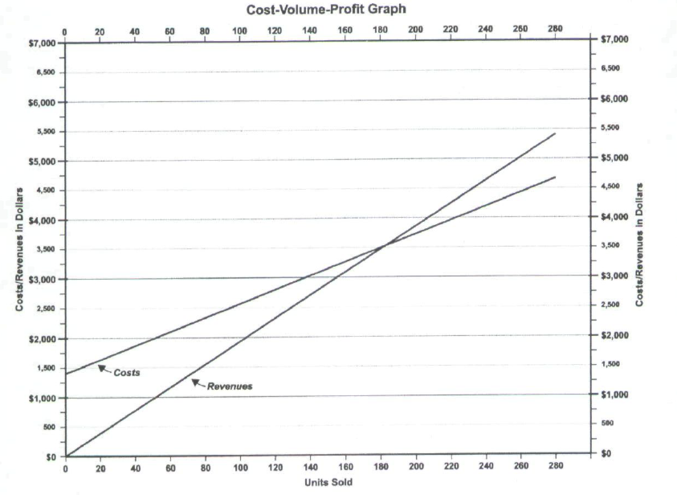
```

```{r framed-murder-rate-map, fig.cap = "Dunn (1988) maps", out.width="100%"}
knitr::include_graphics("images/framed-murder-rate-map.png")
```

### Questioning

An important consideration in understanding graph comprehension is is the questions being asked of the viewer [@graesser2014new].
Low level questions address the content and interpretation or explicit material while deeper questions require inference, application, and evaluation of the information being presented.
Three levels of graph comprehension have emerged from mathematics education research [@wood1968objectives; @curcio1987comprehension; @jolliffe1991assessment; @friel2001making; @glazer2011challenges].
The three behaviors related to graph comprehension involve (1) literal reading of the data (elementary level), (2) reading between the data (intermediate level), and (3) reading beyond the data (advanced level).
@curcio1987comprehension aligns two multiple choice questions with each level of comprehension related to a graph showing the height of four children in centimeters \pcref{fig:children-height}.
Two literal items required the viewer to read the data, title, or axis label in order to answer, "What does this graph tell you" or "How tall was xxx?"
Comparison items required comparisons and the use of mathematical concepts to answer, "Who was the tallest" and "How much taller was x than y?"
Lastly, extension items required an extension, prediction, or inference such as, "If x grows 5 centimeters and y grows 10 centimeters by Sept. 1981, who will be taller and by how much?
In @friel2001making, several studies were reviewed and their questions were placed in the taxonomy of skills required for answering questions at each level.
In addition to th graph's visual features and questioning, it is important for researchers to give careful consideration to the context of the graphic on the viewers comprehension.

```{r children-height, fig.cap = "Comprehension of heights (1987) ", out.width="80%"}
knitr::include_graphics("images/children-height.png")
```

### Estimation Strategies

While not exclusive to extracting numerical values from charts, mathematics education research places an emphasis on quantitative estimation skills [@hogan2003quantitative].
Three modes of estimation are taught as part of the mathematics curriculum in schools: numerosity, measurement, and computational estimation. 
Numerosity estimation requires the estimation of the number of items in a group or array; for example, guessing the number of M&M's in a jar.
Measurement estimation requires participants to provide an estimated value related to an object; for instance, an estimated length of a string or weight or a box.
Computational estimation is the third mode which refers to estimated answers to computations as a way to avoid exact calculations.
These estimates may be presented in either algorithmic form or a contextual scenario with words.
A longer history of quantitative estimation can be found in psychometric literature in which estimation tasks appeared in early psychometric studies of mental abilities.

In efforts to develop estimation skills, research has been conducted to evaluate strategies for estimating tasks.
Common strategies related to measurement estimation, involve reference point estimation, benchmark estimation, unit iteration, and guess and check.
@joram2005children was interested in the relationship among strategy use and accuracy of students’ representations of standard measurement units and measurement accuracy.
In this study, students were asked to estimate the lengths of two objects and explain their process.
In order to prompt students to communicate their estimation strategies, an interviewer asked questions such as, “How did you come up with your answer?” and “What were you thinking about when you came up with your answer?”.
Further prompting such as, “Do you know how tall your cousin is?” was often necessary to identify whether the student was using a reference point strategy for estimation.
Results from the study found that students who used a reference point had a more accurate representation of standard units and estimates of length than students who did not use a reference point.
@jones2012students examined the effect of scale (metric verses English) and task context on the accuracy of measurement estimation for linear distances.
The study showed that students were less accurate in estimating metric units as compared to English units and that estimation accuracy was highly dependent on task context. 
@forrester1990exploring argues that estimation, approximating, and measuring are key components in the intuitive understanding of dimension and scale necessary to manipulate information and interact effectively with our environment.

### Estimation Biases {#estimation-biases}

Certain biases including anchoring and rounding to multiples of five or ten arise in open-ended estimation tasks.
When it comes to understanding graphics, anchoring is prominent in both graphical representations and data extraction tasks [@tan1990processing].
Anchoring bias refers to an individual using easily observed visual cues such as grid lines or "anchors" when extracting information such as the $x$ or $y$ value on a chart [@tan1994human ; @godlonton2018anchoring].
In addition to $x$-value and $y$-value anchoring, entity anchoring refers to anchoring on group information withing a data set. 
Rounding errors occur out of natural human preference to provide rounded figures even if a precise estimate is desired or requested [@myers1954accuracy]. 
 @schneeweiss2010symmetric outlines distortion in results as a consequence of rounding and suggests the use of corrections when conducting statistical regression analyses on data prone to rounding.

Scale and axis labels are other critical factors in estimation accuracy.
@dunham1991learning argue that if there is not proper attention given to the scale when using a line graph, there is a potential for issues when interpreting asymmetric scales and when choosing appropriate scales for the graphic.
@beeby1973well found that when asked to read data from line graphs, viewers consistently misread the $y$-axis scale; when alternate grid lines were labeled, the unlabeled grid lines were read as halves.
This misrepresentation is highlighted for asymmetric scales where spatial distance does not necessarily equate to numerical or quantitative difference.
The choice of scale can change the shape of a graph, thus creating a conceptual demand for the viewer when constructing a mental image of the graph [@leinhardt1990functions]. 

## Motivation and Background

```{r 91divoc-cases-july2021, fig.cap = "91-DOVIC New Daily Case Counts as of July 2021", out.width="100%"}
knitr::include_graphics("images/91dovic-cases-july2021.png")
```

```{r covid19-summer2020-risk-map, fig.cap = "COVID-19 Risk Level Map as of July 2020", out.width="100%"}
knitr::include_graphics("images/covid19-summer2020-risk-map.png")
```

We have recently experienced the impact graphics and charts have on a large scale through the SARSNCOV-2 pandemic (COVID-19). 
At the beginning of 2020, we saw an influx of dashboards being developed to display case counts, transmission rates, and outbreak regions [@rost_2020]; mass media routinely showed charts to share information with the public about the progression of the pandemic [@romano_scale_2020]. 
@fagen-ulmschneider_2020 began the 91-DIVOC project to explore the global growth of COVID-19 through interactive graphics updated daily. 
The interactive graphics allowed viewers to explore the current status of COVID-19 by selecting their desired regions, axes, axis scale, and measure of interest (for example, case count, death count, and vaccine count); \cref{fig:91divoc-cases-july2021} [@fagen-ulmschneider_2020] shows the new confirmed COVID-19 cases per day, normalized by population, as of July 2021. 
Other graphics displayed COVID-19 data as maps \pcref{fig:covid19-summer2020-risk-map} with color indicating the severity and risk in each US county [@global_epidemics_2021].
People began seeking out graphical displays of COVID-19 data as a direct result of these pieces of work [@rost_2020]; providing increased and ongoing exposure to these graphics over time. 
\cref{fig:covid19-datawrapper-views-july2020} illustrates the increased views Datawrapper, a user-friendly web tool used to create basic interactive charts, had during the COVID-19 pandemic [@rost_2020].
Many of these graphics helped guide decision makers to implement policies such as shut-downs or mandated mask wearing, as well as facilitated communication with the public to increase compliance [@bavel_using_2020]. 
As graphics began to play an important role in the communication of the pandemic, creators of graphics were faced with design choices in order to ensure their charts were effective at accurately communicating the current status of the pandemic. 

```{r covid19-datawrapper-views-july2020, fig.cap = "Datawrapper daily chart views during COVID-19", out.width="100%"}
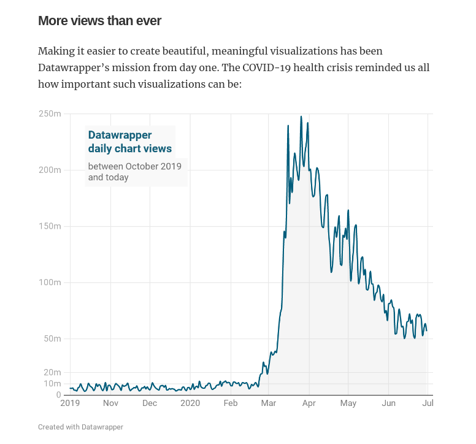
```

### Logarithmic Scales and Mapping

```{r log-scale-comic, include = F, fig.cap = "Usefulness of the log scale in science", out.width="100%"}
knitr::include_graphics("images/log-scale-comic.png")
```

When faced with data which spans several orders of magnitude, we must decide whether to show the data on its original scale (compressing the smaller magnitudes into relatively little area) or to transform the scale and alter the contextual appearance of the data.
One common solution is to use a log scale transformation to display data over several orders of magnitude within one graph.
<!-- The usefulness of the log scale in science is illustrated in \cref{fig:log-scale-comic} [@munroe_2005] showing the challenge of displaying the fuel energy density of Uranium along side other sources of fuel due to differences in magnitude of density. -->
Exponential curves are a common source of data in which smaller magnitudes are compressed into a smaller area; 
\cref{fig:log-scales} presents an exponential curve displayed on both the linear and log scale illustrating the use of the log scale when displaying data which spans several magnitudes. 
Logarithms convert multiplicative relationships (for example, 1 \& 10 displayed 10 units apart and 10 \& 100 displayed 90 units apart) to additive relationships (for example, 1 \& 10 and 10 \& 100 both equally spaced along the axis), showing proportional relationships and linearizing power functions [@menge_logarithmic_2018].
They also have practical purposes, easing the computation of small numbers such as likelihoods and transforming data to fit statistical assumptions.
When presenting log scaled data, it is possible to use either un-transformed scale labels (for example, values of 1, 10 and 100 are equally spaced along the axis) or log transformed scale labels (for example, 0, 1, and 2, showing the corresponding powers of 10).
<!-- \svp{In the grammar of graphics/ggplot2 formulation, this is the difference between a scale and a transformation... it might be worth seeing if that is a hadley-ism or if that is a wider convention.} -->

```{r log-scales, fig.cap = "Linear scale verses log scale", out.width="100%"}
data <- tibble(x = seq(0,10, by = 0.1), y = exp(x))

linear_scale <- data %>%
  ggplot(aes(x = x, y = y)) +
  geom_line() +
  theme_bw() +
  theme(aspect.ratio = 1) +
  ggtitle("Linear Scale")

log_scale <- data %>%
  ggplot(aes(x = x, y = y)) +
  geom_line() +
  theme_bw() +
  theme(aspect.ratio = 1) +
  scale_y_log10(breaks = trans_breaks("log10", function(x) 10^x)) +
  ggtitle("Log Scale")

grid.arrange(linear_scale,log_scale, ncol = 2)


# linear_scale <- data %>%
#   ggplot(aes(x = y, y = x)) +
#   # geom_line() +
#    theme_classic() +
#   theme(aspect.ratio = 0.01,
#         axis.line.y = element_blank(),
#         axis.ticks.y = element_blank(),
#         axis.text.y = element_blank()
#         ) +
#   labs(x = NULL,
#        y = NULL
#        )
# 
# log_scale <- data %>%
#   ggplot(aes(x = y, y = x)) +
#   # geom_line() +
#    theme_classic() +
#   theme(aspect.ratio = 0.01,
#         axis.line.y = element_blank(),
#         axis.ticks.y = element_blank(),
#         axis.text.y = element_blank()
#         ) +
#   labs(x = NULL,
#        y = NULL
#        ) +
#   scale_x_log10(breaks = trans_breaks("log10", function(x) 10^x))
# 
# grid.arrange(linear_scale,log_scale, ncol = 1)
```

We have recently experienced the benefits and pitfalls of using log scales as COVID-19 dashboards displayed
case count data on both the log and linear scale [@fagen-ulmschneider_2020; @burnmurdoch_2020]. 
In spring 2020, during the early stages of the COVID-19 pandemic, there were large magnitude discrepancies in case counts at a given time point between different geographic regions (for example states and provinces as well as countries and continents).
During this time, we saw the usefulness of log scale transformations showing case count curves for areas with few cases and areas with many cases within one chart. 
The usefulness of log scales in comparing deaths attributed to COVID-19 between countries as of March 2020 is illustrated in \cref{fig:covid19-FT-deaths-march2020-log}; the diagonal reference lines provide a visual aid useful for interpretation [@burnmurdoch_2020]. 
As the pandemic evolved, and the case counts were no longer spreading exponentially, graphs with linear scales seemed more effective at spotting early increases in case counts that signaled more localized outbreaks. In \cref{fig:covid19-FT-june2020-case-counts-linear} and \cref{fig:covid19-FT-june2020-case-counts-log}, the daily case counts as of June 30, 2020 are displayed on both the linear and log scales respectively [@burnmurdoch_2020]. 
The effect of the linear scale \pcref{fig:covid19-FT-june2020-case-counts-linear} appears to evoke a stronger reaction from the public than the log scale \pcref{fig:covid19-FT-june2020-case-counts-log} as daily case counts are clearly rising rapidly during the summer wave. 
This is only one recent example of a situation in which both log and linear scales are useful for showing different aspects of the same data. 
There are long histories of using log scales to display results in ecology, psychophysics, engineering, and physics [@menge_logarithmic_2018; @heckler_student_2013].
In @waddell2005comparisons, comparisons were made between the linear and logarithmic scales for the relationship between dosage and carcinogenicity in rodents.
Results favored the use of logarithmic scales for doses in order to put the relative doses into perspective whereas using a linear scale to administer doses to animals with the same chemicals to which humans are exposed does not provide useful, comparative information.
Given the widespread use of logarithmic scales, it is important to understand the implications of their use in order to provide guidelines for best use.

```{r covid19-FT-deaths-march2020-log, fig.cap = "Covid 19 Deaths (log scale) as of March 23, 2020", out.width="90%"}
knitr::include_graphics("images/covid19-FT-03.23.2020-log.png")
# https://eagereyes.org/blog/2020/in-praise-of-the-diagonal-reference-line
```

```{r covid19-FT-june2020-case-counts-linear, fig.cap = "Covid 19 Case Counts (linear scale) as of June 30, 2020", out.width="90%"}
knitr::include_graphics("images/covid19-FT-case-count-06.30.2020-linear.png")
```

```{r covid19-FT-june2020-case-counts-log, fig.cap = "Covid 19 Case Counts (log scale) as of June 30, 2020", out.width="90%"}
knitr::include_graphics("images/covid19-FT-case-count-06.30.2020-log.png")
```

When we first learn to count, we begin counting by ones (for example, 1, 2, 3, etc.), then by tens (for example, 10, 20, 30, etc.), and advancing to hundreds (for example, 100, 200, 300, etc.), following the base10 order of magnitude system (for example, 1, 10, 100, etc.).
Research suggests our perception and mapping of numbers to a number line is logarithmic at first, but transitions to a linear scale later in development, with formal mathematics education [@siegler_numerical_2017; @siegler_numerical_2017; @varshney_why_2013; @dehaene2008log].
For example, a kindergartner asked to place numbers one through ten along a number line would place three close to the middle, following the logarithmic perspective [@varshney_why_2013]; \cref{fig:log-number-line} demonstrates how a kindergartner might map numbers along a number line. 
@dehaene2008log found that with basic training, members of remote cultures with a basic vocabulary and minimal education understood the concept that numbers can be mapped into a spacial space; for example, numbers can be mapped to a number line or numbers can be mapped onto a clock. 
There was a gradual transition from logarithmic to linear scale as the mapping of whole number magnitude representations transitioned from a compressed (approximately logarithmic) distribution to an approximately linear one. 
These results indicate the universal and cultural-dependent characteristics of the sense of number. 

```{r log-number-line, fig.cap= "Kindergarten example of mapping numbers 1-10 along a number line", fig.height=1, fig.width=4.5, message=FALSE, warning=FALSE, out.width = "65%"}
tibble(x = seq(1,10, 0.25),
       y = 1,
       text = c("1", NA, NA, NA, 
                NA, NA, NA, NA,
                NA, NA, NA, "2",
                NA, NA, NA, NA,
                NA, "3", NA, NA, 
                NA, "4", NA, NA,
                NA, "5", NA, NA,
                "6", NA, NA, NA,
                "7", NA, "8", "9",
                "10")
       ) %>%
  ggplot(aes(x = x, y = y, label = text)) +
  # geom_line() +
  geom_text() + 
  theme_classic() +
  theme(aspect.ratio = 0.1,
        axis.line.y = element_blank(),
        axis.ticks.y = element_blank(),
        axis.text.y = element_blank()
        ) +
  labs(x = NULL,
       y = NULL
       ) +
  scale_x_continuous(breaks = c(1,10))
```
    
Assuming there is a direct relationship between perceptual and cognitive processes, it is reasonable to assume numerical representations should also be displayed on a nonlinear, compressed number scale. Therefore, if we perceive logarithmically by default, it is a natural (and presumably low effort) way to display information and should be easy to read and understand/use.
The idea is compression enlarges the coding space, thus increasing the dynamic range of perception and firing neurons within our visual system [@nieder2003coding].
Similar to the training and education required to transition from logarithmic mapping to linear mapping, there is also necessary training required in the assessment of graphical displays associated with logarithmic scales. @haemer_presentation_1949 identify semi-logarithmic charts for temporal series as requiring a certain degree of technical training.
    
### Underestimation of Exponential Growth {#underestimation}

```{r exponential-stages, include = F, fig.cap = "Stages of exponential growth", out.width = "75%"}
data <- tibble(x = seq(0,6,0.001),
               y = exp(x)) %>%
  mutate(group = ifelse(x <= 2, "G1", 
                        ifelse(x <= 4, "G2", "G3")))

data %>%
  ggplot(aes(x = x, y = y, color = group)) +
  geom_line(show.legend = T) +
  theme_bw() +
  theme(aspect.ratio = 1) +
  # facet_zoom(xlim = c(0,2), shrink = F, zoom.size = 3) +
  # facet_zoom(xy = group == 'G1', zoom.size = 1/3) +
  geom_mark_rect(show.legend = T) +
  scale_color_brewer("Stage", palette = "Dark2", labels = c("Early", "Mid", "Late"))
```

```{r exponential-stages-comic, fig.cap = "Log scale comic", out.width="100%"}
knitr::include_graphics("images/exponential-stages-comic.jpg")
```

People with diverse backgrounds can interpret the same display of data in vastly different ways; \cref{fig:exponential-stages-comic} [@vonbergmann_2021] illustrates how individuals in public health interpret exponential growth distinctly different from scientists during early, middle, and late stages of growth.
Exponential growth is often misjudged in early stages, appearing to have a small growth rate.
As exponential growth continues, the middle stage appears to be growing, but not at an astounding rate, appearing more quadratic.
It is not until late stages of exponential growth when it is quite apparent that there is exponential growth occurring.
This misinterpretation can lead to decisions made under inaccurate understanding causing future consequences.

Early studies explored the estimation and prediction of exponential growth and found that growth is underestimated when presented both numerically and graphically [@wagenaar_misperception_1975].
The hierarchy of plot objects found in @cleveland_graphical_1985 can provide a possible explanation for the underestimation the occurs in exponentially increasing trends; the exponential trend can be thought of as a series of tangential angles leading to less accurate judgement of the next points.
Results from @wagenaar_misperception_1975 indicated that numerical estimation is more accurate than graphical estimation for exponential curves. 
Experimental studies were conducted in order to determine strategies to improve the accuracy of estimation of exponential growth [@wagenaar_misperception_1975; @jones_polynomial_1977; @mackinnon_feedback_1991].
There was no improvement in estimation found when participants had contextual knowledge or experience with exponential growth, but instruction on exponential growth reduced the underestimation; participants adjusted their initial starting value but not their perception of the growth rate [@wagenaar_misperception_1975; @jones_polynomial_1977].
@mackinnon_feedback_1991 found that estimation was improved by providing immediate feedback to participants about the accuracy of their current predictions.  

Our inability to accurately predict exponential growth might also be addressed by log transforming the data, however, this transformation introduces new complexities; most readers are not mathematically sophisticated enough to intuitively understand logarithmic math and translate that back into real-world effects.
In @menge_logarithmic_2018, ecologists were surveyed to determine how often ecologists encounter log scaled data and how well ecologists understand log scaled data when they see it in the literature. 
Participants were presented three relationships displayed on linear-linear scales, log-log scales with untransformed values, or log–log scales with log transformed values \pcref{fig:menge-plots}. 
The authors propose three types of misconceptions participants encountered when presented data on log-log scales: 'hand-hold fallacy', 'Zeno's zero fallacy', and 'watch out for curves fallacies'. 
These misconceptions are a result of linear extrapolation assuming that a line in log-log space represents a line instead of the power law (which is an exponential relationship) in linear-linear space.

```{r menge-plots, fig.cap = "Graphs viewed in Menge (2018) survey", out.width="100%"}
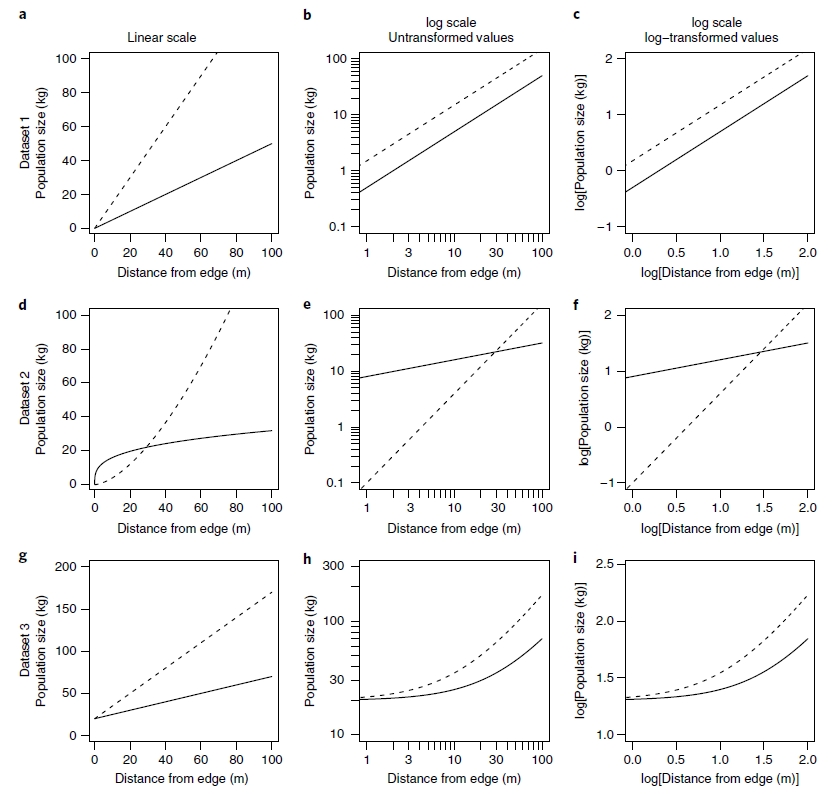
```

The 'hand-hold fallacy' stems from the misconception that steeper slopes in log-log relationships are steeper slopes in linear-linear space, illustrated in \cref{fig:menge-plots} d-f. 
In fact, it is not only the slope that matters, but also the intercept and the location on the horizontal axis since a line in log-log space represents a power law in linear-linear space (linear extrapolation). 
Emerging from 'Zeno's zero fallacy' is the misconception that positively sloped lines in log-log space can imply a non-zero value of y when x is zero, illustrated in \cref{fig:menge-plots} a-c and d-f.
This is never true as positively sloped lines in log-log space actually imply that y = 0 when x = 0. This misconception again is a result of linear extrapolation assuming that a line in log-log space represents a line instead of the power law in linear-linear space. 
The last misconception, 'watch out for curves fallacies' encompasses three faults: (1) lines in log-log space are lines in linear-linear space, illustrated in \cref{fig:menge-plots} d-f, (2) lines in log-log space curve upward in linear-linear space, illustrated in \cref{fig:menge-plots} d-f, and (3) curves in log-log space have the same curvature in linear-linear space, illustrated in \cref{fig:menge-plots} g-i. 
Linear extrapolation is again responsible for the first and third faults while the second fault is a result of error in thinking that log-log lines represent power laws, and all exponential relationships curve upward; this is only true when the log-log slope is greater than one. 
@menge_logarithmic_2018 found that in each of these scenarios, participants were confident in their incorrect responses, indicating incorrect knowledge rather than a lack of knowledge.

## Research Objectives
In this research, we conducted a series of three graphical studies to evaluate the impact displaying data on the log scale has on human perception of exponentially increasing trends compared to displaying data on the linear scale.
Each study was related to a different graphical task, each requiring a different level of interaction and cognitive use of the data being presented.
The first experiment evaluated whether our ability to perceptually notice differences in exponentially increasing trends is impacted by the choice of scale. 
We conducted a visual inference experiment in which participants were shown a series of lineups and asked to identify the plot that differed most from the surrounding plots. 
The other experimental tasks focus on determining whether there are cognitive disadvantages to log scales: do log scales make it harder to make use of graphical information? 
To test an individual's ability to make predictions for exponentially increasing data, participants were asked to draw a line using their computer mouse through an exponentially increasing trend shown on both the linear and log scale.
In addition to differentiation and prediction of exponentially increasing data, an estimation task was conducted to test an individuals' ability to translate a graph of exponentially increasing data into real value quantities and extend their estimations by making comparisons.
Combined, the three studies provide a comprehensive evaluation of the impact of displaying exponentially increasing data on a log scale as it relates to perception, prediction, and estimation.
The results of these studies help us to make recommendations and provide guidelines for the use of log scales.

<!--chapter:end:index.Rmd-->

# Perception through lineups {#lineups}

## Introduction

To lay a foundation for future exploration of the use of log scales, we begin with the most fundamental ability: to identify differences in charts. Identifying differences does not require that participants understand exponential growth, identify log scales, or have any mathematical training. 
Instead, we am simply testing the change in \emph{perceptual sensitivity} resulting from visualization choices.
The study in this chapter is conducted through visual inference and the use of statistical lineups [@buja_statistical_2009] to differentiate between exponentially increasing curves with differing levels of curvature, using linear and log scales.

## Visual Inference

In [Section 1.3.2](#testing-statistical-graphics), we explained how a data plot can be evaluated and treated as a visual statistic, a numerical function which summarizes the data.
To evaluate a graph, the statistic (data plot) must be run through a visual evaluation - a person.
We can conclude the visual statistics are significantly different if two different methods of presenting data result in qualitatively different results when evaluated visually.
Recent graphical experiments have utilized statistical lineups to quantify the perception of graphical design choices [@hofmann_graphical_2012; @loy_model_2017; @loy_variations_2016; @vanderplas_clusters_2017]. 
Statistical lineups provide an elegant way of combining perception and statistical hypothesis testing using graphical experiments [@majumder_validation_2013; @vanderplas_testing_2020; @wickham_graphical_2010].
'Lineups' are named after the 'police lineup' of criminal investigations where witnesses are asked to identify the criminal from a set of individuals. 
Similarly, a statistical lineup is a plot consisting of smaller panels; the viewer is asked to identify the panel containing the real data from among a set of decoy null plots. 
Null plots display data under the assumption there is no relationship and can be generated by permutation or simulation.
A statistical lineup typically consists of 20 panels - one target panel and 19 null panels.
If the viewer can identify the target panel randomly embedded within the set of null panels, this suggests that the real data is visually distinct from data generated under the null model. 
\cref{fig:lineup-example} provides examples of statistical lineups. 
The lineup plot on the left displays increasing exponential data displayed on a linear scale with panel 13 as the target; the lineup plot on the right displays increasing exponential data on the log base ten scale with panel 4 as the target.

```{r lineup-example, fig.height = 2.75, fig.width = 5.75, fig.cap = "Example Lineups"}
lineupData_linear <- read.csv(file = "data/01-lineups/lineup-example-data-linear.csv")
linearPlot <- ggplot(lineupData_linear, aes(x=x, y=y)) +
  facet_wrap(~.sample, ncol=5) +
  geom_point(size = .05) +
  theme(aspect.ratio = 1) +
  theme_bw(base_size = 14) +
  theme(axis.title.y = element_blank(),
        axis.title.x = element_blank(),
        axis.text.y  = element_blank(),
        axis.text.x  = element_blank(),
        strip.text = element_text(size = 5, margin = margin(0.05,0,0.05,0, "cm")),
        strip.background = element_rect(size = 0.5)
  )

lineupData_log <- read.csv(file = "data/01-lineups/lineup-example-data-log.csv")
logPlot <- ggplot(lineupData_log, aes(x=x, y=y)) +
  facet_wrap(~.sample, ncol=5) +
  geom_point(size = .05) +
  theme(aspect.ratio = 1) +
  theme_bw(base_size = 14) +
  theme(axis.title.y = element_blank(),
        axis.title.x = element_blank(),
        axis.text.y  = element_blank(),
        axis.text.x  = element_blank(),
        strip.text = element_text(size = 5, margin = margin(0.05,0,0.05,0, "cm")),
        strip.background = element_rect(size = 0.5)
  ) +
  scale_y_continuous(trans = "log10")

grid.arrange(linearPlot, logPlot, ncol = 2)
```

While explicit graphical tests direct the participant to a specific feature of a plot to answer a specific question, implicit graphical tests require the user to identify both the purpose and function of the plot in order to evaluate the plots shown [@vanderplas_testing_2020]. 
Implicit graphical tests, such as lineups, have the advantage of simultaneously visually testing for multiple visual features including outliers, clusters, linear and nonlinear relationships. Responses from multiple viewers are collected through convenience sampling (in informal situations) or crowd sourcing websites such as Prolific, Amazon Mechanical Turk, and Reddit (in more formal situations).

## Data Generation

In this study, both the target and null data sets were generated by simulating data from an exponential model; the models differ in the parameters selected for the null and target panels. 
In order to guarantee the simulated data spans the same domain and range of values, we begin with a domain constraint of $x\in [0,20]$ and a range constraint of $y\in [10,100]$ with $N = 50$ points randomly assigned throughout the domain and mapped to the $y$-axis using the exponential model with the selected parameters. 
These constraints provide some assurance that participants who select the target plot are doing so because of their visual perception differentiating between curvature or growth rate rather than different starting or ending values.

Data were simulated based on a three-parameter exponential model with multiplicative errors: 
\begin{align}
y_i & = \alpha\cdot e^{\beta\cdot x_i + \epsilon_i} + \theta \\
\text{with } \epsilon_i & \sim N(0, \sigma^2). \nonumber
\end{align} 
The parameters $\alpha$ and $\theta$ are adjusted based on $\beta$ and $\sigma^2$ to guarantee the range and domain constraints are met. 
The model generated $N = 50$ points $(x_i, y_i), i = 1,...,N$ where $x$ and $y$ have an increasing exponential relationship. 
The heuristic data generation procedure is described in \cref{alg:lineup-parameter-estimation-algorithm} and \cref{alg:lineup-exponential-data-simulation-algorithm}.

\begin{algorithm}
  \caption{Lineup Parameter Estimation}\label{alg:lineup-parameter-estimation-algorithm}
  \begin{algorithmic}[1]
    \Statex \textbullet~\textbf{Input Parameters:} domain $x\in[0,20]$, range $y\in[10,100]$, midpoint $x_{mid}$.
    \Statex \textbullet~\textbf{Output Parameters:} estimated model parameters $\hat\alpha, \hat\beta, \hat\theta$.
    \State Determine the $y=-x$ line scaled to fit the assigned domain and range.
    \State Map the values $x_{mid} - 0.1$ and $x_{mid} + 0.1$ to the $y=-x$ line for two additional points.
    \State From the set points $(x_k, y_k)$ for $k = 1,2,3,4$, obtain the coefficients from the linear regression model $\ln(y_k) = b_0 +b_1x_k$ to obtain starting values - $\alpha_0 = e^{b_0}, \beta_0 =  b_1, \theta_0 = 0.5\cdot \min(y)$
    \State Using the `nls` function from the base stats package in Rstudio and the starting parameter values - $\alpha_0, \beta_0, \theta_0$ - fit the nonlinear model, $y_k = \alpha\cdot e^{\beta\cdot x_k}+\theta$ to obtain estimated parameter values - $\hat\alpha, \hat\beta, \hat\theta.$
  \end{algorithmic}
\end{algorithm}

\begin{algorithm}
  \caption{Lineup Exponential Data Simulation}\label{alg:lineup-exponential-data-simulation-algorithm}
  \begin{algorithmic}[1]
    \Statex \textbullet~\textbf{Input Parameters:} sample size $N = 50$, estimated parameters $\hat\alpha$, $\hat\beta$, and $\hat\theta$, from \cref{alg:lineup-parameter-estimation-algorithm}, and $\sigma$ standard deviation from the exponential curve.
    \Statex \textbullet~\textbf{Output Parameters:} $N$ points, in the form of vectors $\mathbf{x}$ and $\mathbf{y}$.
    \State Generate $\tilde x_j, j = 1,..., \frac{3}{4}N$ as a sequence of evenly spaced points in $[0,20]$. This ensures the full domain of $x$ is used, fulfilling the constraints of spanning the same domain and range for each parameter combination.
    \State Obtain $\tilde x_i, i = 1,...N$ by sampling $N = 50$ values from the set of $\tilde x_j$ values. This guarantees some variability and potential clustering in the exponential growth curve disrupting the perception due to continuity of points.
    \State Obtain the final $x_i$ values by jittering $\tilde x_i$.
    \State Calculate $\tilde\alpha = \frac{\hat\alpha}{e^{\sigma^2/2}}.$ This ensures that the range of simulated values for different standard deviation parameters has an equal expected value for a given rate of change due to the non-constant variance across the domain.
    \State Generate $y_i = \tilde\alpha\cdot e^{\hat\beta x_i + e_i}+\hat\theta$ where $e_i\sim N(0,\sigma^2).$
  \end{algorithmic}
\end{algorithm}

## Parameter Selection {#lineups-parameter-selection}

We followed a 'Goldilocks' inspired procedure to choose three levels of curvature (low curvature, medium curvature, and high curvature). For each curvature level, we simulated 1000 data sets of $(x_{ij}, y_{ij})$ points for $i = 1,...,50$ $x$-values and $j = 1...10$ corresponding $y$-values per $x$-value.
Each generated $x_i$ point from \cref{alg:lineup-exponential-data-simulation-algorithm} was replicated ten times. 
On each of the individual data sets, we conducted a linear regression model and computed the lack of fit statistic (LOF) which measures the deviation of the data from the linear regression model.
The density curves of the LOF statistics for each level of curvature are plotted \pcref{fig:lof-density-curves} to to provide a metric for differentiating between the curvature levels and thus detecting the target plot.
While the LOF statistic provides a numerical value for discriminating between the difficulty levels, it cannot be directly related to the perceptual discriminability; it serves primarily as an approximation to ensure that we are testing parameters at several distinct curvature levels.
Final parameters used for data simulation are shown in \cref{tab:parameter-data}.

```{r lof-density-curves, fig.height = 2.5, fig.width = 5, fig.cap = "Lack of fit statistic density curves", out.width = "75%"}
lofData <- read.csv(file = "data/01-lineups/lineup-lof-data.csv")
lofPlot_curvature <- lofData %>%
  mutate(Curvature = factor(Curvature, levels = c("Obvious Curvature", "Noticeable Curvature", "Almost Linear"), labels = c("High Curvature", "Medium Curvature", "Low Curvature"))) %>%
  mutate(Variability = factor(Variability, levels = c("Low"))) %>%
  ggplot(aes(x = statistic, fill = Curvature, color = Curvature)) +
  geom_density(alpha = 0.7) +
  scale_fill_manual("Difficulty", values = c("#004400", "#116611", "#55aa55")) +
  scale_color_manual("Difficulty", values = c("#004400", "#116611", "#55aa55")) +
  theme_bw(base_size = 14) +
  theme(legend.position = "bottom",
        axis.text    = element_text(size = 10),
        axis.title   = element_text(size = 10),
        legend.title = element_text(size = 10),
        legend.text  = element_text(size = 10),
        legend.key.size = unit(0.5, "line")
        ) +
  scale_x_continuous("Lack of Fit Statistic") +
  scale_y_continuous("Density")
lofPlot_curvature
```

```{r parameter-data}
parameter_data <- read.csv(file = "data/01-lineups/lineup-parameter-data.csv")
parameter_data %>%
  mutate(difficulty = ifelse(difficulty == "Obvious Curvature", "High Curvature",
                             ifelse(difficulty == "Noticable Curvature", "Medium Curvature", "Low Curvature"))
         ) %>%
  select(difficulty, xMid, alphahat, alphatilde, betahat, thetahat, sigma_vals) %>%
  knitr::kable("latex", digits = 2, escape = F, booktabs = T, linesep = "", align = "c", label = "parameter-data",
        col.names = c("",   "$x_{mid}$", "$\\hat\\alpha$", "$\\tilde\\alpha$", "$\\hat\\beta$", "$\\hat\\theta$", "$\\hat\\sigma$"),
        caption = "Lineup data simulation final parameters")
```

## Lineup Setup 

Lineup plots were generated by mapping one simulated data set corresponding to curvature level A to a scatter plot to be identified as the target panel while multiple simulated data sets corresponding to curvature level B were individually mapped to scatter plots for the null panels.
The `nullabor` package in R [@nullabor] was used to randomly assign the target plot to one of the panels surrounded by panels containing null plots.
For example, a target plot with simulated data following an increasing exponential curve with high curvature is randomly embedded within null plots with simulated data following an increasing exponential trend with low curvature. 
By the implemented constraints, the target panel and null panels will span a similar domain and range. 
There are a total of six lineup curvature combinations; \cref{fig:curvature-combination-example} illustrates the six lineup curvature combinations (top: linear scale; bottom: log scale) where the green line indicates the curvature level designated to the target plot while the black line indicates the curvature level assigned to the null plots.
Two sets of each lineup curvature combination were simulated (total of 12 test data sets) and plotted on both the linear scale and the log scale (total of 24 test lineup plots).
In addition, there are three curvature combinations which generate homogeneous "Rorschach" lineups, where all panels are from the same distribution. 
Each participant evaluated one of these lineups, but for simplicity, these evaluations are not described in this chapter and their analysis is left to a later date.

```{r curvature-combination-example, fig.height = 6, fig.width = 9, fig.cap = "Lineup curvature combinations", out.width="100%"}
simData <- read.csv("data/01-lineups/difficulty-comparison-data.csv")

# simData  %>%
#   mutate(curvature = factor(curvature, levels = c("E", "M", "H"), labels = c("High Curvature", "Medium Curvature", "Low Curvature"))) %>%
#   ggplot(aes(x = x, y = y, color = curvature)) +
#   geom_line(size = 1) +
#   theme_bw() +
#   theme(aspect.ratio = 1) +
#   theme(axis.text = element_blank(),
#         axis.title = element_blank(),
#         legend.position = "bottom") +
#   scale_color_manual("Difficulty", values = c("#004400", "#116611", "#55aa55"))

tE_nM <- simData  %>%
  mutate(Target = "High",
         Null = "Medium") %>%
  filter(curvature %in% c("E", "M")) %>%
  mutate(curvature = factor(curvature, levels = c("E", "M", "H"))) %>%
  ggplot(aes(x = x, y = y, color = curvature)) +
  geom_line(size = 1) +
  theme_test() +
  theme(aspect.ratio = 1) +
  theme(axis.text = element_blank(),
        axis.title = element_blank(),
        legend.position = "none") +
  scale_x_continuous(limits = c(0,20)) +
  scale_color_manual(values = c("green3", "black"))

tE_nH <- simData  %>%
  mutate(Target = "High",
         Null = "Low") %>%
  filter(curvature %in% c("E", "H")) %>%
  mutate(curvature = factor(curvature, levels = c("E", "M", "H"))) %>%
  ggplot(aes(x = x, y = y, color = curvature)) +
  geom_line(size = 1) +
  theme_test() +
  theme(aspect.ratio = 1) +
  theme(axis.text = element_blank(),
        axis.title = element_blank(),
        legend.position = "none") +
  scale_x_continuous(limits = c(0,20)) +
  scale_color_manual(values = c("green3", "black"))

tM_nE <- simData  %>%
  mutate(Target = "Medium",
         Null = "High") %>%
  filter(curvature %in% c("E", "M")) %>%
  mutate(curvature = factor(curvature, levels = c("E", "M", "H"))) %>%
  ggplot(aes(x = x, y = y, color = curvature)) +
  geom_line(size = 1) +
  theme_test() +
  theme(aspect.ratio = 1) +
  theme(axis.text = element_blank(),
        axis.title = element_blank(),
        legend.position = "none") +
  scale_x_continuous(limits = c(0,20)) +
  scale_color_manual(values = c("black", "green3"))

tM_nH <- simData  %>%
  mutate(Target = "Medium",
         Null = "Low") %>%
  filter(curvature %in% c("H", "M")) %>%
  mutate(curvature = factor(curvature, levels = c("E", "M", "H"))) %>%
  ggplot(aes(x = x, y = y, color = curvature)) +
  geom_line(size = 1) +
  theme_test() +
  theme(aspect.ratio = 1) +
  theme(axis.text = element_blank(),
        axis.title = element_blank(),
        legend.position = "none") +
  scale_x_continuous(limits = c(0,20)) +
  scale_color_manual(values = c("green3", "black"))

tH_nE <- simData  %>%
  mutate(Target = "Low",
         Null = "High") %>%
  filter(curvature %in% c("E", "H")) %>%
  mutate(curvature = factor(curvature, levels = c("E", "M", "H"))) %>%
  ggplot(aes(x = x, y = y, color = curvature)) +
  geom_line(size = 1) +
  theme_test() +
  theme(aspect.ratio = 1) +
  theme(axis.text = element_blank(),
        axis.title = element_blank(),
        legend.position = "none") +
  scale_x_continuous(limits = c(0,20)) +
  scale_color_manual(values = c("black", "green3"))

tH_nM <- simData  %>%
  mutate(Target = "Low",
         Null = "Medium") %>%
  filter(curvature %in% c("H", "M")) %>%
  mutate(curvature = factor(curvature, levels = c("E", "M", "H"))) %>%
  ggplot(aes(x = x, y = y, color = curvature)) +
  geom_line(size = 1) +
  theme_test() +
  theme(aspect.ratio = 1) +
  theme(axis.text = element_blank(),
        axis.title = element_blank(),
        legend.position = "none") +
  scale_x_continuous(limits = c(0,20)) +
  scale_color_manual(values = c("black", "green3"))

# linear scale

tM_nH_linear <- tM_nH +
  scale_y_continuous(limits = c(10,100))

tE_nH_linear <- tE_nH +
  scale_y_continuous(limits = c(10,100))

tH_nM_linear <- tH_nM +
  scale_y_continuous(limits = c(10,100))

tE_nM_linear <- tE_nM +
  scale_y_continuous(limits = c(10,100))

tH_nE_linear <- tH_nE +
  scale_y_continuous(limits = c(10,100))

tM_nE_linear <- tM_nE +
  scale_y_continuous(limits = c(10,100))

# log scale

library(scales)

tM_nH_log <- tM_nH +
  scale_y_continuous(limits = c(10,100), trans = "log10")

tE_nH_log <- tE_nH +
  scale_y_continuous(limits = c(10,100), trans = "log10")

tH_nM_log <- tH_nM +
  scale_y_continuous(limits = c(10,100), trans = "log10")

tE_nM_log <- tE_nM +
  scale_y_continuous(limits = c(10,100), trans = "log10")

tH_nE_log <- tH_nE +
  scale_y_continuous(limits = c(10,100), trans = "log10")

tM_nE_log <- tM_nE +
  scale_y_continuous(limits = c(10,100), trans = "log10")


# output plots with patchwork
tM_nH_linear +
  ggtitle("Linear Scale") +
  facet_grid(~ Target + Null, labeller = labeller(Target = label_both, Null = label_both)) +
tE_nH_linear +
  facet_grid(~ Target + Null, labeller = labeller(Target = label_both, Null = label_both)) +
tH_nM_linear +
  facet_grid(~ Target + Null, labeller = labeller(Target = label_both, Null = label_both)) +
tE_nM_linear +
  facet_grid(~ Target + Null, labeller = labeller(Target = label_both, Null = label_both)) +
tH_nE_linear +
  facet_grid(~ Target + Null, labeller = labeller(Target = label_both, Null = label_both)) +
tM_nE_linear +
  facet_grid(~ Target + Null, labeller = labeller(Target = label_both, Null = label_both)) +
tM_nH_log +
  ggtitle("Log10 Scale") +
  facet_grid(~ Target + Null, labeller = labeller(Target = label_both, Null = label_both)) +
tE_nH_log +
  facet_grid(~ Target + Null, labeller = labeller(Target = label_both, Null = label_both)) +
tH_nM_log +
  facet_grid(~ Target + Null, labeller = labeller(Target = label_both, Null = label_both)) +
tE_nM_log +
  facet_grid(~ Target + Null, labeller = labeller(Target = label_both, Null = label_both)) +
tH_nE_log +
  facet_grid(~ Target + Null, labeller = labeller(Target = label_both, Null = label_both)) +
tM_nE_log +
  facet_grid(~ Target + Null, labeller = labeller(Target = label_both, Null = label_both)) +
plot_layout(ncol = 6)

# tM_nH_linear +
#   ggtitle("Linear Scale") +
#   facet_grid(~ Target + Null, labeller = labeller(Target = label_both, Null = label_both)) +
# tM_nH_log +
#   ggtitle("Log10 Scale") +
#   facet_grid(~ Target + Null, labeller = labeller(Target = label_both, Null = label_both)) +
# tE_nH_linear +
#   facet_grid(~ Target + Null, labeller = labeller(Target = label_both, Null = label_both)) +
# tE_nH_log +
#   facet_grid(~ Target + Null, labeller = labeller(Target = label_both, Null = label_both)) +
# tH_nM_linear +
#   facet_grid(~ Target + Null, labeller = labeller(Target = label_both, Null = label_both)) +
# tH_nM_log +
#   facet_grid(~ Target + Null, labeller = labeller(Target = label_both, Null = label_both)) +
# tE_nM_linear +
#   facet_grid(~ Target + Null, labeller = labeller(Target = label_both, Null = label_both)) +
# tE_nM_log +
#   facet_grid(~ Target + Null, labeller = labeller(Target = label_both, Null = label_both)) +
# tH_nE_linear +
#   facet_grid(~ Target + Null, labeller = labeller(Target = label_both, Null = label_both)) +
# tH_nE_log +
#   facet_grid(~ Target + Null, labeller = labeller(Target = label_both, Null = label_both)) +
# tM_nE_linear +
#   facet_grid(~ Target + Null, labeller = labeller(Target = label_both, Null = label_both)) +
# tM_nE_log +
#   facet_grid(~ Target + Null, labeller = labeller(Target = label_both, Null = label_both)) +
# plot_layout(ncol = 2)

# save thumbnails for plotting later
# tM_nH_thumbnail <- tM_nH_linear + tM_nH_log
# ggsave(tM_nH_thumbnail, file = "images/01-lineups/tM_nH_thumbnail.png", width = 6, height = 3)
# 
# tE_nH_thumbnail <- tE_nH_linear + tE_nH_log
# ggsave(tE_nH_thumbnail, file = "images/01-lineups/tE_nH_thumbnail.png", width = 6, height = 3)
# 
# tH_nM_thumbnail <- tH_nM_linear + tH_nM_log
# ggsave(tH_nM_thumbnail, file = "images/01-lineups/tH_nM_thumbnail.png", width = 6, height = 3)
# 
# tE_nM_thumbnail <- tE_nM_linear + tE_nM_log
# ggsave(tE_nM_thumbnail, file = "images/01-lineups/tE_nM_thumbnail.png", width = 6, height = 3)
# 
# tH_nE_thumbnail <- tH_nE_linear + tH_nE_log
# ggsave(tH_nE_thumbnail, file = "images/01-lineups/tH_nE_thumbnail.png", width = 6, height = 3)
# 
# tM_nE_thumbnail <- tM_nE_linear + tM_nE_log
# ggsave(tM_nE_thumbnail, file = "images/01-lineups/tM_nE_thumbnail.png", width = 6, height = 3)
```

## Study Design

Each participant was shown a total of thirteen lineup plots (twelve test lineup plots and one Rorschach lineup plot). 
Participants were randomly assigned one of the two replicate data sets for each of the six unique lineup curvature combinations. 
For each assigned test data set, the participant was shown the lineup plot corresponding to both the linear scale and the log scale. 
For the additional Rorschach lineup plot, participants were randomly assigned one data set shown on either the linear or the log scale. 
The order of the thirteen lineup plots shown was randomized for each participant. 

Participants above the age of majority in their region were recruited from Prolific, a survey site that connects researchers to study participants.
Participants were compensated for their time and participated in all three related graphical studies consecutively. 
The lineup study in this chapter was completed first in the series of graphical studies.
<!-- Since participants recruited on Reddit were not compensated for their time, most participants have an interest in data visualization research.  -->
Previous literature suggests that prior mathematical knowledge or experience with exponential data is not associated with the outcome of graphical experiments [@vanderplas2015spatial]. 
Participants completed the series of graphical tests using a R Shiny application found [here](https://shiny.srvanderplas.com/perception-of-statistical-graphics/).

Participants were shown a series of lineup plots and asked to identify the plot that was most different from the others. 
On each plot, participants were asked to justify their choice and provide their level of confidence in their choice.
The goal of this graphical task is to test an individuals ability to perceptually differentiate exponentially increasing trends with differing levels of curvature on both the linear and log scale. 

## Results

Participant recruitment and study deployment was conducted via Prolific, a crowd sourcing website, on Wednesday, March 23, 2022 during which 325 individuals completed 4492 unique test lineup evaluations. 
<!-- Previous studies have found that results do not differ on lineup-related tasks between Reddit and other crowd sourcing websites such as Amazon Mechanical Turk [@vanderplas_clusters_2017]. -->
Only participants who completed the lineup study were included in the final data set which included a total of 311 participants and 3958 lineup evaluations.
Each plot was evaluated between 141 and 203 times (Mean: 164.92, SD: 14.9).
Participants correctly identified the target panel in 47\% of the 1981 lineup evaluations made on the linear scale and 65.3\% of the 1977 lineup evaluations made on the log scale.

Target plot identification was analyzed using the `glmer` function in the `lme4` R package [@lme4]. 
Estimates and odds ratio comparisons between the log and linear scales were calculated using the `emmeans` R package [@emmeans].
Each lineup plot evaluated was assigned a binary value based on the participant response (correct = 1, not correct = 0).
Define $Y_{ijkl}$ to be the event that participant $l = 1,...,N_{participant}$ correctly identifies the target plot for data set $k = 1,2$ with curvature combination $j = 1,2,3,4,5,6$ plotted on scale $i = 1,2$.
The binary response was analyzed using a generalized linear mixed model following a binomial distribution with a logit link function with a row-column blocking design accounting for the variation due to participant and data set respectively as 
\begin{equation}
\text{logit }P(Y_{ijk}) = \eta + \delta_i + \gamma_j + \delta \gamma_{ij} + s_l + d_k
\end{equation}
\noindent where
\begin{itemize}
\item $\eta$ is the baseline average probability of selecting the target plot
\item $\delta_i$ is the effect of scale $i = 1,2$
\item $\gamma_j$ is the effect of curvature combination $j = 1,2,3,4,5,6$
\item $\delta\gamma_{ij}$ is the two-way interaction between the $i^{th}$ scale and $j^{th}$ curvature combination
\item $s_l \sim N(0,\sigma^2_\text{participant})$is the random effect for participant characteristics
\item $d_k \sim N(0,\sigma^2_{\text{data}})$ is the random effect for data specific characteristics. 
\end{itemize}
\noindent We assume that random effects for data set and participant are independent.

Results indicate a strong interaction between the curvature combination and scale ($\chi^2_5 = 294.443$; $\text{p} <0.0001$). Variance due to participant and data set were estimated to be $\hat\sigma^2_{\text{participant}} = 1.19$ (s.e. 1.09) and $\hat\sigma^2_{\text{data}} = 0.433$ (s.e. 0.66) respectively.

```{r anova, include = F}
read.csv("data/01-lineups/lineups-anova.csv") %>%
  knitr::kable("latex", escape = F, booktabs = T, linesep = "", align = "c", 
        label = "lineup-anova-table",
        caption = "Lineup ANOVA table for fixed effects.")
```

On both the log and linear scales, the highest accuracy occurred in lineup plots where the target model and null model had a large curvature difference and the target plot had more curvature than the null plots (high curvature target plot embedded in low curvature null plots).
There is a decrease in accuracy on the linear scale when comparing a target plot with less curvature to null plots with more curvature (medium curvature target plot embedded in high curvature null plots; low curvature target plot embedded in medium curvature null plots; low curvature target plot embedded in high curvature null plots). 
@best_perception_2007 found that accuracy of identifying the correct curve type was higher when nonlinear trends were presented indicating that it is hard to say something is linear (something has less curvature), but easy to say that it is not linear; our results concur with this observation.
\cref{fig:odds-ratio-plot} displays the estimated (log) odds ratio of successfully identifying the target panel on the log scale compared to the linear scale. The thumbnail figures to the right of the plot illustrate the curvature combination on both the linear (left thumbnail) and log base ten (right thumbnail) scales associated with the $y$-axis label.
The choice of scale has no impact if curvature differences are large and the target plot had more curvature than the null plots (high curvature target plot embedded in low curvature null plots).
However, presenting data on the log scale makes us more sensitive to slight changes in curvature (low or high curvature target plot embedded in medium curvature null plots; medium curvature target plot embedded in high curvature null plots) and large differences in curvature when the target plot has less curvature than the null plots (low curvature target plot embedded in high curvature null plots).
An exception occurs when identifying a plot with curvature embedded in null plots close to a linear trend (medium curvature target panel embedded in low curvature null panels).
The results indicate that participants were more accurate at detecting the target panel on the linear scale than the log scale.
When examining this curvature combination, the same perceptual effect occurs as what we previously saw, but in a different context of scales.
On the linear scale, participants are perceptually identifying a curved trend from close to a linear trend whereas after the logarithmic transformation, participants are perceptually identifying a trend close to linear from a curved trend.
This again supports the claim that it is easy to identify a curve in a bunch of lines but much harder to identify a line in a bunch of curves [@best_perception_2007].

```{r odds-ratio-plot, echo = F, eval = T, fig.width = 12, fig.height = 6, fig.align='center', fig.cap = "Lineups log(odds) results", message = F, warning = F}
lineups_or <- read.csv("data/01-lineups/lineups-odds-ratios.csv")

dodge <- position_dodge(width=0.9)
lineups_or_plot <- lineups_or %>%
  separate(curvature, into = c(NA, "target", NA, "null")) %>%
  mutate(null = factor(null, levels = c("E", "M", "H"), labels = c("High Curvature", "Medium Curvature", "Low Curvature")),
         target = factor(target, levels = c("E", "M", "H"), labels = c("High Curvature", "Medium Curvature", "Low Curvature"))) %>%
  ggplot(aes(x = odds.ratio, y = null, color = target, shape = target)) + 
  geom_point(position = dodge, size = 3) + 
  geom_errorbar(aes(xmin = asymp.LCL, xmax = asymp.UCL), position = dodge, width = .1) +
  geom_vline(xintercept = 1) +
  theme_bw()  +
  theme(axis.title = element_text(size = 12),
        axis.text = element_text(size = 12),
        legend.title = element_text(size = 12),
        legend.text  = element_text(size = 12),
        legend.key.size = unit(1, "line"),
        legend.position = "bottom"
  ) +
  scale_y_discrete("Null Panel Difficulty", position = "left") +
  scale_x_continuous("Odds ratio (on log scale) \n (Log vs Linear)", trans = "log10", labels = scales::comma) + 
  scale_color_manual("Target Panel Difficulty", values = c("#004400", "#116611", "#55aa55")) + 
  scale_shape_discrete("Target Panel Difficulty")

picsList <- c("images/01-lineups/tM_nH_thumbnail.png", 
              "images/01-lineups/tE_nH_thumbnail.png", 
              "images/01-lineups/tH_nM_thumbnail.png", 
              "images/01-lineups/tE_nM_thumbnail.png", 
              "images/01-lineups/tH_nE_thumbnail.png", 
              "images/01-lineups/tM_nE_thumbnail.png"
)

pimage <- axis_canvas(lineups_or_plot, axis = 'y') + 
  draw_image(picsList[1], y = 2.75, scale = 0.75) +
  draw_image(picsList[2], y = 2.25, scale = 0.75) +
  draw_image(picsList[3], y = 1.75, scale = 0.75) +
  draw_image(picsList[4], y = 1.25, scale = 0.75) +
  draw_image(picsList[5], y = 0.75, scale = 0.75) +
  draw_image(picsList[6], y = 0.25, scale = 0.75)

# insert the image strip into the plot
ggdraw(insert_yaxis_grob(lineups_or_plot, pimage, position = "right", clip = "on"))
```

## Discussion and Conclusion

The overall goal of this chapter is to provide basic research to support the principles used to guide design decisions in scientific visualizations of exponential data. 
In this study, we explored the use of linear and log scales to determine whether our ability to notice differences in exponentially increasing trends is impacted by the choice of scale. 
The results indicated that when there was a large difference in curvature between the target plot and null plots and the target plot had more curvature than the null plots, the choice of scale had no impact and participants accurately differentiated between the two curves on both the linear and log scale. 
However, displaying exponentially increasing data on a log scale improved the accuracy of differentiating between models with slight curvature differences or large curvature differences when the target plot had less curvature than the null plots.
An exception occurred when identifying a plot with curvature embedded in surrounding plots closely relating to a linear trend, indicating that it is easy to identify a curve in a group of lines but much harder to identify a line in a group of curves.
The use of visual inference to identify these guidelines suggests that there are \emph{perceptual} advantages to log scales when differences are subtle. 
What remains to be seen is whether there are cognitive disadvantages to log scales: do log scales make it harder to make use of graphical information?

<!--chapter:end:02-lineups.Rmd-->

# Prediction with 'You Draw It' {#youdrawit}

```{r youdrawit-setup, message=FALSE, warning=FALSE, echo = F}
library(tidyverse)
library(patchwork)
library(here)
library(readr)
library(knitr)
```

```{r eyefitting-data, message=FALSE, warning=FALSE}
eyefitting_model_data <- read_csv("data/02b-eyefitting/eyefitting-model-data.csv") %>%
  dplyr::rename(`Parameter Choice` = parm_id)

eyefitting_simulated_data <- read_csv("data/02b-eyefitting/eyefitting-simulated-data.csv") %>%
  dplyr::rename(`Parameter Choice` = parm_id)

eyefitting_parameters <- read_csv("data/02b-eyefitting/eyefitting-parameters.csv") %>%
  dplyr::rename(`Parameter Choice` = parm_id)

eyefitting_lmer_preds <- read_csv("data/02b-eyefitting/eyefitting-lmer-preds.csv") %>%
  dplyr::rename(`Parameter Choice` = parm_id)

eyefitting_gamm_preds <- read_csv("data/02b-eyefitting/eyefitting-gamm-preds.csv") %>%
  dplyr::rename(`Parameter Choice` = parm_id)
```

```{r exponential-data, message=FALSE, warning=FALSE}
youdrawit_model_data      <- read_csv("data/02a-youdrawit/youdrawit-model-data.csv")  %>%
  mutate(`Points Truncated` = ifelse(points_truncated == 10, "50%", "75%"),
         `Growth Rate` = ifelse(beta == "beta0.1", "Low", "High")) %>%
  mutate(`Growth Rate` = factor(`Growth Rate`, levels = c("Low", "High")))

youdrawit_simulated_band <- youdrawit_model_data %>%
  group_by(`Growth Rate`, `Points Truncated`, x) %>%
  summarize(min_ynls = min(ynls),
            max_ynls = max(ynls))

youdrawit_simulated_data  <- read_csv("data/02a-youdrawit/youdrawit-simulated-data.csv")  %>%
  mutate(`Points Truncated` = ifelse(points_truncated == 10, "50%", "75%"),
         `Growth Rate` = ifelse(beta == "beta0.1", "Low", "High")) %>%
  mutate(`Growth Rate` = factor(`Growth Rate`, levels = c("Low", "High")))

youdrawit_preds_gamm_0.1  <- read_csv("data/02a-youdrawit/youdrawit-exponential-prediction-gamm-preds-0.1.csv") %>%
  mutate(`Points Truncated` = ifelse(points_truncated == 10, "50%", "75%"),
         `Growth Rate` = ifelse(beta == "beta0.1", "Low", "High")) %>%
  mutate(`Growth Rate` = factor(`Growth Rate`, levels = c("Low", "High")))

youdrawit_preds_gamm_0.23 <- read_csv("data/02a-youdrawit/youdrawit-exponential-prediction-gamm-preds-0.23.csv") %>%
  mutate(`Points Truncated` = ifelse(points_truncated == 10, "50%", "75%"),
         `Growth Rate` = ifelse(beta == "beta0.1", "Low", "High")) %>%
  mutate(`Growth Rate` = factor(`Growth Rate`, levels = c("Low", "High")))

```

## Introduction

In [Chapter 2](#lineups), a base foundation for future exploration of the use of log scales was established by evaluating participants ability to identify differences in charts through the use of lineups. 
This did not require that participants were able to understand exponential growth, identify log scales, or have any mathematical training; instead, it simply tested the change in perceptual sensitivity resulting from visualization choices. 
In order to determine whether there are cognitive disadvantages to log scales, we utilized interactive graphics to test an individual's ability to make predictions for exponentially increasing data. 
In this study, participants were asked to draw a line using their computer mouse through the exponentially increasing trend shown on both the log and linear scales. 

### Past Methodology

Our visual system is naturally built to look for structure and identify patterns. 
For instance, points going down from left to right indicates a negative correlation between the x and y variables. 
In the past, manual methods have been used to compare our intuitive visual sense of patterns to those determined by statistical methods.
Initial studies in the 20th century explored the use of fitting lines by eye through a set of points [@finney_subjective_1951; @mosteller_eye_1981]. 
Common methods of fitting trends by eye involve maneuvering a string, black thread, or ruler until the fit is suitable, then drawing the line through the set of points. 

In @finney_subjective_1951, it was of interest to determine the effect of stopping iterative maximum likelihood calculations after one iteration. 
Many techniques in statistical analysis are performed with the aid of iterative calculations such as Newton's method or Fisher's scoring. 
Guesses are made at the best estimates of certain parameters and these guesses are then used as the basis of a computation which yields a new set of approximation to the parameter estimates; this same procedure is then performed on the new parameter estimates and the computing cycle is repeated until convergence, as determined by the statistician, is reached. 
The author was interested in whether one iteration of calculations was sufficient in the estimation of parameters connected with dose-response relationships. 
One measure of interest in dose-response relationships is the relative potency between a test preparation of doses and standard preparation of does; relative potency is calculated as the ratio of two equally effective doses between the two preparation methods. 
\cref{fig:subjective-judgement} shows a pair of parallel probit responses in a biological assay.
The $x$-axis is the $\log_{1.5}$ dose level for four dose levels (for example, doses 4, 6, 9, and 13 correspond correspond to equally spaced values on a logarithmic scale, labeled  0, 1, 2, and 3) and the $y$-axis is the corresponding probit response as calculated in @finney1948table; circles correspond to the test preparation method while the crosses correspond to the standard preparation method.
For these sort of assays, the does-response relationship follows a linear regression of the probit response on the logarithm of the dose levels; the two preparation methods can be constrained to be parallel [@jerne1949validity], limiting the relative potency to one consistent value. 
In this study, twenty-one scientists were recruited via postal mail and asked to "rule two lines" in order to judge by eye the positions for a pair of parallel probit regression lines in a biological assay \pcref{fig:subjective-judgement}.
<!-- https://www.quantics.co.uk/blog/what-is-relative-potency/ -->
The author then computed one iterative calculation of the relative potency based on starting values as indicated by the pair of lines provided by each participant and compared these relative potency estimates to that which was estimated by the full probit technique (reaching convergence through multiple iterations).
Results indicated that one cycle of iterations for calculating the relative potency was sufficient based on the starting values provided by eye from the participants.

```{r subjective-judgement, fig.cap = "Subjective Judgement in Statistical Analysis (1951) Parallel Probits", out.width="50%"}
knitr::include_graphics("images/02-you-draw-it/subjective-judgement-plot.png")
```

Thirty years later, Mosteller et al. (1981), sought to understand the properties of least squares and other computed lines by establishing one systematic method of fitting lines by eye. 
The authors recruited 153 graduate students and post doctoral researchers in Introductory Biostatistics. 
Participants were asked to fit lines by eye to four sets of points \pcref{fig:mosteller-eyefitting-plot} using an 8.5 x 11 inch transparency with a straight line etched completely across the middle. 
A latin square design [@anderson_design_1974] with packets of the set of points stapled together in four different sequences was used to determine if there is an effect of order of presentation.
It was found that order of presentation had no effect and that participants tended to fit the slope of the first principal component (error minimized orthogonally, both horizontal and vertical, to the regression line) over the slope of the least squares regression line (error minimized vertically to the regression line) \pref{fig:ols-vs-pca-example}.
<!-- \pref{fig:ols-vs-pca-example} -->
<!-- \rh{maybe some explanation would be nice for this.} -->

```{r mosteller-eyefitting-plot, fig.cap = "Eye Fitting Straight Lines (1981) Data Sets", out.width="70%"}
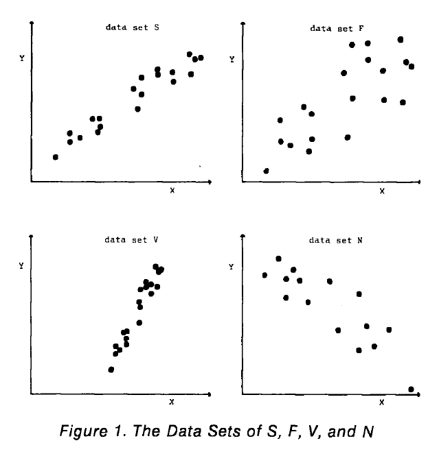
```

Recently, @ciccione2021can conducted a comprehensive set of studies investigating human ability to detect trends in graphical representations from a psychophysical approach.
Participants were asked to judge trends, estimate slopes, and conduct extrapolation. 
To estimate slopes, participants were asked to report the slope of the best-fitting regression line using a track-pad to adjust the tilt of a line on the screen. 
Results indicated the slopes participants reported were always in excess of the ideal slopes, both in the positive and in the negative direction, and those biases increase with noise and with number of points.
This supports the results found in Mosteller et al. (1981) and suggest that participants might use Deming regression [@deming1943statistical], which is equivalent to a regression equation based ont the first principal component or principal axes and minimizes the Euclidean distance of points from the line, when fitting a line to a noisy scatter-plot.

While not explicitly intended for perceptual testing, in 2015, the New York Times introduced an interactive feature, called 'You Draw It' [@aisch_cox_quealy_2015; @buchanan_park_pearce_2017; @katz_2017], where readers input their own assumptions about various metrics and compare how these assumptions relate to reality.
The New York Times team utilizes Data Driven Documents (D3) that allow readers to predict these metrics through the use of drawing a line on their computer screen with their computer mouse. 
\cref{fig:nyt-caraccidents} [@katz_2017] is one such example in which readers were asked to draw the line for the missing years providing what they estimated to be the number of Americans who have died every year from car accidents, since 1990.
After the reader completed drawing the line, the actual observed values were revealed and the reader was able to check their estimated knowledge against the actual reported data.

```{r nyt-caraccidents, fig.cap = "New York Times 'You Draw It' Feature", out.width="75%"}
knitr::include_graphics("images/02-you-draw-it/nyt-caraccidents-frame4.png")
```

### Data Driven Documents

Major news and research organizations such as the New York Times, FiveThirtyEight, Washington Post, and the Pew Research Center create and customize graphics with Data Driven Documents (D3).
In June 2020, the New York Times released a front page displaying figures that represent each of the 100,000 lives lost from the COVID-19 pandemic until that point in time [@NYTrememberinglives]; this visualization was meant to bring about a visceral reaction and resonate with readers. 
During 2021 March Madness, FiveThirtyEight created a roster-shuffling machine which allowed readers to build their own NBA contender through interactivity [@ryanabest_2021].
Data Driven Documents (D3) is an open-source JavaScript based graphing framework created by Mike Bostock during his time working on graphics at the New York Times.
For readers familiar with R, it is notable to consider D3 in JavaScript equivalent to the `ggplot2` package in R [@ggplot2]. 
Similar to geometric objects and style choices in `ggplot2`, the grammar of D3 also includes elements such as circles, paths, and rectangles with choices of attributes and styles such as color and size.
Data Driven Documents depend on Extensible Markup Language (XML) to generate graphics and images by binding objects and layers to the plotting area as Scalable Vector Graphics (SVG) in order to preserve the shapes rather than the pixels \pcref{fig:raster-vs-vector} [@raster_vs_svg].
Advantages of using D3 include animation and allowing for movement and user interaction such as hovering, clicking, and brushing. 

```{r raster-vs-vector, fig.cap = "SVG vs Raster", out.width="70%"}
knitr::include_graphics("images/02-you-draw-it/raster-vs-vector.png")
# https://commons.wikimedia.org/wiki/File:Bitmap_VS_SVG.svg
# https://creativecommons.org/licenses/by-sa/2.5/legalcode
```

A challenge of working with D3 is the environment necessary to display the graphics and images. 
The `r2d3` package in R provides an efficient integration of D3 visuals and R by displaying them in familiar HTML output formats such as RMarkdown or Shiny applications [@r2d3].
The creator of the graphic applies D3.js source code to visualize data which has previously been processed within an R setting. 

The example R code illustrates the structure of the `r2d3` function which includes specification of a data frame in R (converted to a JSON file), the D3.js source code file, and the D3 version that accompanies the source code.
A default SVG container for layering elements is then generated by the `r2d3` function which renders the plot using the source code. 
[Appendix A](#youdrawit-with-shiny) outlines the development of the 'You Draw It' interactive plots used in this study through the use of `r2d3` and R shiny applications. 
\cref{fig:youdrawit-example} provides an example of a 'You Draw It' interactive plot as was shown to participants during the study. 
The first frame shows what the participant saw along with the prompt, "Use your mouse to fill in the trend in the yellow box region". 
Next, the yellow box region moved along as the participant drew their trend-line until the yellow region disappeared, indicating the participant had filled in the entire domain.

```{r r2d3-example, echo = T, eval = F}
r2d3(data = data,
     script = "d3-source-code.js",
     d3_version= "5")
```

```{r youdrawit-example, fig.cap = "You Draw It Example", out.width="100%"}
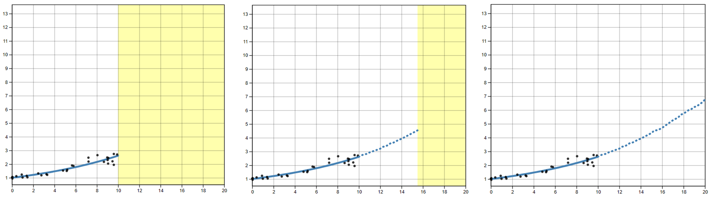
```

## Study Design

This chapter contains two sub-studies; the first aims to establish 'You Draw It' as a tool for measuring predictions of trends fitted by eye and a method for testing graphics, the second then applies 'You Draw It' to test an individual's ability to make predictions for exponentially increasing data on the log and linear scale.
The first sub-study, referred to as Eye Fitting Straight Lines in the Modern Era, was intended  to implement the ‘You Draw It’ feature as a way to measure the patterns we see in data. We validate the 'You Draw It' method for testing graphics by replicating the less technological study conducted by @mosteller_eye_1981.
Based on previous research, we hypothesize that visual regression tends to mimic principle component or Deming regression rather than an ordinary least squares regression. 
In order to assess this hypothesis, we introduce a method for statistically modeling the participant drawn lines using generalized additive mixed models (GAMM).
The second sub-study, referred to as Prediction of Exponential Trends, uses the established 'You Draw It' method to test an individual's ability to make predictions for exponentially increasing data on both the log and linear scales.
We then use the GAMMS to analyze participant drawn lines; a benefit of using a GAMM is the estimation of smoothing splines, allowing for flexibility in the residual trend and analysis of nonlinear trends.

A total of six data sets - four Eye Fitting Straight Lines in the Modern Era and two Prediction of Exponential Trends - are generated for each individual at the start of the experiment. 
The two simulated data sets corresponding to the simulated data models used in the Prediction of Exponential Trends sub-study are then plotted a total of four times each with different aesthetic and scale choices for a total of eight task plots. 
Participants in the study are first shown two 'You Draw It' practice plots followed by twelve 'You Draw It' task plots. 
The order of all twelve task plots was randomly assigned for each individual in a completely randomized design where users saw the four task plots from the Eye Fitting Straight Lines in the Modern Era sub-study interspersed with the eight task plots from the Prediction of Exponential Trends sub-study. 

The 'You Draw It' study in this chapter was completed second in the series of the three graphical studies and took about fifteen minutes for participants to complete drawn trend lines for the twelve 'You Draw It' task plots.
Participants completed the series of graphical tests using a R Shiny application found [here](https://shiny.srvanderplas.com/perception-of-statistical-graphics/). 
Participant recruitment and study deployment was conducted via Prolific, a crowd sourcing website, on Wednesday, March 23, 2022 during which a total of 302 individuals completed 1254 unique 'You Draw It' task plots for the first sub-study and 309 individuals completed 2520 unique 'You Draw It' task plots associated with the second sub-study.

## Eye Fitting Straight Lines in the Modern Era

@finney_subjective_1951 and @mosteller_eye_1981 use methods such as using a ruler, string, or transparency sheet to fit straight lines through a set of points.
This section replicates the study found in @mosteller_eye_1981 and extends this study with formal statistical analysis methods in order to establish 'You Draw It' as a tool and method for testing graphics.

### Data Generation

All data processing was conducted in R before being passed to the D3.js source code. 
A total of $N = 30$ points $(x_i, y_i), i = 1,...N$ were generated for $x_i \in [x_{min}, x_{max}]$ where $x$ and $y$ have a linear relationship.
Data were simulated based on linear model with additive errors: 
\begin{align}
y_i & = \beta_0 + \beta_1 x_i + e_i \\
\text{with } e_i & \sim N(0, \sigma^2). \nonumber
\end{align} 
The parameters $\beta_0$ and $\beta_1$ were selected to replicate @mosteller_eye_1981 with $e_i$ generated by rejection sampling in order to guarantee the points shown align with that of the fitted line. 
An ordinary least squares regression was then fit to the simulated points in order to obtain the best fit line and fitted values in 0.25 increments across the domain, $(x_k, \hat y_{k,OLS}), k = 1, ..., 4 x_{max} +1$.
The data simulation function then outputted a list of point data and line data both indicating the parameter identification, $x$ value, and corresponding simulated or fitted $y$ value.
The data simulation procedure is described in \cref{alg:eyefitting-algorithm}.

\begin{algorithm}
  \caption{Eye Fitting Straight Lines in the Modern Era Data Simulation}\label{alg:eyefitting-algorithm}
  \begin{algorithmic}[1]
    \Statex \textbullet~\textbf{Input Parameters:} $y_{\bar{x}}$ for calculating the y-intercept, $\beta_0$; slope $\beta_1$; standard deviation from line $\sigma$; sample size of points $N = 30$; domain $x_{min}$ and $x_{max}$; fitted value increment $x_{by} = 0.25$.
    \Statex \textbullet~\textbf{Output Parameters:} List of point data and line data each indicating the parameter identification, $x$ value, and corresponding simulated or fitted $y$ value.
    \State Randomly select and jitter $N = 30$ $x$ values along the domain, $x_{i=1:N}\in [x_{min}, x_{max}]$.
    \State Determine the $y$-intercept, $\beta_0$, at $x = 0$ from the provided slope ($\beta_1$) and $y$ value at the mean of $x$ ($y_{\bar{x}}$) using point-slope equation of a line.
    \State Generate "good" errors, $e_{i = 1:N}$ based on $N(0,\sigma)$ by setting a constraint requiring the mean of the first $\frac{1}{3}\text{N}$ errors $< |2\sigma|.$
    \State Simulate point data based on $y_i = \beta_0 + \beta_1 x_i + e_i$
    \State Obtain ordinary least squares regression coefficients, $\hat\beta_0$ and $\hat\beta_1$, for the simulated point data using the `lm` function in the `stats` package in base R.
    \State Obtain fitted values every 0.25 increment across the domain from the ordinary least squares regression $\hat y_{k,OLS} = \hat\beta_{0,OLS} + \hat\beta_{1,OLS} x_k$.
    \State Output data list of point data and line data each indicating the parameter identification, $x$ value, and corresponding simulated or fitted $y$ value.
  \end{algorithmic}
\end{algorithm}

```{r eyefitting-parameters}
data.frame(Parm = c("F", "N", "S", "V"),
           y_xbar = c(3.9, 4.11, 3.88, 3.89),
           slope = c(0.66, -0.70, 0.66, 1.98),
           sigma = c(1.98, 2.5, 1.3, 1.5)
           ) %>%
  mutate(Parm = factor(Parm, levels = c("S", "F", "V", "N"))) %>%
  arrange(Parm) %>%
  knitr::kable("latex", 
               digits = 2, 
               escape = F, 
               booktabs = T, 
               linesep = "", 
               align = "c", 
               label = "eyefitting-parameters",
               col.names = c("Parameter Choice", "$y_{\\bar{x}}$", "$\\beta_1$", "$\\sigma$"),
        caption = "Eye Fitting Straight Lines in the Modern Era simulation model parameters")
```

Simulated model equation parameters were selected to reflect the four data sets (F, N, S, and V) used in @mosteller_eye_1981 \pcref{tab:eyefitting-parameters}. 
Parameter choices F, N, and S simulated data across a domain of 0 to 20. 
Parameter choice F produced a trend with a positive slope and a large variance while N had a negative slope and a large variance. 
In comparison, S resulted a trend with a positive slope with a small variance and V yielded a steep positive slope with a small variance over the domain of 4 to 16. 
\cref{fig:eyefitting-simplot} illustrates an example of simulated data for all four parameter choices intended to reflect the trends seen in \cref{fig:mosteller-eyefitting-plot}.
Aesthetic design choices were made consistent across each of the interactive 'You Draw It' plots; the $y$-axis range extended 10\% beyond (above and below) the range of the simulated data points to allow for users to draw outside the simulated data set range and minimize participants anchoring their lines to the edges of the graph.

```{r eyefitting-simplot, fig.height = 8, fig.width = 8, fig.cap = "Eye Fitting Straight Lines in the Modern Era Simulated Data Example", out.width="100%", echo = F, messages = F, warning = F}

eyefitting_example_sim <- read_csv("data/02b-eyefitting/eyefitting-simdata-example.csv")
eyefitting_example_simplot <- eyefitting_example_sim %>%
  filter(data == "point_data") %>%
  filter(dataset %in% c("F", "N", "S") | (x < 16 & x > 4)) %>%
  mutate(dataset = factor(dataset, levels = c("S", "F", "V", "N"))) %>%
  dplyr::rename(`Parameter Choice` = dataset) %>%
  ggplot(aes(x = x, y = y)) +
  geom_point(size = 1) +
  facet_wrap(~`Parameter Choice`, labeller = labeller(`Parameter Choice` = label_both), ncol = 2) +
  theme_bw(base_size = 14) +
  theme(aspect.ratio = 1,
        legend.position = "none",
        plot.title   = element_text(size = 12, hjust = 0),
        axis.text    = element_text(size = 12),
        axis.title   = element_text(size = 12),
        legend.title = element_text(size = 12),
        legend.text  = element_text(size = 12),
        # strip.text = element_text(size = 5, margin = margin(0.05,0,0.05,0, "cm")),
        # strip.background = element_rect(size = 0.5),
        legend.key.size = unit(1, "line")
        ) 

eyefitting_example_simplot
```

### Results

In addition to the participant drawn points, $(x_k, y_{k,drawn})$, and the ordinary least squares (OLS) regression fitted values, $(x_k, \hat y_{k,OLS})$, a regression equation with a slope based on the first principal component (PCA) was used to calculate fitted values, $(x_k, \hat y_{k,PCA})$.
For each set of simulated data and parameter choice, the PCA regression slope, $\hat\beta_{1,PCA}$, and y-intercept, $\hat\beta_{0,PCA}$, were determined by using the `mcreg` function in the `mcr` package in R [@mcr_pkg] which implements Deming regression (equivalent to a regression based on the slope of the first principal component).
Fitted values, $\hat y_{k,PCA}$ were then obtained every 0.25 increment across the domain from the PCA regression equation, $\hat y_{k,PCA} = \hat\beta_{0,PCA} + \hat\beta_{1,PCA} x_k$.
\cref{fig:ols-vs-pca-example} illustrates the difference between an OLS regression equation which minimizes the vertical distance of points from the line and a regression equation with a slope calculated by the first principal component which minimizes the smallest distance of points from the line.

```{r ols-vs-pca-example, fig.height = 6, fig.width = 8, warning = F, message = F, fig.cap="OLS vs PCA Regression Lines", message=FALSE, warning=FALSE, out.width="100%"}
library(ggplot2)
library(magrittr)
library(plyr)

set.seed(2)
corrCoef = 0.5 # sample from a multivariate normal, 10 datapoints
dat = MASS::mvrnorm(10,c(0,0),Sigma = matrix(c(1,corrCoef,2,corrCoef),2,2))
dat[,1] = dat[,1] - mean(dat[,1]) # it makes life easier for the princomp
dat[,2] = dat[,2] - mean(dat[,2])

dat = data.frame(x1 = dat[,1],x2 = dat[,2])

# Calculate the first principle component
# see http://stats.stackexchange.com/questions/13152/how-to-perform-orthogonal-regression-total-least-squares-via-pca
v = dat%>%prcomp%$%rotation
x1x2cor = bCor = v[2,1]/v[1,1]

x1tox2 = coef(lm(x1~x2,dat))
x2tox1 = coef(lm(x2~x1,dat))
slopeData = data.frame(slope = c(x1x2cor,x2tox1[2]),
                       type=c("Principal Component", "Ordinary Least Squares"))

# We want this to draw the neat orthogonal lines.
pointOnLine = function(inp){
  # y = a*x + c (c=0)
  # yOrth = -(1/a)*x + d
  # yOrth = b*x + d
  x0 = inp[1] 
  y0 = inp[2] 
  a = x1x2cor
  b = -(1/a)
  c = 0
  d = y0 - b*x0
  x = (d-c)/(a-b)
  y = -(1/a)*x+d
  return(c(x,y))
}

points = apply(dat,1,FUN=pointOnLine)

segmeData = rbind(data.frame(x=dat[,1],y=dat[,2],xend=points[1,],yend=points[2,],type = "Principal Component"),
                  data.frame(x=dat[,1],y=dat[,2],yend=dat[,1]*x2tox1[2],xend=dat[,1],type="Ordinary Least Squares"))

ols_pca_plot <- dat %>%
ggplot(aes(x1,x2))+
  geom_point()+
  geom_abline(data=slopeData,aes(slope = slope,intercept=0,color=type, linetype=type), size = 1.2)+
  geom_segment(data=segmeData,aes(x=x,y=y,xend=xend,yend=yend,color=type, linetype=type))+
  facet_grid(.~type)+
  coord_equal()+
  scale_x_continuous("x") +
  scale_y_continuous("y") +
  theme_bw(base_size = 14) +
  theme(aspect.ratio = 1,
        legend.position = "none",
        axis.text    = element_text(size = 12),
        axis.title   = element_text(size = 12),
        legend.title = element_blank(),
        # legend.text  = element_text(size = 10),
        # strip.text = element_text(size = 8, margin = margin(0.1,0,0.1,0, "cm")),
        # strip.background = element_rect(size = 0.8),
        legend.key.size = unit(1, "line")
        ) +
  scale_color_manual(values = c("steelblue", "orange"), labels = c("OLS", "PCA")) +
  scale_linetype_manual(values = c("solid", "dashed"), labels = c("OLS", "PCA"))
ols_pca_plot
```

<!-- To calculate the first principal component fit: https://benediktehinger.de/blog/science/scatterplots-regression-lines-and-the-first-principal-component/ -->

For each participant, the final data set used for analysis contains $x_{ijk}, y_{ijk,drawn}, \hat y_{ijk,OLS}$, and $\hat y_{ijk,PCA}$ for parameter choice $i = 1,2,3,4$, $j = 1,...N_{participant}$, and $x_{ijk}$ value $k = 1, ...,4 x_{max} + 1$. 
Using both a linear mixed model (LMM) and a generalized additive mixed model (GAMM), comparisons of vertical residuals in relation to the OLS fitted values ($e_{ijk,OLS} = y_{ijk,drawn} - \hat y_{ijk,OLS}$) and PCA fitted values ($e_{ijk,PCA} = y_{ijk,drawn} - \hat y_{ijk,PCA}$) were made across the domain.
\cref{fig:eyefitting-example-plot} displays an example of all three fitted trend lines for parameter choice F.

```{r eyefitting-example-plot, fig.height = 6, fig.width = 6, warning = F, message = F, fig.cap = "Eye Fitting Straight Lines in the Modern Era Example", out.width="100%"}

eyefitting_example <- eyefitting_model_data %>%
  # filter(participant_id == "65c10d498eae365e108efcd3dcb75287", parm_id == "N") %>%
  filter(participant_id == "60b16b9bd5a122c1457d31055df51a45", `Parameter Choice` == "F") %>%
  ggplot(aes(x = x)) +
  geom_line(aes(y = yols, color = "OLS", linetype = "OLS")) +
  geom_line(aes(y = ypca, color = "PCA", linetype = "PCA")) +
  geom_line(aes(y = ydrawn, color = "Drawn", linetype = "Drawn")) +
  geom_point(data = eyefitting_simulated_data %>%
               filter(dataset == "point_data", participant_id == "60b16b9bd5a122c1457d31055df51a45", `Parameter Choice` == "F"),
             aes(x = x, y = y)) +
  facet_wrap(~`Parameter Choice`, labeller = labeller(`Parameter Choice` = label_both)) +
  theme_bw(base_size = 14) +
  theme(aspect.ratio = 1,
        legend.position = "bottom",
        axis.text    = element_text(size = 12),
        axis.title   = element_text(size = 12),
        legend.title = element_text(size = 12),
        legend.text  = element_text(size = 12),
        # strip.text = element_text(size = 8, margin = margin(0.1,0,0.1,0, "cm")),
        # strip.background = element_rect(size = 0.8),
        legend.key.size = unit(1, "line")
        ) +
  scale_x_continuous(limits = c(0,20)) +
  scale_color_manual("", values = c("black", "steelblue", "orange")) +
  scale_linetype_manual("", values = c("dashed", "solid", "solid")) +
  scale_y_continuous("y")

eyefitting_example
```

Using the `lmer` function in the `lme4` package [@lme4], a LMM is fit separately to the OLS and PCA residuals, constraining the fit to a linear trend. 
Parameter choice, $x$, and the interaction between $x$ and parameter choice were treated as fixed effects with a random participant effect accounting for variation due to participant.
The LMM equation for each fit (OLS and PCA) residuals is given by:
\begin{equation}
y_{ijk,drawn} - \hat y_{ijk,fit} = e_{ijk,fit} = \left[\gamma_0 + \alpha_i\right] + \left[\gamma_{1} x_{ijk} + \gamma_{2i} x_{ijk}\right] + p_{j} + \epsilon_{ijk}
\end{equation}
\noindent where

+ $y_{ijk,drawn}$ is the drawn y-value for the $i^{th}$ parameter choice, $j^{th}$ participant, and $k^{th}$ increment of x-value
+ $\hat y_{ijk,fit}$ is the fitted y-value for the $i^{th}$ parameter choice, $j^{th}$ participant, and $k^{th}$ increment of x-value corresponding to either the OLS or PCA fit
+ $e_{ijk,fit}$ is the residual between the drawn and fitted y-values for the $i^{th}$ parameter choice, $j^{th}$ participant, and $k^{th}$ increment of x-value corresponding to either the OLS or PCA fit
+ $\gamma_0$ is the overall intercept
+ $\alpha_i$ is the effect of the $i^{th}$ parameter choice (F, S, V, N) on the intercept
+ $\gamma_1$ is the overall slope for $x$
+ $\gamma_{2i}$ is the effect of the parameter choice on the slope
+ $x_{ijk}$ is the x-value for the $i^{th}$ parameter choice, $j^{th}$ participant, and $k^{th}$ increment
+ $p_{j} \sim N(0, \sigma^2_{participant})$ is the random error due to the $j^{th}$ participant's characteristics
+ $\epsilon_{ijk} \sim N(0, \sigma^2)$ is the residual error.

Eliminating the linear trend constraint, the `bam` function in the `mgcv` package [@mgcv1; @mgcv2; @mgcv3; @mgcv4; @mgcv5] is used to fit a GAMM separately to the OLS and PCA residuals to allow for estimation of smoothing splines.
Parameter choice was treated as a fixed effect with no estimated intercept and a separate smoothing spline for $x$ was estimated for each parameter choice. 
A random participant effect accounting for variation due to participant and a random spline for each participant accounted for variation in spline for each participant.
The GAMM equation for each fit (OLS and PCA) residuals is given by:
\begin{equation}
y_{ijk, drawn} - \hat y_{ijk, fit} = e_{ijk,fit} = \alpha_i + s_{i}(x_{ijk}) + p_{j} + s_{j}(x_{ijk})
\end{equation}
\noindent where

+ $y_{ijk,drawn}$ is the drawn y-value for the $i^{th}$ parameter choice, $j^{th}$ participant, and $k^{th}$ increment of x-value
+ $\hat y_{ijk,fit}$ is the fitted y-value for the $i^{th}$ parameter choice, $j^{th}$ participant, and $k^{th}$ increment of x-value corresponding to either the OLS or PCA fit
+ $e_{ijk,fit}$ is the residual between the drawn and fitted y-values for the $i^{th}$ parameter choice, $j^{th}$ participant, and $k^{th}$ increment of x-value corresponding to either the OLS or PCA fit
+ $\alpha_i$ is the intercept for the parameter choice $i$
+ $s_{i}$ is the smoothing spline for the $i^{th}$ parameter choice
+ $x_{ijk}$ is the x-value for the $i^{th}$ parameter choice, $j^{th}$ participant, and $k^{th}$ increment
+ $p_{j} \sim N(0, \sigma^2_{participant})$ is the error due to participant variation
+ $s_{j}$ is the random smoothing spline for each participant.

\cref{fig:eyefitting-lmer-residualplots} and \cref{fig:eyefitting-gamm-residualplots} show the estimated trends of residuals (vertical deviation of participant drawn points from both the OLS and PCA fitted points) as modeled by a LMM and GAMM respectively. 
A random sample of 75 participants was selected to display individual participant residuals behind the overall residual trend.
Examining the plots, the estimated trends of PCA residuals (orange) appear to align more parallel and closer to the $y=0$ horizontal (dashed) line than the OLS residuals (blue). 
In particular, this trend is more prominent in parameter choices with large variances (F and N).
These results are consistent to those found in @mosteller_eye_1981 indicating participants fit a trend line closer to the estimated regression line with the slope of the first principal component than the estimated OLS regression line.
This study established 'You Draw It' as a method for graphical testing and reinforced the differences between intuitive visual model fitting and statistical model fitting, providing information about human perception as it relates to the use of statistical graphics.

```{r eyefitting-lmer-residualplots, warning = F, message = F, fig.height = 9, fig.width = 9, out.width = "100%", fig.cap = "Eye Fitting Straight Lines in the Modern Era LMM results", dev='png'}

set.seed(68505)
participant_sample <- sample(unique(eyefitting_model_data$prolific_id), 75)

# Plot Predictions
eyefitting_lmer_plot <- eyefitting_lmer_preds %>%
  filter((`Parameter Choice` %in% c("F", "N", "S") | (x <= 16 & x >= 4))) %>%
  mutate(`Parameter Choice` = factor(`Parameter Choice`, levels = c("S", "F", "V", "N"))) %>%
  ggplot(aes(x = x)) +
  geom_line(data = eyefitting_model_data %>% 
              filter(prolific_id %in% participant_sample), 
            aes(x = x, y = residual_ols_loess, group = plot_id, color = "OLS"), alpha = 0.1) +
  geom_line(data = eyefitting_model_data %>% 
              filter(prolific_id %in% participant_sample), 
            aes(x = x, y = residual_pca_loess, group = plot_id, color = "PCA"), alpha = 0.1) +
  geom_ribbon(aes(ymin = asymp.LCL.ols, ymax = asymp.UCL.ols, fill = "OLS"), color = NA, alpha = 0.4) +
  geom_line(aes(y = emmean.ols, color = "OLS")) +
  geom_ribbon(aes(ymin = asymp.LCL.pca, ymax = asymp.UCL.pca, fill = "PCA"), color = NA, alpha = 0.4) +
  geom_line(aes(y = emmean.pca, color = "PCA")) +
  geom_hline(yintercept = 0, linetype = "dashed", alpha = 0.5) +
  facet_wrap(~`Parameter Choice`, labeller = labeller(`Parameter Choice` = label_both), scales = "free") +
  theme_bw(base_size = 14) +
  theme(aspect.ratio = 1,
        legend.position = "right",
        plot.title   = element_text(size = 12, hjust = 0),
        axis.text    = element_text(size = 12),
        axis.title   = element_text(size = 12),
        legend.title = element_text(size = 12),
        legend.text  = element_text(size = 12),
        # strip.text = element_text(size = 5, margin = margin(0.05,0,0.05,0, "cm")),
        # strip.background = element_rect(size = 0.5),
        legend.key.size = unit(1, "line")
        ) +
  scale_y_continuous("Residual", limits = c(-5,5), breaks = seq(-5,5,2.5)) +
  scale_color_manual("Individual participant \nresiduals", values = c("steelblue", "orange"), labels = c("OLS", "PCA")) +
  scale_fill_manual("LMER fitted trend", values = c("steelblue", "orange"), labels = c("OLS", "PCA"))  +
  guides(color = guide_legend(override.aes = list(alpha = 1)),
         fill = guide_legend(override.aes = list(alpha = 1)))

eyefitting_lmer_plot
```

```{r eyefitting-gamm-residualplots, warning = F, message = F, fig.height = 9, fig.width = 9, out.width = "100%", fig.cap = "Eye Fitting Straight Lines in the Modern Era GAMM results", dev='png'}

eyefitting_gamm_plot <- eyefitting_gamm_preds %>%
  filter((`Parameter Choice` %in% c("F", "N", "S") | (x <= 16 & x >= 4))) %>%
  mutate(`Parameter Choice` = factor(`Parameter Choice`, levels = c("S", "F", "V", "N"))) %>%
  ggplot(aes(x = x)) +
  geom_line(data = eyefitting_model_data %>% 
              filter(prolific_id %in% participant_sample), 
            aes(x = x, y = residual_ols_loess, group = plot_id, color = "OLS"), alpha = 0.1) +
  geom_line(data = eyefitting_model_data %>% 
              filter(prolific_id %in% participant_sample), 
            aes(x = x, y = residual_pca_loess, group = plot_id, color = "PCA"), alpha = 0.1) +
  geom_ribbon(aes(ymin = ols.lower, ymax = ols.upper, fill = "OLS"), color = NA, alpha = 0.4) +
  geom_line(aes(y = ols.pred, color = "OLS")) +
  geom_ribbon(aes(ymin = pca.lower, ymax = pca.upper, fill = "PCA"), color = NA, alpha = 0.4) +
  geom_line(aes(y = pca.pred, color = "PCA")) +
  geom_hline(yintercept = 0, linetype = "dashed", alpha = 0.5) +
  facet_wrap(~`Parameter Choice`, labeller = labeller(`Parameter Choice` = label_both), scales = "free") +
  theme_bw(base_size = 14) +
  theme(aspect.ratio = 1,
        legend.position = "right",
        plot.title   = element_text(size = 12, hjust = 0),
        axis.text    = element_text(size = 12),
        axis.title   = element_text(size = 12),
        legend.title = element_text(size = 12),
        legend.text  = element_text(size = 12),
        # strip.text = element_text(size = 5, margin = margin(0.05,0,0.05,0, "cm")),
        # strip.background = element_rect(size = 0.5),
        legend.key.size = unit(1, "line")
        ) +
  scale_y_continuous("Residual", limits = c(-5,5), breaks = seq(-5,5,2.5)) +
  scale_color_manual("Individual participant \nresiduals", values = c("steelblue", "orange"), labels = c("OLS", "PCA")) +
  scale_fill_manual("GAMM fitted trend", values = c("steelblue", "orange"), labels = c("OLS", "PCA"))   +
  guides(color = guide_legend(override.aes = list(alpha = 1)),
         fill = guide_legend(override.aes = list(alpha = 1)))

eyefitting_gamm_plot
```

## Prediction of Exponential Trends

The results from the first sub-study validated 'You Draw It' as a tool for testing graphics. 
This sub-study was designed to test an individual's ability to make predictions for exponentially increasing data on both the log and linear scales, addressing cognitive understanding of log scales.
Participants were asked to draw a line using their computer mouse through the exponentially increasing trend shown on both the log and linear scale. 

### Data Generation

All data processing was conducted in R before being passed to the D3.js source code. 
A total of $N = 30$ points $(x_i, y_i), i = 1,...N$ were generated for $x_i\in [x_{min}, x_{max}]$ where $x$ and $y$ have an exponential relationship.
Data were simulated based on a one parameter exponential model with multiplicative errors: 
\begin{align}
y_i & = e^{\beta x_i + e_i} \\
\text{with } e_i & \sim N(0, \sigma^2). \nonumber
\end{align} 
The parameter, $\beta$, was selected to reflect the rate of exponential growth with $e_i$ generated by rejection sampling in order to guarantee the points shown align with that of the fitted line displayed in the initial plot frame. 
A nonlinear least squares regression is then fit to the simulated points in order to obtain the best fit line and fitted values in 0.25 increments across the domain, $(x_m, \hat y_{m,NLS}), k = 1, ..., 4 x_{max} +1$.
The data simulation function then outputs a list of point data and line data both indicating the parameter identification, $x$ value, and corresponding simulated or fitted $y$ value.
The data simulation procedure is described in \cref{alg:exponential-prediction-alg}.

\begin{algorithm}
  \caption{Prediction of Exponential Trends Data Simulation}\label{alg:exponential-prediction-alg}
  \begin{algorithmic}[1]
    \Statex \textbullet~\textbf{Input Parameters:} $\beta$ growth rate; standard deviation from exponential curve $\sigma$; sample size of points $N = 30$; domain $x_{min}$ and $x_{max}$; fitted value increment $x_{by} = 0.25$.
    \Statex \textbullet~\textbf{Output Parameters:} List of point data and line data each indicating the parameter identification, $x$ value, and corresponding simulated or fitted $y$ value.
    \State Randomly select and jitter $N = 30$ $x$-values along the domain, $x_{i=1:N}\in [0, 20]$.
    \State Generate "good" errors, $e_{i = 1:N}$ based on $N(0,\sigma)$ by setting a constraint requiring the mean of the first $\frac{1}{3} N$ errors $< |2\sigma|.$
    \State Simulate point data based on $y_i = e^{\beta x_i + e_i}$.
    \State Fit the equation $\log(y_i) = \beta x_i$ to obtain an estimated starting value $\beta_0$. 
    \State Obtain nonlinear least squares regression coefficient, $\hat\beta_{NLS}$, for the simulated point data fitting using the `nls` function in the base `stats` R package.
    \State Obtain fitted values every 0.25 increment across the domain from the nonlinear least squares regression $\hat y_{m,NLS} = e^{\hat\beta_{NLS} x_m}$.
    \State Output data list of point data and line data each indicating the parameter identification, $x$ value, and corresponding simulated or fitted $y$ value.
  \end{algorithmic}
\end{algorithm}

Model equation parameter, $\beta$, was selected to reflect two exponential growth rates (low: $\beta = 0.10, \sigma = 0.09$ and high: $\beta = 0.23, \sigma = 0.25$) as determined by visual inspection with growth rate parameter selection from the lineup study in [Chapter 2](#lineups-parameter-selection) used as a starting point.
<!-- Visit [You Draw It Development - parameter selection](https://emily-robinson.shinyapps.io/you-draw-it-parameter-selection/) for examples. -->
Each growth rate parameter was used to simulate data across a domain of 0 to 20.
The two simulated data sets (low and high exponential growth rates) were then shown four times each by truncating the points shown at both 50\% and 75\% of the domain as well as on both the log and linear scales for a total of eight interactive plots reflecting a factorial treatment design. 
[Appendix B](#exponential-prediction-plots) displays visual examples of all eight interactive plots.
Aesthetic design choices were made consistent across each of the interactive 'You Draw It' plots; the $y$-axis extended 50\% below the lower limit of the simulated data range and 200\% beyond the upper limit of the simulated data range to allow for users to draw outside the data set range, and participants were asked to start drawing at 50\% of the domain (for example, at $x = 10$).
Reflecting the treatment design for each plot, the y-axis was assigned to be displayed on either the linear scale or log scale.

### Results

A LOESS smoother (local regression) was fit to each user line to allow for visual inspection.
For each participant $l = 1,...N_{participant}$, the final data set used for analysis contained $x_{ijklm}, y_{ijklm,drawn}, \hat y_{ijklm,loess}$, and $\hat y_{ijklm,NLS}$ for growth rate $i = 1,2$, points truncated $j = 1,2$, scale $k = 1,2$ and $x_{ijklm}$ value for increment $m = 1, ...,81$. 
\cref{fig:exponential-yloess-spaghetti-plot} displays spaghetti plots for each of the eight treatment combinations.
The spaghetti plot with a high growth rate suggests participants underestimated the exponential trend when asked to draw a trend line on the linear scale compared to when asked to draw a trend line on the log scale.
In particular, this suggestion is most noticeable when points are truncated at 50\% with the underestimation beginning at a later $x$ value when points are truncated at 75\%. 

```{r exponential-yloess-spaghetti-plot, message=FALSE, warning=FALSE, fig.height = 9, fig.width = 9, out.width = "100%", fig.cap = "Exponential Prediction Spaghetti Plot", dev='png'}

spaghetti_plot <- youdrawit_model_data %>%
  ggplot(aes(x = x)) +
  geom_line(aes(y = yloess, group = plot_id, color = scale), alpha = 0.2) +
  geom_ribbon(data = youdrawit_simulated_band, aes(ymin = min_ynls, ymax = max_ynls, fill = "Fitted NLS", group = NA), color = NA, alpha = 0.35) +
  facet_grid(`Growth Rate` ~ `Points Truncated`, scales = "free", labeller = labeller(`Growth Rate` = label_both, `Points Truncated` = label_both)) +
  theme_bw() +
  theme(aspect.ratio = 1,
        legend.position = "bottom"
        ) +
  scale_color_manual("", values = c("steelblue", "orange"), labels = c("Linear Scale \n (drawn, loess)", "Log Scale \n (drawn, loess)")) +
  scale_fill_manual("", values = c("black"), labels = c("Fitted Band \n (NLS)")) +
  scale_x_continuous(limits = c(10, 20)) +
  scale_y_continuous("y") +
  guides(color = guide_legend(override.aes = list(alpha = 1)),
         fill = guide_legend(override.aes = list(alpha = 0.5)))
spaghetti_plot
```

Allowing for flexibility, the `bam` function in the `mgcv` package [@mgcv1; @mgcv2; @mgcv3; @mgcv4; @mgcv5] was used to fit a GAMM to estimate trends of vertical residuals from the participant drawn line in relation to the NLS fitted values ($e_{ijklm,NLS} = y_{ijklm,drawn} - \hat y_{ijklm,NLS}$) across the domain. 
The combination between growth rate, point truncation, and scale was treated as a fixed effect with no estimated intercept and a separate smoothing spline for $x$ was estimated for each treatment combination. 
A random participant effect accounting for variation due to participant and a random spline for each participant accounted for variation in spline for each participant.
The GAMM equation for residuals is given by:
\begin{equation}
y_{ijklm,drawn} - \hat y_{ijklm,NLS} = e_{ijklm,nls} = \tau_{ijk} + s_{ijk}(x_{ijklm}) + p_{l} + s_{l}(x_{ijklm})
\end{equation}
\noindent where

+ $y_{ijklm,drawn}$ is the drawn y-value for the $l^{th}$ participant, $m^{th}$ increment, and $ijk^{th}$ treatment combination 
+ $\hat y_{ijklm,NLS}$ is the NLS fitted y-value for the $l^{th}$ participant, $m^{th}$ increment, and $ijk^{th}$ treatment combination 
+ $e_{ijklm,NLS}$ is the residual between the drawn y-value and fitted y-value for the $l^{th}$ participant, $m^{th}$ increment, and $ijk^{th}$ treatment combination 
+ $\tau_{ijk}$ is the intercept for the $i^{th}$ growth rate, $j^{th}$ point truncation, and $k^{th}$ scale treatment combination
+ $s_{ijk}$ is the smoothing spline for the $ijk^{th}$ treatment combination
+ $x_{ijklm}$ is the x-value for the $l^{th}$ participant, $m^{th}$ increment, and $ijk^{th}$ treatment combination 
+ $p_{l} \sim N(0, \sigma^2_{participant})$ is the error due to the $l^{th}$ participant's characteristics 
+ $s_{l}$ is the random smoothing spline for the $l^{th}$ participant.

\cref{fig:exponential-prediction-gamm-preds} shows the estimated trends of the residuals (vertical deviation of participant drawn points from NLS fitted points) as modeled by the GAMM. 
Examining the plots, the estimated trends of residuals for predictions made on the linear scale (blue) appear to deviate from the  $y=0$ horizontal (dashed) line indicating underestimation of exponential growth.
In comparisons, the estimated trends of residuals for predictions made on the log scale (orange) follow closely to the $y=0$ horizontal (dashed) line, implying exponential trends predicted on the log scale are more accurate than those predicted on the linear scale.
In particular, this trend is more prominent in high exponential growth rates where underestimation becomes prominent after the aid of points is removed.

```{r exponential-prediction-gamm-preds, message=FALSE, warning=FALSE, fig.height = 9, fig.width = 9, out.width = "100%", fig.cap = "Exponential Prediction GAMM Results", dev='png'}

set.seed(68505)
participant_sample2 <- sample(unique(youdrawit_model_data$prolific_id), 75)

gamm_plot_0.1 <- youdrawit_preds_gamm_0.1 %>%
  ggplot(aes(x = x, y = estimate, group = scale, color = scale, fill = scale)) +
  geom_line(data = youdrawit_model_data %>% 
              filter(beta == "beta0.1", prolific_id %in% participant_sample2), 
            aes(x = x, y = residual_nls_drawn, group = plot_id), alpha = 0.1) +
  geom_ribbon(aes(ymin = lower, ymax = upper), color = NA, alpha = 0.4) +
  geom_line() +
  geom_hline(yintercept = 0, linetype = "dashed") +
  facet_grid(`Growth Rate` ~ `Points Truncated`, scales = "free", labeller = labeller(`Growth Rate` = label_both, `Points Truncated` = label_both)) +
  theme_bw() +
  theme(aspect.ratio = 1) +
  scale_y_continuous("Residual \n (ydrawn - ynls)", limits = c(-8, 8), breaks = seq(-10,10,2)) +
  scale_color_manual("Individual participant \nresiduals", values = c("steelblue", "orange2"), labels = c("Linear scale", "Log scale")) +
  scale_fill_manual("GAMM fitted trend", values = c("steelblue", "orange2"), labels = c("Linear scale", "Log scale")) +
  guides(color = guide_legend(override.aes = list(alpha = 1)),
         fill = guide_legend(override.aes = list(alpha = 1)))

gamm_plot_0.23 <- youdrawit_preds_gamm_0.23 %>%
  ggplot(aes(x = x, y = estimate, group = scale, color = scale, fill = scale)) +
  geom_line(data = youdrawit_model_data %>% 
              filter(beta == "beta0.23", prolific_id %in% participant_sample2), 
            aes(x = x, y = residual_nls_drawn, group = plot_id), alpha = 0.1) +
  geom_ribbon(aes(ymin = lower, ymax = upper), color = NA, alpha = 0.4) +
  geom_line() +
  geom_hline(yintercept = 0, linetype = "dashed") +
  facet_grid(`Growth Rate` ~ `Points Truncated`, scales = "free", labeller = labeller(`Growth Rate` = label_both, `Points Truncated` = label_both)) +
  theme_bw() +
  theme(aspect.ratio = 1) +
  scale_y_continuous("Residual \n (ydrawn - ynls)", limits = c(-150, 225), breaks = seq(-200,200,50)) +
  scale_color_manual("Individual participant \nresiduals", values = c("steelblue", "orange2"), labels = c("Linear scale", "Log scale")) +
  scale_fill_manual("GAMM fitted trend", values = c("steelblue", "orange2"), labels = c("Linear scale", "Log scale")) +
  guides(color = guide_legend(override.aes = list(alpha = 1)),
         fill = guide_legend(override.aes = list(alpha = 1)))

gamm_plot_0.1/
gamm_plot_0.23
```

<!-- + advocate smoothing of scatterplots to assist in detecting the shape of the point cloud in situations where the error in the data is substantial, or where the density of points changes along the abscissa @cleveland_graphical_1984 -->

## Discussion and Conclusion

The intent of this chapter was to establish 'You Draw It' as a method and tool for testing graphics then use this tool to determine the cognitive implications of displaying data on the log scale.
Eye Fitting Straight Lines in the Modern Era replicated the results found in @mosteller_eye_1981. 
When shown points following a linear trend, participants tended to fit the slope of the first principal component over the slope of the least squares regression line.
This trend was most prominent when shown data simulated with larger variances. 
The reproducibility of these results serve as evidence of the reliability of the 'You Draw It' method.

In Prediction of Exponential Trends, the 'You Draw It' method was used to test an individual's ability to make predictions for exponentially increasing data.
Results indicate that underestimation of exponential growth occurs when participants were asked to draw trend lines on the linear scale and that there was an improvement in accuracy when trends were drawn on the log scale. 
This phenomena is strongly supported for high exponential growth rates.
Improvement in predictions are made when points along the exponential trend are shown as indicated by the discrepancy in results for treatments with points truncated at 50\% compared to 75\% of the domain. 

The results of this study suggest that there are cognitive advantages to log scales when making predictions of exponential trends.
Improvement in predictions were made for trends with high exponential growth rates when participants were asked to draw a trend line on the log scale compared to the linear scale. 
Further investigation is necessary to determine the implications of using log scales when translating exponential graphs to numerical values. 

<!--chapter:end:03-youdrawit.Rmd-->

# Numerical Translation and Estimation {#estimation}

```{r estimation-setup, message=FALSE, warning=FALSE, echo = F}
library(tidyverse)
library(patchwork)
library(ggforce)
library(ggpubr)
library(here)
library(readr)
library(knitr)
library(kableExtra)
# library(pander)

library(ggwordcloud)
library(wordcloud)
library(RColorBrewer)
library(wordcloud2)
library(tm) 
library(tidytext)
library(corpus)
library(reshape2)
```

```{r estimation-data, message=FALSE, warning=FALSE, echo = F}
estimation_model_data <- read_csv("data/03-estimation/estimation-model-data.csv")
q0_text_summary <- read_csv("data/03-estimation/q0-text-summary.csv")
estimation_simulated_data <- read_csv("data/03-estimation/estimation-simulated-data.csv") %>%
  mutate(x = x - 3000)
estimation_scenario_text <- read_csv("data/03-estimation/estimation-scenario-text.csv")
estimation_parameters <- read_csv("data/03-estimation/estimation-parameters.csv")
estimation_questions <- read_csv("data/03-estimation/estimation-questions.csv")
population_estimates_data <- read_csv("data/03-estimation/first-level-population-estimates.csv")

grid_lines_data <- tibble(scale = c(rep("linear", 12), rep("log2", 10)), 
                          grid_lines = c(seq(0,55000, 5000),
                                         2^seq(7,16))
) %>%
  expand_grid(dataset = c("dataset1", "dataset2"))
```

```{r density-plot}
densityPlot <- function(data, datasetID, estimate, xlabel = "Estimate", x_limits = c(0,70000), zoom = F, scalesx = T, zoom_limits = c(NA,NA), gridlines = T, rugjitter = 0.25){
  
  estPlot <- data %>%
    filter(dataset %in% datasetID) %>%
    ggplot(aes_string(x = estimate, fill = "scale", color = "scale")) +
    geom_density(alpha = 0.5, color = NA) +
    geom_rug(aes(y = -Inf), alpha = 0.8, show.legend = F, position = position_jitter(width = rugjitter, height = 0)) +
    geom_vline(aes(xintercept = true_value, linetype = "a")) +
    geom_vline(aes(xintercept = closest_pt_value, linetype = "b"))
  
  if(gridlines){
  estPlot <- estPlot + 
    geom_vline(data = grid_lines_data %>% filter(dataset == "dataset1", grid_lines >= x_limits[1], grid_lines <= x_limits[2]),
               aes(xintercept = grid_lines, color = scale, linetype = "c"))
  }
  
  estPlot <- estPlot +
    theme_bw() +
    theme(aspect.ratio = 0.5) +
    scale_color_manual("Scale", values = c("steelblue", "orange3")) +
    scale_fill_manual("Scale", values = c("steelblue", "orange3")) +
    scale_linetype_manual("", labels = c("True Value", "Closest Point Value", "Grid Line Breaks"), values = c("solid", "dashed", "dotted")) +
    scale_y_continuous("Density", labels = scales::comma)
  
  if(zoom){
  estPlot <- estPlot +
    facet_zoom(xlim = zoom_limits)
  }
  
  if(scalesx){
    estPlot <- estPlot +
    scale_x_continuous(xlabel, limits = x_limits)
  }
    
  return(estPlot)
  
}
```

## Introduction

The previous two chapters explored the use of log scales through differentiation and visual prediction of trends. 
These graphical tasks were conducted independent of scenarios or contextual applications of log scales; instead, they focused how our visual system perceives and identifies patterns in exponential growth.
In order to understand the cognitive implications of displaying exponentially increasing data on a log scale, it is essential to evaluate graph comprehension as it relates to the contextual scenario of the data shown.
This is a complex inferential process which requires participants to engage with the data by quantitatively transforming information in the chart [@cleveland_graphical_1984; @cleveland_graphical_1985].
In this study, we asked participants to translate a graph of exponentially increasing data into real value quantities and extend their estimations by comparing two data points.

<!-- Such complex inferential processes involve quantitatively transforming the information in the display (e.g., mentally transforming from a linear to log scale or calculating the difference between two or more data points; Cleveland, 1984, 1985). -->

### Graph Comprehension

Graph comprehension is heavily dependent on the questions being asked of the viewer; therefore, questioning is an important aspect of comprehension and must be given deliberate consideration [@graesser2014new]. 
Evaluation of how viewers explore a new and complex graphic requires long-term interaction with the chart displaying the data [@becker2019trackr]. 
While it is difficult to obtain an accurate representation of a viewers understanding of the graphic with a fixed set of numerical estimates, three levels of graph comprehension have emerged from literature [@wood1968objectives; @curcio1987comprehension; @jolliffe1991assessment; @friel2001making; @glazer2011challenges].
The three behaviors related to graph comprehension involve (1) literal reading of the data (elementary level), (2) reading between the data (intermediate level), and (3) reading beyond the data (advanced level).

### Estimation Biases

Certain well-known biases such as the tendency to round to multiples of five or ten or to anchor estimates to visual cues arise from open-ended estimation tasks [@tan1990processing].
Viewers may anchor their estimates to grid lines or round their approximations to rounded figures due to natural preference [@tan1994human; @godlonton2018anchoring; @myers1954accuracy].
Estimation accuracy is also affected by scale and axis labels [@dunham1991learning]; when alternate grid lines are labeled, viewers often read unlabeled grid lines as halves [@beeby1973well].
This misrepresentation is highlighted for asymmetric scales, such as a log scale, since spatial distance does not equate to numerical or quantitative difference.
Therefore, careful consideration must be given to the choice of scale for the graphic and how the viewer will interpret the data and information displayed.

## Study Design

Participants in this study were asked to answer six questions related to each of two contextual scenarios and an associated scatter plot shown for a total of twelve questions. 
The text for each scenario is presented below; the context of both scenarios was selected to be similar.
Each text describes a situation in which a fictional intergalactic species is exponentially increasing in population over a time measure adjusted to reflect the popular culture media depiction of that species [@star_wars1; @star_wars2; @star_trek]. 
For simplicity, we will refer to these fictional time components as a year throughout the rest of the chapter.

\begin{quote}
\textbf{\textit{Tribble scenario.}} Hi, we're Tribbles! We were taken from our native planet, Iota Germinorum IV, and brought abroad Starfleet in stardate 4500. A Starfleet scientist, Edward Larkin, genetically engineered us to increase our reproductive rate in an attempt to solve a planetary food shortage. The Tribble population on Starfleet over the next 50 Stardates (equivalent to 1 week universe time) is illustrated in the graph. We need your help answering a few questions regarding the population of Tribbles.

\textbf{\textit{Ewok scenario.}} Hi, we're Ewoks! We are native to the forest moon of Endor. After the Galactic Civil War, some Ewoks traveled offworld to help Rebel veterans as 'therapy Ewoks' and began to repopulate. The Ewok population After the Battle of Yavin (ABY) is illustrated in the graph. We need your help answering a few questions regarding the population of Ewoks offworld.
\end{quote}

Fictional illustrations of the figures used in context were modified from artwork by @allison_horst and included on the main page for each scenario.
The scale of the graphic and data set displayed was randomly assigned to scenarios for each individual.
For instance, a participant may have seen a scatter plot of data set two displayed on the linear scale paired with the Ewok scenario text and a scatter plot of data set one displayed on the log scale paired with the Tribble scenario text.
The order of the two scenarios and their assigned data set and scale was randomly assigned to each individual.

We selected the six questions \pcref{tab:estimation-questions-table} for graph comprehension based on the three defined levels of questioning.
In each scenario, participants were first asked an open ended question, which required them to spend time exploring the data displayed in the graphic, followed by a random order of two elementary level questions and three intermediate level questions.
We did not focus on advanced level questioning since extrapolation and interpolation was addressed in [Chapter 2](#youdrawit).

```{r, estimation-questions-table, echo = F}
estimation_questions %>%
  filter(q_id != "scenario") %>%
  pivot_wider(id_cols = "q_id",
              names_from = "creature",
              values_from = "qtext") %>%
  mutate(q_id = c("Open Ended", "Elementary Q1", "Elementary Q2", "Intermediate Q1", "Intermediate Q2", "Intermediate Q3")) %>%
  kableExtra::kable("latex", booktabs = T, col.names = c("Question type", "Tribble scenario", "Ewok scenario"),
               caption = "Estimation Questions")  %>%
  kableExtra::column_spec(2:3, width = "10em")
```

The estimation study in this chapter was completed last in the series of the three graphical studies and took about fifteen minutes for participants to answer all twelve estimation questions.
Participants completed the series of graphical tests using a R Shiny application found [here](https://shiny.srvanderplas.com/perception-of-statistical-graphics/). 
For each of the quantitative translation questions, participants were provided a basic calculator and scratchpad to aid in their estimation of values.
We recorded the inputted and evaluated calculations and scratch work of each participant in order to better understand participant strategies for estimation.

## Data Generation

We generated two unique data sets with the same underlying parameter coefficients, but different errors randomly generated from the same error distribution. 
For each data set, a total of $N = 50$ points $(x_i, y_i), i = 1,...N$ were generated for single increments of $x_i\in [0, 50]$ where $x$ and $y$ have an exponential relationship.
Data were simulated based on a three parameter exponential model with multiplicative errors: 
\begin{align}
y_i & = \alpha e^{\beta x_i + e_i} + \theta \\
\text{with } e_i & \sim N(0, \sigma^2). \nonumber
\end{align} 
The underlying parameter coefficients were selected to follow a similar growth rate and shape as the previous two studies by visual inspection while ensuring in a maximum magnitude of around 50,000.
The resulting parameters selected for data generation were $\alpha = 130$, $\beta = 0.12$, $\theta = 50$, and $\sigma = 1.5$.

```{r estimation-simulated-data, fig.cap = "Estimation simulated data", fig.height=9, fig.width=9, echo = F, message=FALSE, warning=FALSE, out.width="100%", echo = F, dev = "png"}

# dataset 1
simulated_plot_linear1 <- estimation_simulated_data %>%
  filter(dataset == "dataset1") %>%
  mutate(scale = "Linear") %>%
  ggplot(aes(x = x, y = y)) +
  geom_point() +
  geom_line(aes(y = y0), size = 0.5, color = "gray30", linetype = "dashed") +
  facet_wrap(~scale) +
  theme_bw() +
  theme(aspect.ratio = 1) +
  scale_x_continuous("Year") +
  scale_y_continuous("Population \n(Linear Scale)", 
                     limits = c(100, 55000),
                     breaks = seq(0, 55000, 5000),
                     labels = scales::comma,
                     minor_breaks = c()) +
  ggtitle("Data set 1")

simulated_plot_log1 <- estimation_simulated_data %>%
  filter(dataset == "dataset1") %>%
  mutate(scale = "Log2") %>%
  ggplot(aes(x = x, y = y)) +
  geom_point() +
  geom_line(aes(y = y0), size = 0.5, color = "gray30", linetype = "dashed") +
  facet_wrap(~scale) +
  theme_bw() +
  theme(aspect.ratio = 1) +
  scale_x_continuous("Year") +
  scale_y_continuous("Population \n(Log Scale)",
                     trans = "log2",
                     limits = c(100, 55000),
                     breaks = 2^seq(0,10000,1),
                     labels = scales::comma,
                     minor_breaks = c())

# dataset 2
simulated_plot_linear2 <- estimation_simulated_data %>%
  filter(dataset == "dataset2") %>%
  mutate(scale = "Linear") %>%
  ggplot(aes(x = x, y = y)) +
  geom_point() +
  geom_line(aes(y = y0), size = 0.5, color = "gray30", linetype = "dashed") +
  facet_wrap(~scale) +
  theme_bw() +
  theme(aspect.ratio = 1) +
  scale_x_continuous("Year") +
  scale_y_continuous("Population \n(Linear Scale)", 
                     limits = c(100, 55000),
                     breaks = seq(0, 55000, 5000),
                     labels = scales::comma,
                     minor_breaks = c()) +
  ggtitle("Data set 2")

simulated_plot_log2 <- estimation_simulated_data %>%
  filter(dataset == "dataset2") %>%
  mutate(scale = "Log2") %>%
  ggplot(aes(x = x, y = y)) +
  geom_point() +
  geom_line(aes(y = y0), size = 0.5, color = "gray30", linetype = "dashed") +
  facet_wrap(~scale) +
  theme_bw() +
  theme(aspect.ratio = 1) +
  scale_x_continuous("Year") +
  scale_y_continuous("Population \n(Log Scale)", 
                     trans = "log2",
                     limits = c(100, 55000),
                     breaks = 2^seq(0,10000,1),
                     labels = scales::comma,
                     minor_breaks = c())

(simulated_plot_linear1 + simulated_plot_log1) /
(simulated_plot_linear2 + simulated_plot_log2)
```

\cref{fig:estimation-simulated-data} display scatter plots of the two unique data sets on both the linear and log base two scales; a log of base two was selected in order to aid in participants estimation of time until the population doubled in 'Intermediate Q3' \pcref{tab:estimation-questions-table}.
Participants were shown the graphic of both data sets on either the linear or log scale with labels adjusted to reflect the associated scenario context and scale.
Grid lines for the $y$-axis were set to be consistent for the same scale across both data sets with the linear scale increasing by 5,000 and the log base two scale doubling, thus demonstrating the additive and multiplicative contextual appearance and interpretation of each scale respectively.
Minor $y$-axis grid lines were removed to avoid participants anchoring to the midway point between grid lines; this is particularly important on the log scale since a half-way grid line spatially does not correspond to a half-way point numerically.
Grid lines for the $x$-axis spanned a range of 50 years with major grid lines every ten years apart and minor grid lines indicating every five years.
The time unit labels on the $x$-axis reflected 0 to 50 ABY (After Battle of Yavin) for the Ewok scenario and were adjusted to 4500 to 4550 Stardates for the Tribble Scenario to align with the associated popular media depiction of each figure as well as disguise the use of the same underlying data simulation model and estimation questions across both scenarios.

## Results

Participant recruitment and study deployment was conducted via Prolific, a crowd sourcing website, on Wednesday, March 23, 2022 during which 302 individuals each completed all six estimation questions for each scenario (total of twelve questions per individual).
The data set used for analysis contained the unique participant identification and indicated the scenario, scale, data set, and estimation question along with the participant text response or quantitative estimate, calculation input and evaluation, and associated scratch work.
A total of 145 participants answered questions related to data set one on the linear scale and data set two on the log scale with 157 participants answering questions related to data set one on the log scale and data set two on the linear scale.
Sketches for each question are used to demonstrate the estimation tasks participants were asked to conduct.
An array of graphical displays allow for visual inspection of participant responses and provide suggestions about the cognitive implications of displaying exponentially increasing data on the log scale.

### Open Ended

Before participants were asked to estimate numeric quantities, they were asked to provide an open ended response and describe how the population changed over time. 
This required participants to spend time exploring the graphic and reflect upon how the data displayed related to the contextual application.
The `tidytext` and `corpus` packages in R [@tidytext_pkg; @corpus_pkg] were used to extract and stem words from participant text responses; stop words such as 'the' and 'is' as well as numbers were removed from the cleaned word responses.
The `wordcloud` package [@wordcloud_pkg] was used to create a cloud comparing frequencies of words across the two scales \pcref{fig:estimation-word-cloud}. 
The comparison word cloud is generated by defining $p_{i,j}$ as the rate in which word $i$ occurs when describing the data on scale $j$ where $p_j$ is the average rate across the scales $\sum_i{\frac{p_{i,j}}{\text{N scales}}}$. 
The maximum deviation for each word is calculated by $max_i(p_{i,j} - p_j)$ and mapped to the size of the word with the position of the word determined by the scale in which the maximum occurs.

```{r, estimation-word-cloud, fig.cap = "Estimation word cloud", fig.height=6, fig.width=6, out.width = "75%", message=FALSE, warning=FALSE, echo = F, dev = "png"}
set.seed(68505)
q0_text_summary %>%
  reshape2::acast(stem_word ~ scale, value.var = "count", fill = 0) %>%
  comparison.cloud(colors = c("steelblue", "orange2"),
                   max.words = 100,
                   rot.per = 0)
```

The comparison word cloud illustrates the general terminology participants used when describing the scatter plots shown on each scale.
Participants more frequently referred to terms such as 'exponential' and 'rapid' when shown the scatter plot on the linear scale while 'double' and 'quadruple' were often used to describe the graphic when shown on the log scale; indicating participants read the $y$-axis labels and noticed the doubling grid lines.
Participants often used "triple" to describe the data when displayed on the linear scale; one explanation might be that participants were roughly estimating the multiplicative change between grid lines.
For example, in year 40, the trend lands roughly around 15,000 and ends near 45,000 (three times as large) in year 50.
The use of the term 'linear' when participants are describing the appearance of the data displayed on the log scale suggests that a portion of participants did not recognize the data was exponentially increasing rather than linearly increasing due to the change in the visual appearance of the data between the two scales.

### Elementary Q1: Estimation of population

In order to examine the effect of scale on literal reading of the data, participants were asked, \textit{"What is the population in year 10?"} \pcref{fig:qe1-sketch}.
The true estimated population in year 10 based on the underlying parameter estimates aw 481.61 with simulated points of 445.48 and 466.9 for data sets one and two respectively.
The median participant estimate across both scales and data sets was 500 with innerquartile ranges of 500 and 400 for data set one and data set two respectively when displayed on the linear scale and 48 and 12 for data set one and data set two respectively when displayed on the log scale.

```{r qe1-sketch, eval = T, fig.height = 8, fig.width = 8, out.width = "100%", fig.cap = "Elementary Q1 Sketch", dev = "png"}
knitr::include_graphics("images/03-estimation/qe1-sketch.png")
```

Density plots were used to illustrate the distribution of the quantitative estimates provided by participants.
\pcref{fig:qe1-density-plot-10-all} reveals a larger variance in quantitative population estimates made on the linear scale compared to the log scale.
There is strong support that participants were anchoring to grid lines and base ten values as highlighted by the high density of estimates at 512 and 500 on the log scale as well as local maximums near multiples of ten such as 500 and 1000.

```{r, eq1-data, message=FALSE, warning=FALSE, dev = "png"}
qe1_data <- estimation_model_data %>% 
  filter(q_id == "QE1") %>%
  mutate(response = as.numeric(response)) %>%
  mutate(showed_work_cutoff = ifelse(showed_work_n >= 2, "yes", "no"))
```

```{r qe1-info, eval = F}
estimation_simulated_data %>% 
  filter(x == 10) %>%
  knitr::kable(digits = 2)

qe1_data %>%
  group_by(dataset, scale) %>%
  get_summary_stats(response, type = "median_iqr") %>%
  knitr::kable(digits = 2)
```

```{r, qe1-density-plot-10-all, fig.cap = "Elementary Q1 Density in year 10", fig.width = 9, fig.height = 9, out.width = "100%", message=FALSE, warning=FALSE, dev = "png"}
qe1_density10_1 <- densityPlot(data = qe1_data, datasetID = "dataset1", "response", xlabel = "Estimated Population at 10", x_limits = c(0,1200), zoom = F, rugjitter = 10) +
  geom_text(aes(label = "512", y = Inf, x = 512), color = "orange3", size = 3, hjust = -0.25, vjust = 2, show.legend = F) +
  ggtitle("Data set 1")

qe1_density10_2 <- densityPlot(data = qe1_data, datasetID = "dataset2", "response", xlabel = "Estimated Population at 10", x_limits = c(0,1200), zoom = F, rugjitter = 10) +
  geom_text(aes(label = "512", y = Inf, x = 512), color = "orange3", size = 3, hjust = -0.25, vjust = 2, show.legend = F) +
  ggtitle("Data set 2")

qe1_density10_1 / qe1_density10_2
```

During the study, participants were explicitly asked to estimate the population during year 10; this value corresponds to a low magnitude where the population is condensed in a small region on the linear scale as opposed to later in time when larger magnitudes in population can be seen.
While the results provided support for less variability in the estimated population in year 10 on the log scale, it is important to evaluate the accuracy of estimates along the domain.
In two estimation questions related to intermediate level reading between the data, participants are asked to provide an increase and change in population between years 20 and 40, thus requiring participants to make first level estimates at these locations (\cref{fig:qi1-sketch} and \cref{qi2-sketch}).
In order to understand the effect of the location along the domain and in turn the magnitude of the population being estimated, we extracted first level estimates for years 20 and 40 from participant calculations and scratch work.
We first compared population estimates from the explicitly asked year 10 location between participants who used the calculator and scratchpad in two or more of the questions to determine whether there were differences or biases between those who used resources for estimation compared to those who did not utilize the resources [Appendix 3b](#estimation-comparison).
About half of the participants fell into the category which provided scratch work and half did not. 
It was determined there was no substantial difference or biases in estimations between the two groups, therefore, we proceeded to examine the estimated populations across scales from the first level estimates.

The true population from the underlying parameters in year 20 was 1483.01 with closest simulated point values of 1529.19 and 1288.9 for data sets one and two respectively; this location still results in a relatively low magnitude of population, but is closer to the crux of the exponential curve. 
In year 40, the true population from the underlying parameters in year 40 is 15846.35 with closest simulated point values of 17046.94 and 24186.34 for data sets one and two respectively. 
It is important to note the discrepancy in simulated point values in year 40 between the two data sets as a result to a multiplicative error causing a larger variance in simulated points for later years and larger population magnitudes.

```{r estimation-spaghetti-plots}
spaghettiPlotsTogether <- function(yearVals, scale, datasetID){
  
  plot <- population_estimates_data %>%
    filter(population_est < 55000, year %in% yearVals, dataset %in% datasetID) %>%
  ggplot() +
    
    # add spaghetti segments
    geom_segment(aes(x = yearest_true, y = population_est, xend = 0, yend = population_est, color = scale), alpha = 0.3) +
    geom_segment(aes(x = yearest_true, y = 100, xend = yearest_true, yend = population_est, color = scale), alpha = 0.3) +
    
    
    # add arrows for true value and closest point value
    geom_segment(aes(x = year, y = true_value, xend = -Inf  + 5, yend = true_value), size = 0.5, alpha = 0.9, linetype = "solid", color = "black", arrow = arrow(length=unit(0.1,"cm"), ends="last", type = "closed")) +
    geom_segment(aes(x = year, y = closest_pt_value, xend = -Inf + 5, yend = closest_pt_value), size = 0.5, alpha = 0.9, linetype = "solid", color = "black", arrow = arrow(length=unit(0.1,"cm"), ends="last", type = "closed")) +
    geom_segment(aes(x = year, y = 100, xend = year, yend = true_value), size = 0.5, alpha = 0.9, linetype = "solid", color = "black", arrow = arrow(length=unit(0.1,"cm"), ends="last", type = "closed")) +
    geom_segment(aes(x = year, y = 100, xend = year, yend = closest_pt_value), size = 0.5, alpha = 0.9, linetype = "solid", color = "black", arrow = arrow(length=unit(0.1,"cm"), ends="last", type = "closed")) +
    
    # add points
    geom_point(data = estimation_simulated_data %>% filter(dataset %in% datasetID), aes(x = x, y = y), alpha = 0.7, shape = 1, size = 1) +
    
    # extra
    facet_grid(~year, labeller = label_both) +
    theme_bw() +
    theme(aspect.ratio = 1) +
    scale_color_manual(values = c("steelblue", "orange3"), guide = guide_legend(override.aes = list(alpha = 1))) +
    scale_fill_manual(values = c("steelblue", "orange3")) +
    xlab("Year")
  
  if(scale == "linear"){
    plot <- plot +
      scale_y_continuous("Population", 
                         limits = c(100, 55000),
                       breaks = seq(0, 55000, 5000),
                       labels = scales::comma,
                       minor_breaks = c())
  } 
  
  if(scale == "log2"){
    plot <- plot +
    scale_y_continuous("Population \n (log2)", 
                       trans = "log2",
                       limits = c(100, 55000),
                       breaks = 2^seq(0,10000,1),
                       labels = scales::comma,
                       minor_breaks = c()
                       )
  }

plot
}
```

```{r spaghetti-dataset1, message=FALSE, warning=FALSE, fig.cap = "Estimated Population: Data set 1", fig.width = 9, fig.height = 6, out.width = "100%", dev = "png"}
p1 <- spaghettiPlotsTogether(yearVals = c(10,20,40), scale = "linear", datasetID = "dataset1") + ggtitle("Data set 1")
p2 <- spaghettiPlotsTogether(yearVals = c(10,20,40), scale = "log2", datasetID = "dataset1")
p1/p2
```

```{r spaghetti-dataset2, message=FALSE, warning=FALSE, fig.cap = "Estimated Population: Data set 2", fig.width = 9, fig.height = 6, out.width = "100%", dev = "png"}
p3 <- spaghettiPlotsTogether(yearVals = c(10,20,40), scale = "linear", datasetID = "dataset2") + ggtitle("Data set 2")
p4 <- spaghettiPlotsTogether(yearVals = c(10,20,40), scale = "log2", datasetID = "dataset2")
p3/p4
```

Population estimates for year 10 from participants who used the scratchpad and first level estimates for years 20 and 40 are shown with spaghetti plots in \cref{fig:spaghetti-dataset1} and \cref{fig:spaghetti-dataset2} displayed on both the linear and log scale to aid in visual evaluation.
The scale in which the estimate was made is indicated blue for linear and orange for log with the segments mapped from the participant estimated population to the true year based on the underlying data equation.
Previously noted, the simulated point corresponding to year 40 in data set two has a large deviation from the true underlying data equation; \cref{fig:spaghetti-dataset2} highlights that some participants were reading the data points as opposed to first detecting the underlying trend and making estimates based on the identified trend.
This provides argument that estimates are highly subjective to the particular data set.
As the year increases, we observe an increased accuracy in estimates made on the linear scale while estimates made on the log scale suffer in accuracy due to strong anchoring to grid lines and the larger quantitative difference between grid lines as population magnitudes increase.
For instance, on the log scale, there was a tendency to overestimate the population for year 20 from data set one, underestimate the population for year 20 from data set two, and overestimate the population for year 40 from data set two.
Inaccurate first level estimations can lead to consequences in estimations which require participants to make comparisons between two points (e.g. Intermediate Q1 and Q2).

In extracting participant first level estimates from their calculation and scratch work, we observed participants were resistant to estimating between grid lines and had a greater tendency to anchor their estimates to the grid line estimates on the log scale.
\cref{fig:common-population-estimates} illustrates the number of participants who provided that estimate on either the linear or log base two scale. 
True values based on underlying estimates, closest simulated point values, and grid line breaks are indicated by the horizontal line types.
In particular, for year 40 in data set one, the closest point (17046.94) falls close to the log grid line (16384); participants greatly anchored to the grid line of 16384 with some participants adjusting to 16500 or 17000, anchoring again to a base ten value.
In a similar situation, for year 40 in data set two, the closest point (24186.34) falls close to the linear grid line (25000); more participants adjusted their estimates to 24500 or 24000 rather than anchoring to the grid line.
This suggests that participants were more likely to provide estimates which deviated from grid lines when making estimates on the linear scale, indicating they are more comfortable with interpreting values on a linear scale as opposed to the log scale.
When participants made estimates between grid lines on the log scale as indicated by their scratch work, they tended to estimate "halfway" between the two values indicated by the grid line breaks.
For example, 1536 was a common population estimate for year 20 in data set one because visually the location of estimation lands about halfway between grid lines 1024 and 2048 (\cref{fig:qi1-sketch} and \cref{qi2-sketch}).
Another common halfway point on the log scale occurred at 24576 which visually lands between grid lines 16384 and 32768 for year 40 in data set two.
Participant calculations and scratch work provides support that participants equated these as halfway numerically as indicated by the selected work provided below:
\begin{align}
\textit{Sample work 1} \nonumber\\
2048-1024 &= 1024 \nonumber \\
1024/2 &= 512 \nonumber\\
512+1024 &= 1536 \nonumber
\nonumber \\ 
\nonumber \\
\textit{Sample work 2} \nonumber\\
2048 + 1024 & =3072 \nonumber\\
3072/2 & =1536 \nonumber
\nonumber \\ 
\nonumber \\
\textit{Sample work 3} \nonumber\\
32768-16384&=16384  \nonumber\\
32768-16384&=16384  \nonumber\\
16384*2&=32768  \nonumber\\
16384/2&=8192  \nonumber\\
8192+16384&=24576.  \nonumber
\end{align}
In particular, sample work 3 demonstrates the participant processing the log base two mapping as they repeatedly calculate the distance between two grid lines by subtraction and multiplication; they however then go on to estimate halfway between the two grid lines by equating spatial distance and quantitative difference.
This indicates a lack of understanding of log mapping where the spatial equivalence does not correspond to numeric equivalence; in other words, spatially halfway between two grid lines does not result in a numeric value halfway between the quantitative grid line labels.

```{r qe1-first-level-info, eval=FALSE, message=FALSE, warning=FALSE}
qe1_data %>%
  group_by(dataset, scale, showed_work_cutoff) %>%
  get_summary_stats(response, type = "median_iqr") %>%
  knitr::kable(digits = 2)

estimation_simulated_data %>% 
  filter(x == 20) %>%
  knitr::kable(digits = 2)

estimation_simulated_data %>% 
  filter(x == 40) %>%
  knitr::kable(digits = 2)
```

```{r message=FALSE, warning=FALSE, dev = "png"}
qe1_popest_common_responses <- population_estimates_data %>%
  group_by(scale, year, dataset, true_value, closest_pt_value, population_est) %>%
  dplyr::summarize(count = n()) %>%
  filter(count > 3) %>%
  arrange(year, scale, -count)

actual_values_data <- qe1_popest_common_responses %>%
  # filter(scale == "linear", "log") %>%
  select(year, scale, dataset, true_value, closest_pt_value) %>%
  unique() %>%
  pivot_wider(id_cols = c("year", "scale", "true_value"),
              names_from = "dataset",
              values_from = "closest_pt_value") %>%
  pivot_longer(cols = c("true_value", "dataset2", "dataset1"),
              names_to = "dataset",
              values_to = "population_est") %>%
  mutate(dataset = ifelse(dataset == "true_value" & scale == "linear", "dataset1",
                          ifelse(dataset == "true_value" & scale == "log2", "dataset2", dataset))) %>%
  mutate(scale = "linear", 
         true_value = NA,
         closest_pt_value = NA,
         count = NA) %>%
  unique() %>%
  select(year, scale, dataset, true_value, closest_pt_value, population_est, count)

qe1_popest_common_responses  <- qe1_popest_common_responses  %>%
  rbind(actual_values_data)
response_order <- c(unique(round(qe1_popest_common_responses$population_est,2))) %>% sort()

popEstCommonPlot <- function(yearVal, datasetID){
  
  common_plot <- qe1_popest_common_responses %>%
    filter(year %in% yearVal, dataset == datasetID) %>%
    mutate(population_est = round(population_est, 2)) %>%
    mutate(population_est = factor(population_est, response_order)) %>%
    mutate(population_est = factor(population_est, levels = response_order)) %>%
    ggplot(aes(x = count, xmin = 0, xmax = count, y = population_est, color = scale, shape = scale)) +
    geom_linerange(position = position_dodge(.5), show.legend = F) +
    geom_point(position = position_dodge(0.5) ) +
    geom_hline(aes(yintercept = as.factor(round(true_value,2)), linetype = "a")) +
    geom_hline(aes(yintercept = as.factor(round(closest_pt_value,2)), linetype = "b")) +
    geom_hline(data = grid_lines_data, aes(yintercept = as.factor(round(grid_lines, 2)), color = scale, linetype = "c")) +
    facet_wrap(~ year, ncol = 3, scales = "free_y", labeller = label_both) +
    theme_test() +
    theme(aspect.ratio = 0.67) +
    scale_shape_manual("Scale", values = c(16,15)) +
    scale_color_manual("Scale", values = c("steelblue", "orange3")) +
    scale_linetype_manual("", labels = c("True value", "Closest point", "Grid line"), values = c("solid", "dashed", "dotted")) +
    scale_y_discrete("Estimated Population") +
    scale_x_continuous("Number of participants")
  common_plot
}
```

```{r fig.height = 9, fig.width=9, message=FALSE, warning=FALSE, common-population-estimates, fig.cap="Estimated Population: Common responses", out.width="100%", dev = "png"}
p5 <- popEstCommonPlot(yearVal = c(40), datasetID = "dataset1") +
  ggtitle("Data set 1")

p6 <- popEstCommonPlot(yearVal = c(40), datasetID = "dataset2") +
  ggtitle("Data set 2")

p5 / p6
```

In conclusion, Elementary Q1 and the first level population estimates extracted from participant calculations and scratch work indicate that accuracy for low magnitudes are more accurate with lower variance in those estimates on the log scale than on the linear scale.
Accuracy of population estimates made on the linear scale improve as the magnitude of the population increases.
The results also provided support that participants have a strong tendency to anchor their estimates to both grid lines and a base ten framework with resistance to estimating between grid lines on the log scale in particular, leading to a sacrifice in accuracy for larger magnitudes.
Participant calculations and scratch work revealed a lack of understanding of logarithmic mapping as they equated spatial distance to numerical distance.

### Elementary Q2: Estimation of time

In addition to estimating the population from a given year, participants were asked, \textit{"In what year does the population reach 4000?"} \pcref{fig:qe2-sketch}.
This required literal reading of the data by mapping a value given on the $y$-axis to its corresponding value on the $x$-axis.
The true estimated year based on the underlying equation in which the population reached exactly 4000 was 28.45. 
Unlike the previous question, there was no exact simulated point that aligned with the quantity to be estimated; the closest points for data set one occured at years 24 (population 3774.9) and 30 (population 5174.12) and for data set two at years 27 (population 3859.22) and 28 (population 4099.69).
The median year estimated by participants for data set one was 24 on both scales with innerquartile ranges of 1 and 3 for the linear and log scale respectively; the median for data set two occurred at 27 for both data sets with innerquartile ranges of 2 and 1 for the linear and log scale respectively.

```{r qe2-sketch, eval = T, fig.height = 9, fig.width = 9, out.width = "100%", fig.cap = "Elementary Q2 Sketch", dev = "png"}
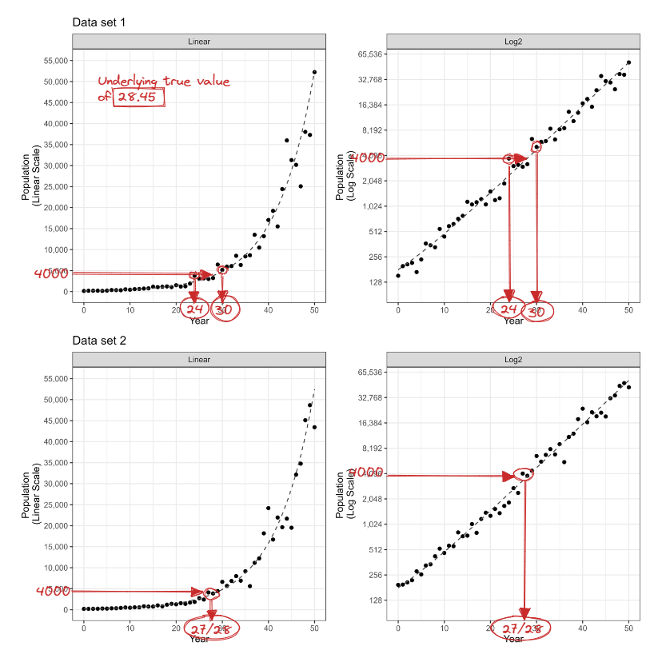
```

```{r, eq2-data, message=FALSE, warning=FALSE}
qe2_data <- estimation_model_data %>% 
  filter(q_id == "QE2") %>%
  mutate(response = as.numeric(response))
```

```{r qe2-info, eval = F}
estimation_simulated_data %>% 
  filter(abs(y - 4000) < 1500) %>%
  arrange(dataset, y)

qe2_data %>%
  group_by(dataset, scale) %>%
  get_summary_stats(response, type = "median_iqr")
```

While a small portion of participants provided estimates of years 5, 10 and 15, the density plots in \cref{fig:qe2-density-plot} focus on reasonable participant estimates between years 20 and 35.
A population of 4000 occurs around a medium magnitude and is thus distinguishable on the linear scale, making the estimated location more visible.
Participant accuracy was consistent across both the linear and log scales with a larger variance for data set one when estimates were made on the log scale.
One possible explanation for the difference in variation between data sets is that some participants were first visually fitting a trend on on the log scale (results in a visually linear trend) while some participants were basing their estimates off the closest point (year 24).
This is apparent by participants overestimation of the closest point, with some estimates drawing closer to the true value based on the underlying equation. 
On the log scale, participants were able to strongly anchor their estimates to the grid line break of 4096 and provide accurate year estimates by counting between grid lines on the $x$-axis with few participants making estimates between years (for example, 27.5).
However, participants still had a tendency to anchor to a base ten framework as indicated by an increase in the density of estimates occurring at year 30.

```{r, qe2-density-plot, fig.cap = "Elementary Q2 Density", fig.width = 9, fig.height = 9, out.width = "100%", message=FALSE, warning=FALSE, dev = "png"}

# DATA SET 1
qe2_density_1 <- densityPlot(data = qe2_data, datasetID = "dataset1", "response", xlabel = "Estimated Year", x_limits = c(20,35), zoom = F, scalesx = T, gridlines = F, rugjitter = 0.25) +
  ggtitle("Data set 1")

# DATA SET 2
qe2_density_2 <- densityPlot(data = qe2_data, datasetID = "dataset2", "response", xlabel = "Estimated Year", x_limits = c(20,35), zoom = F, scalesx = T, zoom_limits = c(20,33), gridlines = F, rugjitter = 0.25) +
  geom_vline(aes(xintercept = 28, linetype = "b")) +
  ggtitle("Data set 2")

qe2_density_1  / qe2_density_2 
```

Results form Elementary Q2 provide support that participants accurately estimated the year in which the population reaches 4000 on both scales.
The accuracy on the linear scale can be explained by the visibility of a medium magnitude along with participant ability to make accurate estimates between grid lines on a linear scale.
The population given aligned closely with grid line 4096 on the log scale, allowing participants to strongly anchor to the grid line for their estimation.
In particular, for data set one, participants were slightly more likely to base their estimates off the underlying trend line on the log scale than on the linear scale.
Estimated years were often provided in whole numbers and few participants showed an understanding that the population of interest could occur between years.

### Intermediate Q1: Additive increase in population

Intermediate level questions required participants to read between the data and make comparisons between points.
Participants were asked, \textit{"From 20 to 40, the population increases by \_\_\_\_ [creatures]."} \pcref{fig:qi1-sketch}.
The questioning was selected carefully to prompt participants to make an additive comparison of populations between two years.
In order to make this comparison, participants must have first made an accurate first level estimate in both years and then subtract the two estimates. 
Sample participant work below shows correct logic on both the linear and log scales:
\begin{align}
\textit{Sample work 4: correct logic (linear)} \nonumber\\
15000 - 2500 & = 12500\nonumber\\
\text{Scratchpad: } &\text{In 20 ABY the population of Ewoks was 2500,}\nonumber\\
                   &\text{in 40 ABY the population was 15 000,}\nonumber\\
                   &\text{i would make a substraction}\nonumber \\
\nonumber \\
\textit{Sample work 5: correct logic (log)} \nonumber\\
2048 - 1024  & = 1024 \nonumber\\
1024 - 512   & = 512 \nonumber\\
1024 + 512   & = 1536 \nonumber\\
16384 - 1536 & = 14848 \nonumber\\
\text{Scratchpad: }  & \text{20 aby 1536} \nonumber\\
             & \text{40 16384.} \nonumber
\end{align}
The true estimated increase in population from year 20 to 40 based on the underlying equation is 14363.34 (15846.35 - 1483.01) with increases based on the closest points of 15517.75 (17046.94 - 1529.18) and 22897.45 (24186.34 - 1288.91) for data sets one and two respectively.
The median estimated increase for data set one was 15000 (IQR = 3000) for the linear scale and 14784 (IQR = 2000) for the log scale while data set two resulted in larger estimates and variability with a median increase of 17500 (IQR = 10625) and 16500 (IQR = 8952) for the linear and log scale respectively.
The discrepancy in the summary between the two data sets provides further support that participants were inspecting the simulated data points in order to make their estimates.

```{r, qi1-sketch, eval = T, fig.height = 8, fig.width = 8, out.width = "100%", fig.cap = "Intermediate Q1 Sketch", dev = "png"}
knitr::include_graphics("images/03-estimation/qi1-sketch.png")
```

```{r qi1-data, message=FALSE, warning=FALSE}
# TRUNCATE AT 50000
qi1_data <- estimation_model_data %>% 
  filter(q_id == "QI1") %>%
  mutate(response = as.numeric(response)) %>%
  filter(response < 500000)
```

```{r qi1-summary, eval = F, message=FALSE, warning=FALSE, dev = "png"}
estimation_simulated_data %>% 
  filter(x %in% c(20, 40)) %>%
  arrange(dataset) %>%
  pivot_wider(id_cols = c("dataset"),
              names_from = "x",
              values_from = "y") %>%
  mutate(increase = `40` - `20`)

qi1_data %>%
  group_by(dataset, scale) %>%
  get_summary_stats(response, type = "median_iqr")
```

```{r qi1-density-1, fig.cap = "Intermediate Q1 Density (Data set 1)", fig.width = 9, fig.height = 9, out.width = "100%", message=FALSE, warning=FALSE, dev = "png"}

# DATA SET 1
vline1 = c(14750)
vline2 = c(15000)
qi1_density_1a <- densityPlot(data = qi1_data, datasetID = "dataset1", "response", xlabel = "Estimated Increase in Population", x_limits = c(0,50000), zoom = T, scalesx = F, zoom_limits = c(10000,20000), gridlines = F, rugjitter = 10) +
  
  # geom_vline(aes(xintercept = vline1), color = "gray30") +
  # geom_text(aes(label = vline1, x = vline1, y = Inf), vjust = 2, hjust = -0.5, size = 3, color = "gray30") +  geom_vline(aes(xintercept = vline1), color = "gray30") +
  # 
  # geom_vline(aes(xintercept = vline2), color = "gray30") +
  # geom_text(aes(label = vline2, x = vline2, y = Inf), vjust = 2, hjust = -0.5, size = 3, color = "gray30") +
  
  ggtitle("Data set 1")

qi1_density_1b <- densityPlot(data = qi1_data, datasetID = "dataset1", "response", xlabel = "Estimated Increase in Population", x_limits = c(0,50000), zoom = T, scalesx = T, zoom_limits = c(10000,20000), gridlines = F, rugjitter = 10) +
  
  # geom_vline(aes(xintercept = vline1), color = "gray30") +
  # geom_text(aes(label = vline1, x = vline1, y = Inf), vjust = 2, hjust = -0.5, size = 3, color = "gray30") +  geom_vline(aes(xintercept = vline1), color = "gray30") +
  # 
  # geom_vline(aes(xintercept = vline2), color = "gray30") +
  # geom_text(aes(label = vline2, x = vline2, y = Inf), vjust = 2, hjust = -0.5, size = 3, color = "gray30") +
  
  ggtitle("Data set 1")

qi1_density_1a <- ggplot_build(qi1_density_1a)
qi1_density_1b <- ggplot_build(qi1_density_1b)

# re-set zoomed facet's limits to match zoomed range
k <- qi1_density_1b$layout$layout$SCALE_X[qi1_density_1b$layout$layout$name == "x"]
qi1_density_1b$layout$panel_scales_x[[k]]$limits <- qi1_density_1b$layout$panel_scales_x[[k]]$range$range 

# re-set zoomed facet's panel parameters based on original version p0
k <- qi1_density_1b$layout$layout$PANEL[qi1_density_1b$layout$layout$name == "x"]
qi1_density_1b$layout$panel_params[[k]] <- qi1_density_1a$layout$panel_params[[k]]

# convert built ggplot object to gtable of grobs as usual & print result
qi1_density_1b <- ggplot_gtable(qi1_density_1b)
grid::grid.draw(qi1_density_1b)
```

```{r qi1-density-2, fig.cap = "Intermediate Q1 Density (Data set 2)", fig.width = 9, fig.height = 9, out.width = "100%", message=FALSE, warning=FALSE, dev = "png"}

# DATA SET 2
qi1_density_2a <- densityPlot(data = qi1_data, datasetID = "dataset2", "response", xlabel = "Estimated Year", x_limits = c(0,50000), zoom = T, scalesx = F, zoom_limits = c(10000,30000), gridlines = F, rugjitter = 10) +
  ggtitle("Data set 2")

qi1_density_2b <- densityPlot(data = qi1_data, datasetID = "dataset2", "response", xlabel = "Estimated Year", x_limits = c(0,50000), zoom = T, scalesx = T, zoom_limits = c(10000,30000), gridlines = F, rugjitter = 10) +
  ggtitle("Data set 2")

qi1_density_2a <- ggplot_build(qi1_density_2a)
qi1_density_2b <- ggplot_build(qi1_density_2b)

# re-set zoomed facet's limits to match zoomed range
k <- qi1_density_2b$layout$layout$SCALE_X[qi1_density_2b$layout$layout$name == "x"]
qi1_density_2b$layout$panel_scales_x[[k]]$limits <- qi1_density_2b$layout$panel_scales_x[[k]]$range$range 

# re-set zoomed facet's panel parameters based on original version p0
k <- qi1_density_2b$layout$layout$PANEL[qi1_density_2b$layout$layout$name == "x"]
qi1_density_2b$layout$panel_params[[k]] <- qi1_density_2a$layout$panel_params[[k]]

# convert built ggplot object to gtable of grobs as usual & print result
qi1_density_2b <- ggplot_gtable(qi1_density_2b)
grid::grid.draw(qi1_density_2b)
```

\cref{fig:qi1-density-1} and \cref{fig:qi1-density-2} display the density for estimated increases in population as made by participants for data set one and two respectively.
There were a considerable amount of estimated increases near zero indicating that some participants were misinterpreting the value they were asked to estimate.
Sample participant work below shows common incorrect logic on both the linear and log scales:

\begin{align}
\textit{Sample work 6: incorrect logic (linear)} \nonumber\\
24000/2000&=12 \nonumber\\
\nonumber \\ 
\textit{Sample work 7: incorrect logic (log)} \nonumber\\
16380/1026&=15.96\nonumber\\
\nonumber \\ 
\textit{Sample work 8: changed logic (log)} \nonumber\\
2048-1024&=1024\nonumber\\
1024+512&=1536\nonumber\\
16384-1536&=14848\nonumber\\
14848/1536&=9.67.\nonumber
\end{align}

In particular, sample work 5 shows how the participant first estimated halfway between the log grid lines and correctly subtracted the populations for the two given years before incorrectly changing their logic to divide the two populations.
One potential source of misinterpretation of this questions might be the particular order in which participants were asked the questions.
For example, if participants were asked to provide an estimated increase in population after having been asked Intermediate Q2 which prompts participants to provide a multiplicative change in population, they may be more likely to misinterpret Intermediate Q1.
However, participants answering questions on the second scenario would have seen both questioning frameworks in the previous scenario context.

Estimates for the increase in population between year 20 and year 40 was distinctly more accurate for estimates made on the linear scale as indicated by the peak density occurring near the closest point and true value vertical lines.
The slight shifts in the density on the log scale suggest participants are making inaccurate first level estimates.
One explanation might be that participants were anchoring to the grid lines much stronger on the log scale as opposed to being more likely to adjust their estimates between grid lines on the linear scale.
Common responses \pcref{fig:qi1-common-responses} on the log scale come from anchoring to grid lines (16384 - 1024 = 15360), halfway numerically between grid lines (16384 - 1536  = 14848; 24576 - 1536 = 2340), and base ten (16384 - 2000 = 14784) while participants on the linear scale anchored to multiples of 500 and 1000.
This was dependent on the location of simulated points in relation to the grid lines and lead to an underestimation in difference for data set one and an overestimation in difference for data set two. 
Variance in estimates appeared to be consistent across both scales for data set two with a smaller variance on the log scale for data set one.

```{r, qi1-common-responses, fig.cap = "Intermediate Q1 Common Responses", fig.width = 9, fig.height = 9, out.width = "100%", message=FALSE, warning=FALSE, dev = "png"}
qi1_common_responses <- qi1_data %>%
  mutate(true_value = round(true_value, 2)) %>%
  group_by(scale, true_value, closest_pt_value, dataset, response) %>%
  dplyr::summarize(count = n()) %>%
  filter(count > 4) %>%
  arrange(response)

actual_values_data <- qi1_common_responses %>%
  # filter(scale == "linear", "log") %>%
  select(scale, dataset, true_value, closest_pt_value) %>%
  unique() %>%
  pivot_wider(id_cols = c("scale", "true_value"),
              names_from = "dataset",
              values_from = "closest_pt_value") %>%
  pivot_longer(cols = c("true_value", "dataset2", "dataset1"),
              names_to = "dataset",
              values_to = "response") %>%
  mutate(dataset = ifelse(dataset == "true_value" & scale == "linear", "dataset1",
                          ifelse(dataset == "true_value" & scale == "log2", "dataset2", dataset))) %>%
  mutate(scale = "linear", 
         true_value = NA,
         closest_pt_value = NA,
         count = NA) %>%
  unique() %>%
  # mutate(response = round(response, 2)) %>%
  select(scale, dataset, true_value, closest_pt_value, response, count)

qi1_common_responses <- qi1_common_responses %>%
  rbind(actual_values_data)
response_order <- c(unique(round(qi1_common_responses$response, 2))) %>% sort()

qi1_common_plot_1 <- qi1_common_responses %>%
  filter(dataset == "dataset1") %>%
  mutate(response = round(response, 2)) %>%
  mutate(response = factor(response, levels = response_order)) %>%
  ggplot(aes(x = count, xmin = 0, xmax = count, y = response, color = scale, shape = scale)) +
  geom_linerange(position = position_dodge(.5)) +
  geom_point(position = position_dodge(0.5)) +
  geom_hline(aes(yintercept = as.factor(round(true_value,2)), linetype = "True"), size = 0.8) +
  geom_hline(aes(yintercept = as.factor(round(closest_pt_value,2)), linetype = "Closest Point"), size = 0.8) +
  # facet_grid(~ dataset) +
  theme_test() +
  theme(aspect.ratio = 0.67) +
  scale_shape_manual("Scale", values = c(16,15)) +
  scale_color_manual("Scale", values = c("steelblue", "orange3")) +
  scale_linetype_manual("Actual Value", labels =  c("Closest Point", "True Value"), values = c("dashed", "solid")) +
  scale_y_discrete("Estimated Increase in Population") +
  scale_x_continuous(expand = c(0,0.5)) +
  ggtitle("Data set 1")

qi1_common_plot_2 <- qi1_common_responses %>%
  filter(dataset == "dataset2") %>%
  mutate(response = round(response, 2)) %>%
  mutate(response = factor(response, levels = response_order)) %>%
  ggplot(aes(x = count, xmin = 0, xmax = count, y = response, color = scale, shape = scale)) +
  geom_linerange(position = position_dodge(.5)) +
  geom_point(position = position_dodge(0.5)) +
  geom_hline(aes(yintercept = as.factor(round(true_value,2)), linetype = "True"), size = 0.8) +
  geom_hline(aes(yintercept = as.factor(round(closest_pt_value,2)), linetype = "Closest Point"), size = 0.8) +
  # facet_grid(~ dataset) +
  theme_test() +
  theme(aspect.ratio = 0.67) +
  scale_shape_manual("Scale", values = c(16,15)) +
  scale_color_manual("Scale", values = c("steelblue", "orange3")) +
  scale_linetype_manual("Actual Value", labels =  c("Closest Point", "True Value"), values = c("dashed", "solid")) +
  scale_y_discrete("Estimated Increase in Population") +
  scale_x_continuous(expand = c(0,0.5)) +
  ggtitle("Data set 2")

qi1_common_plot_1/
qi1_common_plot_2
```

Responses from Intermediate Q1 required participants to use their first level estimates in order to make an additive comparison of populations between two years.
Some participants misinterpreted the question, making a multiplicative comparison, thus providing estimates closer to zero.
This was supported by examining select participant calculation and scratchpad work. 
The estimated increase in population was more accurate on the linear scale with the lack of accuracy on the log scale affected by participant resistance to and misunderstanding of making estimates between log grid lines.

### Intermediate Q2: Multiplicative change in population

Previously, we explored how participants made an additive comparison of populations between two years.
In addition, participants were asked, \textit{"How many times more [creatures] are there in 40 than in 20?"} \pcref{fig:qi2-sketch}.
The questioning was selected carefully to prompt participants to make a multiplicative comparison between two years.
Similar to Intermediate Q1, in order to make this comparison, participants must have made accurate first level estimates in both years and then divide the two estimates.
Participants may also have made this comparison on the log scale by understanding the multiplicative nature of the grid lines. Sample participant work below shows correct logic on both the linear and log scales:

\begin{align}
\textit{Sample work 9: correct logic (linear)} \nonumber\\
17500/1400&=12.5 \nonumber\\	
\text{Scratchpad: } & \text{same as before, but a division} \nonumber\\
\nonumber \\
\textit{Sample work 11: correct logic (linear)} \nonumber\\
17000-1000&=16000 \nonumber\\
17000/1000&=17  \nonumber\\
\nonumber \\
\textit{Sample work 12: correct logic (log)} \nonumber\\
24/1.4&=17.14	 \nonumber\\ 
\text{Scratchpad: } & \text{around 24k tribbles were at 4540, and} \nonumber\\
                   & \text{1.4k at 4520, make a division and thats}\nonumber\\
                   & \text{how many times (without the k)}\nonumber
\nonumber \\
\textit{Sample work 13: correct logic (log)} \nonumber\\                   
2048*5&=10240 \nonumber\\   
2048*6&=12288 \nonumber\\   
2048*7&=14336 \nonumber\\   
2048*8&=16384  \nonumber\\   
2048*8&=16384. \nonumber
\end{align}

```{r, qi2-sketch, eval = T, fig.height = 8, fig.width = 8, out.width = "100%", fig.cap = "Intermediate Q2 Sketch", dev = "png"}
knitr::include_graphics("images/03-estimation/qi2-sketch.png")
```

The scratch work from participants gave insight about the estimation strategy participants followed when determining the estimated change in population.
For instance, sample work 11 shows the participant first incorrectly calculated the additive increase in population before correcting their calculation through division while sample work 13 shows how the participant used a trial and error method.
The true change in population based on the underlying equation was 10.69 times as many (15846.35/1483.01) with changes based on the closest points of 11.1 (17046.94/1529.18) and 18.8 (24186.34/1288.91) for data sets one and two respectively.
The median estimated change for data set one was 11.7 (IQR = 8.5) for the linear scale and 10.7 (IQR = 6) for the log scale while data set two resulted in larger estimates and variability with a median change of 15.3 (IQR = 14) and 16 (IQR = 8.5) for the linear and log scale respectively.
The inconsistency between the two data sets aligns with previous evidence that participants were making estimates by reading the simulated data rather than based on the underlying trend.

```{r, qi2-data, warning = F, message = F}
# TRUNCATED AT 5000
qi2_data <- estimation_model_data %>% 
  filter(q_id == "QI2") %>%
  mutate(response = as.numeric(response)) %>%
  filter(response < 50000)
```

```{r, qi2-summary, eval = F, message = F, warning = F}
estimation_simulated_data %>% 
  filter(x %in% c(20, 40)) %>%
  arrange(dataset) %>%
  pivot_wider(id_cols = c("dataset"),
              names_from = "x",
              values_from = "y") %>%
  mutate(increase = `40`/`20`)

qi2_data %>%
  group_by(dataset, scale) %>%
  get_summary_stats(response, type = "median_iqr")
```

```{r, qi2-plots, fig.cap = "Intermediate Q2 Observed Plot", fig.width = 9, fig.height = 9, out.width = "100%", message=FALSE, warning=FALSE, dev = "png"}
qi2_plot_1 <- qi2_data %>%
    filter(dataset == "dataset1") %>%
  ggplot(aes(x = scale, y = response, group = participant_id, color = scale, shape = scale)) +
    geom_linerange(aes(ymin = 0, ymax = response), position = position_dodge2(0.95), size = 0.25) +
    geom_point(position = position_dodge2(0.95)) +
    # geom_hline(aes(yintercept = closest_pt_value), linetype = "dashed") +
    theme_bw() +
    theme(aspect.ratio = 0.5) +
    scale_shape_manual(values = c(16,15)) +
    scale_color_manual(values = c("steelblue", "orange"), guide = guide_legend(override.aes = list(alpha = 1) )) +
  scale_y_continuous("Estimated Change in Population \n(Times as Many)") +
  xlab("") +
  ggtitle("Data set 1")

qi2_plot_2 <- qi2_data %>%
    filter(dataset == "dataset2") %>%
  ggplot(aes(x = scale, y = response, group = participant_id, shape = scale, color = scale)) +
    geom_linerange(aes(ymin = 0, ymax = response), position = position_dodge2(0.95), size = 0.25) +
    geom_point(position = position_dodge2(0.95)) +
    # geom_hline(aes(yintercept = closest_pt_value), linetype = "dashed") +
    theme_bw() +
    theme(aspect.ratio = 0.5) +
    scale_shape_manual(values = c(16,15)) +
    scale_color_manual(values = c("steelblue", "orange"), guide = guide_legend(override.aes = list(alpha = 1) )) +
  ggtitle("Data set 2") +
  scale_y_continuous("Estimated Change in Population \n(Times as Many)") +
  xlab("")

qi2_plot_1 /
qi2_plot_2
```

As seen in the results for Intermediate Q1, some participants struggled to understand the value they were being asked to estimate.
Similarly, \cref{qi2-plots} illustrates a substantial number of participants provided estimates that more closely reflected that of the additive increase in population rather than the multiplicative change. 
\cref{qi2-common-responses} highlights that 15000 was still a common participant response.
Sample work below demonstrate common incorrect logic and calculations conducted by participants:

\begin{align}
\textit{Sample work 14: incorrect logic (linear)} \nonumber\\
23800-1100&=22700 \nonumber\\	
\nonumber \\
\textit{Sample work 15: incorrect logic (log)} \nonumber\\
16384-1536&=14848. \nonumber
\end{align}

Evaluating reasonable participant responses for the change in population between 0 times as many and 35 times as many, \cref{fig:qi2-density} indicates participants tended to be make more accurate and less variable estimates on the log scale than on the linear scale.
\cref{qi2-plots} shows common responses provided by participants.

```{r qi2-density, fig.cap = "Intermediate Q2 Density", fig.width = 9, fig.height = 9, out.width = "100%", message=FALSE, warning=FALSE, dev = "png"}

# DATA SET 1
qi2_density_1 <- densityPlot(data = qi2_data, datasetID = "dataset1", "response", xlabel = "Estimated Change in Population \n(Times as Many)", x_limits = c(0,35), zoom = F, scalesx = T, gridlines = F, rugjitter = 1) +
  ggtitle("Data set 1")

# DATA SET 2
qi2_density_2 <- densityPlot(data = qi2_data, datasetID = "dataset2", "response", xlabel = "Estimated Change in Population \n(Times as Many)", x_limits = c(0,35), zoom = F, scalesx = T, gridlines = F, rugjitter = 1) +
  ggtitle("Data set 2")

qi2_density_1 /
qi2_density_2
```

```{r, qi2-common-responses, fig.cap = "Intermediate Q2 Common Responses", fig.width = 9, fig.height = 9, out.width = "100%", message=FALSE, warning=FALSE, dev = "png"}
qi2_common_responses <- qi2_data %>%
  mutate(true_value = round(true_value, 2)) %>%
  group_by(scale, true_value, closest_pt_value, dataset, response) %>%
  dplyr::summarize(count = n()) %>%
  filter(count > 3) %>%
  arrange(response)

actual_values_data <- qi2_common_responses %>%
  select(scale, dataset, true_value, closest_pt_value) %>%
  unique() %>%
  pivot_wider(id_cols = c("scale", "true_value"),
              names_from = "dataset",
              values_from = "closest_pt_value") %>%
  pivot_longer(cols = c("true_value", "dataset2", "dataset1"),
              names_to = "dataset",
              values_to = "response") %>%
  mutate(dataset = ifelse(dataset == "true_value" & scale == "linear", "dataset1",
                          ifelse(dataset == "true_value" & scale == "log2", "dataset2", dataset))) %>%
  mutate(scale = "linear", 
         true_value = NA,
         closest_pt_value = NA,
         count = NA) %>%
  unique() %>%
  # mutate(response = round(response, 2)) %>%
  select(scale, dataset, true_value, closest_pt_value, response, count)

qi2_common_responses <- qi2_common_responses %>%
  rbind(actual_values_data)
response_order <- c(unique(round(qi2_common_responses$response, 2))) %>% sort()

qi2_common_plot_1 <- qi2_common_responses %>%
  filter(dataset == "dataset1") %>%
  mutate(response = round(response, 2)) %>%
  mutate(response = factor(response, levels = response_order)) %>%
  ggplot(aes(x = count, xmin = 0, xmax = count, y = response, color = scale, shape = scale)) +
  geom_linerange(position = position_dodge(.5)) +
  geom_point(position = position_dodge(0.5)) +
  geom_hline(aes(yintercept = as.factor(round(true_value,2)), linetype = "True"), size = 0.8) +
  geom_hline(aes(yintercept = as.factor(round(closest_pt_value,2)), linetype = "Closest Point"), size = 0.8) +
  # facet_grid(~ dataset) +
  theme_test() +
  theme(aspect.ratio = 0.67) +
  scale_shape_manual("Scale", values = c(16,15)) +
  scale_color_manual("Scale", values = c("steelblue", "orange3")) +
  scale_linetype_manual("Actual Value", values = c("dotted", "dashed")) +
  scale_y_discrete("Estimated Change in Population \n(Times as Many)") +
  scale_x_continuous(expand = c(0,0.5)) +
  ggtitle("Data set 1")

qi2_common_plot_2 <- qi2_common_responses %>%
  filter(dataset == "dataset2") %>%
  mutate(response = round(response, 2)) %>%
  mutate(response = factor(response, levels = response_order)) %>%
  ggplot(aes(x = count, xmin = 0, xmax = count, y = response, color = scale, shape = scale)) +
  geom_linerange(position = position_dodge(.5)) +
  geom_point(position = position_dodge(0.5)) +
  geom_hline(aes(yintercept = as.factor(round(true_value,2)), linetype = "True"), size = 0.8) +
  geom_hline(aes(yintercept = as.factor(round(closest_pt_value,2)), linetype = "Closest Point"), size = 0.8) +
  # facet_grid(~ dataset) +
  theme_test() +
  theme(aspect.ratio = 0.67) +
  scale_shape_manual("Scale", values = c(16,15)) +
  scale_color_manual("Scale", values = c("steelblue", "orange3")) +
  scale_linetype_manual("Actual Value", values = c("dotted", "dashed")) +
  scale_y_discrete("Estimated Change in Population \n(Times as Many)") +
  scale_x_continuous(expand = c(0,0.5)) +
  ggtitle("Data set 2")

qi2_common_plot_1/
qi2_common_plot_2
```

Overall, responses for Intermediate Q2 provided further support that participants tended to misinterpret the quantity they were being asked to estimate.
The density plots of responses suggest that the log scale has a slight advantage over the linear scale for estimating the multiplicative change in population.
While anchoring to grid lines and base ten values for first level estimates still occurred, many participants further anchored their responses to whole values.

### Intermediate Q3: Time until population doubles

An alternative multiplicative comparison between two points was to determine the amount of time it took for a value to double.
Participants were asked, \textit{"How long does it take for the population in year 10 to double?"} \pcref{qi3-sketch}.
In order to accurately evaluate this comparison, participants must have made a first level estimate for the population in year 10, asked in Elementary Q1.
Participants then needed to double their first level estimate in order to extract the year in which this value occurred and finally subtract year 10.
Alternatively, on the log scale, participants could have made this comparison without actually extracting the numeric values and instead relied on their spatial distance equating one increase in grid lines to a double in population.
This estimation strategy would have required keen understanding of the log base two scale.
Making a judgement based on participant calculations and scratch work, most participants selected the former approach when they estimated the number of years it took for the population to double.
One participant stated, "4510 has 512 Tribble Population and to double it it needs to have 1,024 so it would take approximately 5 years. In 4515 they would have double the population." while another participant indicated "10Aby near to 460.8 so double is 921.6; aprox. 5 years."

```{r qi3-sketch, eval = T, fig.height = 8, fig.width = 8, out.width = "100%", fig.cap = "Intermediate Q3 Sketch", dev = "png"}
knitr::include_graphics("images/03-estimation/qi3-sketch.png")
```

```{r, qi3-data, warning = F, message = F}
qi3_data <- estimation_model_data %>% 
  filter(q_id == "QI3") %>%
  mutate(response = as.numeric(response)) %>%
  filter(response < 50)
```

```{r, qi3-summary, eval = F, warning = F, message = F, dev = "png"}
doubled_data <- estimation_simulated_data %>% 
  filter(x == 10) %>%
  mutate(doubled = y*2)

estimation_simulated_data %>% 
  left_join(doubled_data %>% select(-c(x, y0, y)), by = c("dataset")) %>%
  mutate(pop_diff = abs(y - doubled),
         year_diff = x - 10) %>%
  filter(pop_diff < 200) %>%
  arrange(dataset, pop_diff)

qi3_data %>%
  group_by(dataset, scale) %>%
  get_summary_stats(response, type = "median_iqr") 
```

Based on the true underlying equation, the population in year 10 (481.62) doubled to 963.24 in year 16.25, thus it took 6.25 years for the population to double.
Closest simulated points resulted in the population doubling in 4 years (445 x 2 = 890.97 in 14) for data set one and 6 years (466.90 x 2 = 933.79 in 16) for data set two.
The median participant response for data set one was 5 (IQR = 5) and 5 (IQR = 2) for the linear and log scale respectively with a median for data set two of 8 (IQR = 6) and 6 (IQR = 2) for the linear and log scale respectively.
\cref{qi3-density} illustrates the estimated number of years until the population in year 10 doubled.
While there appears to be similar accuracy across both scales, the variance in estimates was considerably smaller for the log scale.
The large variance in the linear scale may be explained by the location of reference year 10 which resulted in a population of low magnitude and is visually difficult to estimate.
As indicated by peaks in density, there was strong anchoring which occurs at multiples of five.

```{r qi3-density, fig.cap = "Intermediate Q3 Density", fig.width = 9, fig.height = 9, out.width = "100%", message=FALSE, warning=FALSE, dev = "png"}

# DATA SET 1
qi3_density_1 <- densityPlot(data = qi3_data, datasetID = "dataset1", "response", xlabel = "Estimated Years to Double \nin Population", x_limits = c(0,50), zoom = F, scalesx = T, gridlines = F, rugjitter = 1) +
  ggtitle("Data set 1")

# DATA SET 2
qi3_density_2 <- densityPlot(data = qi3_data, datasetID = "dataset2", "response", xlabel = "Estimated Years to Double \nin Population", x_limits = c(0,50), zoom = F, scalesx = T, gridlines = F, rugjitter = 1) +
  ggtitle("Data set 2")

qi3_density_1 /
qi3_density_2
```

In summary, as indicated by participant scratch work, they tended to make a first level estimates for the reference year 10 rather than visually judging the distance between grid lines on the log scale. 
The estimated number of years until the population doubled from a reference year of 10 resulted in lower variability on the log scale as opposed to a larger variability on the linear scale.
One explanation might be the low magnitude of population in year 10 and further exploration would be needed to justify for other reference years.
Common responses strongly suggest participants were anchoring to multiples of 5 years.

## Discussion and Conclusion

This study was intended to help inform and aid in understanding the cognitive implications of displaying exponentially increasing data on a log scale.
We evaluated graph comprehension as it relates to two contextual scenarios by asking participants a series of six questions (one open ended, two elementary level, and three intermediate) which required them to quantitatively transform information in the chart.
Results provided an understanding of the advantages and disadvantages of the log scale.

In general, results suggest that understanding log logic is difficult as indicated by the misunderstanding in Intermediate Q1 and Q2.
This is also supported in following participants estimation strategies for making first level estimates in Intermediate Q3 rather than relying on their spatial awareness between grid lines on the log scale.
The accuracy of estimates greatly depends on the location of the value being estimated in relation to the magnitude.
For example, accuracy and variability of population estimates made on the linear scale improved as the year of interest increased and thus the magnitude of population increased, making the point more visible.
Alternatively, there was a slight sacrifice in the accuracy of population estimates on the log scale as the year of interest increased.
This was due to participant resistance to estimate between grid lines on the log scale and inaccurate representation of equating spatial distance to quantitative difference.
As the magnitude of population increases, there was a more noticeable effect of the resistance and lack of understanding.
Density plots showed an advantage of the linear scale when estimating an additive increase in population and a slight advantage of the log scale when estimating a multiplicative change in population.

It was also found that estimates were subjective to the simulated data set as shown by the discrepancy between data set one and data set two.
This implies a large portion of participants were reading the actual simulated data points as opposed to basing estimates on the underlying visual trend of the data.
Common responses revealed participants bias to anchoring their estimates to the grid lines, particularly on the log scale, as well as to base ten values.
The strong tendency to anchor to grid lines on the log scale resulted in a sacrifice in accuracy as quantitative differences between grid lines increased.
This also implies that accuracy strongly depended on the location of the simulated point in relation to the grid lines.

Understanding graph comprehension is a complex process and requires long-term interaction with the chart and information being presented. 
With a fixed number of estimates and assessment of participant scratch work, we outlined a variety of situations in which displaying exponentially increasing data on the log scale resulted in both advantages and disadvantages, thus providing a better understanding of the cognitive implications of the use of log scales.


<!--chapter:end:04-estimation.Rmd-->

# Conclusion

In this research, we conducted a series of three graphical studies to evaluate the impact displaying data on the log scale has on human perception of exponentially increasing trends compared to displaying data on the linear scale.
Each study was related to a different graphical task, each requiring a different level of interaction and cognitive use of the data being presented.
The first experiment evaluated whether our ability to perceptually notice differences in exponentially increasing trends is impacted by the choice of scale. 
We conducted a visual inference experiment in which participants were shown a series of lineups and asked to identify the plot that differed most from the surrounding plots. 
The other experimental tasks focus on determining whether there are cognitive disadvantages to log scales: do log scales make it harder to make use of graphical information? 
To test an individual's ability to make predictions for exponentially increasing data, participants were asked to draw a line using their computer mouse through an exponentially increasing trend shown on both the linear and log scale.
In addition to differentiation and prediction of exponentially increasing data, an estimation task was conducted to test an individuals' ability to translate a graph of exponentially increasing data into real value quantities and extend their estimations by making comparisons.
Combined, the three studies provide a comprehensive evaluation of the impact of displaying exponentially increasing data on a log scale as it relates to perception, prediction, and estimation.
The results of these studies help us to make recommendations and provide guidelines for the use of log scales.

## Lineups

To lay a foundation for future exploration of the use of log scales, we begin with the most fundamental ability: to identify differences in charts. Identifying differences does not require that participants understand exponential growth, identify log scales, or have any mathematical training. 
Instead, we am simply testing the change in \emph{perceptual sensitivity} resulting from visualization choices.
The study in this chapter is conducted through visual inference and the use of statistical lineups [@buja_statistical_2009] to differentiate between exponentially increasing curves with differing levels of curvature, using linear and log scales.

The overall goal of this chapter is to provide basic research to support the principles used to guide design decisions in scientific visualizations of exponential data. 
In this study, we explored the use of linear and log scales to determine whether our ability to notice differences in exponentially increasing trends is impacted by the choice of scale. 
The results indicated that when there was a large difference in curvature between the target plot and null plots and the target plot had more curvature than the null plots, the choice of scale had no impact and participants accurately differentiated between the two curves on both the linear and log scale. 
However, displaying exponentially increasing data on a log scale improved the accuracy of differentiating between models with slight curvature differences or large curvature differences when the target plot had less curvature than the null plots.
An exception occurred when identifying a plot with curvature embedded in surrounding plots closely relating to a linear trend, indicating that it is easy to identify a curve in a group of lines but much harder to identify a line in a group of curves.
The use of visual inference to identify these guidelines suggests that there are \emph{perceptual} advantages to log scales when differences are subtle. 
What remains to be seen is whether there are cognitive disadvantages to log scales: do log scales make it harder to make use of graphical information?

## You Draw It

In [Chapter 2](#lineups), a base foundation for future exploration of the use of log scales was established by evaluating participants ability to identify differences in charts through the use of lineups. 
This did not require that participants were able to understand exponential growth, identify log scales, or have any mathematical training; instead, it simply tested the change in perceptual sensitivity resulting from visualization choices. 
In order to determine whether there are cognitive disadvantages to log scales, we utilized interactive graphics to test an individual's ability to make predictions for exponentially increasing data. 
In this study, participants were asked to draw a line using their computer mouse through the exponentially increasing trend shown on both the log and linear scales. 

The intent of this chapter was to establish 'You Draw It' as a method and tool for testing graphics then use this tool to determine the cognitive implications of displaying data on the log scale.
Eye Fitting Straight Lines in the Modern Era replicated the results found in @mosteller_eye_1981. 
When shown points following a linear trend, participants tended to fit the slope of the first principal component over the slope of the least squares regression line.
This trend was most prominent when shown data simulated with larger variances. 
The reproducibility of these results serve as evidence of the reliability of the 'You Draw It' method.

In Prediction of Exponential Trends, the 'You Draw It' method was used to test an individual's ability to make predictions for exponentially increasing data.
Results indicate that underestimation of exponential growth occurs when participants were asked to draw trend lines on the linear scale and that there was an improvement in accuracy when trends were drawn on the log scale. 
This phenomena is strongly supported for high exponential growth rates.
Improvement in predictions are made when points along the exponential trend are shown as indicated by the discrepancy in results for treatments with points truncated at 50\% compared to 75\% of the domain. 

The results of this study suggest that there are cognitive advantages to log scales when making predictions of exponential trends.
Improvement in predictions were made for trends with high exponential growth rates when participants were asked to draw a trend line on the log scale compared to the linear scale. 
Further investigation is necessary to determine the implications of using log scales when translating exponential graphs to numerical values. 

## Estimation

The previous two chapters explored the use of log scales through differentiation and visual prediction of trends. 
These graphical tasks were conducted independent of scenarios or contextual applications of log scales; instead, they focused how our visual system perceives and identifies patterns in exponential growth.
In order to understand the cognitive implications of displaying exponentially increasing data on a log scale, it is essential to evaluate graph comprehension as it relates to the contextual scenario of the data shown.
This is a complex inferential process which requires participants to engage with the data by quantitatively transforming information in the chart [@cleveland_graphical_1984; @cleveland_graphical_1985].
In this study, we asked participants to translate a graph of exponentially increasing data into real value quantities and extend their estimations by comparing two data points.


This study was intended to help inform and aid in understanding the cognitive implications of displaying exponentially increasing data on a log scale.
We evaluated graph comprehension as it relates to two contextual scenarios by asking participants a series of six questions (one open ended, two elementary level, and three intermediate) which required them to quantitatively transform information in the chart.
Results provided an understanding of the advantages and disadvantages of the log scale.

In general, results suggest that understanding log logic is difficult as indicated by the misunderstanding in Intermediate Q1 and Q2.
This is also supported in following participants estimation strategies for making first level estimates in Intermediate Q3 rather than relying on their spatial awareness between grid lines on the log scale.
The accuracy of estimates greatly depends on the location of the value being estimated in relation to the magnitude.
For example, accuracy and variability of population estimates made on the linear scale improved as the year of interest increased and thus the magnitude of population increased, making the point more visible.
Alternatively, there was a slight sacrifice in the accuracy of population estimates on the log scale as the year of interest increased.
This was due to participant resistance to estimate between grid lines on the log scale and inaccurate representation of equating spatial distance to quantitative difference.
As the magnitude of population increases, there was a more noticeable effect of the resistance and lack of understanding.
Density plots showed an advantage of the linear scale when estimating an additive increase in population and a slight advantage of the log scale when estimating a multiplicative change in population.

It was also found that estimates were subjective to the simulated data set as shown by the discrepancy between data set one and data set two.
This implies a large portion of participants were reading the actual simulated data points as opposed to basing estimates on the underlying visual trend of the data.
Common responses revealed participants bias to anchoring their estimates to the grid lines, particularly on the log scale, as well as to base ten values.
The strong tendency to anchor to grid lines on the log scale resulted in a sacrifice in accuracy as quantitative differences between grid lines increased.
This also implies that accuracy strongly depended on the location of the simulated point in relation to the grid lines.

Understanding graph comprehension is a complex process and requires long-term interaction with the chart and information being presented. 
With a fixed number of estimates and assessment of participant scratch work, we outlined a variety of situations in which displaying exponentially increasing data on the log scale resulted in both advantages and disadvantages, thus providing a better understanding of the cognitive implications of the use of log scales.

<!--chapter:end:05-conclusion.Rmd-->

`r if(knitr:::is_latex_output()) '\\appendix'`

`r if(!knitr:::is_latex_output()) '# (APPENDIX) Appendix {-}'` 

<!--
If you feel it necessary to include an appendix, it goes here.
-->

<!-- # First Appendix -->

<!-- This first appendix includes all of the R chunks of code that were hidden throughout the document (using the `include = FALSE` chunk tag) to help with readibility and/or setup. -->

<!-- **In the main Rmd file** -->

<!-- ```{r ref.label='include_packages', results='hide', echo = TRUE} -->
<!-- ``` -->

<!-- **In Chapter \@ref(ref-labels):** -->

<!-- ```{r ref.label='include_packages_2', results='hide', echo = TRUE} -->
<!-- ``` -->

```{r appendix-setup, message=FALSE, warning=FALSE, echo = F}
library(tidyverse)
```

# You Draw It Setup with Shiny {#youdrawit-with-shiny}

Interactive plots for the you draw it study were created using the `r2d3` package and integrating D3 source code with an R shiny application. 
I conducted all data simulation and processing in R and outputted two data sets - point data and line data - containing (x, y) coordinates corresponding to either a simulated point or fitted value predicted by a statistical model respectively. 
Then, the r2d3 package converted the data sets in R to JSON to be interpreted by the D3.js code. 
I define functions in D3.js to draw the initial plot and set up drawable points for the user drawn line. 
Drag events in D3.js were utilized to react to observe and react to user input. 
Shiny Messages were used to communicate the user interaction between the D3 code and the R environment. 
The plot was then rendered and updated on user interaction into the R shiny application with the RenderD3 and d3Output functions.
Parameters for aesthetic design choices were defined in a list of options and r2d3 passes these to the D3.js code.
For instance, I specified the buffer space allowed for the $x$ and $y$ axes to avoid users anchoring their lines to the axes limits. For D3.js source code, visit GitHub [here](https://github.com/srvanderplas/Perception-of-Log-Scales/blob/master/you-draw-it-development/you-draw-it-test-app/main.js).
\cref{fig:r2d3-shiny-flowchart} provides a visual aid of the process of creating the you draw it experimental study in [Chapter 3](#youdrawit).

<!-- ## You draw it D3.js source code {#d3.js-source-code} -->

```{r r2d3-shiny-flowchart, fig.cap = "Interactive plot development", out.width="100%"}
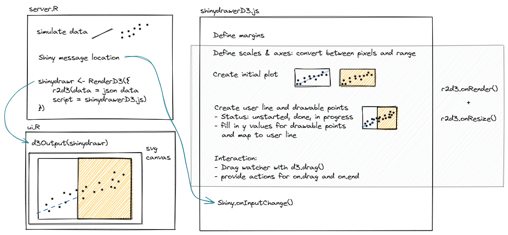
```

```{r d3.js-source-code, include = F, eval = F, echo = T}
# Define variable margins
const margin = {left: 55, 
                right: 10, 
                top: options.title ? 40: 10, 
                bottom: options.title? 25: 55};

# Define variable default line attributes
const default_line_attrs = Object.assign({
  fill: "none",
  stroke: options.data_line_color || 'steelblue',
  strokeWidth: 4,
  strokeLinejoin: "round",
  strokeLinecap: "round",
}, options.line_style);

# defines a changing variable called state
let state = Object.assign({
  line_data: data.line_data,
  point_data: data.point_data,
  svg: svg.append('g').translate([margin.left, margin.top]).attr("class", "wrapper"),
  w: height*options.aspect_ratio - margin.left - margin.right,
  h: height - margin.top - margin.bottom,
}, options);

# To distinguish between code that runs at initialization-time only and
# code that runs when data changes, organize your code so that the code
# which responds to data changes is contained within the r2d3.onRender()
r2d3.onRender(function(data, svg, width, height, options) {
  
  state.line_data = data.line_data;
  state.point_data = data.point_data;
  
  state = Object.assign(state, options);
  state.options = options;
  state.w = height*options.aspect_ratio;

  start_drawer(state);

});

# An explicit resize handler
r2d3.onResize(function(width, height, options) {
  state.w = height*state.options.aspect_ratio - margin.left - margin.right;
  state.h = height - margin.top - margin.bottom;
  
  start_drawer(state, reset = false);

});

# Main function that draws current state of viz
function start_drawer(state, reset = true){
  const scales = setup_scales(state);
  
  if(!state.free_draw){
    draw_true_line(state, scales, state.draw_start);
  }
  
  # Cover hidden portion with a rectangle (disabled)
  # const line_hider = setup_line_hider(state.svg, state.draw_start, scales);
  
  # if we reset (these are points that can be drawn) remove what user has drawn.
  if(reset){
    state.drawable_points = setup_drawable_points(state);
  }
  
  # if we have points, we draw user's line.
  draw_user_line(state, scales);
  draw_rectangle(state, scales);
  draw_finished_line(state, scales, state.draw_start);
  
    # draw points for initial portion
  if(state.points != "none"){
    draw_points(state, scales);
  }
  
  # invert from pixle to data scale when they draw their points
  const on_drag = function(){
    const drag_x = scales.x.invert(d3.event.x);
    const drag_y = scales.y.invert(d3.event.y);
    fill_in_closest_point(state, drag_x, drag_y);
    draw_user_line(state, scales);
    draw_rectangle(state, scales);
  };
  
  # line_status is set by draw watcher - get user status line
  # if some points missing - in progress
  # complete line - done
  const on_end = function(){
    # Check if all points are drawn so we can reveal line
    const line_status = get_user_line_status(state);
    if(line_status === 'done'){
      # User has completed line drawing
      # if(state.show_finished) line_hider.reveal();
      # if(!state.free_draw)  line_hider.reveal();
      if(state.show_finished){
        draw_finished_line(state, scales, state.draw_start);
      }
      if(state.shiny_message_loc){
        # Make sure shiny is available before sending message
        if(typeof Shiny !== 'undefined'){
          # Send drawn points off to server
          Shiny.onInputChange(
            state.shiny_message_loc,
            state.drawable_points.map(d => d.y)
          );
        } else {
          console.log(`Sending message to ${state.shiny_message_loc}`);
        }
      }
    }
  };
  
  setup_draw_watcher(state.svg, scales, on_drag, on_end);
  
  # Do we have a title?
    if(state.title){
      state.svg.append('text')
      .at({
        y: -margin.top/2,
        dominantBaseline: 'middle',
        fontSize: '1.5rem',
      })
      .style('font-family', system_font)
      .text(state.title);
    }
}

function setup_drawable_points({line_data, free_draw, draw_start}){
  if(free_draw){
    return line_data.map(d => ({x: d.x, y: null}));
  } else {
    return line_data
    .filter(d => d.x >= draw_start)
    .map((d,i) => ({
      x: d.x,
      y: i === 0 ? d.y: null
    }));
  }
}

function get_user_line_status({drawable_points, free_draw}){
  const num_points = drawable_points.length;
  const num_filled = d3.sum(drawable_points.map(d => d.y === null ? 0: 1));
  const num_starting_filled = free_draw ? 0: 1;
  if(num_filled === num_starting_filled){
    return 'unstarted';
  } else if(num_points === num_filled){
    return 'done';
  } else {
    return 'in_progress';
  }
}

# Draw visable portion of line
function draw_true_line({svg, line_data, draw_start}, scales){
  var df = line_data.filter(function(d){ return d.x<=draw_start})
  state.svg.selectAppend("path.shown_line")
  .datum(df)
  .at(default_line_attrs)
  .attr("d", scales.line_drawer);
}

function draw_points({svg, point_data, points_end, points}, scales){
    if(points == "partial"){
      var df = point_data.filter(function(d){return (d.x<=points_end)});
    } else {
      var df = point_data;
    }
  const dots = state.svg.selectAll("circle").data(df)
  dots
    .enter().append("circle")
    .merge(dots)
    .attr("cx", d => scales.x(d.x))
    .attr("cy", d => scales.y(d.y))
    .attr("r", 2)
    .style("fill", "black")
    .style("opacity", 0.8)
    .style("stroke", "black")
}

function draw_rectangle({svg, drawable_points, line_data, draw_start, width, height, free_draw, x_by}, scales){
    if(get_user_line_status(state) === 'unstarted'){
      if(free_draw){
         var xmin = line_data[0].x
         var len  = line_data.length - 1
         var xmax = line_data[len].x
         var drawSpace_start = scales.x(xmin)
         var drawSpace_end   = scales.x(xmax)
       } else {
         var drawSpace_start = scales.x(draw_start)
         var drawSpace_end   = state.w
       }
    } else {
      if(get_user_line_status(state) === 'done'){
        var drawSpace_start = scales.x(100)
        var drawSpace_end = scales.x(110)
      } else {
        var df = drawable_points.filter(function(d){return (d.y === null)});
        var xmin = df[0].x - x_by;
        var len  = line_data.length - 1
        var xmax = line_data[len].x
        var drawSpace_start = scales.x(xmin)
        var drawSpace_end   = scales.x(xmax)
      }
    }
    const draw_region = state.svg.selectAppend("rect");
    draw_region
      .attr("x", drawSpace_start)
      .attr("width",drawSpace_end - drawSpace_start)
      .attr("y", 0)
      .attr("height", state.h)
      //.style("fill", "#e0f3f3")
      .style("fill-opacity", 0.4)
      .style("fill", "rgba(255,255,0,.8)")
}

function draw_user_line(state, scales){
  const {svg, drawable_points, drawn_line_color} = state;
  const user_line = state.svg.selectAppend("path.user_line");
  # Only draw line if there's something to draw.
  if(get_user_line_status(state) === 'unstarted'){
    user_line.remove();
    return;
  }
  # Draws the points the user is drawing with their mouse
  user_line
      .datum(drawable_points)
      .at(default_line_attrs)
      .attr('stroke', drawn_line_color)
      .attr("d", scales.line_drawer)
      .style("stroke-dasharray", ("1, 7"));
}

function draw_finished_line({svg, line_data, draw_start, free_draw}, scales){
  if(!free_draw){
    var df = line_data.filter(function(d){ return d.x >= draw_start})
  } else {
    var df = line_data
  }
  const finished_line = state.svg.selectAppend("path.finished_line")
    # Only draw line if there's something to draw.
  if(get_user_line_status(state) === 'unstarted'){
    finished_line.remove();
    return;
  }
  finished_line
  .datum(df)
  .at(default_line_attrs)
  .attr("d", scales.line_drawer)
  .attr("opacity", 0.5)
}

# from state we need drawable_points
function fill_in_closest_point({drawable_points, pin_start, free_draw}, drag_x, drag_y){
  # find closest point on data to draw
  let last_dist = Infinity;
  let current_dist;
  # If nothing triggers break statement than closest point is last point
  let closest_index = drawable_points.length - 1;
  const starting_index = free_draw ? 0 : (pin_start ? 1: 0);
  # for loop to check where closest point to where I am
  for(i = starting_index; i < drawable_points.length; i++){
    current_dist = Math.abs(drawable_points[i].x - drag_x);
    # If distances start going up we've passed the closest point
if(last_dist - current_dist < 0) {
  closest_index = i - 1;
  break;
}
last_dist = current_dist;
}

drawable_points[closest_index].y = drag_y;
}

function setup_draw_watcher(svg, scales, on_drag, on_end){
  svg.selectAppend('rect.drag_watcher')
  .at({
    height: scales.y.range()[0],
    width: scales.x.range()[1],
    fill: 'grey',
    fillOpacity: 0,
  })
  .call(
    d3.drag()
    .on("drag", on_drag)
    .on("end", on_end)
  );
}

function add_axis_label(label, y_axis = true){
  const bump_axis = y_axis ? 'x': 'y';
  const axis_label_style = {
    [bump_axis]: bump_axis == 'y' ? 3: -2,
    textAnchor: 'end',
    fontWeight: '500',
    fontSize: '0.9rem',
  };
  return g => {
    let last_tick = g.select(".tick:last-of-type");
    const no_ticks = last_tick.empty();
    if(no_ticks){
      last_tick = g.append('g')
      .attr('class', 'tick');
    }
    last_tick.select("line").remove();
    last_tick.selectAppend("text")
    .at(axis_label_style)
    .html(label);
  };
}

# Setup scales for visualization
function setup_scales(state){
  # multi-assign: x_range, etc. coming from options
  const {w, h, line_data, x_range, y_range, x_name, y_name, linear} = state;
  # convert x from data scale to pixle scale
  const x = d3.scaleLinear()
  .domain(x_range || d3.extent(line_data, d => d.x))
  .range([0, w]);
  //console.log(linear);
  if (linear == 'true') {
    //console.log('in linear block');
    # converts from data linear scale to pixle scale
    var y = d3.scaleLinear()
    .domain(y_range || d3.extent(line_data, d => d.y))
    .range([h, 0]);
  } else {
    //console.log('in log block');
    # converts from data log scale to pixle scale
    var y = d3.scaleLog()
    .domain(y_range || d3.extent(line_data, d => d.y))
    .range([h, 0]).base(10);
  }
  
  const xAxis = d3.axisBottom().scale(x).tickSizeOuter(0);
  const yAxis = d3.axisLeft().scale(y).tickFormat(d3.format(".4")).tickSizeOuter(0);
  const xAxisGrid = d3.axisBottom().scale(x).tickSize(-h).tickFormat('');
  const yAxisGrid = d3.axisLeft().scale(y).tickSize(-w).tickFormat('');
  
  state.svg.selectAll("g.x_grid").remove()
  state.svg.selectAll("g.y_grid").remove()
  # could call axis-grid "fred"
  state.svg.selectAll("g.axis-grid").remove()
  
  state.svg.selectAll("path.shown_line").remove()
  state.svg.selectAll("circle").remove()
  
  state.svg.selectAppend("g.x_grid")
  .attr('class', 'x axis-grid')
  .translate([0,h])
  .call(xAxisGrid);
  
  state.svg.selectAppend("g.y_grid")
  .attr('class', 'y axis-grid')
  .call(yAxisGrid);
  
  state.svg.selectAll(".axis-grid .tick")
  .style("stroke", "light-grey")
  .style("opacity", ".3");
  
  state.svg.selectAppend("g.x_axis")
  .translate([0,h])
  .call(xAxis);
  
  state.svg.selectAppend("g.y_axis")
  .call(yAxis);
  
  const line_drawer = d3.line()
  .defined(d => d.y !== null)
  .x(d => x(d.x))
  .y(d => y(d.y));
  
  return {
    x,
    y,
    line_drawer,
  };
}
```

# Exponential Prediction Interactive Plots {#exponential-prediction-plots}

The figures below illustrate the 8 interactive plots used to test exponential prediction.
Two data sets were simulated with low and high exponential growth rates and shown four times each by truncating the points shown at both 50\% and 75\% of the domain as well as on both the log and linear scales following a 2 x 2 x 2 factorial treatment design. 

```{r low-10-linear, fig.height = 4, fig.width = 4, out.width = "65%", fig.cap = "Exponential Prediction: low growth rate, points truncated at 50\\%, linear scale"}
knitr::include_graphics("images/02-you-draw-it/low-10-linear.png")
```

```{r low-10-log, fig.cap = "Exponential Prediction: low growth rate, points truncated at 50\\%, log scale", fig.height = 4, fig.width = 4, out.width = "65%"}
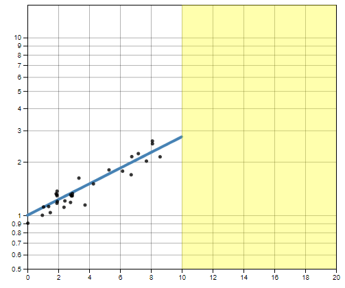
```

```{r low-15-linear, fig.cap = "Exponential Prediction: low growth rate, points truncated at 75\\%, linear scale", fig.height = 4, fig.width = 4, out.width = "65%"}
knitr::include_graphics("images/02-you-draw-it/low-15-linear.png")
```

```{r low-15-log, fig.cap = "Exponential Prediction: low growth rate, points truncated at 75\\%, log scale", fig.height = 4, fig.width = 4, out.width = "65%"}
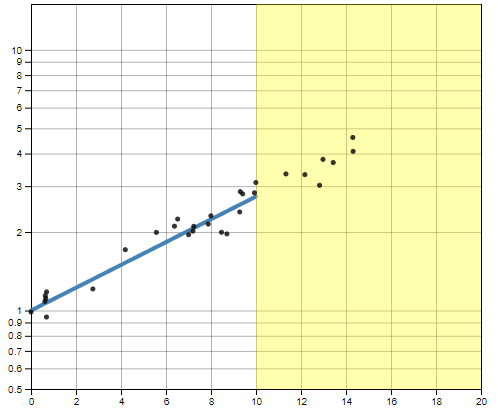
```

```{r high-10-linear, fig.cap = "Exponential Prediction: high growth rate, points truncated at 50\\%, linear scale", fig.height = 4, fig.width = 4, out.width = "65%"}
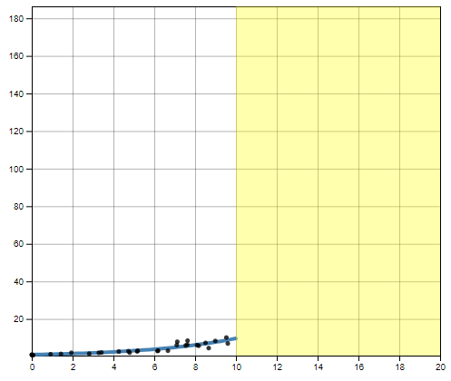
```

```{r high-10-log, fig.cap = "Exponential Prediction: high growth rate, points truncated at 50\\%, log scale", fig.height = 4, fig.width = 4, out.width = "65%"}
knitr::include_graphics("images/02-you-draw-it/high-10-log.png")
```

```{r high-15-linear, fig.cap = "Exponential Prediction: high growth rate, points truncated at 75\\%, linear scale", fig.height = 4, fig.width = 4, out.width = "65%"}
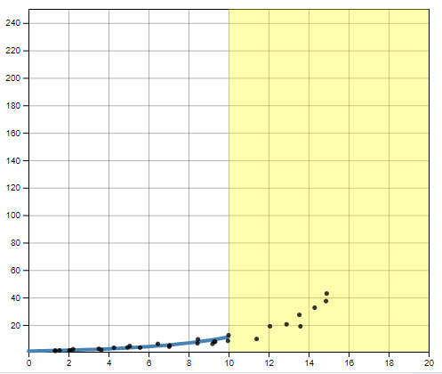
```

```{r high-15-log, fig.cap = "Exponential Prediction: high growth rate, points truncated at 75\\%, log scale", fig.height = 4, fig.width = 4, out.width = "65%"}
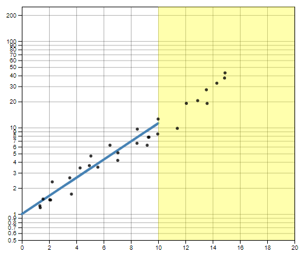
```

## Scratchwork participant comparison {#estimation-comparison}

```{r, echo = F, fig.cap = "Estimation showed work density plot comparison", fig.height = 9, fig.width = 9, out.width = "100%", warning = F, message = F}

# estimation_model_data <- read.csv(here("data/03-estimation/estimation-model-data.csv"))
# q0_text_summary <- read.csv(here("data/03-estimation/q0-text-summary.csv"))
# estimation_simulated_data <- read.csv(here("data/03-estimation/estimation-simulated-data.csv")) %>%
#   mutate(x = x - 3000)
# estimation_scenario_text <- read.csv(here("data/03-estimation/estimation-scenario-text.csv"))
# estimation_parameters <- read.csv(here("data/03-estimation/estimation-parameters.csv"))
# estimation_questions <- read.csv(here("data/03-estimation/estimation-questions.csv"))
# population_estimates_data <- read.csv(here("data/03-estimation/first-level-population-estimates.csv"))
# 
# grid_lines_data <- tibble(scale = c(rep("linear", 12), rep("log2", 10)),
#                           grid_lines = c(seq(0,55000, 5000),
#                                          2^seq(7,16))
# ) %>%
#   expand_grid(dataset = c("dataset1", "dataset2"))
# 
# qe1_data <- estimation_model_data %>%
#   filter(q_id == "QE1") %>%
#   mutate(response = as.numeric(response)) %>%
#   mutate(showed_work_cutoff = ifelse(showed_work_n >= 2, "yes", "no"))

qe1_data %>%
  group_by(dataset, scale, showed_work_cutoff) %>%
  get_summary_stats(response, type = "median_iqr") %>%
  select(dataset,	scale,	showed_work_cutoff,	n) %>%
  kableExtra::kable("latex", 
                    booktabs = T, 
                    col.names = c("Data set", "Scale", "Showed work", "N"),
               caption = "Estimation showed work summary")

qe1_compare_work <- qe1_data %>%
  ggplot(aes(x = response, fill = showed_work_cutoff)) +
  geom_density(alpha = 0.5, color = NA) +
  geom_vline(aes(xintercept = true_value, linetype = "True")) +
  geom_vline(aes(xintercept = closest_pt_value, linetype = "Closest Point")) +
  facet_grid(dataset ~ scale, scales = "free_y") +
  theme_bw() +
  theme(aspect.ratio = 1) + 
  scale_fill_manual(values = c("steelblue", "orange3")) +
  scale_linetype_manual("Actual Value", values = c("dashed", "dotted")) +
  # coord_cartesian(xlim = c(0,1000), ylim = c(0, 0.1)) +
  scale_x_continuous("Estimated Population", limits = c(0,1000)) +
  scale_y_continuous("Density")
qe1_compare_work
```


<!--chapter:end:06-appendix.Rmd-->

<!--
The bib chunk below must go last in this document according to how R Markdown renders.  More info is at http://rmarkdown.rstudio.com/authoring_bibliographies_and_citations.html
-->

\backmatter

<!-- 
If you'd like to change the name of the bibliography to something else,
delete "References" and replace it.
-->

# References {-}
<!--
This manually sets the header for this unnumbered chapter.
-->
<!-- \markboth{References}{References} -->
<!--
To remove the indentation of the first entry.
-->
\noindent

<!--
To create a hanging indent and spacing between entries.  These three lines may need to be removed for styles that don't require the hanging indent.
-->

\setlength{\parindent}{-0.20in}
\setlength{\leftskip}{0.20in}
\setlength{\parskip}{8pt}


<!--
This is just for testing with more citations for the bibliography at the end.  Add other entries into the list here if you'd like them to appear in the bibliography even if they weren't explicitly cited in the document.
-->

---
nocite: | 
  @angel2000, @angel2001, @angel2002a
...


<!--chapter:end:99-references.Rmd-->

